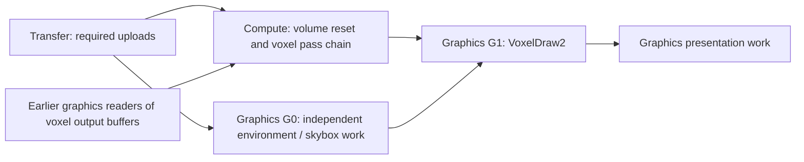

# Async compute implementation plan

Status: Steps 1–8 are complete. Step 9 renderer integration, submission diagnostics, and correctness coverage are implemented; paused for user verification. After counter access was enabled, six Nsight Graphics traces verified dedicated compute execution and consumer dependencies, but showed zero graphics/compute overlap across nine captured update frames. Measured async update spans were longer. First-load timing, isolated graphics-wait timing, and full performance acceptance remain open; see [Nsight verification](AsyncComputeNsightVerification.md). Async compute remains opt-in. ComputeVoxelizer now requests compute for its reset/update chain; drawing and presentation stay on graphics. See [Step 8 verification](AsyncComputeStep8Verification.md), [Step 9 verification](AsyncComputeStep9Verification.md), and the linked earlier reports. The baseline below describes the working tree reviewed on 2026-09-20, before implementation.

Implement GPU async compute for the existing `ComputeVoxelizer` pass chain. Keep RDG construction, compilation, and pass callbacks on the RenderCore thread. Use the existing RHI executor to submit work to graphics, compute, and transfer queues. Keep all backend queries, submission serials, semaphore operations, and native queue interaction outside RenderGraph.

The first release should preserve current images, voxelization requests, and failure behavior. It should allow independent graphics work to overlap voxel computation, with graphics waiting only in the submission that consumes compute results. A separate GPU compute queue does not require another CPU worker thread.

## 1. Baseline implementation and what can be reused

| Area | Current behavior | Required change |
| --- | --- | --- |
| [ComputeVoxelizer.cpp](../ZenCore/Source/Graphics/RenderCore/V2/ComputeVoxelizer.cpp) | Adds compute passes and `VoxelDraw2` to the current frame RDG. Compute passes currently execute through the graphics command list. | Mark eligible passes for compute scheduling; keep `VoxelDraw2` on graphics. |
| [VoxelizerBase.cpp](../ZenCore/Source/Graphics/RenderCore/V2/VoxelizerBase.cpp) | `BeginVoxelization()` adds `ResetVoxelVolumes`, a transfer pass, and clears `m_needVoxelization`. | Allow the reset to run with the voxel compute chain when the compute queue supports its commands; preserve request/retry semantics. |
| [RendererServer.cpp](../ZenCore/Source/Graphics/RenderCore/V2/RendererServer.cpp) | Voxel mode builds skybox work, then voxelizer work, then executes one frame RDG. PBR mode builds skybox and deferred-lighting work instead. | Keep this renderer entry point and one logical frame graph; split its physical submissions internally. |
| [RenderGraph.h](../ZenCore/Include/Graphics/RenderCore/V2/RenderGraph/RenderGraph.h), [RenderGraph.cpp](../ZenCore/Source/Graphics/RenderCore/V2/RenderGraph.cpp) | `ExecutionPlan` has one `transfer` choice. `ExecutePrepared()` records the graph into one command list. Barrier history follows a single execution order. | Represent logical queue preferences, a schedule of pass groups, and synchronization boundaries; record groups without backend interaction. |
| [RenderDevice.cpp](../ZenCore/Source/Graphics/RenderCore/V2/RenderDevice.cpp) | Chooses graphics or transfer for a whole standalone graph. `ExecuteFrameGraph()` uses one graphics list. `SubmitRecordedFrame()` hands it to RHI. | Assign actual queues, acquire lists per queue, package a frame schedule, and maintain resource submission history. |
| [RHICommandListExecutor.h](../ZenCore/Include/Graphics/RHI/RHICommandListExecutor.h), [implementation](../ZenCore/Source/Graphics/RHI/RHICommandListExecutor.cpp) | `RHICommandBatch` owns one main list and a presentation list. Its result already contains three queue serials. | Own multiple scheduled lists, resolve dependencies between them, and retain every list until its GPU work completes. |
| [RHICommandList.h](../ZenCore/Include/Graphics/RHI/RHICommandList.h) | Already defines `eAsyncCompute` and submission dependencies. Detach/reset/rollback preserve dependency metadata. | Reuse concrete queue/serial dependencies; add explicit references to earlier scheduled submissions. |
| [VulkanDevice.cpp](../ZenCore/Source/Graphics/VulkanRHI/VulkanDevice.cpp), [VulkanQueue.cpp](../ZenCore/Source/Graphics/VulkanRHI/VulkanQueue.cpp), [VulkanContext.cpp](../ZenCore/Source/Graphics/VulkanRHI/VulkanContext.cpp) | Compute-family selection and compute command-context creation already exist, but every queue wrapper selects index `0`. Timeline waits accept a producer queue type and are skipped when producer and consumer have the same native queue handle. | Select queue family/index pairs, expose actual availability and sharing through the RHI facade, and preserve barriers between logical contexts sharing one native queue. |
| [VulkanResourceSharing.h](../ZenCore/Include/Graphics/VulkanRHI/VulkanResourceSharing.h) | Engine-created buffers and textures already include graphics and compute families in concurrent sharing when the families differ. Transfer usage also includes the transfer family. | Reuse this policy; retain explicit synchronization. Treat swapchain/external resources separately. |
| [RenderDevice.h](../ZenCore/Include/Graphics/RenderCore/V2/RenderDevice.h) | `RenderFrame` retirement tracks graphics and transfer serials only. | Include compute completion in frame reuse, resource destruction, and resize/shutdown handling. |
| [RDGResourceManager.h](../ZenCore/Include/Graphics/RenderCore/V2/RenderGraph/RDGResourceManager.h), [implementation](../ZenCore/Source/Graphics/RenderCore/V2/RDGResourceManager.cpp) | Pool retirement records graphics/transfer serials. Within a graph, native objects can be reused using linear first/last-use intervals. Pool operations query `GDynamicRHI` directly, and physical materialization calls its buffer/texture creation methods. | Make reuse safe under concurrent execution and route allocation, completion, and retirement services through RenderDevice; remove direct backend access from the RDG resource manager. |

At the review baseline, the upload patch supplied synchronization primitives and `m_resourceSubmissions` stored one last queue/serial per physical resource, applying dependencies to a whole graph submission. Step 6 replaces that map with writer/reader history and exact submission references. Step 7 connects it to production multi-queue frame submission when async policy is enabled and supported.

## 2. Actual voxel workloads and dependencies

The voxelization resolution is currently 256 cubed. `BeginVoxelization()` runs the update chain initially, after a scene is assigned, and after `RequestVoxelization()`. On ordinary frames only the visualization draw is added. `R` requests another voxelization in voxel mode; it does not run every frame automatically.

| Pass tag | Main accesses | Planned queue |
| --- | --- | --- |
| `ResetVoxelVolumes` | Clears the albedo volume; the base helper also clears normal/emissive volumes when a voxelizer supplies them. | Compute queue if its transfer-command capabilities permit the clear; otherwise a graphics producer followed by a compute dependency. |
| `ResetComputeIndirectComp` | Resets the dispatch command's `x` count. Initial upload supplies the other command fields. | Compute. |
| `VoxelizationComp` for each renderable node | Reads scene geometry, node data, triangle mapping, and material textures; writes voxel albedo and large-triangle records; updates dispatch count. | Compute, preserving the existing order and declared shared-write hazards between node passes. |
| `VoxelizationLargeTriangleComp` | Reads the generated large-triangle records and indirect dispatch command; accesses scene inputs and writes voxel albedo. | Compute. |
| `ResetDrawIndirectComp` | Resets the draw command's instance count. Other fields come from initial upload. | Compute. |
| `VoxelPreDrawComp` | Reads voxel albedo; writes instance positions/colors and updates the indirect draw count. | Compute. |
| `VoxelDraw2` | Reads instance position/color SSBOs and indirect draw command; reads cube geometry; writes viewport color/depth. | Graphics. |

Preserve `eProducedElements` / `eConsumeProducedElements` declarations for large-triangle and instance buffers. Preserve `UseIndirectBuffer()` declarations: an indirect command read is a separate access from a shader storage-buffer read. Keep `BindSceneTextureArray()` declarations so material textures accessed through bindless indices remain visible to RDG dependency and lifetime tracking.

The current compute voxelizer is an albedo visualization path. `ProducesRadianceInputs()` is false, and `RendererServer` does not instantiate a voxel GI lighting path. Async scheduling must not silently add radiance injection, cone tracing, or voxel work to PBR mode.

## 3. Target frame schedule

Use one logical RDG and several native submissions. In a voxelization frame, the desired shape is:



Each edge from uploads is conditional on actual resource use. The earlier-frame edge is required when overwriting buffers still read by an older voxel draw. There must be no artificial `G0 -> C` or `C -> G0` edge just because renderer code added skybox passes first.

Submit ready work in a topological order, for example `C`, `G0`, then `G1`, after required upload producers have been submitted. Submitting one queue's work first on the CPU does not require waiting for that work to finish before submitting another queue's work.

The existing semaphore wait uses `ALL_COMMANDS`. Keep that conservative scope initially, but attach the compute wait only to `G1`. Combining `G0` and `G1` into a single waiting graphics submission would unnecessarily stall the independent graphics work. Coalescing all graphics passes into one batch can also create a cycle for a general graphics -> compute -> graphics graph; batch boundaries must respect the dependency DAG.

On a frame with no new voxelization, submit the existing graphics work and reuse the prior voxel outputs. Do not create an empty compute submission. Graphics still needs a dependency on the producer if its output is not already ordered through earlier graphics work.

Independent environment preprocessing can offer overlap on an initial frame when its resources permit it. On a repeated voxelization, the independent graphics work may be only a small skybox draw. Expect limited gains in this renderer and measure update-frame latency separately from normal frame time. Do not promise a steady-state FPS improvement when no voxel compute work runs.

## 4. Ownership and API boundaries

| Component | Responsibility |
| --- | --- |
| Renderer / ComputeVoxelizer | Declare passes, resource accesses, and a preference for async compute. No queue submissions or manual GPU waits. |
| RenderGraph / RDGExecutor | Validate and compile the logical DAG, preserve content guarantees, produce logical scheduling/barrier requirements, and record pass commands through the existing encoder boundary. No `GDynamicRHI`, native queue queries, semaphore calls, or submission-progress queries. |
| RDGResourceManager | Describe logical resources, materialize through RenderDevice allocation services, and manage pools using supplied completion/retirement services. No direct backend allocation or progress queries. |
| RenderDevice | Supply capability and queue-sharing snapshots to planning, choose queues, build physical submission groups, provide allocation/retirement services, maintain scheduled resource history, and manage commit/rollback and lifetime gates. |
| RHICommandListExecutor | Own detached command lists, resolve scheduled dependency references, execute native submissions on its existing worker, and report results. It must not access live RDG objects or renderer callbacks. |
| Vulkan RHI | Own queue identities, command pools, timeline semaphores, legal native barriers, submission acceptance, and GPU completion. |

Use `Execute` for RDG CPU execution, `Submit` for command handoff, and `Wait` for an actual blocking operation. Keep `ExecuteFrameGraph`, `SubmitRecordedFrame`, and `SubmitRecordedGraph` as orchestration entry points, refactoring shared recording/submission logic instead of creating separate voxel-only paths.

Suggested new names below describe proposed APIs, not APIs already present in the tree.

## 5. Implementation sequence

### Step 1 — Capability selection and startup controls

Add a backend-neutral capability query describing compute support, whether compute and graphics resolve to different native queues, and async GPU dependency support. Cache it in the RHI executor as is already done for transfer capabilities. Also expose queue-sharing relationships for compute versus transfer; two different logical queue types may refer to the same native queue.

Implement native queue selection before publishing that snapshot. The current `VulkanQueue` constructor fixes `m_queueIndex` to `0`; exposing capabilities alone would still alias graphics and compute on a device whose only compute-capable family is the graphics family. Select a `(familyIndex, queueIndex)` pair for each logical context and pass both values into queue construction:

1. Prefer a suitable separate compute-capable family when available; it need not be compute-only.
2. Otherwise, if the graphics family has another usable queue, select an index distinct from graphics within that family.
3. If no distinct queue is available, alias graphics and use the graphics fallback.

Ensure `VkDeviceQueueCreateInfo::queueCount` covers every selected index before `vkCreateDevice`, and never request an index beyond the family's advertised count. The current code requests all queues in selected families, but still needs explicit index selection. Resolve transfer selection against the same assignments so its sharing with graphics or compute is intentional. Retrieve and compare the resulting handles inside Vulkan RHI; equal family indices alone do not imply equal queues. See [`vkGetDeviceQueue`](https://docs.vulkan.org/refpages/latest/refpages/source/vkGetDeviceQueue.html).

Expose sharing as backend-neutral equivalence IDs or a pairwise relation in the capability snapshot. Scheduling and barrier planning use that relation without seeing native handles or family/index values. Preserve logical context types for command-list ownership and submission serial provenance; sharing a native queue does not authorize comparing serials from separate timeline objects.

Select async compute only when all of the following hold:

1. The startup policy requests it.
2. A usable compute queue/context exists and is distinct from graphics.
3. Timeline submission dependencies are available.
4. The particular pass and its resources are legal for that queue.

If any condition fails, run the compute passes on graphics. A queue family supporting compute is not itself proof of an independent queue. Do not require a dedicated compute-only family when a distinct compute-capable queue is available. Use the backend's actual queue handles/identities to decide sharing; keep that comparison inside RHI.

Proposed controls: `AsyncComputeMode::eDisabled` and `eAuto` in `RenderConfig`, a parsed `async_compute=off|auto` config key, and a demo override `--async-compute=0|1`. Here `1` requests automatic use with a safe fallback; it does not force unsupported execution. Start with the default disabled during rollout. Read policy before RenderDevice/renderer initialization. Keep `--rhi-thread` independent: GPU queue overlap must work with either CPU execution mode.

Log requested mode, support, selected queue sharing, and fallback reason once at startup. Log the first successful compute submission separately so capability is distinguishable from actual use.

Completion gate: exercise separate families, one family with two selected queue indices, a single available queue, and compute/transfer aliasing. Verify requested queue counts, selected handles, capability results, and fallback reasons. Classify sharing by actual handles rather than requiring different family indices or comparing logical context enums.

### Step 2 — Extend lifetime tracking and isolate RDG resource services

Introduce one reusable completion-set value with a slot for each `RHICommandContextType`, sized using `eMax`. It should support extending a requirement by per-queue maximum, testing completion, and resetting. Queue serials are comparable only within their own timeline; never take a global maximum across queues.

Replace duplicated graphics/transfer-only retirement fields with this value where appropriate. Audit these sites explicitly:

- `RenderFrame`, `CompleteFrame`, `StampOutgoingFrameSerials`, `BeginFrame`, `ProcessPendingFreeResources`, `WaitForPreviousFrames`, resize, and shutdown.
- RDG pool entries, retired-byte accounting, pool trim/reuse, and extracted-resource ownership.
- `StagingCompletion`, staging reuse, and retained destination references. A staging allocation normally needs only the copy submission, but preserve every queue that actually accesses it; later use of the destination has its own lifetime requirement.
- RHI batch retirement, detached command storage, render-layout ownership, shader-parameter copies, uniform allocations, descriptors, bindless epochs, samplers, pipelines, and native command-pool reuse.

The executor already has three queue serial slots and the Vulkan lifetime tracker already records queue/serial pairs. Reuse those facilities rather than adding a separate compute retirement system. Audit assumptions about completion of a frame slot even when a compute branch has no final graphics consumer.

Include pending CPU submissions in reuse protection. A queued compute batch can own a resource before a native serial has been assigned. Protect it with a pending submission reference until an accepted serial replaces that reference, or until the work is definitively discarded.

Provide completion snapshots/retirement services through RenderDevice to the RDG resource manager. Remove its direct `GDynamicRHI` progress queries as part of this work. Logical RDG state should not discover backend progress on its own.

Also route physical buffer/texture allocation through RenderDevice. `RDGResourceManager::CreatePhysicalResource()` currently calls `GDynamicRHI->CreateTexture()` and `CreateBuffer()`, and materialization checks `GDynamicRHI` directly. Replace these with RenderDevice services that accept the compiled resource description, preserve its usage flags, dimensions, format, allocation type, and debug name, and report allocation failure explicitly. Keep RDG pool/extraction ownership intact: creating a resource through the service must not accidentally add a second owner in RenderDevice's persistent resource collections. Route native work through the existing RHI facade and worker.

The boundary applies to compilation and transient materialization as well as recording and retirement. Supply an appropriate allocation service for the standalone CPU harness or require pre-materialized resources there; do not restore a global-backend fallback for tests. Add service-backed tests for cold buffer/texture allocation, allocation failure with rollback, and pooled reuse. Audit the RDG implementation for remaining direct `GDynamicRHI` access, including availability checks.

Completion gate: deliberately delay compute and prove that completing graphics/transfer alone cannot recycle its resources or frame slot. Verify that cold materialization uses the allocation service, preserves resource descriptors and ownership, and propagates failure without publishing state or extractions.

### Step 3 — Add logical pass queue preferences

Add a RenderCore enum such as `RDGQueuePreference { eDefault, ePreferAsyncCompute }`, with a setter on compute pass descriptors and the transfer recorder. Preserve the preference in recorded nodes, compiled data, plan invalidation, and metrics. Default compute passes stay on graphics; default transfer behavior remains compatible with the existing upload path.

The preference is a scheduling hint, not an RHI context type. RenderDevice resolves it using the capability snapshot. Graphics passes always remain graphics. Unsupported commands, native external images, or incompatible resource contracts produce an explicit fallback reason or a validation error when no legal fallback exists.

Allow transfer operations such as `ResetVoxelVolumes` to share a compute batch when that queue supports the operation. Do not equate a transfer pass with mandatory use of the transfer queue. Keep mipmap blits and graphics-only operations on a capable queue.

Completion gate: verify descriptor copies, recorded and compiled metadata, metrics, graph rebuilds, stale-plan rejection, and unchanged default routing. In both CPU execution modes, cover policy/capability fallbacks, legal compute clears, unsupported copy/blit commands, external resource contracts, and viewport restrictions. Eligibility must be resolved before transient materialization without creating compute submissions; physical queue assignment starts in Step 4.

### Step 4 — Build a schedule from the live pass DAG

Extend preparation beyond the current whole-graph `plan.transfer` boolean. Preserve culling, version validation, content checks, and logical graph ordering constraints, then assign eligible live passes to queues and form submission groups.

Each group needs a stable ID, logical queue assignment, pass IDs, resource access summary, predecessor group IDs, boundary transitions, and diagnostic reasons for its placement. The RDG representation should contain values and IDs, not Vulkan handles or backend completion counters.

Use actual RAW, WAR, WAW, and layout-change edges derived from declared resource accesses. Keep side-effect passes live through `NeverCull` or `allowCulling=false`; express required GPU ordering through resource declarations. Initial states, extraction, indirect accesses, and bindless declarations must survive scheduling. Shader access reflection is part of the input; do not infer independence merely because descriptor names differ. A public manual pass-ordering API is outside this implementation's scope.

Initially keep the voxel reset and dependent compute passes together in one compute group where legal. Keep independent graphics before the consumer in a separate group. Coalesce groups only when it preserves an acyclic submission DAG and does not pull a wait in front of unrelated work. Stable topological tie-breaking should make captures reproducible.

Disable within-graph physical-object reuse based only on linear first/last-use intervals for any graph using multiple queues. Two intervals that do not overlap in a topological listing may execute concurrently. Later optimization may reuse a native object only with a proven happens-before relationship in the dependency graph. Pool reuse between frames must also honor every queue's completion and pending work.

Determine the effective queue plan and reuse policy before `MaterializeTransientResources()` assigns physical objects. Disabling reuse after materialization would leave already-shared objects in the schedule. Adjust the existing preparation order accordingly, while retaining upload-state refresh and execution-plan revision checks.

Completion gate: compile graphics -> compute -> graphics, independent graphics/compute branches, and two independent transient allocations. Verify acyclicity and that the independent transient resources do not share an unsafe physical allocation.

### Step 5 — Record groups and generate valid synchronization

Refactor the existing single-list recording path so the executor can record groups while maintaining one graph-level transaction. Acquire command lists from pools associated with the assigned queue. Preserve the existing encoder API; renderer callbacks still execute on the RenderCore thread.

Prepare every pass and record every group before handing the frame schedule to RHI. If recording or validation fails, roll back all command checkpoints and private logical state together. Do not publish extractions from a partially recorded graph. Keep the standalone CPU recording harness available and independent of native submission.

Make barrier planning queue-aware. A graphics stage from an earlier use cannot simply be emitted as the source stage of a barrier recorded into a compute-only command buffer. Cross-queue memory dependencies use semaphores; image layout transitions still need explicit planning. Vulkan requires stage masks to be valid for the command buffer's queue family. Follow the [Vulkan synchronization specification](https://docs.vulkan.org/spec/latest/chapters/synchronization.html) when generating native barriers.

Replace the assumption that one CPU traversal defines all prior GPU accesses with queue-local access state plus the scheduled cross-queue edges. Here, "same queue" means the same native queue according to the supplied sharing relation, including accesses recorded through different logical context types. Preserve the graph's content state, but track concurrent readers and ordered layout changes explicitly. Use the current Vulkan barrier API initially; a Synchronization2 migration is not a prerequisite. Represent cross-queue availability explicitly at the RenderCore/RHI boundary and translate it into legal scopes for the API in use.

For this implementation, use these rules:

- Preserve ordinary barriers between dependent commands on the same native queue, including separate submissions and different logical contexts. Merge their access history for barrier planning using the sharing relation. Submission order alone does not supply memory visibility.
- For different native queues, establish a producer signal and consumer wait covering the accesses, including when their family indices are equal. Retain any same-queue hazards in the consumer independently of that cross-queue edge.
- For a buffer with no ownership transfer, a correctly scoped semaphore dependency can supply the cross-queue memory dependency. Do not copy a graphics-only source stage into a compute barrier just to repeat that dependency.
- Assign an image layout transition to one ordered point, before a producer signal or after a consumer wait, using legal scopes there. Multiple read consumers must agree on layout and wait for the transition's completion. Do not transition the same image concurrently on two queues. See the [Khronos semaphore synchronization examples](https://docs.vulkan.org/guide/latest/synchronization_examples.html#interactions-with-semaphores).
- Engine-created concurrent-sharing resources need no queue-family ownership transfer between their permitted families. For exclusive external resources, initially fall back to graphics unless their owner explicitly supports the required transfer protocol. Keep viewport/presentation resources on graphics.
- Keep the first version's `ALL_COMMANDS` semaphore wait and split submissions to preserve overlap. Narrowing waits to first-use stages can be a later measured optimization.

For example, when transfer and compute share one native queue, an upload writing a buffer followed by a compute shader reading it needs a transfer-write -> compute-shader-read barrier. The current `PrepareSubmissionDependencies()` skips the semaphore wait for equal native handles; that behavior is safe only when the schedule retains the required ordinary barrier. Keep the producer-before-consumer submission edge even if no semaphore is emitted. Conversely, distinct queues in the same family still need the semaphore dependency, although they need no queue-family ownership transfer. Engine-created resources using exclusive sharing within that one family remain legal on either queue. These distinctions follow the [Khronos synchronization examples](https://docs.vulkan.org/guide/latest/synchronization_examples.html).

Specific voxel hazards to cover are clear -> storage image access, shader write -> indirect dispatch read, large-triangle producer -> consumer, voxel image write -> pre-draw read, pre-draw write -> vertex-shader SSBO read, and pre-draw write -> draw-indirect read. Preserve both the shader and indirect-command access scopes.

Do not silently discard unsupported stage bits. Either account for the foreign-queue dependency through a validated semaphore boundary or reject/fallback the schedule before recording native commands.

An already-submitted producer cannot be edited to add a transition. For that case, schedule the required transition after its wait on a legal consumer or bridge submission, and make all affected users depend on that point.

Completion gate: for aliased transfer/compute contexts, assert the ordinary buffer barrier, image transition, and submission order even though the backend emits no inter-queue wait. For distinct queues in one family, assert the semaphore dependency and absence of ownership transfer. Include fallback to graphics so queue reassignment rebuilds the barrier plan before recording.

### Step 6 — Replace whole-graph submission history with scheduled access tracking

Keep the physical-resource history in RenderDevice. Index it by stable identity, with texture views normalized to their backing resource. Start with whole-resource granularity, matching the current conservative approach; subresource/range optimization is a later task.

For general parallel scheduling, track the last writer/transition and outstanding readers per queue. A read waits for the writer and required layout transition. A write or incompatible layout change waits for the writer and all relevant readers. Read/read overlap is permitted only when layout and ownership allow it. Treat read/write accesses as writers and preserve existing logical content guarantees separately.

Use the native-queue sharing relation when deciding between an ordinary barrier and a semaphore dependency. Keep each accepted point's originating logical queue/timeline with its serial; do not collapse completion requirements by taking the maximum of unrelated serials merely because their wrappers share a native handle. Aliased contexts still retain their scheduled producer references until those producers are accepted.

The current single last-use map is safe only while every cross-queue use is chained. It may be retained during early bring-up, but removing read/read waits without retaining every outstanding reader would make a later overwrite unsafe.

A dependency point must distinguish:

| Point | Resolution |
| --- | --- |
| Already accepted external submission | Concrete producer queue and serial, as in the upload patch. |
| Earlier group in this frame schedule | Stable group ID resolved to the exact serial after that group is successfully submitted. |
| Earlier scheduled frame | Owned submission-state reference and producer group ID, resolved by the ordered RHI executor. |

Do not use `kLatestSubmitted` to represent dependencies between groups in the new schedule. It can over-wait or identify the wrong producer once graphics and compute submissions are interleaved. Do not guess future serials by incrementing the last counter. Keep the existing marker only where its old contract is explicitly sufficient, and migrate frame resource history to exact scheduled references.

Construct a private scheduled-history update during preparation. Publish it when the executor accepts the complete owned frame batch. Convert scheduled references to concrete points after native acceptance. A rejected batch leaves prior history intact; a later partial native failure blocks further dependent execution and invalidates speculative history. Destroyed-resource and external-invalidation paths must clear the new records too.

Preserve upload dependencies at group granularity: compute reading uploaded scene data waits for its upload producer; independent graphics does not inherit an unrelated compute wait. A later upload overwriting compute-read data must wait for the compute reader as well as any graphics readers.

Completion gate: verify parallel readers followed by overwrite, image layout changes, exact references across queued frames, aliased logical timelines, physical texture-view identity, rejected/stale updates, producer failure, destruction, and external invalidation while a frame is pending. Use native wait capture and deterministic readback to prove an intervening unrelated submission does not change an exact producer point. Keep production single-list read/read chaining until Step 7 switches recording and submission together; the group preparation/recording harness verifies the parallel behavior at this boundary.

### Step 7 — Submit an owned multi-queue frame through the existing executor

Extend `RHICommandBatch` to own a `HeapVector` of scheduled submissions plus the presentation data. Each entry owns its command list, predecessor references, retained resources, and accepted submission result. Make recycling queue/context-aware; a recycled graphics-context list must not be reused as a compute-context list accidentally.

Extend `SubmitFrame()` to accept this complete schedule and return one frame ticket. Preserve a convenience path for a single-list frame. `SubmitRecordedFrame()` prepares the owned handoff, while `ExecuteFrameGraph()` records the logical work. Keep standalone `SubmitRecordedGraph()` working by sharing the scheduler/recording machinery where appropriate.

Apply the existing pending-frame backpressure once at the frame handoff. Do not add a render-thread wait after each submission group. The worker receives an immutable owned schedule, with no captured RenderGraph pointer or pass callback.

On the RHI thread, validate the schedule and process its entries in topological order:

1. Resolve dependencies on earlier accepted submissions to concrete queue/serial pairs.
2. Attach those dependencies to the current list and finalize only this ready submission group.
3. Submit it and record its actual accepted serial.
4. Continue to another ready group without waiting for GPU completion.
5. After the final backbuffer writer has been submitted, submit presentation commands on graphics and present using the existing viewport protocol.
6. End the native frame once, publish per-group results and per-queue maxima, and signal the frame ticket.

Do not finalize all groups together with the current batch preflight. `PrepareCommandListDependencies()` validates already-submitted producer serials before translation; a producer in the same unsubmitted batch would not yet satisfy that contract. Calling the existing backend submission path separately for each ready group is the simplest correct initial implementation.

Also do not rely on the current `FlushAllGPUCommands()` graphics/compute/transfer enumeration order to order a dependency DAG. Native submission order follows the schedule, and each producer must be accepted before a dependent group is finalized. This avoids waits on work that a later failed submission never signals.

There remains one RHI CPU worker. Inline mode executes the same schedule on the calling thread, while still allowing distinct GPU queues to overlap. A frame ticket means that native submission/presentation processing finished; it does not mean all GPU work completed. The [Khronos timeline semaphore sample](https://docs.vulkan.org/samples/latest/samples/extensions/timeline_semaphore/README.html) illustrates the distinction between GPU semaphore waits and host waits.

Completion gate: verify all-or-nothing handoff validation, exact per-group results, producer-before-consumer native preflight, independent prefixes, one presentation/frame boundary, context-aware recycling, compute lifetime without a graphics join, and graph rebuilding while an owned frame remains queued. Standalone graph submission must use the same group execution without advancing the native frame and preserve retryable rejection before any GPU acceptance. Native dispatch/readback must pass in inline/threaded modes, and timeline-based execution must introduce no host completion wait before the explicit readback wait.

### Step 8 — Define rejection, partial failure, and publication behavior

| Failure point | Required behavior |
| --- | --- |
| Compile/record/validate fails before handoff | Restore all CPU command checkpoints and private graph state; publish no extraction or scheduled resource update. |
| Executor declines the frame before acceptance | Retain prior committed history; return failure so the renderer can request voxelization again. |
| First native group rejects, with no GPU work accepted | Discard unsubmitted groups. For a previously accepted asynchronous frame, block subsequent speculative frames, matching current frame-failure policy. |
| Any group fails after another group was accepted, or acceptance is uncertain | Treat as fatal for the scheduled frame; stop later groups and presentation, retain resources through safe teardown, and block further submissions. Do not replay the whole graph automatically. |
| Presentation/recreation fails after computation was accepted | Preserve accepted serials and lifetime gates; use the existing viewport-recreation protocol without pretending computation was rolled back. |

Only publish graph extractions after the frame's required native submissions are accepted, using the existing publication semantics. GPU completion remains a separate lifetime condition. Scheduled states for later frames must never survive a failed producer as if its outputs existed.

Keep the current `RequestVoxelization()` retry on immediate graph failure. Document that a deferred fatal submission failure requires device recovery instead of a normal retry against uncertain state. Do not lose a request merely because CPU recording toggled `m_needVoxelization` before a handoff failed.

Completion gate: exercise the matrix in inline/threaded modes, including presentation-command rejection after accepted compute, completion-query failure, and an already-recorded speculative frame whose producer fails. Every valid handoff ticket must reach frame retirement even when execution fails immediately. Confirmation failure must suppress extraction publication. Verify recoverable viewport recreation preserves accepted outputs and compute completion gates, immediate voxel-request restoration remains retryable, and fatal work remains retained until safe device teardown. Step 8 passed this gate with 758 enabled tests and eight scene smoke runs; see [verification](AsyncComputeStep8Verification.md).

### Step 9 — Integrate ComputeVoxelizer with minimal renderer changes

Set the async preference on `ResetComputeIndirectComp`, every `VoxelizationComp`, `VoxelizationLargeTriangleComp`, `ResetDrawIndirectComp`, and `VoxelPreDrawComp`. Use a small shared configuration helper if needed instead of duplicating the policy decision in every descriptor.

Extend `BeginVoxelization()` with an optional logical queue preference, defaulting to existing behavior. ComputeVoxelizer passes the preference through to `ResetVoxelVolumes`; GeometryVoxelizer continues using the default. Validate clear support from the supplied capability snapshot.

The builder uses a shared descriptor helper equivalent to:

```cpp
RDGComputePassDesc voxelization{};
voxelization.SetShaderProgramName("VoxelizationCompSP");
voxelization.SetPassTag("VoxelizationComp");
voxelization.SetQueuePreference(RDGQueuePreference::ePreferAsyncCompute);
// Existing resource bindings and Dispatch callbacks remain here.
```

The transfer recorder needs an equivalent preference for the reset:

```cpp
RDGTransferPassCmdRecorder reset = graph.AddTransferPass("ResetVoxelVolumes");
reset.SetQueuePreference(queuePreference);
reset.ClearTexture(m_voxelTextures.pAlbedo, Color(0.0f));
```

Do not move the entire `ComputeVoxelizer::BuildRenderGraph()` function to an RHI or background thread: it also creates `VoxelDraw2` and reads renderer/scene data. Keep `VoxelDraw2` and skybox work as graphics passes in the same logical graph. `RendererServer::DispatchRenderWorkloads()` continues to build and execute one frame through its existing entry point.

Retain one persistent set of voxel outputs initially. A revoxelization must wait on earlier graphics readers before overwriting instance and indirect buffers. Submit the draw consuming the new output after compute. This preserves same-frame output without adding a frame of latency. Double-buffered voxel outputs are a separate future optimization with substantial memory cost and explicit publication semantics.

Completion gate: verify the reset and all five compute pass types on compute, graphics draw/presentation, cached-frame reuse without empty compute submissions, first-use logs only after acceptance, repeated updates and resize with zero synchronization errors, and unchanged opt-in policy. Correctness checks passed. Nsight GPU timestamps now verify routing/dependencies and quantify longer async spans with zero overlap in the captured repeated updates. First-load timing, isolated graphics-wait timing, and full performance acceptance remain open; see [Nsight verification](AsyncComputeNsightVerification.md). See [Step 9 verification](AsyncComputeStep9Verification.md).

## 6. How to use it in the current renderer after implementation

The `async_compute` config key and `--async-compute` CLI override select policy and capability. ComputeVoxelizer now marks its reset and compute chain with `ePreferAsyncCompute`; eligible passes submit on compute when policy and device support permit it. Startup logs report `enabled for opted-in passes` or `graphics fallback`. A separate first-use log is emitted only after native acceptance and history confirmation. Geometry/PBR frames without opted-in work do not emit that first-use log. Nsight captured repeated-update timings but found no overlap or speedup in that workload; first-load timing and full performance acceptance are still pending. The commands below run the implemented renderer path.

Set the existing voxelizer selection explicitly in [Data/engine.cfg](../Data/engine.cfg), then enable async policy:

```ini
voxelizer=comp
async_compute=auto
```

Setting `voxelizer=auto` selects geometry voxelization on a GPU with geometry-shader support. Merely enabling async compute would not change that renderer selection. Keep voxelizer choice and queue policy separate; use `comp` when testing this feature.

From `E:\Dev\ZenEngine\bin`, the run commands are:

```powershell
.\scene_renderer_demo.exe --rhi-thread=1 --async-compute=1
.\scene_renderer_demo.exe --rhi-thread=0 --async-compute=1
.\scene_renderer_demo.exe --rhi-thread=1 --async-compute=0
```

Run from `bin` so the current relative model path resolves correctly. Use key `1` for voxel visualization, key `2` for PBR, and `R` in voxel mode to request a fresh voxelization. A camera move alone should not schedule voxel computation. The last command provides the graphics-queue baseline with the same compute voxelizer and shaders.

Diagnostics distinguish support, selection, and confirmed use. For example, a supported Sponza compute-voxelizer run reports:

```text
Async compute: requested=auto; supported=yes; compute/graphics=separate; compute/transfer=separate; policy=available; scheduling=enabled for opted-in passes
Async compute in use: graph=frame_rdg; passes=6; compute serial=1
```

Fallback messages should state `disabled by configuration`, `compute shares graphics queue`, `timeline dependencies unavailable`, or the specific unsupported pass/resource condition. A geometry/PBR frame with no eligible workload must not report async compute as used. Log first use and capture requested per-frame details; avoid printing every pass every frame.

Extend RDG captures with pass logical queue, native-queue equivalence ID, submission group, dependency producer, synchronization kind (ordinary barrier or semaphore boundary), wait stage, and fallback reason. Equivalence IDs come from the capability snapshot and contain no native handles. Add GPU timestamps per relevant queue when supported. Show CPU submission time, GPU compute time, graphics wait time/critical path, and total frame time separately. CPU RHI-thread metrics alone cannot establish GPU overlap.

## 7. Validation and acceptance criteria

Use existing fake-backend fixtures in [RenderCoreTests.cpp](../ZenSamples/RenderCoreTest/RenderCoreTests.cpp), [RHIThreadingTests.inl](../ZenSamples/RenderCoreTest/RHIThreadingTests.inl), and [AsyncUploadTests.inl](../ZenSamples/RenderCoreTest/AsyncUploadTests.inl). Add focused async-compute cases and reuse real-backend coverage in [VulkanUploadIntegrationTests.cpp](../ZenSamples/CommonTest/VulkanUploadIntegrationTests.cpp) and [VulkanAsyncComputeIntegrationTests.cpp](../ZenSamples/CommonTest/VulkanAsyncComputeIntegrationTests.cpp) where applicable. The existing async-compute fixture requires a compute family distinct from graphics and transfer; add topology-aware cases for shared native queues and distinct queues within one family so those paths are not skipped by that prerequisite.

| Test group | Required cases and evidence |
| --- | --- |
| Capability/fallback | Policy off/on, inline/threaded CPU execution, separate families, distinct graphics/compute queue indices in one family, a single available queue, shared compute-transfer queue, timelines disabled, unsupported transfer operation in compute group. Verify device queue counts and selected indices/handles as well as reported support; outputs and fallback reasons agree. |
| Schedule structure | Independent graphics prefix has no compute wait; consumer draw has one; graphics -> compute -> graphics stays acyclic; no empty compute batch on ordinary frames. |
| Resource hazards | Upload -> compute, compute -> graphics, graphics -> compute overwrite, compute -> transfer overwrite, multiple read queues followed by a writer, image transition followed by parallel readers, buffer/view stable identity. |
| Native queue sharing | Aliased logical contexts retain producer order and ordinary buffer/image barriers when semaphore waits are skipped. Distinct queues in one family use semaphore dependencies without ownership transfer. Queue fallback rebuilds the barrier plan. Serial provenance and retirement remain correct when aliased wrappers have separate timelines. |
| Voxel resources | Reset before accumulation, producer records before indirect dispatch, instance streams and draw count before drawing, preserved produced-element validity, correct first upload of untouched indirect fields. |
| Frame/lifetime | One and three frames in flight; delayed compute while graphics completes; standalone compute with no graphics join; frame-slot reuse, transient pool reuse, resize, minimize/restore, mode switching, and shutdown. No early destruction or command-pool reset. |
| Transactions | Failure during recording, rejection before native acceptance, rejection/fatal failure after compute is accepted, deferred failure followed by another scheduled frame, presentation failure, extraction publication, and retryable voxel request handling. |
| Aliasing | Independent cross-queue transient resources never reuse one physical object without an ordering proof. Pool accounting includes compute and pending submissions. |
| Architectural boundary | RDG compilation, cold materialization, recording, and retirement have no direct `GDynamicRHI` access. Buffer/texture creation uses RenderDevice services and preserves descriptors and ownership; allocation failure rolls back without publication; pooled reuse avoids unnecessary allocation. Recording-only execution performs no backend submission/progress query. Native tests verify valid compute command pools, barriers, and semaphore waits. |

Real Vulkan tests should dispatch a small deterministic compute shader that writes a known buffer, consume it on graphics or a following queue, and read back an expected result. Include image transition and indirect-command cases. Count host completion waits to prove the normal async path does not introduce a CPU GPU-completion wait. Do not infer correctness from successful `vkQueueSubmit` alone.

Run synchronization validation on a device with a separate compute queue. Cover both distinct queues in one family and aliased transfer/compute contexts on native devices where available, and exercise unavailable topologies and timeline-disabled fallback through controlled fixtures. Native tests must state the required topology and report an explicit skip when it is unavailable; a family-based skip must not hide support for distinct queue indices. A single GPU cannot validate every topology. Require zero synchronization hazards and no reported leaks. If an overlay contaminates the run, use the existing isolated test-launch procedure without disabling validation or changing persistent user settings.

`RunSmokeStep()` now requests voxelization at frames 0, 2, 3, 8, 11, 12, 21, and 28. This includes consecutive updates, return from PBR, and updates around resize/restore. It captures reset/pass placement and reports final queue serials; the 64-frame run must produce exactly eight compute submissions for supported `comp`/async-on runs and none for geometry or async-off. Smoke commands:

```powershell
$env:VK_LAYER_VALIDATE_SYNC = '1'
.\scene_renderer_demo.exe --rhi-thread=0 --async-compute=1 --frames=64 --smoke-test
.\scene_renderer_demo.exe --rhi-thread=1 --async-compute=1 --frames=64 --smoke-test
.\scene_renderer_demo.exe --rhi-thread=1 --async-compute=0 --frames=64 --smoke-test
```

Compare the graphics and async paths with the same scene, camera, voxelizer, and shaders. Use deterministic synthetic inputs for strict readback comparisons; establish baseline variability before requiring bitwise equality from the existing voxel visualization. Validate output correctness before making performance comparisons.

For performance, capture both queues in a GPU timeline and confirm actual overlap between independent graphics and compute. Measure first-load and repeated `R` update frames separately from cached-output frames, with warmed pipelines/assets and identical presentation settings. Record whether extra submissions or GPU contention outweigh the available overlap. Keep async compute opt-in until these measurements justify a default change.

Build and run the existing `RenderCoreTest`, `VulkanRHITest`, `VulkanRHIIntegrationTest`, and `scene_renderer_demo` targets as appropriate for each phase. The scheduler, lifetime, and native synchronization changes require the full relevant coverage.

## 8. Suggested implementation breakdown and completion checklist

Implement in this order so each change has a testable boundary:

1. Native family/index selection, capability and sharing snapshots, config/CLI parsing, all-queue completion gates, and RenderDevice allocation/retirement services. Async scheduling remains disabled. Validate queue topology, lifetime, and cold materialization tests first.
2. Logical queue preferences, schedule representation, and safe transient materialization. Test planning without submitting on compute.
3. Multi-list recording, barriers based on native queue sharing, and exact dependency references. Validate aliased-context barriers, same-family semaphore boundaries, rollback, and graph boundaries with the fake backend.
4. Owned multi-queue RHI batches, compute command-list pools, native timeline dependencies, and failure handling. Validate deterministic GPU results before renderer opt-in.
5. ComputeVoxelizer annotations, reset placement, renderer controls, diagnostics, repeated-update smoke tests, and performance captures.

The feature is complete when:

- Eligible voxel work actually submits on `eAsyncCompute` when enabled and supported, while `VoxelDraw2` and presentation remain graphics work.
- Compute selection can use a distinct queue index in the graphics family when no suitable separate compute family exists; a single available queue produces the documented fallback.
- All upload, intra-frame, and cross-frame hazards have correct dependencies without routine CPU completion waits on the async path.
- Aliased logical contexts preserve ordinary barriers and producer order; distinct queues in the same family retain semaphore dependencies without ownership transfers. Completion tracking preserves each timeline's serial provenance.
- Independent graphics work can be submitted without inheriting the voxel consumer's wait; GPU capture demonstrates overlap when the device/workload permits it.
- Completion, reuse, extraction, and failure handling cover compute work even without a final graphics consumer.
- RenderGraph and its resource manager perform no direct backend interaction during compilation, materialization, recording, or retirement. Physical allocation and completion/retirement services go through RenderDevice with tested ownership and failure behavior.
- Inline mode, threaded mode, and graphics fallback preserve the renderer's behavior and pass validation.
- The usage instructions and logs clearly distinguish the implemented async mode from the existing compute voxelizer selection.

Parallel CPU RDG recording, exclusive-resource ownership migration, subresource-granular scheduling, double-buffered voxel outputs, automatic cost-based placement of every compute pass, and new voxel-GI renderer integration are follow-up work. They are not prerequisites for safely enabling the current ComputeVoxelizer chain.

Apply the project's C++ rules throughout implementation: explicit types except iterators, one final return per function, short necessary lambdas, engine containers (`Templates/SmallVector.h` instead of `std::array`), no new exception-based error handling, shared helpers for repeated logic, and the repository `.clang-format`.
