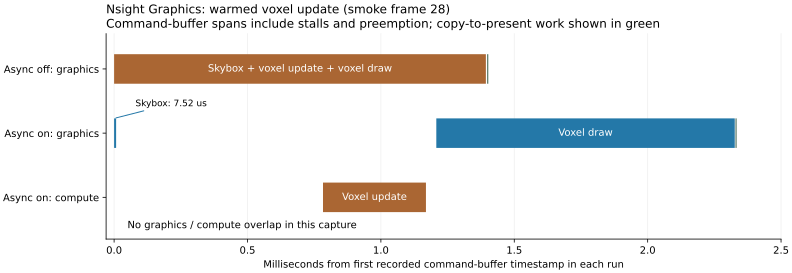

# Async compute: Nsight Graphics verification

Captured on 2026-09-20 after the user enabled GPU performance-counter access. **Nsight Graphics now works. The captures verify dedicated compute execution and the intended dependencies, but show no graphics/compute overlap or update-frame speedup in the measured workload.** Async compute remains opt-in. First-load GPU timing and full performance acceptance remain open.

## Scope and method

- Nsight Graphics 2026.3.1, Vulkan, NVIDIA GeForce RTX 5080 / GB203, driver 616.92, Windows hardware scheduling enabled.
- Existing MSVC Debug `scene_renderer_demo.exe`, Sponza, `voxelizer=comp`, `--rhi-thread=1 --frames=64 --smoke-test`, async policy off/on. No engine source or executable was changed for this verification.
- Six successful traces: two early off/on pairs and one later off/on pair. GPU clocks were explicitly **unaltered**. Validation and synchronization validation stayed enabled. The first pair collected screenshots; the other pairs did not.
- The early traces contain ten complete present-to-present intervals, corresponding to smoke frames **2–11**, at 1280×720. The later pair contains fifteen, corresponding to **24–38**, at 960×640. Frame correspondence is a **high-confidence inference** from the smoke sequence, PBR/voxel transitions, compute timeline serials, and API command shapes; the trace's application-frame-index field is unset.
- Nsight reports **V-sync enforced off / `VK_PRESENT_MODE_IMMEDIATE_KHR`** in both policies. This differs from the normal MAILBOX configuration. Comparisons below use matching profiler presentation settings.
- Each run used a temporary identical executable named `7zFM.exe` to select the existing RTSS no-hook profile. Configuration was restored byte-for-byte and the temporary copy removed after every pair. No persistent profiler, driver, or overlay settings were changed by this work.

The official CLI exports counters and `FRAME.xls`, but does not export the queue-event timeline in these runs. A local, version-specific reader decodes the trace's metadata block using the installed viewer's protobuf schema. It reads recorded queue types, Vulkan arguments and nonzero **bottom-of-pipe GPU timestamps**; it does not replay the application or derive GPU times from CPU logs. Every complete frame duration was cross-checked against Nsight's official `FRAME.xls` export, within 0.0001 ms rounding tolerance. Unresolved hardware-event correlation timestamps are not treated as zero-duration events.

Evidence anchors below use `Q<queue>:S<command-stream>:C<call-index>` in the decoded metadata. These are reproducible coordinates, **not Nsight GUI event IDs**. Stream 0 contains queue submissions/presents; command-buffer references identify the other streams. There are no captured pass-name markers, so semantic pass names are correlated with the source/RDG capture and command shapes, rather than asserted as Nsight labels.

## Queue routing and synchronization

**Verified:** Q0 is graphics, Q1 compute, Q2 transfer. Startup selects native families/indices `graphics=0:0`, `compute=2:0`, `transfer=1:0`.

Across the nine complete async-on update frames in the three traces, each voxel update has one clear, four direct dispatches and one indirect dispatch on Q1. These same actions are on Q0 with async disabled. Indirect voxel drawing, the viewport copy and presentation remain on Q0. Cached frames add no Q1 submission. Each full 64-frame run reports eight compute submissions when enabled and zero when disabled; graphics submissions rise from 130 to 138, with five transfer submissions in both cases.

For the later async-on trace, the warmed update has these anchors:

| Phase | GPU/API anchor | Evidence |
| --- | --- | --- |
| Independent skybox graphics | `Q0:S11:C4`, submitted by `Q0:S0:C15` | One indexed draw. No wait on the current compute result; signals graphics serial 66. |
| ResetVoxelVolumes | `Q1:S1:C1` | `vkCmdClearColorImage`. |
| ResetComputeIndirectComp / ResetDrawIndirectComp | `Q1:S1:C5`, `C9` | Two `vkCmdDispatch(1,1,1)` operations, in source order. |
| VoxelizationComp | `Q1:S1:C13` | Direct voxelization dispatch. |
| VoxelizationLargeTriangleComp | `Q1:S1:C17` | `vkCmdDispatchIndirect`. |
| VoxelPreDrawComp | `Q1:S1:C21` | `vkCmdDispatch(32,32,32)`. |
| Compute submission | `Q1:S0:C0` | Waits for earlier graphics serial 56 and transfer serial 5; signals compute serial 8. |
| VoxelDraw2 | `Q0:S12:C4`, submitted by `Q0:S0:C16` | `vkCmdDrawIndexedIndirect`; submission waits on compute serial 8, then signals graphics serial 67. |
| Viewport copy / present | `Q0:S13:C1` / Q0 queue stream | `vkCmdCopyImage`, followed by `vkQueuePresentKHR`. |

The exact producer signal is present in the consuming submission's waits and absent from the independent prefix's waits. Compute waits on an **earlier** graphics reader, not the current skybox submission. The consumer's first recorded command-buffer timestamp follows compute completion. These checks passed for all nine captured async updates.

## GPU timing results

All figures below are observations from instrumented Debug runs, not production benchmarks. “GPU work span” is the interval from the first recorded command-buffer timestamp in a frame to the end of its viewport-copy command buffer, across both queues. It includes gaps, preemption and synchronization. Nsight's “GPU frame time” is the present-to-present interval and includes idle time; it is not summed shader execution time.

| Matched workload | Samples per policy | GPU work span, off → on | Nsight frame interval, off → on |
| --- | --- | --- | --- |
| Early updates, first pair: frames 2, 3, 8, 11 | 4 | median **1.798 → 2.147 ms** | median 8.661 → 9.481 ms |
| Early updates, second pair | 4 | median **1.612 → 3.313 ms** | median 7.192 → 10.759 ms |
| Warmed update: frame 28 | 1 | **1.403 → 2.334 ms** | 8.920 → 10.087 ms |
| Warmed cached voxel frames: 29–38 | 10 | median 1.435 → 1.654 ms | median 3.124 → 3.111 ms |

**Measured overlap is zero in all nine async update frames.** In the warmed update, the independent skybox command buffer lasts only **7.52 µs** and completes before the compute command buffer starts. The clear/compute-chain interval is **269.664 µs** on graphics in the baseline and **385.888 µs** on compute in the async capture. Earlier async updates have median chain intervals around 225–228 µs, illustrating variation; the single later sample does not establish a persistent compute slowdown.

The warmed async graphics queue has a **1,200.256 µs gap** from the end of the skybox command buffer to the start of the voxel-draw command buffer. Only **104.640 µs** lies between the recorded consumer-submission start and its first command-buffer timestamp, and the consumer starts **38.880 µs** after compute completion. These intervals include scheduling/instrumentation overhead; they must **not** be reported as exclusive semaphore-wait duration. Pure graphics wait time is not isolated by this analysis.

For the same warmed frame, RDG's CPU handoff/backpressure metric is **260.0 µs off / 48.7 µs on**. It measures a different operation from native GPU submission or execution and does not contradict the longer async GPU work span. The exact rows and all underlying timestamps are retained in the evidence files.

The scheduling structure is correct, but the independent work available in these update frames is too small to overlap the later observed compute execution. Extra submission boundaries and gaps outweigh any observed overlap benefit in these captures. Their individual causes cannot be apportioned to engine CPU cost, driver scheduling, GPU contention and profiler overhead from these measurements. Cached-frame results do not establish an async-compute benefit because those frames have no compute update.

## Validation and limitations

Two fresh 64-frame controls, with the same temporary executable, scene, environment and off/on policies but **without Nsight injection**, exited successfully with **zero VUIDs, zero synchronization hazards and no reported memory leaks**. Their submission counts match the earlier correctness suite. The previous 768-test result remains applicable; engine code was not changed and the full suite was not rerun for this profiling-only task.

All six Nsight launches/captures/exports succeeded and reported zero `SYNC-HAZARD` messages and zero VMA device-memory leaks. However, each instrumented run logged ten errors, capped by validation's duplicate-message limit, for `VUID-vkCmdPipelineBarrier-pImageMemoryBarriers-02819`: `HOST_WRITE` source access paired with `ALL_COMMANDS`. Nsight also caused instance-function lookup warnings. Disabling screenshot collection did not remove these diagnostics. There are no `HOST_WRITE` source image barriers in the captured application command streams, and the fresh controls are clean. This supports a **profiler-specific interaction**; the precise injected component responsible remains unproven. Do not describe the Nsight runs as validation-clean.

Nsight itself disables the incompatible UNIQUE_HANDLES and DEBUG_PRINTF validation features. Instrumentation, Debug validation, unaltered clock variation, other GPU contexts, the small sample count and the profiler's presentation override limit performance conclusions. No bitwise full-scene output-equivalence claim is made.

**First-load frame 0 was not captured.** Both early trigger attempts (`--start-after-submits 0` and `1`) produced the same later workload window; the early reports stop before the frame-12 resize. The full 64-frame application logs are not evidence of a 64-frame GPU trace. Initialization/environment-preprocessing overlap therefore remains unknown. A controlled capture including that initialization, plus an isolated wait measurement and repeatable low-overhead performance comparison, is still required before closing the plan's full performance gate. There is no remaining counter-permission blocker.

## Reproduction and artifacts

- Capture commands, exit statuses and configuration-restoration results: `build/async-compute-step9-nsight-{retry,noscreen,warm}.py` and the matching `.json` files. Native controls: `nsight-control.py` / `nsight-controls.json` with the same prefix.
- Raw `.ngfx-gputrace` files and official metric exports: the six matching `build/async-compute-step9-nsight-<pair>-<policy>/` directories. Logs sit beside each directory.
- Reproducible decoder/verification: [analysis script](../build/async-compute-step9-nsight-analyze.py); plot: [plot script](../build/async-compute-step9-nsight-plot.py). Dependencies are isolated in `build/nsight-analysis-libs` (`protobuf`, `lz4`, `matplotlib`).
- Parsed queue calls/timestamps, exact semaphore references, frame CSVs, trace hashes and checks: [evidence directory](../build/async-compute-step9-nsight-analysis); aggregate measurements: [summary.json](../build/async-compute-step9-nsight-analysis/summary.json).
- Open [async-on warmed trace](../build/async-compute-step9-nsight-warm-1/7zFM_2026_09_20_14_54_07.ngfx-gputrace) and [async-off warmed trace](../build/async-compute-step9-nsight-warm-0/7zFM_2026_09_20_14_54_00.ngfx-gputrace) in Nsight Graphics for independent inspection.

NVIDIA's documentation explains the [GPU Trace collection and timestamp model](https://docs.nvidia.com/nsight-graphics/UserGuide/gpu-trace-overview.html) and [per-queue timeline and synchronization views](https://docs.nvidia.com/nsight-graphics/UserGuide/gpu-trace-ui.html). The measurements and findings above come from the local captures.
