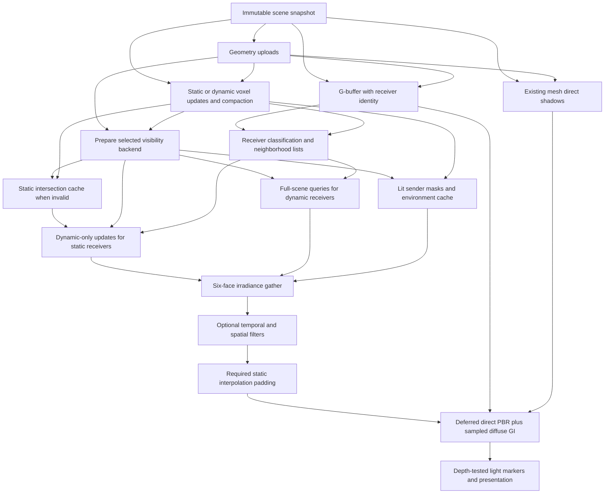

# Dynamic voxel-based GI implementation plan

Date: 2026-09-22; implementation status updated 2026-09-25. **V0, V1 and M0-M7 passed, including the locked M7 quality matrix:** calibrated voxelization is recorded in [VoxelizationCalibration.md](VoxelizationCalibration.md), deterministic averaged diffuse reflectance in [VoxelReflectanceVerification.md](VoxelReflectanceVerification.md), and the reference audit/HDR baseline in [DynamicVoxelGIM0Verification.md](DynamicVoxelGIM0Verification.md). Owner remains the compatibility default; averaging is selectable. [M1 queries](DynamicVoxelGIM1Verification.md), [M2 geometry/classes](DynamicVoxelGIM2Verification.md), [M3 static GI](DynamicVoxelGIM3Verification.md), [M4 dynamic visibility](DynamicVoxelGIM4Verification.md), [M5 filtering/history](DynamicVoxelGIM5Verification.md), [M6 lighting/materials](DynamicVoxelGIM6Verification.md), and [M7 functional acceptance](DynamicVoxelGIM7Verification.md) passed. **M8 is in progress:** [current measurements and validation boundaries](DynamicVoxelGIM8Profiling.md#current-work-at-the-stop-point-2026-09-25) cover receiver selection, compact caching and parallel gathering. The latest static-scene regression, final validation, remaining experiments and promotion decision are open; see the [M8 unfinished-work checklist](#m8-unfinished-work-at-the-stop-point-2026-09-25). Explicit directional GI is verified at 64³/128³ with static/dynamic geometry, temporal/spatial filtering, zero through 32 analytic lights, environment/emissive transport, and method switching. It uses ordinary compute DDA for bounce/environment visibility, existing mesh shadow maps for analytic sender visibility, RT features disabled, 128 rays per face and a checked memory budget. The [M7 quality corrections](DynamicVoxelGIM7QualityFixVerification.md) pass all 56 image profiles under unchanged limits. At 256³, only budget rejection/cone fallback is verified. Unsupported profiles and `auto` use cone tracing when it fits the configured GI cap; exhausted caps or incomplete voxel coverage use PBR. Runtime material/opacity updates, fixed bounds and explicit bounds rebuilds are implemented; see the [gap follow-up](DynamicVoxelGIGapVerification.md). M8 and hardware RT remain unfinished.

Implement the algorithm from **Dynamic Voxel-Based Global Illumination**, Alejandro Cosin Ayerbe, Pierre Poulin, and Gustavo Patow, Computer Graphics Forum 44(1), e15262 (2025; first published online in 2024), as the new GI method for ZenEngine mode 3. The paper uses a voxel irradiance cache whose visibility is computed against triangle geometry. Deliver its irradiance/cache pipeline first with replaceable compute-based voxel visibility, then add triangle queries when RT support reaches RHI and RenderCore. The first stage is an explicit approximation; the later triangle backend completes the paper's geometry-visibility requirement. Neither stage is voxel cone tracing or the reflective-shadow-map algorithm from the separate 2011 paper.

The source PDF is `E:\Dev\DynamicVoxel‐Based-Global-Illumination.pdf`. Page numbers below are PDF page numbers, 1-23. The [publisher's article](https://onlinelibrary.wiley.com/doi/10.1111/cgf.15262) identifies the method and publication. The [authors' GitHub repository](https://github.com/AlejandroC1983/dvbgi) redirects development to [Bitbucket](https://bitbucket.org/Alex_Storm_/dvbgi). Its README describes an academic Vulkan implementation tested on RTX 2060 and warns of possible outstanding validation errors. Use it to resolve algorithm details, not as an engine or synchronization layer to copy wholesale. Although the browsing tool could not retrieve Bitbucket's source pages, its REST API was accessible: the voxelization shaders, pipeline setup, and static/dynamic pass code were inspected at commit **`581c116061b1294dad2a8eca6afb45b49cc95a7e`** (2024-10-15). This was a source inspection, not a successful build/run or a complete audit of the authors' GI implementation.

This plan extends, rather than rewrites, the historical [VoxelGIImplementationPlan.md](VoxelGIImplementationPlan.md) and [VoxelGIVerification.md](VoxelGIVerification.md). Their successful tests describe the existing cone-tracing implementation, not the new method.

## 1. Target behavior and scope

Mode 3 should produce one-bounce indirect diffuse lighting with color bleeding and indirect shadows, supporting static and moving geometry, the existing multiple analytic lights, environment lighting, and emissive materials. It should preserve mesh-based direct shadows and light markers. Both geometry and compute voxelization must remain usable.

First complete **V0: calibrate and correct the existing voxelizers** using the pinned paper implementation plus an independent geometry oracle. V0 and **V1: deterministic averaged diffuse reflectance** have passed. Preserve both contracts while completing M0 and the subsequent algorithm milestones, delivered in two independently testable stages. **Stage A** implements directional irradiance, static/dynamic caches, camera-driven work, filtering, and engine lighting extensions using voxel DDA in ordinary compute shaders. It requires no acceleration-structure resources, ray-query shader extensions, or new native RT commands. **Stage B**, deferred until RT integration is scheduled, adds hardware triangle queries through RHI/RDG while reusing those stages. Keep the current cone tracer selectable for comparisons and as a fallback. Promote either stage only after its own acceptance gate.

Deferring native RT support does not eliminate visibility rays: Stage A follows rays through voxel cells using shader arithmetic. A software triangle BVH can also implement triangle visibility without hardware RT, but is optional work rather than a prerequisite for Stage A.

| Feature | Paper baseline | ZenEngine delivery decision |
| --- | --- | --- |
| Transport | One indirect bounce, diffuse materials | Required; no iterative multi-bounce claim |
| Visibility | Rays intersect scene geometry | Stage A: approximate occupied-cell intersections; Stage B: Vulkan triangle ray queries |
| Cache | Six irradiance directions per voxel | Required, separately for static and dynamic receivers |
| Work reduction | Static visibility cache; camera-visible receiver updates | Required; off-camera senders and occluders remain in the scene |
| Dynamic objects | Revoxelization, separate visibility updates, neighboring receiver cells | Required; rigid transforms and a deforming-mesh update test |
| Lights | One dynamic light in the demonstrated implementation | Extend to existing point, spot, and directional lights, up to `MaxSceneLights` |
| Direct shadows | Ray-traced geometry shadows | Retain current mesh shadow maps; never substitute voxel DDA for final direct shadows; triangle-query reference path arrives in Stage B |
| Environment and emission | Not established as equivalent to our current feature set | Explicit extensions with separate energy and visibility tests |
| Glossy transport | Future work | Keep current specular IBL; do not label it ray-traced specular GI |
| Voxelization | Dominant-axis raster boundary voxelization | Preserve both existing producers and their shared material/coverage contract |

Sparse clipmaps, streaming large worlds, transparent light transport, area-light sampling, ReSTIR, multi-bounce transport, and a general skeletal-animation asset pipeline are outside this implementation. Supporting updated vertex buffers is required; building an animation authoring/import system is not.

**Implementation priority:** complete functionality and correctness first. GPU profiling infrastructure, performance measurements, and optimization belong to the final milestone of each delivery: M8 for Stage A and H2 for the deferred Stage B. Earlier milestones have no GPU timing or frame-time acceptance requirement. Native GPU buffer-allocation failure is treated as a severe GPU error; recovery, retry/fallback after that failure, and new allocation-failure handling infrastructure are deferred to separate future work. Pre-allocation size/range/budget checks and existing resource-lifetime/submission contracts remain applicable.

### 1.1 Replacement choices

| Query replacement | Existing infrastructure it can use | Fidelity and cost | Decision |
| --- | --- | --- | --- |
| Compute voxel DDA | Both voxelizers, occupancy/material textures, normal compute dispatch and storage buffers | Returns occupied cells rather than triangle surfaces; thin geometry, normals, bias, and indirect shadows remain grid-dependent | Implement first; smallest route to exercising the complete irradiance pipeline |
| Compute software triangle BVH | Scene vertex/index/instance buffers and ordinary storage-buffer compute shaders | Can provide triangle hits and masked-material acceptance without native RT; needs BVH construction/refit, traversal, and performance work | Optional bridge if hardware RT is delayed and DDA quality is insufficient |
| Hardware triangle ray queries | Future AS resources, descriptors, builds, and synchronization in RHI/RDG | Matches the paper's geometric visibility more closely; performance still requires measurement | Stage B target |
| Shadow maps, RSMs, or screen-space tracing alone | Existing raster rendering | Do not supply general first-hit information for arbitrary receiver-to-sender directions throughout the scene | Not a replacement for the common visibility backend |

The [existing `VoxelVisibility`](../Data/Shaders/VoxelGI/gi_common.glsl) is a useful DDA starting point, but returns only a visibility scalar and treats an origin outside the grid as visible. It cannot be used unchanged for this pipeline. A software BVH would use bounds traversal and leaf triangle tests, as described in the [PBRT BVH reference](https://www.pbr-book.org/4ed/Primitives_and_Intersection_Acceleration/Bounding_Volume_Hierarchies); no software BVH implementation was found in the inspected active engine/shader paths.

The preferred sequence is **voxel DDA -> hardware RT**, with a software BVH only if needed. Avoid requiring two acceleration-structure implementations before delivering GI. DDA enables the pipeline work; it does not promise to cure the box-shaped indirect-occlusion artifacts associated with coarse voxels.

## 2. Current code and the gaps to close

The following observations record the pre-V0 working-tree baseline, including the uncommitted VoxelGI and shadow changes. Subsequent V0 corrections and their verification are recorded in [VoxelizationCalibration.md](VoxelizationCalibration.md); the baseline findings below explain why that prerequisite exists.

| Existing code | Current behavior | Required change |
| --- | --- | --- |
| [RendererServer.cpp](../ZenCore/Source/Graphics/RenderCore/V2/RendererServer.cpp) | Mode 3 records voxelization, mesh shadows, GI, then deferred rendering | Schedule G-buffer production before receiver classification and GI gathering |
| [DeferredLightingRenderer.cpp](../ZenCore/Source/Graphics/RenderCore/V2/DeferredLightingRenderer.cpp) | One function records both G-buffer and composition; square G-buffer attributes are linearly sampled at viewport resolution | Split graph construction into G-buffer and composition steps; expose actual dimensions and receiver class; use a coherent surface-texel lookup for the new method |
| [VoxelGIRenderer.cpp](../ZenCore/Source/Graphics/RenderCore/V2/VoxelGIRenderer.cpp) | Dense radiance/opacity mip chains and sky cache consume one voxel texture set and one geometry revision | Add the new renderer alongside it; retain an all-scene voxel output and combined invalidation for cone selection/fallback |
| [cone_trace.glsl](../Data/Shaders/VoxelGI/cone_trace.glsl) | Per-pixel cone marching through isotropic radiance mips | Keep as the legacy method; new composition samples directional irradiance |
| [inject_radiance.comp](../Data/Shaders/VoxelGI/inject_radiance.comp) | Direct light and sky injection use voxel occupancy for visibility | New method queries a selected visibility provider and caches intersections separately from lighting |
| [gi_common.glsl](../Data/Shaders/VoxelGI/gi_common.glsl) | Boolean base-grid DDA, no closest-hit record | Add an independently tested closest-hit/occlusion implementation behind the new query contract; preserve legacy behavior until its tests justify sharing helpers |
| [VoxelizerBase.h](../ZenCore/Include/Graphics/RenderCore/V2/Renderer/VoxelizerBase.h) and the two producers | One shared grid; deterministic triangle owner and coherent surface attributes | Support static/dynamic subsets, separate outputs, occupied-cell compaction, and dynamic clearing |
| [RenderScene.cpp](../ZenCore/Source/Graphics/RenderCore/V2/RenderScene.cpp) | Triangle-instance table exists; node buffers are initialized once; `Update()` updates camera and lights | Add geometry classification, transform/vertex updates, stable instance identity, and geometry/material revisions |
| [SceneShadowRenderer.cpp](../ZenCore/Source/Graphics/RenderCore/V2/SceneShadowRenderer.cpp) | Geometry-based direct shadows independent of voxel resolution | Preserve and invalidate correctly for moving/deforming objects |
| [VulkanExtension.cpp](../ZenCore/Source/Graphics/VulkanRHI/VulkanExtension.cpp) | Device-address, acceleration-structure, and ray-query feature plumbing exists | Stage B only: expose usable capabilities and complete resource/command/binding paths |
| [RHIShaderUtil.h](../ZenCore/Include/Graphics/RHI/RHIShaderUtil.h) | Acceleration-structure descriptors are explicitly unsupported | Stage B only: add reflection, descriptor binding, and validation |
| [RHICommon.h](../ZenCore/Include/Graphics/RHI/RHICommon.h), [RHIResource.h](../ZenCore/Include/Graphics/RHI/RHIResource.h), and RDG | No complete acceleration-structure resource/build/access abstraction | Stage A uses existing textures/buffers/compute; Stage B adds AS support with submission history and retirement |
| [RHIResource.h](../ZenCore/Include/Graphics/RHI/RHIResource.h), [RenderDevice.h](../ZenCore/Include/Graphics/RenderCore/V2/RenderDevice.h), and [VulkanDescriptorSetState.cpp](../ZenCore/Source/Graphics/VulkanRHI/VulkanDescriptorSetState.cpp) | Buffer sizes/storage-buffer creation use 32-bit byte counts; ordinary storage bindings default to the full buffer range; `RHIGPUInfo` does not expose `maxStorageBufferRange` | Stage A: expose the device range limit and reject unsupported individual buffers before allocation, independently of the total memory budget |
| [RHICommon.h](../ZenCore/Include/Graphics/RHI/RHICommon.h) and [RDGPassCompiler.cpp](../ZenCore/Source/Graphics/RenderCore/V2/RDGPassCompiler.cpp) | GPU capabilities expose local workgroup size/invocation limits, but not `maxComputeWorkGroupCount`; dispatch validation does not check device group-count limits | Stage A: expose per-axis dispatch limits in M0, validate direct dispatch dimensions, and bound GPU-generated indirect arguments independently of list capacity |
| [deferred_lighting.glsl](../Data/Shaders/SceneRenderer/deferred_lighting.glsl), [SceneRendererDemo.cpp](../ZenSamples/VulkanRHIDemo/SceneRenderer/SceneRendererDemo.cpp), and [capture_frame.comp](../Data/Shaders/SceneRenderer/capture_frame.comp) | Lighting is tone-mapped in composition; capture reads the final backbuffer, packs UNORM8, and writes PPM | Add opt-in pre-tone-map floating-point component capture in M0 before recording the legacy HDR baseline |

Vulkan feature detection alone is not an implemented ray-tracing rendering path. The first query milestone demonstrates voxel closest-hit and occlusion queries with RT features disabled; the later hardware milestone demonstrates actual triangle queries through RHI/RDG.

### 2.1 Current voxelization assessment: not yet certified

The current code has useful shared contracts: one padded cubic grid, dominant-axis projection, explicit triangle-instance/material records, depth/cull disabled during geometry voxelization, deterministic owner election, and coherent attribute resolution. However, **it is not correct to claim that both producers currently implement equivalent, complete boundary coverage**. The inspected geometry path can miss intersected cells, and the existing image/validation tests do not prove raw-volume coverage.

| Evidence from current code | Consequence | Required V0 action |
| --- | --- | --- |
| `GeometryVoxelizer::BuildVoxelizationGraph()` uses the default single-sample state; [voxelization.geom](../Data/Shaders/VoxelGI/voxelization.geom) emits the original projected triangle without edge expansion | A triangle that touches a cell but covers no pixel center can produce no voxel; dominant-axis selection alone does not prevent these holes | Reproduce a subpixel/sliver fixture, compare the paper's 8x MSAA path, and implement coverage meeting the independent oracle |
| [voxelization.frag](../Data/Shaders/VoxelGI/voxelization.frag) writes only the cell containing one interpolated world position | A slanted triangle can touch more than one depth cell within a projected pixel; the other intersected cells are not enumerated | Verify and correct conservative depth coverage, not just 2D raster coverage |
| [voxelization.comp](../Data/Shaders/VoxelGI/voxelization.comp) enumerates projected cells, tests three candidate depth cells, and uses triangle-box SAT | Its coverage contract is stronger than the current geometry raster path; agreement is not guaranteed, and the compute path is not an independent truth oracle | Prove the dominant-axis depth bound; compare against a separate high-precision triangle/box oracle, including boundaries and near-degenerate triangles |
| Geometry alpha testing uses fragment world position; compute uses the cell center; [resolve_surface.glsl](../Data/Shaders/VoxelGI/resolve_surface.glsl) resolves from the center after owner election | Masked edges can select different coverage/owners; selected attributes need not describe the same opaque point used by the geometry pass | Establish a shared masked-coverage and attribute-sampling policy and test mixed opaque/transparent texels |
| [voxel_surface.glsl](../Data/Shaders/VoxelGI/voxel_surface.glsl) clamps/renormalizes projected barycentrics; `atomicMin` chooses one triangle | This is a deterministic representative-surface approximation, not the paper's fragment-weighted mean or an exact closest-point operator | Calibrate single-surface accuracy separately from mixed-surface approximation; do not demand equality with averaged reference colors |
| Geometry degeneracy checks use world-space area while compute checks use grid-space area | The same tiny but nonzero triangle can encounter different effective rejection thresholds | Define consistent units/tolerances and regression cases before declaring tiny geometry supported |
| Both producer functions gate owner clearing on a non-null triangle buffer | Clearing a previous nonempty volume when the new input has zero triangles is not established by that path | Test empty-input transitions and explicitly clear stale occupancy/attributes when required |

A concrete analytic counterexample is an opaque triangle at voxel coordinates `(10.1,10.1,10.2)`, `(10.3,10.1,10.2)`, `(10.1,10.3,10.2)`: it intersects cell `(10,10,10)` but covers no projected pixel center. The current single-sample geometry path can therefore emit no fragment, while the compute overlap test can retain the cell. This follows from source/raster coverage reasoning; it has **not** yet been reproduced with a new GPU raw-volume readback in this review. Do not report this as a completed GPU calibration.

### 2.2 What the pinned paper implementation actually does

Calibrate against the implementation as well as Sections 4.1-4.2 of the paper. Inspect shader inputs and pipeline state together; the shaders alone do not reveal multisample coverage.

| Reference component at the pinned commit | Observed behavior | Calibration use |
| --- | --- | --- |
| [voxelization.vert / geom](https://bitbucket.org/Alex_Storm_/dvbgi/src/581c116061b1294dad2a8eca6afb45b49cc95a7e/data/vulkanshaders/voxelization.geom) | World-transformed triangles, dominant-axis orthographic projection, original triangle emission | Match world/grid transforms and axis conventions; the reference tie order differs from ZenEngine and should be normalized or recorded |
| [MaterialSceneVoxelization](https://bitbucket.org/Alex_Storm_/dvbgi/src/581c116061b1294dad2a8eca6afb45b49cc95a7e/Framework2/include/material/materialscenevoxelization.h) and its dynamic counterpart | Eight raster samples, `minSampleShading=1`, no depth/stencil state, no face culling | Compare effective sample-shading enable/masks/locations and shader invocations; setting a minimum does not alone establish per-sample execution |
| [SceneVoxelizationTechnique](https://bitbucket.org/Alex_Storm_/dvbgi/src/581c116061b1294dad2a8eca6afb45b49cc95a7e/Framework2/source/rastertechnique/scenevoxelizationtechnique.cpp) | An 8-sample raster attachment/render pass and a cube derived from the scene bounds | Reproduce the reference sample count and canonicalize its coordinates before comparing cells; ZenEngine's padded bounds are a documented difference |
| [voxelization.frag](https://bitbucket.org/Alex_Storm_/dvbgi/src/581c116061b1294dad2a8eca6afb45b49cc95a7e/data/vulkanshaders/voxelization.frag) | Per-fragment cell mapping, bit-packed occupancy, RGB reflectance averaging through compare-and-swap | Decode occupancy into canonical cell coordinates; compare reflectance using its own aggregation policy, not raw packed bytes |
| [voxelizationdynamic.frag](https://bitbucket.org/Alex_Storm_/dvbgi/src/581c116061b1294dad2a8eca6afb45b49cc95a7e/data/vulkanshaders/voxelizationdynamic.frag) | Same raster method writing separate dynamic occupancy/reflectance | Guide later static/dynamic separation; preserve the now-calibrated coverage contract when M2 introduces it |

The inspected reference fragments sample reflectance RGB without ZenEngine's alpha-cutoff logic; opaque reference fixtures must be distinguished from our masked-material extension. The reference also averages reflectance whereas ZenEngine resolves an elected owner. Those differences must be classified, not hidden by a global image-error tolerance.

The paper cites Takeshige's [The Basics of GPU Voxelization](https://developer.nvidia.com/content/basics-gpu-voxelization), which distinguishes dominant-axis selection, conservative coverage, and MSAA approximation. MSAA can still miss primitives between samples. Therefore copying the authors' 8x setting is a useful comparison, **not proof of hole-free conservative voxelization**. Stage A uses voxel occupancy for visibility and is especially sensitive to missing cells; it needs an independent correctness oracle even when reference images look plausible.

### 2.3 V0 calibration procedure and exit gate

1. **Pin provenance and normalize inputs.** Record the reference commit, selected file hashes, engine revision/working-tree snapshot, shader compiler, driver/device, sample support, and effective pipeline state. Use identical triangle/index buffers, instance transforms, materials, fixed grid origin/voxel size/resolution, and coordinate orientation. Begin with opaque constant-color fixtures, then textures and engine-only material features. Automatic scene normalization must not resize the triangle differently between runs. Do not use Sponza screenshots with different bounds as a cell-level comparison.
2. **Add a diagnostic volume export.** Through existing RHI/RDG copy/readback support, export base-level owner IDs, binary occupancy, linear albedo, decoded normals/metallic, and HDR emission, before mip generation, lighting, filtering, or padding. Readback must wait for the correct GPU completion and preserve production resource states. Export slice images, cell-coordinate diffs, and machine-readable counts. Keep this an opt-in calibration path; no per-frame production readback is needed.
3. **Build an independent CPU oracle.** Use double-precision triangle clipping against cell boxes, or another independently implemented intersection method, rather than copying the GPU SAT verbatim. For opaque nondegenerate triangles, define conservative boundary occupancy as every triangle-intersected cell, with explicit rules for face/edge/corner touches, outer grid boundaries, and a small numerical ambiguity band. Enumerate sufficient candidate cells, including exact-boundary neighbors. Record ambiguous cells separately; do not hide ordinary missing voxels behind an oversized tolerance. No solid filling of closed meshes is intended: this is boundary voxelization.
4. **Compare three results.** Compare ZenEngine `geom`, ZenEngine `comp`, and the pinned paper reference independently against the oracle. An isolated reference voxelization harness may be used if its full renderer cannot run, but reproduce the relevant pipeline/sample state and label the harness. Reference defects/approximations are findings, not output to copy blindly. Where the paper backend cannot be run, report that comparison as incomplete; source inspection is not a substitute for the gate's GPU evidence.
5. **Correct the current producers before GI work.** For geometry, evaluate conservative projected coverage plus intersection-tested depth candidates, using hardware conservative raster only when properly supported or a portable software expansion/test path. A reference-compatible 8x MSAA run may remain a comparison profile, but cannot stand in for the selected conservative contract. For compute, verify projected candidate ranges, the three-depth-cell bound, clipping, precision, and degenerate handling. Share grid/material/intersection helpers when they express the same contract. Do not repair missing coverage by indiscriminate volume dilation, solid filling, or GI bias tuning.
6. **Separate coverage from attributes.** First establish occupancy for opaque triangles. Then validate masked coverage using an explicit supported sampling/footprint rule and high-resolution reference cases; do not claim exact alpha-texture coverage from a single texel sample. For a single elected surface, validate the same material/normal/emission at the agreed surface point. The current voxel normal is an interpolated mesh normal, not the normal-mapped G-buffer normal; compare equivalent signals and document this limitation instead of treating all differences as defects. For mixed surfaces, retain and quantify the owner policy or adopt a justified deterministic aggregation; never copy the reference's concurrent averaging just to match a screenshot.
7. **Publish the evidence and rerun affected checks.** Store the fixtures/runner under `tools` or the existing test targets, logs/raw dumps under `build/voxelization-calibration`, and a proposed `Doc/VoxelizationCalibration.md` report with settings, measured errors, before/after slices, remaining approximations, and exact commands. Preserve the user's config and current changes. This report is an implementation deliverable; it is not present or marked passing merely because this plan exists.

Minimum calibration matrix:

| Fixture group | Required checks |
| --- | --- |
| Axis-aligned, diagonal, grazing, and axis-tie triangles | No unexplained opaque-cell omissions; all three projection orientations and both windings |
| Subpixel triangles, slivers, shared edges, tessellated planes | Missing-center case above, continuity across projection changes, no seam gaps introduced by triangulation |
| Sloped triangles spanning several depth cells per pixel | Correct depth candidates rather than one fragment-position cell only |
| Exact grid faces/edges/corners, negative coordinates, clipping, outside geometry | Shared touch/bounds convention; no out-of-range writes or boundary-clamped ghost cells |
| Zero-area, near-degenerate, large triangles, nonuniform/negative-scale instances | Explicit rejection/tolerance rules, valid normals, no lost instance/material identity |
| Closed box and thin walls, including black opaque material | Boundary cells rather than filled interiors; occupancy independent of RGB brightness; grid-dependent thickness documented |
| UV0/UV1, vertex color, texture factors, sRGB, masked checkerboards, HDR emission | Albedo/normal/metallic/emission coherence and explicit masked-coverage policy; compare against the G-buffer at matching surface points |
| Overlapping materials and repeated triangles/draw order | Stable occupancy; deterministic owners for fixed record IDs; order-sensitive representative colors documented rather than mislabeled as averaging |
| Rebuild, transform/reload, empty input, removal, mode switch, failed submission | No stale occupancy/attributes and no success revision published for failed work |
| 64/128/256 grids; geom/comp; inline/threaded; async off/on | Identical logical contents within declared numeric bounds; zero application/VUID/synchronization errors |
| Sponza using fixed normalized bounds | Slice/difference inspection at columns, arches, fabrics, thin rails, and floor/wall contacts; aggregate and regional errors against the chosen references |

**V0 exit criteria:** no unexplained false-negative or false-positive opaque cells outside the declared numeric/touch ambiguity set in the analytic fixtures; both producers meet the same approved boundary-coverage contract; material/normal/emission errors stay within predeclared format/sampling tolerances; rebuild/empty/failure cases pass; and GPU dumps, reference comparisons, and limitations are reviewed in the calibration report. Quantify missing/extra counts and precision/recall, not only occupied-cell totals or final GI images. Known MSAA-reference omissions may remain documented reference limitations, but do not excuse misses in the engine's approved conservative profile.

V0 is **passed for the calibrated contract**. The [implementation record](VoxelizationCalibration.md) contains the completed analytic/material/submission matrix, native lifecycle checks, Sponza regions, and isolated reference occupancy comparison. It quantifies point-alpha, owner-selection, normal, and numeric limitations; the full paper executable and its reflectance averaging were not run. V1 has its own passing [verification record](VoxelReflectanceVerification.md), independent of the historical V0 pass. After M2 changes static/dynamic production, repeat the relevant V0/V1 suites for each class and their union before M3 consumes those outputs.

## 3. Algorithm contracts

### 3.1 Grid, geometry, and ownership

Reuse the normalized renderer-world grid transform. All voxelization, ray origins, hit reconstruction, light positions, and final lookup use that transform. Keep the grid fixed while objects move within it. An explicit bounds change rebuilds all grid-dependent caches; do not recenter around moving objects every frame.

Reserve a documented movement margin when establishing bounds. Stage A can represent only geometry covered by its voxel grids: require those bounds to contain the participating geometry before declaring complete coverage. On an out-of-bounds update, return incomplete coverage and rebuild explicit bounds or select the documented method fallback; do not claim a clear ray through unrepresented geometry. Triangle backends retain out-of-grid geometry as occluders; out-of-grid receivers get no cached diffuse GI and out-of-grid surface hits contribute no bounced light, but neither becomes a sky miss. Count/report these cases and offer an explicit bounds rebuild. Automatic clipmap or moving-volume behavior is out of scope.

Classify each renderable instance as static or dynamic. Classification belongs to the instance, not the shared mesh. A cell can contain both classes, so neither occupancy nor a voxel owner can identify the camera-visible object's class. Add an integer G-buffer instance/class output, with explicit background invalidity, populated from the same immutable draw snapshot as the other G-buffer attributes.

Maintain separate static and dynamic surface outputs. Both voxelizers consume the same filtered triangle-instance lists and the coverage/material contracts certified by V0, resolving albedo, normal/metallic, emission, alpha masking, UV selection, and vertex colors consistently. Preserve the deterministic owner for representative base color, mesh normal, metallic, and emission. V1 adds a separate averaged GI diffuse-reflectance output, using integer sums/counts and a resolve pass; do not adopt the reference's packed compare-and-swap averaging loop.

For V1, one accepted triangle-voxel pair contributes once at the calibrated cell-center material sample, with equal weight. Accumulate linear `rhoDiffuse = baseColor * (1 - metallic) * 0.96`, using the existing resolved material bounds before fixed-point encoding. Average this per-contribution expression, not averaged base color multiplied by one owner's metallic value. Emission and normals are outside this average. Consumers use the resolved reflectance once, without applying metallic or the `0.96` factor again; final camera-visible receiver shading still uses its own G-buffer material.

This contribution rule adapts the paper's reflectance averaging to our conservative producers; it does not reproduce its MSAA fragment weights or exact surface-area weighting. Repeated triangles and tessellation can change the represented mean, and unrelated surfaces in one cell can still blend. V1 must quantify those limits. Retain the owner-based GI policy for A/B comparison, record the active policy in captures, and invalidate dependent lighting/history on a policy change without claiming an occupancy/visibility change when coverage is unchanged.

Generate compact occupied-cell lists and grid-to-list index maps. Use the paper's encoding `N*N*x + N*y + z` consistently, or provide one shared conversion if existing storage order differs. A compact-list index is not a persistent history identity: histories are keyed by grid coordinate, class, and grid generation.

For dynamic geometry, clear/rebuild its occupancy and attributes independently. Clear old occupied positions as well as newly touched ones. Removing the last dynamic instance must remove its contributions and restore unoccluded static visibility. Static-to-dynamic promotion also removes the object from the static voxelization and the selected provider's static scene view and invalidates affected static visibility; merely changing a flag is insufficient.

### 3.2 Visibility and cached intersections

Sections 4.1 and 4.5, pages 4-6, define the central optimization:

1. Precompute intersections with static geometry for each occupied static voxel, for six faces and 128 fixed, slightly jittered hemisphere directions per face.
2. On an update, trace the same rays against dynamic geometry for active static receivers. Select the nearer of the static and dynamic intersections.
3. For dynamic receivers and their required neighboring cells, trace the full scene.
4. Reuse static intersection data when a moving object leaves a ray's path.

Use three logical scene views: static-only, dynamic-only, and full scene. DDA implements them with separate occupancy/attribute sets; full-scene traversal checks both classes and resolves the nearest cell hit. Hardware RT later uses separate TLAS objects sharing mesh BLAS objects, so dynamic-only queries have restricted traversal. With RT, rigid motion updates instances/TLAS and changed vertices update or rebuild the relevant BLAS followed by dependent TLAS work; topology changes require rebuild. Empty dynamic scenes have an explicit no-query path for every backend.

Stage A substitutes occupied-cell hits for the paper's surface hits in the four steps above. Cache the cell's class/index and its entry distance, using the resolved voxel surface normal/material as an approximation. Do not invent triangle barycentrics, exact hit normals, or exact primitive identity for a cell hit. Co-located static/dynamic cells cannot be depth-ordered within the cell by DDA; define a stable tie rule and expose this limitation in comparison images.

Cache explicit hit/miss/unknown validity, world-space distance, and the sender information required by the chosen backend. Reconstruct position from the exact stored ray origin and direction. For triangle hits, resolve sender class and voxel coordinates; for DDA preserve the already known voxel coordinate rather than re-deriving it from a quantized boundary distance. Use normalized directions and world-space distances consistently under nonuniform instance scaling. The paper packs each triangle ray into four bytes: a 16-bit distance plus a packed normal. Start with an unpacked diagnostic format; DDA and triangle caches may use different packed layouts behind the common decoded-hit contract.

Define a deterministic surface-to-voxel lookup for points on cell boundaries. For triangle backends compare the packed path against diagnostic hit identity and barycentrics; half-precision distance rounding must not select an empty cell or the opposite side of a thin wall. For DDA compare against exact integer cell/class identity and cell-entry distances. If a compact representation cannot satisfy its fixture tolerance, retain enough sender identity/precision and update the memory estimate. A hit with missing voxel attributes remains an occlusion hit, never an environment miss.

Use **face-center origins**, confirmed by the M0 source audit: voxel center plus the signed face axis times the per-axis half-cell extent. The static ray generator, dynamic ray generator, and gather reconstruction use this convention. Keep tracing, distance reconstruction, bias, and cache lookup identical. The reference's ray minimum is scaled from the half-cell diagonal; its tuning constants are not validated engine defaults. Do not apply the existing cone tracer's 1.5-voxel receiver bias to triangle queries; use a small scale-aware epsilon and test self-intersection and thin walls. See [the M0 audit](DynamicVoxelGIM0Verification.md) for source locations and packing details.

**Visibility is independent of illumination.** Choose the closest accepted geometry before checking whether its voxel is lit. An unlit dynamic blocker must still hide a lit static sender. The wording in Section 4.5 ties part of the dynamic-hit discussion to lit voxels; do not implement that as permission to see through unlit geometry. Keep an explicit regression for this case.

For triangle backends, respect opaque/masked material visibility, UVs and cutoff, double-sided state, transforms, and triangle identity. Reject masked-out candidate intersections before confirming a hit. Use geometric normals for geometric sidedness and bias; keep shading-normal decisions explicit. DDA inherits material coverage from voxelization and cannot resolve a cutout or multiple surfaces below voxel resolution; it must not reject an occupied cell solely because its one representative normal faces away. Alpha-cutoff/opacity edits invalidate occupancy and visibility in every backend, while a base-color-only edit need not rebuild geometry.

### 3.2.1 Stage A DDA requirements

- Intersect the finite ray interval with the grid AABB before traversal, including rays starting outside it. Track distances in world units. Handle zero direction components, negative directions, exact grid boundaries, edge/corner ties, and zero-length segments deterministically.
- `TraceClosest` returns the first occupied cell with entry distance, class, cell identity, and resolved attributes. `TraceOccluded` can stop after a valid occupied cell before `tMax`; it need not find the nearest hit. Both ignore illumination when deciding occupancy.
- Limit self-cell rejection to an explicit source-cell hint and its initial exit interval. Never ignore the same coordinate in the other class or skip an arbitrary distance through neighboring cells. Test face-center origins inside the source voxel. This is an approximation with a documented thin-geometry tradeoff, not triangle-level self-intersection handling.
- Prove the traversal bound from the intersected grid dimensions and the chosen tie policy. A watchdog, invalid input, or unfinished query returns `Unknown`, not a fabricated miss. Diagnose and retry/fallback at pass/frame boundaries rather than injecting sky light on failure.
- Use unfiltered base occupancy initially. A later empty-space hierarchy must conservatively OR occupied children and preserve base-level first-hit results; the existing averaged radiance/opacity mips are not a conservative intersection hierarchy.
- Keep visibility sampling, biases, and coverage metadata separate from GI energy integration. All non-RT shader variants compile without `GL_EXT_ray_query` or acceleration-structure descriptors.
- Do not replace `SceneShadowRenderer` with this traversal. Final direct shadows retain triangle rasterization, so Stage A cannot reintroduce grid-shaped direct shadows. Indirect occlusion may still show grid artifacts.

### 3.3 Sender lighting and receiver gathering

The paper's Section 4.3, page 5, classifies lit voxels with eight interior light-visibility queries and a threshold above four visible samples. **M0 found a paper/source discrepancy:** the pinned shader uses `numNoIntersection > 1`, with samples at the eight combinations of center plus/minus `0.475 * cellExtent`. Retain the paper's strict `> 4` threshold as the initial engine baseline and those interior sample positions; do not claim that threshold matches the pinned code. All occupied sender voxels are eligible, including those outside the camera view.

**M7 quality adaptation:** production analytic sender masks now use the existing alpha-aware mesh shadow maps at the owner triangle's projected cell-center point, shared with sender light evaluation. This fixes false finite-light occlusion by solid voxel boxes. DDA bounce/environment queries and the native eight-corner query oracle remain distinct; see [quality corrections](DynamicVoxelGIM7QualityFixVerification.md).

Store one per-voxel bit per enabled light for the engine extension. There are currently at most 32 enabled scene lights, so a 32-bit mask per class/cell suffices. Its bit order must match the immutable enabled-light snapshot; removing, disabling, or reordering lights invalidates the masks. This extends the paper's single-light flag without multiplying geometric visibility caches by the light count. Light color/intensity changes require regathering but can retain geometric light visibility when other properties are unchanged.

Reuse `EvaluateLight` for direction, attenuation, spot cones, and ranges. Point/spot visibility rays stop before the light; directional rays traverse relevant scene geometry. Honor the existing shadow-enable controls. The mask is an approximation of source illumination, not the receiver-to-sender occlusion test. Emissive surfaces remain senders even when their analytic-light mask is zero.

Define buffers in linear HDR units:

- Cached face values represent **irradiance**, before receiver albedo and receiver BRDF factors.
- For a diffuse hit, outgoing radiance is `Le + rhoDiffuse * E_direct / pi`, using the hit normal and the sender's resolved material. In V1's averaged policy, `rhoDiffuse` is the separately resolved mean including the diffuse/metallic factors; do not reapply them. The owner policy evaluates the same expression on its representative material. Normal/emission selection remains explicit and is not changed by reflectance averaging.
- Gather incident radiance into the receiver face with a documented hemisphere quadrature. For a sampling density `p(w)`, the reference estimator is `E_face = mean(Li(w) * max(dot(n_face,w),0) / p(w))`.
- Section 4.6 describes a differential-area form factor. M0 found fixed direction tables without stored PDFs, distance/area heuristics in gathering, and a final empirical factor of four marked for adjustment in the reference. This is not established as the normalized solid-angle estimator above. Use that estimator as an explicit engine adaptation, with a documented sampling PDF; do not apply an additional inverse-square/form-factor factor. A constant radiance hemisphere must integrate to `pi * L`.
- Final diffuse outgoing light applies the receiver reflectance and `/pi` once, with the established PBR diffuse weight. Keep tone mapping and exposure outside the GI integration.

Use 128 directions per face for the paper reference setting. Direction identity, weights, and ray count form part of the static-cache key. Any change invalidates that cache. Do not rotate static sample directions each frame while reusing old intersections.

Environment handling is an explicit extension: confirmed ray misses contribute the rotated environment radiance; hits can reflect directly incident environment illumination computed with the selected query backend. `Unknown` or incomplete coverage is not a sky miss. Reflected environment light needs a sender-side environment cache for all relevant occupied senders, including off-screen ones, not just camera-visible receivers. Invalidate it for occluder and environment changes. Do not read last frame's receiver GI as sender direct lighting, which would silently add uncontrolled extra bounces. Keep unoccluded specular IBL as the existing approximation and avoid also adding the old diffuse environment term in composition.

Preserve the current indirect-intensity distinction: scale bounced surface-hit contributions, including emissive senders, but do not scale the directly visible environment term. Apply this gain while gathering the two contributions into the final irradiance cache, avoiding another set of persistent volumes. Changing the gain therefore invalidates gathered lighting/history, and composition must not multiply it again. At zero indirect intensity, visible sky can still light a receiver.

### 3.4 Receiver selection, interpolation, and history

Section 4.4 selects receivers using G-buffer positions. Deduplicate active cells on the GPU and generate bounded work lists/indirect dispatch arguments. Bound every dispatch dimension by the device's `maxComputeWorkGroupCount` as specified in Section 5; fitting the work list in memory does not establish dispatch validity. There must be no per-frame CPU readback of receiver counts. Check coordinates before indexing, and handle background, zero receivers, padded dispatch lanes, and overflow explicitly.

Receiver identity and surface attributes must describe the same G-buffer texel. For the initial `dynamic_voxel` composition, map the viewport pixel center to normalized screen UV, compute `floor(uv * gbufferExtent)`, clamp to the valid integer extent, and use `texelFetch` at that coordinate for instance/class, position, depth, normal, and material outputs. Receiver classification reads the same tuples at native G-buffer resolution; composition uses the identical background/validity rule. Share the lookup convention and supply actual extents after resize. The existing linear-repeat attribute sampler cannot be reused for this surface lookup: at a silhouette or class boundary it can blend positions from different surfaces while the integer ID identifies only one. Directional irradiance still uses the intended world-space trilinear sampling. Any later image reconstruction must preserve surface identity and be verified separately. Test square-to-widescreen and odd-sized extents, screen edges, background silhouettes, and adjacent static/dynamic surfaces.

Preserve a geometric normal separately from the normal-mapped shading normal before adopting this lookup. The current [composition shader](../Data/Shaders/SceneRenderer/deferred_lighting.glsl) reconstructs it from `cross(dFdx(worldPos), dFdy(worldPos))`, falling back to the shading normal when the result is too small; [scene_shadows.glsl](../Data/Shaders/ShadowMapping/scene_shadows.glsl) uses it for shadow bias and receiver-plane depth correction. With a 4096-square viewport sampling a 2048-square G-buffer, a 2x2 pixel quad can fetch one identical position, making those derivatives zero. For the initial implementation, compute the geometric normal in the G-buffer pass from derivatives of the original interpolated world position before alpha discard, preserve it in a documented encoding, and fetch it from the same texel as receiver identity. Define orientation against the unperturbed surface and handling of degenerate/invalid results; a zero derivative after resampling must not silently select the normal-mapped normal. Use the geometric normal for direct-shadow bias/plane correction and retain the shading normal for the BRDF and directional irradiance lookup. Verify normal-mapped flat and sloped receivers at equal resolution and 2x/noninteger upscaling, including silhouettes and mirrored instances, before considering M3's shadow-preservation requirement passed.

Static receiver selection must include the cells needed by final trilinear sampling and spatial filtering, including the occupied donors read by static padding, or validate and fill their missing values before use. Dynamic receiver lists include the paper's `5x5x5` neighborhood around dynamic occupied cells; offer `3x3x3` as a measured quality option. Distinguish actual occupied sender cells from empty receiver-padding cells. Computing lighting for an empty receiver cell must not turn it into an occluder or emitter.

**Valid interpolation is required in M3, before optional filtering.** Initially populate the empty cells required by static trilinear lookup with the normalized average of valid occupied static neighbors in a `3x3x3` neighborhood. Read only occupied donors with compatible generation/lighting validity, never other padding or cleared cells; a missing required donor must be updated before publishing a ready composition volume. Rebuild affected padding after its donors change, without modifying occupancy, sender attributes, or occupied-cell history. Use separate source/destination resources and reusable composition scratch within the existing bank budget. In M3, pad from raw gathered irradiance; in M5, pad from the selected temporal/spatial output. Padding remains enabled when either or both filters are disabled. Preserve an unpadded raw-face diagnostic for estimator checks.

Verify this independently using M1's deterministic provider with fixed lighting that produces a spatially constant irradiance field, and a plane translated through fractional voxel positions. For example, at `z=10.1` in unit-voxel coordinates, an occupied layer containing irradiance `1` interpolates to `0.6` if its empty neighbor is cleared; correct interpolation support must preserve `1` within numeric tolerance. Sweep axis-aligned and sloped fixtures through cell boundaries and grid edges, testing raw-face values and composed diffuse output against the known receiver material/BRDF response with filters disabled. This checks interpolation support independently of DDA geometry error.

Allocate separate static/dynamic six-face irradiance sets. For final shading, select one signed X, Y, and Z face from the surface normal and blend the three samples. M0 confirmed that the reference uses `1 - acos(abs(n_i))/(pi/2)`, then L2-normalizes the three weights. Use normalized squared normal components as the initial engine adaptation: weights sum to one and preserve a constant face field, including diagonal normals. Test axis-aligned and diagonal normals and normal-mapped surfaces. The nominal three-sample composition depends on valid neighboring data, not on interpreting uninitialized cells as black.

**M7 quality adaptation:** composition now reads all six faces with signed weights `(n_i² ± n_i)/2`, preserves constant and first-order directional irradiance, validates each contributing face and clamps the reconstructed result nonnegative. The analytic regression and measured effect are in the [quality correction report](DynamicVoxelGIM7QualityFixVerification.md).

In M5, add the paper's temporal filter (`alpha = 0.03` per update), `3x3x3` spatial Gaussian filter, and dynamic-cell cooldown (0.3 seconds), from Sections 4.6-4.8, retaining M3's static empty-cell padding after the selected filters. Use separate source/destination images for neighborhood filtering. Initialize newly valid receivers from their first result; do not blend with cleared or unrelated history. This deliberately differs from the pinned source's zero-color sentinel and initial multipliers (`0.575` static, `0.7` dynamic), found in M0. Track explicit validity, grid generation, and last-update time. Reject stale history when a cell changes class/occupant or undergoes a major lighting/geometry change. Ordinary continuous motion/light animation should still use filtering.

**M7 quality adaptation:** multiply the spatial Gaussian by the nonnegative surface-normal cosine for occupied cell pairs, preventing opposite surfaces from exchanging filtered energy. Empty dynamic-neighborhood cells retain Gaussian filtering. Temporal behavior and static padding are unchanged.

Keep a paper-reference fixed-alpha option. The engine default should use an elapsed-time equivalent, `alpha(dt) = 1 - (1 - 0.03)^(60*dt)`, with explicit resets after long gaps, to avoid frame-rate-dependent convergence. Cooldown uses seconds. A camera cut changes active receiver coverage; it does not require rebuilding static intersection data. Newly revealed cells must receive valid lighting before composition.

Separate caches address static/dynamic mixing, but do not guarantee zero leakage across all thin surfaces. Retain the paper's known limitation and measure any additional normal/visibility-aware filter as a later quality improvement.

## 4. Engine ownership and graph integration

Use the current V2 renderer, not the older `Graphics/Val` API.

- `RenderScene` owns instance classification, stable IDs, geometry/material/light revisions, and immutable frame snapshots.
- Extend voxelizer input/output handling to accept static/dynamic subsets and separate output sets without duplicating coverage/material shaders. Mode 1 can visualize their union or either class.
- Add a focused RenderCore `GIVisibilityProvider` boundary for scene preparation, graph resource declaration/binding, shader variant selection, and coverage/capabilities. The first provider consumes voxel grids; the later hardware provider owns scene-query state backed by RHI AS resources. Keep native Vulkan objects out of renderer code.
- Add a `DynamicVoxelGIRenderer` beside the existing `VoxelGIRenderer` during migration. It owns the new method's caches, work lists, settings, and passes. Share small lighting/grid input records where useful; do not build a general GI plugin framework.
- `DeferredLightingRenderer` owns G-buffer generation, composition, depth preservation, and markers. Expose these graph steps separately so GI can consume G-buffer resources in between.
- Stage A uses existing RHI buffers, images, and compute commands. In Stage B, RHI/VulkanRHI own acceleration-structure creation, build recording, address queries, descriptors, synchronization translation, and destruction. RDG owns declared dependencies; RenderDevice owns submission and retirement in both stages.

The retained cone renderer requires a single coherent all-scene voxel set. Initially, selecting `cone` or entering cone fallback clears and revoxelizes all static and dynamic triangle instances from one immutable snapshot into that set, using the same calibrated producer/resolve shaders. This also supplies mode-1 union visualization when requested. Keep stable scene triangle-record IDs, representative owner attributes, and the selected V1 reflectance policy; rebuild averaged reflectance from all contributing triangle instances rather than averaging class means without their counts. Do not pass only one class's textures to the cone renderer. Changes to either class's geometry, membership, coverage, or resolved surface attributes invalidate the combined output and advance its successful-publication revision, so cone opacity mips, sky lighting, and radiance refresh together as required. Removal and class promotion must leave no stale combined cells.

M2 implements the following cone path; its opt-in class preparation and verification are recorded in [DynamicVoxelGIM2Verification.md](DynamicVoxelGIM2Verification.md). Allocate the combined cone output lazily. Rebuild it and its dependent lighting before composing the first cone frame; a previously allocated volume is usable only if its scene/grid generations still match. While preparation cannot complete, use a ready compatible method or the documented PBR fallback. Include the combined output, cone caches, and all old in-flight generations in transition memory checks, and retire unused resources through RenderDevice. A later merge of class outputs may replace all-scene revoxelization only after proving equivalent owner/material resolution and invalidation.

### 4.1 Stable query contract and replaceable stages

Select the GI method independently from its visibility backend. The `dynamic_voxel` GI method must not imply hardware RT. Bind one provider for a complete frame; do not mix DDA static caches with hardware dynamic-hit distances inside the same nearest-hit decision.

The narrow interface has two sides:

| Side | Contract | Deliberately backend-specific |
| --- | --- | --- |
| RenderCore preparation | Given an immutable scene/grid snapshot, declare preparation passes and produce a ready query-resource bundle or an explicit failure | Occupancy views, optional software BVH buffers, or BLAS/TLAS builds |
| Pass integration | Declare resources read by each query pass and bind a compatible compiled shader variant | Descriptor layouts, AS declarations, traversal uniforms, and packing stride |
| Capabilities | Report backend ID/generation, voxel-versus-triangle hit precision, supported material coverage, and scene coverage bounds/completeness | Native RT availability and actual traversal limits |
| Shader `TraceClosest` | Return the nearest represented hit in the requested interval, or a confirmed miss, or unknown/incomplete | Traversal algorithm, hit details available, and packed cache representation |
| Shader `TraceOccluded` | Return blocked, confirmed clear, or unknown for a finite segment | Any-hit early termination; no first-hit ordering requirement |
| Surface decoding | Resolve a hit's sender class/cell, material inputs, position, and normal with explicit precision | DDA cell attributes versus triangle hit reconstruction |

Use one shared CPU/GLSL definition for the logical request and decoded response. A request contains world-space origin, normalized direction, `[tMin,tMax)` with finite validated values, a static/dynamic/all mask, and an optional source-surface hint for self-intersection. Directional/sky queries use a conservative scene-bound distance rather than an unbounded numeric sentinel. The backend may narrow traversal against its bounds but cannot silently shorten a requested segment and call it clear.

A closest-hit response contains status (`Hit`, `Miss`, `Unknown`), world-space hit parameter, position, sender class, cell/surface reference, normal, and a precision/validity flag. Triangle identity and barycentrics are optional backend details, not fields that DDA fabricates. Consumers may request exact geometry only from a provider advertising triangle hits. DDA's entry position is a voxel boundary, not proof that the representative triangle intersects that position. Tie handling and finite-interval endpoint semantics are shared and tested.

The common GI shaders own sampling directions/weights, static-versus-dynamic nearest selection, sender lighting, gathering, temporal accumulation, filtering, and composition. Query implementations live in separate GLSL includes compiled into provider-specific variants through `ShaderProgram` registration. Share the gather bodies; do not copy them into a DDA renderer and an RT renderer. Non-RT variants must contain no RT-only declarations. Select pipelines once per pass/frame instead of a per-ray runtime backend switch.

Provider-specific bindings must still be visible to RDG. A callback that binds opaque native resources without declaring their lifetime and read/write dependencies violates the contract. Stage A declares sampled/storage textures and buffers using existing APIs. Stage B adds AS declarations and retention through RHI/RDG, without changing the logical hit/gather interfaces.

Keep voxel production, visibility preparation, receiver selection, source lighting, gathering, filtering, and composition as explicit graph stages with typed input/output records and revisions. Their owners stay as listed above. Settings control backend/sample/filter choices without embedding `if (hardwareRT)` branches throughout `RendererServer`. This is a small set of replaceable stages with two planned providers, not a general runtime plugin system.

Cache keys include backend ID, backend generation/packing version, scene class/revisions, grid transform, ray-origin/bias convention, directions, and sample count. On a backend switch, invalidate intersection caches, lit masks, sender environment caches, and irradiance histories, then rebuild before publishing the new result. Keep the old resources alive through GPU completion. Preserve compatible geometry/voxel source data, but never reinterpret old packed records as a new backend's layout. If the new provider cannot initialize, keep the last usable method selected and report the reason.

This contract lets a software triangle BVH satisfy the same requests without RHI RT extensions. If implemented, use uploaded flat BVH nodes, shared triangle/material data, correct instance transforms, bounded traversal with explicit overflow handling, and refit/rebuild rules for geometry updates. Do not implement it now merely to exercise extensibility. A small deterministic test provider establishes query/resource-binding conformance in M1; substitution through the actual gather/composition is verified in M3 and extended through filtering in M5, before hardware work starts.

### 4.2 Backend-independent frame graph

Proposed frame dependencies, with cached outputs reused when valid:

The diagram specifies dependencies, not unconditional work every frame. For DDA, preparation consumes the voxel outputs and validates coverage; it does not build an AS. Hardware AS builds depend on geometry uploads and can overlap independent voxel work, while the common query-resource bundle is published when all inputs are ready. Static initialization may be chunked over bounded dispatches; composition must use a ready method until the required cache is valid. Do not run a giant startup shader that risks a device timeout.

### 4.3 Deferred Stage B: RHI/RDG hardware RT integration

This section is explicitly deferred. None of these AS APIs, RT feature requirements, or native build commands is a prerequisite for Stage A. The provider boundary is established first using ordinary compute resources.

Use `VK_KHR_ray_query` from compute shaders; a ray-generation pipeline and shader binding table are unnecessary for this implementation. Follow the [Khronos ray-query guide/sample](https://docs.vulkan.org/samples/latest/samples/extensions/ray_queries/README.html) and [ray-tracing synchronization guide](https://docs.vulkan.org/guide/latest/extensions/ray_tracing.html).

Add only the support required by this path:

1. Public capabilities for enabled buffer device address, acceleration structures, and ray queries; relevant scratch/primitive/instance limits and supported geometry formats. A requested feature and an enabled feature are distinct.
2. An acceleration-structure RHI resource with stable identity, backing allocation, build sizes, and explicit status-returning creation. Buffer usage/address support for vertex/index inputs, instances, scratch, and AS storage.
3. Recorded build/update commands whose descriptions and geometry arrays survive deferred execution. Backend build/update eligibility and scratch alignment follow the [Vulkan acceleration-structure requirements](https://docs.vulkan.org/spec/latest/chapters/accelstructures.html).
4. Acceleration-structure shader reflection, ordinary descriptor binding, descriptor cache identity, and retained dependencies through command recording and GPU completion. Do not add AS objects to the global material texture heap.
5. RDG build/read declarations and AS resource tracking, with exact producer provenance across graphs. Declare build-input reads, scratch read/write, BLAS writes, TLAS reads/writes, and query reads. An AS read in a compute ray query uses AS-read access at the compute shader stage, not an invented requirement for a ray-tracing pipeline stage.
6. Audit all stage/access masks and fixed-size coverage tables when adding flags. Current RDG tracking/metrics contain arrays of size 17; update the shared count and all associated loops/expansions, not only Vulkan enum translation. Query accesses must retain referenced BLAS as well as the TLAS.
7. Correct upload-to-build, BLAS-to-TLAS, build-to-query, and scratch-reuse dependencies. Start on the graphics queue; enable async placement only after queue capability, resource sharing, cross-queue dependencies, and validation are covered.
8. Retire old AS objects, their buffers, instance tables, scratch, and geometry generations after all relevant queue serials complete. Do not mutate shared in-flight geometry or AS data without ordering against previous readers. Rejected or fatal submission must not publish valid caches or reusable scratch.

Follow [RHI/README.md](../ZenCore/Include/Graphics/RHI/README.md) for the existing lifetime and submission contracts in both stages. Do not add renderer-owned native submissions, device-idle calls, or an unrelated render-graph replacement. Hardware RT adds a provider; it must not require rewriting the verified irradiance pipeline.

## 5. Resource and performance budgets

Start the new method at **64 cubed**, then validate **128 cubed**. Keep 256 cubed available only with explicit budget checks. The current cone-tracing default of 256 cubed must not automatically become the new method's default allocation policy.

Let `S` be the number of occupied static voxels, `D` the capacity of dynamic receiver cells including neighborhoods, `R` directions per face, and `N` grid resolution. The four-byte intersection rows below describe the paper's packed triangle format, not a mandatory ABI for Stage A.

| Resource | Initial layout | Budget implication |
| --- | --- | --- |
| Static/dynamic attributes and maps | Separate dense grids, compact occupied lists, R32_UINT lookup/flags as needed | Account for all current voxelizer owner/albedo/normal/emission allocations |
| V1 reflectance accumulation scratch | Four 32-bit unsigned values per cell: RGB sums and count; M2 owns independent static/dynamic scratch and a third set during cone transitions | `16*N^3` bytes: 4/32/256 MiB at 64/128/256 cubed; account for concurrently live builds, reuse only after declared completion |
| V1 resolved diffuse reflectance | Separate RGBA8_UNORM 3D output per voxel set initially; RGB reflectance, alpha occupancy | `4*N^3` bytes: 1/8/64 MiB per set; include static, dynamic, lazy cone output, and retiring generations |
| Packed static intersections | `S * 6 * R * 4` bytes | At `R=128`, 3 KiB per static voxel |
| Dynamic intersections for static receivers | Initially capacity `S * 6 * R * 4` bytes | Another 3 KiB per static voxel; compact active scratch is a later optimization |
| Dynamic receiver intersections | `D * 6 * R * 4` bytes | 3 KiB per expanded dynamic receiver cell |
| Stage A DDA hit cache | Proposed 8-byte record: FP32 entry distance plus 32-bit cell/class/status token | At `R=128`, static plus update sets cost 12 KiB per static voxel; dynamic set costs 6 KiB per receiver cell; do not budget it as the paper's 4-byte record |
| Implemented M8 DDA cache / decoded reference | Six buffers; selectable 8-byte compact records or 96-byte decoded `GIHit` records; 32/64/128 records per face/receiver | At 128 rays: 6 KiB compact or 72 KiB decoded per reserved static receiver. Preflight uses the selected stride/sample count. Config loading defaults to compact; deterministic reference-provider fixtures retain decoded records. Final M8 acceptance remains open. |
| Implemented M6/M7 frame resources | Dynamic hits are consumed directly during gathering; no persistent dynamic intersection buffers. Active frame resources cost `488*N^3 + 48 + 32*ceil(N^3/64)` bytes | Includes raw/final faces, RGBA32F histories, history metadata, sender environment and representative-position grids, masks/flags/lists, persistent light-mask unknown status and bounded dispatch arguments. Receiver attachments, class/cone resources and retiring allocations are budgeted separately. See [M7 resource observations](DynamicVoxelGIM7Verification.md) |
| One static+dynamic irradiance bank | 12 RGBA16F 3D textures | `96*N^3` bytes; 24 MiB at 64 cubed, 192 MiB at 128 cubed |
| History/filter storage | Two persistent banks plus reusable raw/filter scratch, initially up to three banks total | Up to 72 MiB at 64 cubed, 576 MiB at 128 cubed before visibility and other resources |
| Sender lighting extension | Lit masks, environment cache and any source-light cache | Budget separately; do not hide it inside irradiance estimates |
| Cone selection/fallback | Lazy all-scene owner/attribute grids, albedo mips, radiance mips, and sky cache | Include overlap with retiring static/dynamic resources and histories in transition peaks; do not assume the fallback allocates nothing |
| Stage A query resources | Reuse separate voxel occupancy/material grids; optional conservative hierarchy later | No BLAS/TLAS, device-address scratch, or native RT descriptors |
| Stage B scene queries | Shared BLAS, three TLAS views, instance buffers, scratch | Driver build sizes determine the actual cost; allocated only for the selected provider |

The paper-format packed visibility budget is `6144*S + 3072*D` bytes at 128 directions, excluding masks and validity. The proposed eight-byte DDA layout instead costs `12288*S + 6144*D`. Its cell token needs 24 coordinate bits at the currently supported maximum 256 cubed, leaving bits for class/status; validate the encoding and change the layout explicitly if the grid range expands. Resolve normals/materials from the referenced class grid, whose attributes may change independently of cached occupancy hits. Unpacked diagnostic storage costs more. Never allocate per-ray records for every empty grid cell.

Paper Table 8, page 16, reports 158.1 MB at 64 cubed and 751.9 MB at 128 cubed for Sponza. Its 256/512 estimates are extrapolated. These are neither our allocation totals nor a guarantee of lower memory than equal-resolution VCT. Our formats, histories, multi-light support, and selected provider resources must be measured separately. Avoid allocating hardware RT resources in a DDA run.

Before allocation, use 64-bit checked arithmetic and estimate the peak including old generations awaiting retirement. Enforce a configurable memory cap, report the breakdown, and reject an over-budget configuration before allocation. Do not silently shrink an explicitly requested shared grid. A missing resolution setting can select the new method's 64-cubed default; an existing explicit 256 setting remains explicit and may trigger the documented fallback. Allocate inactive-method resources lazily. M7 retains compatible static caches and fallback resources across method switches within the checked transition budget; replaced resources must follow the existing GPU retirement contract. The shared grid is fixed at startup. Native allocation-failure recovery is outside this plan's implementation and acceptance scope.

Check each allocation and descriptor range separately from that total. Current `RHIBufferCreateInfo::size`, `RHIBuffer::GetRequiredSize()`, and `RenderDevice::CreateStorageBuffer()` use `uint32_t`; storage descriptors normally cover the full buffer. V1 brings forward the minimal `maxStorageBufferRange` capability exposure and size/range/budget checks required for its accumulation resources; M0 reuses them in the full provider-aware estimator. Require each planned storage buffer to fit both the device descriptor limit and `UINT32_MAX`, with checked shader indexing and no narrowing before validation. Vulkan's [storage descriptor range rule](https://docs.vulkan.org/refpages/latest/refpages/source/VkWriteDescriptorSet.html) applies to this ordinary descriptor path. The initial implementation rejects an unsupported layout before issuing allocations and reports the resource, capacity, stride, requested bytes, and limiting capability. Paging or a wider buffer API is optional follow-up work, not an assumed capability of Stage A.

For example, at `R=128` an eight-byte DDA buffer needs `6144` bytes per receiver; `699051` receiver entries need `4294969344` bytes and exceed the current RHI size type even if the total memory cap permits them. A lower device descriptor limit can reject a smaller buffer. Apply these checks to reserved capacities, diagnostic/unpacked layouts, scratch, and fallback resources, not only compact live counts. Add mocked boundary tests for exact-limit/over-limit sizes and descriptor ranges, including a pre-allocation rejection below the total budget; no multi-gigabyte test allocation is needed. Complete the estimator and checks before M3 allocates hit caches, then retain them through M8 packing changes.

Receiver counts and dispatches remain GPU-driven. Static cache initialization can use capacity-sized bounded dispatches with index guards, avoiding CPU count synchronization. Any list overflow must be observable and cause a safe retry or method fallback; never drop occluders or return a partially lit frame as a successful result.

Dispatch dimensions have a separate correctness limit from buffer capacity and local workgroup size. In M0, expose `maxComputeWorkGroupCount[3]` through `RHIGPUInfo`, populate it from the selected device, and validate CPU-recorded direct dispatches. Every direct and GPU-generated indirect dispatch must satisfy those per-axis limits; Vulkan applies the same bounds to [indirect dispatch arguments](https://docs.vulkan.org/refpages/latest/refpages/source/VkDispatchIndirectCommand.html). For example, a valid list of 65,536 receivers cannot use one workgroup per receiver along an axis limited to 65,535, even when its buffer and memory budget fit.

Use a checked multidimensional work mapping or bounded chunks for query batches, static initialization, gathering, and receiver-driven updates. GPU argument generation must enforce the selected mapping's per-axis limits, with guards for final partial tiles/chunks and checked linear-index/base-offset arithmetic. Cover the entire accepted list exactly once; never clamp group counts and silently omit work. Unused indirect commands must perform zero work. Do not read receiver counts back to the CPU for this purpose. Establish the mapping and mocked boundary tests in M0, use it in M1 query execution and M3 cache/gather passes, and extend it to GPU-generated arguments in M4. Test zero, exact-limit, and limit-plus-one counts, multidimensional/chunk transitions, and arithmetic overflow independently of list overflow or memory rejection. Legal dispatch dimensions do not replace the bounded initialization work needed to avoid device timeouts.

Workgroup size and sample count are separate controls. The paper uses 128 threads for 128 samples per face. Begin with one legal gather workgroup size and preserve the 128 directions with strided loops and reductions as needed. Validate shared-memory and invocation limits. Reuse the existing legal volume-workgroup policy for grid passes. Add and benchmark 32/64/128-thread gather variants in the final profiling milestone; larger legal groups are not automatically faster. Do not change the integration sample count just to fit a workgroup.

Stage A can be slower than hardware traversal despite fewer integration dependencies. DDA costs scale with visited cells as well as receiver/sample count. Keep 128 directions as the reference setting during functional implementation. In M8, profile explicit 32/64/128-sample quality presets and bounded initialization work before choosing an interactive DDA default. A reduced sample preset is labeled and renormalized, never hidden behind the backend choice. Lower sample counts do not restore geometric details lost to voxelization.

## 6. Invalidation and failure behavior

| Change | Required work |
| --- | --- |
| Camera movement | Refresh receiver lists and missing histories; preserve static geometry/intersections |
| Light position/direction/range/type or shadow flag | Recompute corresponding lit-mask information and receiver lighting; preserve geometry intersections |
| Light color/intensity | Regather lighting; retain unchanged visibility masks |
| Light enable/remove/reorder | Rebuild mask-slot mapping from the frame snapshot; clear stale bits and lighting |
| Environment texture/rotation/intensity | Invalidate sender environment lighting and receiver results; preserve geometry intersections |
| Static transform/topology/position edit | Update static voxel data and selected provider scene data; invalidate static intersections and dependent lighting conservatively; AS work applies only to Stage B |
| Dynamic transform/vertex edit | Update geometry snapshots, dynamic voxel data and provider inputs; update static-receiver dynamic visibility and dynamic receiver intersections; AS work applies only to Stage B |
| Dynamic object removal | Clear old occupancy/lighting work; retain static hits so revealed static senders return correctly |
| Base color, metallic, emission, or reflectance-policy edit | Refresh affected representative/averaged surface data and lighting/history; preserve geometric intersections if opacity is unchanged |
| Indirect intensity | Regather with the new surface-hit gain and reset incompatible lighting history; preserve geometric intersections |
| Alpha/coverage/sidedness edit | Update voxel occupancy/material acceptance and affected visibility caches |
| Grid bounds/resolution, ray origins/directions/count, method or query-backend change | Reset relevant cache generation, receiver validity, and history; do not reuse packed records across backend/layout changes |
| DDA coverage becomes incomplete | Reject unrepresented queries; rebuild configured bounds or select fallback rather than publish sky leaks |
| Resize or G-buffer extent change | Recreate screen resources and dispatch extents; preserve compatible world-space caches |
| Graph rejection, partial submission failure, device loss | Preserve existing rejection/fatal-state behavior; invalidate speculative publications and protect all possibly submitted resources; new GPU recovery infrastructure is deferred |
| Cone selected after either class or its surface attributes changed | Rebuild the all-scene voxel output and dependent cone lighting for the current snapshot before composition; account for transition allocations and retiring generations |

Use separate revisions for geometry, classification, opacity, surface lighting attributes, lights, environment, grid, and sampling where their invalidation actually differs. Capture pending revisions and publish them only through the existing successful graph-handoff/result contract. CPU handoff is not GPU completion. Do not regard a returned descriptor or non-null allocation as a completed cache build.

**Light-mask reuse implemented (2026-09-25):** unchanged visibility skips both mask passes; light color/intensity changes regather using existing masks, including transitions through zero/black. Spatial, range, type, cone or shadow changes refresh only affected light-slot bits. Provider/geometry/opacity/grid changes and rejected publication conservatively refresh all slots. Unknown-query bits persist across reused frames. Current provider generations also include surface-only edits, so those still conservatively refresh masks. [Implementation and verification](DynamicVoxelGILightMaskReuse.md).

Resolve automatic backend selection from implemented, enabled, validated providers, not device marketing/feature flags alone. During Stage A, `auto` resolves to DDA even on an RT-capable GPU. After Stage B acceptance, it can prefer hardware queries and otherwise select DDA. An explicit unavailable backend request reports that status; any configured fallback must be identified as the actual backend, never silently labeled hardware RT.

For unavailable providers, incomplete coverage, or pre-allocation buffer-limit/budget rejection, try a ready compatible provider with an explicit cache reset; otherwise use the legacy cone tracer if its all-scene voxel output and dependent lighting can be prepared within the transition budget, then the current PBR fallback. Only use legacy cone fallback where its bounded-volume behavior is valid; for out-of-bounds coverage failures prefer PBR until bounds are rebuilt. Do not render a partial GI update as a complete result. Log the selected method/backend and cause once per transition. Preserve the existing stop/fatal-state behavior for severe native GPU errors. Allocation-failure recovery and resuming rendering after a fatal GPU error are future work, outside these fallback requirements.

## 7. Implementation milestones

Each milestone ends with a build and the checks for the affected contracts. Complete functional implementation and correctness acceptance before starting GPU profiling, profiling infrastructure, or optimization. M8 and H2 are the final profiling/performance milestones of their respective deliveries. File names for new components below are proposed; use existing local naming conventions during implementation.

**The dependency order is V0 (passed) -> V1 (passed) -> M0-M7 functionality/correctness (passed) -> M8 profiling/performance -> deferred H0-H1 functionality/correctness -> H2 profiling/performance.** M8 is next; M8 and H0-H2 remain unfinished. Stage A is M0-M8 and does not depend on H0-H2, but it depends on both verified voxelization prerequisites. Stage B remains deferred. The optional software triangle BVH is not on either critical path.

### V0. Mandatory: calibrate and correct current voxelization

- Execute Section 2.3 against the pinned reference implementation from Section 2.2 and the independent CPU oracle. Fix current geometry/compute coverage and attribute defects within the selected shared contract.
- Add raw-volume readbacks, analytic fixtures, and the calibration report before adding the new GI provider/gathering/filtering code. Prior GI screenshots and clean validation logs do not substitute for occupancy evidence.
- Validate both backends and retain source/runtime evidence for every intentional difference from the paper, including MSAA versus conservative coverage and reflectance aggregation.

Exit: all V0 criteria in Section 2.3 pass. This is a blocking prerequisite, not a test phase to postpone until GI looks wrong. Changes introduced by later milestones must preserve or rerun this gate.

### V1. Deterministic averaged diffuse reflectance

Status: **passed**, with results and remaining limits in [VoxelReflectanceVerification.md](VoxelReflectanceVerification.md). The implemented scope extends the existing voxelization/resolve path; no new GI gatherer, RT support, profiling infrastructure, or area-weighted aggregation is required here.

- Preserve V0's occupancy, alpha acceptance, and owner election. Share material evaluation between geometry and compute so each accepted triangle-voxel pair supplies exactly one linear diffuse-reflectance contribution under Section 3.1, including black surfaces. Avoid evaluating the same material twice for alpha acceptance and accumulation.
- Add per-cell `uint32` RGB sums and count, clear them on every rebuild, and accumulate fixed-point values with integer `atomicAdd`. Document the quantization scale, rounding, bounds, and resulting error before final validation. Integer sums are order-independent only for the same quantized contribution multiset and without overflow. Prove a maximum contribution count from the once-per-pair rule and admitted triangle records; reject an unsupported count/scale before dispatch. Never silently wrap or drop contributions.
- Resolve `sumRGB / (scale * count)` in the existing resolve stage, converting operands before multiplication to avoid integer overflow. Publish a separate bounded GI reflectance texture, zero for empty cells, and preserve representative base color/normal/metallic/emission. Begin with RGBA8_UNORM to match the existing bounded material-output precision; verify its combined accumulation/output error explicitly. Keep HDR emission outside this encoding.
- Declare scratch clear writes, producer atomic read/write access, and resolve reads/writes through RDG for both raster and compute producers. Handle empty input, removal, failed publication, rebuild, and async queue transitions using the established lifecycle contract. No production CPU readback or global GPU wait is added.
- Integrate the selectable owner/averaged policy with existing cone radiance injection so the mean effective diffuse reflectance is actually consumed once. Keep direct G-buffer shading and representative surface outputs unchanged; report the selected policy. Preserve the owner baseline and defer any default-policy change until the comparisons pass. M3 later consumes the same resolved reflectance contract.
- Before allocation, check scratch/output/retirement peak memory, descriptor range, RHI size/index bounds, and accumulation overflow independently. Bring forward only the required capability and validation subset from M0; reuse it there. Start native verification at 64/128 cubed and run 256 only when those checks accept it. Avoid new paging, sparse storage, or optional atomic extensions for this first implementation.
- Extend the raw capture and independent CPU oracle with counts, encoded sums, and resolved reflectance. Test known mixtures, black contributors, masked rejection, UV0/UV1 and sRGB, mixed metallic values, reversed record order, repeated triangles, and tessellation changes. Require order-invariant sums for identical quantized contributions; quantify changed weighting when the contribution set changes instead of claiming area invariance.
- Recheck fixed-record owner attributes and V0 occupancy, then native rebuild/removal and both producers across inline/threaded and async off/on. Validate no double metallic/diffuse weighting using raw radiance checks and compare owner versus averaged GI in controlled mixed-material scenes and Sponza. Record differences and limits in the calibration report; do not claim measured quality improvement or exact paper-fragment equivalence without matching evidence.

Exit: the independent mean/count oracle and predeclared numeric tolerances pass; V0 coverage and representative attributes remain passing; arithmetic/resource-limit rejection and lifecycle/submission tests pass; existing GI regressions are rerun with policy-specific expected changes; and the averaging contract, raw evidence, image comparisons, and default-policy decision are documented. Complete this gate before M0 captures its baseline.

### M0. Freeze reference behavior and capture the baseline

Status: **passed**. [DynamicVoxelGIM0Verification.md](DynamicVoxelGIM0Verification.md) records the pinned source audit, intentional adaptations, 31 baseline/control runs, 158 legacy image regressions, 566 unit tests, focused native test and shader validation. Method/backend requests currently resolve to cone/none; the new visibility and irradiance algorithm remain M1 onward.

- Start only after V0 and V1; use the calibrated voxelizers, verified reflectance policies, fixed-grid fixtures, and reference provenance as the baseline. Record the selected reflectance policy in every capture.
- Record the paper/source version and inspect reference shaders for ray origins, sample weights, normal packing, face interpolation, light-mask threshold, and temporal initialization. If unavailable, retain the explicit choices in Section 3 and mark the output as an adaptation rather than claiming bitwise reproduction.
- Implement and validate the opt-in linear HDR component capture contract in Section 9 before collecting baseline images. Add floating-point output/readback and runner support here; M3 extends this facility to the new method. The existing backbuffer PPM capture remains a presentation check.
- Capture legacy mode 3 in Sponza and the generated room with fixed camera/light settings, both voxelizers, and linear HDR diffuse-only outputs. Separate direct-only shadow fixtures from GI fixtures.
- Add independent GI-method and query-backend selection without changing the default path yet. Write a provider-aware resource estimator using occupied-cell capacities and the memory table above, including V1 scratch/output and cone fallback/retirement overlap. Reuse V1's storage descriptor range capability and allocation checks, extending them to each provider buffer's representable size, bound range, and indexing; test exact-limit and over-limit cases independently of the total cap.
- Expose per-axis dispatch-count limits, add direct-dispatch validation, and establish the checked multidimensional/chunk mapping from Section 5. Test mocked limits and exact work coverage before M1 executes query batches; list capacity and local workgroup legality are separate checks.
- Define reference image regions and numeric thresholds before judging a new capture; record all calibration choices.

Exit: verified floating-point captures and a reproducible baseline, documented unresolved reference details, validated configuration and per-buffer/total-budget rejection, dispatch-limit validation and mapping checks, and no change in legacy presentation images when diagnostics are disabled.

### M1. Establish the query contract with compute voxel traversal

Status: **passed**, with the ABI, traversal conventions and native/CPU results in [DynamicVoxelGIM1Verification.md](DynamicVoxelGIM1Verification.md).

- Implement the provider boundary and shared request/decoded-hit definitions from Section 4.1. Use existing RHI/RDG storage buffers, images, descriptors, and compute commands only.
- Implement closest-cell and any-occluder DDA queries against synthetic static/dynamic grid fixtures, including full-scene nearest selection, empty sets, self-cell handling, clipped finite intervals, and unknown/coverage status.
- Add shader variants and backend resource declarations without RT-only shader syntax or AS descriptors. Add a small deterministic test provider and a query-consumer harness to verify request/decoded-response conformance, shader selection, and declared resource bindings. M1 tests these query interfaces; integration with actual gather/composition and filters belongs to M3 and M5 respectively.
- Run with native RT features disabled/unavailable, using both inline and threaded submission and M0's bounded dispatch mapping. Compare GPU queries with a CPU reference DDA or exact ray-box intersections over occupied cells.

Exit: correct cell/class identity and distance, explicit approximate precision, robust failure handling, no validation errors, and no new RHI RT dependency.

### M2. Add mutable scene geometry and two-class voxelization

**Status: passed.** [Verification and implemented API](DynamicVoxelGIM2Verification.md). Both producers preserve V0/V1 coverage and materials for each class and their union. The DDA provider consumes real class outputs; cone remains the selected GI method.

- Extend `RenderScene` and instance data with static/dynamic classification, stable IDs, transform and vertex updates, and revisions. Upload one consistent generation for rasterization, voxelization, visibility queries, and direct shadows.
- Connect DDA static-only, dynamic-only, and full-scene views to actual voxel outputs. Support rigid motion first, then an explicit vertex-deformation fixture; no BLAS/TLAS work is required at this stage.
- Extend `VoxelizerBase`, `GeometryVoxelizer`, `ComputeVoxelizer`, and shared resolve shaders to separate static/dynamic outputs and produce compact occupied lists/index maps. Keep both backends and mode 1 functional.
- Preserve cone rendering with the lazy all-scene revoxelization path from Section 4. Combine invalidation from both classes, preserve owner/material coherence, and verify explicit cone selection and fallback after motion, removal, and class promotion, including transitions with old resources in flight.
- Rerun the V0 coverage/material/clear and V1 reflectance suites for static, dynamic, and combined outputs before M3; classification and compaction must not change the certified coverage or aggregation rule. Clear/rebuild each affected class's accumulation independently; a combined mean must represent all contributing samples, not an unweighted average of class means.

Exit: a moving object, a deforming object, removal, and class promotion share consistent transforms/classification without stale cells or attributes in either the class outputs or the cone all-scene output. Cone selection/fallback uses the current generation within the transition budget. Query geometry is explicitly the voxelized approximation, not pixel-exact raster geometry.

### M3. Produce static single-light diffuse GI

**Status: passed** for the explicit 64³ static, single-light profile. See [M3 verification](DynamicVoxelGIM3Verification.md) for resource costs, native/provider/scene evidence and approximation limits. This uses decoded hit records and requires an explicit budget; it does not promote `auto` or implement dynamic transport.

- Add `DynamicVoxelGIRenderer`, its shader registrations, shared CPU/GLSL data definitions, and new shaders under `Data/Shaders/VoxelGI/Dynamic/`.
- Build the static six-face DDA intersection cache, single-light lit flags, and shared single-bounce gather, using M0's per-buffer and total-budget validation before allocation and its bounded dispatch mapping for execution. Initially process all occupied static receivers at 64 cubed to isolate transport from receiver-list bugs.
- Split deferred G-buffer and composition recording. Add receiver identity, the separate geometric-normal output, and the coherent surface-texel lookup from Section 3.4, directional-volume sampling, and new-method outputs through M0's HDR capture facility. Keep direct shadows and markers intact; test normal-mapped receivers under upscaling without deriving the geometric normal from resampled positions.
- Add the required static interpolation padding from Section 3.4 before trilinear composition. Keep raw-face readbacks unpadded for estimator checks; composed raw-mode checks use valid padding while temporal/spatial filters remain disabled. Verify constant irradiance while translating planar fixtures through fractional cell positions and boundaries.
- Run the actual gather and composition with DDA and M1's deterministic provider. For matched decoded-hit fixtures, lighting, and sampling settings, require equivalent raw irradiance and composed results within the declared numeric tolerance, using shared consumer code and provider-specific declared bindings.

Exit: a constant-incident-radiance integration check, color bleeding, a hidden sender, a hidden occluder, and an unlit blocker pass with correct radiance scaling and no double counting. Constant-irradiance interpolation tests pass with filters disabled. Gather/composition provider substitution passes, and geometric-normal shadow tests pass under G-buffer upscaling. Record DDA geometric error separately from estimator and interpolation correctness.

### M4. Add camera-driven work and dynamic visibility

**Status: passed** for the explicit 64³ single-light profile, including static and dynamic geometry. [M4 verification](DynamicVoxelGIM4Verification.md) records GPU receiver selection/dispatch, all four transport combinations, bounded cache initialization, lifecycle/submission tests and regression fixes. Static visibility remains cached across dynamic-only and camera changes. Dynamic queries are consumed directly by the shared gather; temporal/spatial filtering remains M5.

- Select/deduplicate static receivers from coherent G-buffer surface tuples and their required sampling/filter support, including M3 padding donors. Generate GPU dispatch arguments using M0's bounded mapping; verify per-axis limits, exact work coverage, zero work, and partial tiles/chunks without CPU count readback. Verify classification/composition agreement at static/dynamic boundaries, background silhouettes, and mismatched or resized screen extents.
- Implement cached-static plus dynamic-only intersection selection for static receivers; full-scene queries for dynamic receivers.
- Implement dynamic receiver neighborhoods, separate static/dynamic irradiance sets, occupancy cleanup, and all four transport combinations: static-to-static, static-to-dynamic, dynamic-to-static, and dynamic-to-dynamic.
- Batch static cache initialization and show a valid fallback while it is not ready.

Exit: entering/leaving camera coverage, off-screen light transport, moving unlit blockers, teleportation, removal, and empty dynamic sets are correct. Moving only the camera must not rebuild static visibility.

### M5. Add temporal stability and spatial filtering

**Passed 2026-09-25:** [verification and evidence](DynamicVoxelGIM5Verification.md). History uses RGBA32F to avoid accumulated half-precision bias; raw/final faces remain RGBA16F.

- Add history validity, timestamped cooldown, fixed-alpha reference and elapsed-time default filters, and disocclusion/occupant-change resets.
- Add `3x3x3` Gaussian filtering, then apply M3's static padding to the selected filter output with explicit read/write resources and all sampled cells valid. Retain padding in every filter-toggle combination and rerun the constant-irradiance interpolation fixtures. Validate `3x3x3` versus `5x5x5` dynamic neighborhoods. Tiling optimization belongs to M8.
- Extend M3's provider-substitution cases through the actual temporal/spatial filters, padding, and final composition. Use matched decoded hits, identical initial history state, and identical settings; verify equivalent filtered output and the required history invalidation on a provider-generation change.
- Measure step response, motion trails, and leakage with raw, temporal-only, and fully filtered debug views. Do not use tone mapping to hide overbright values.

Exit: stable stationary output, no cold-start black seams, bounded stale lighting after object/light removal at 30/60/120 Hz, and provider substitution verified through the complete filtered pipeline.

### M6. Preserve ZenEngine lighting and material features

**Passed 2026-09-25:** [verification and evidence](DynamicVoxelGIM6Verification.md). All enabled analytic lights, sender/escaping environment and emissive transport run through the existing directional gather; direct mesh shadows, receiver material evaluation and specular IBL retain their existing paths.

- Generalize lit flags/gathering to all existing analytic light types and the enabled-light snapshot. Exercise the actual four static lights plus animated fifth light configuration.
- Add sender environment visibility/irradiance, escaping-ray environment terms, and emissive senders as specified in Section 3.3. Keep these independently switchable for validation.
- Reuse material evaluation for UV0/UV1, sRGB conversion, vertex color, alpha cutoff, nonuniform transforms, and diffuse metallic weighting. Preserve the receiver's normal mapping and current specular IBL.
- Extend shadow invalidation to geometry updates; maintain light-marker depth and exclusion from GI/occluder geometry.

Exit: all existing lighting capabilities have explicit passing cases; zero analytic lights, sky-only, emission-only, and multiple-light removal produce correct results without stale mask slots.

### M7. Complete Stage A functionality and correctness

**Status: functionality and locked quality gates passed.** Stage A compute visibility has passing functional tests at 64³/128³, with budget-gated 256³ rejection/fallback. The [M7 quality validation](DynamicVoxelGIM7QualityVerification.md) now supplies independent triangle image references, locked tolerances, coverage/leakage measurements, stationary variance and light-removal decay. The original run exposed eight Sponza failures. The [quality corrections](DynamicVoxelGIM7QualityFixVerification.md) now pass 56/56 image profiles, all four stationary sequences, 132 native GI tests, 12 mesh-light controls and 11 CPU-reference tests under unchanged limits. Sponza raw relative RMSE is now 52.22% at 64³ and 45.00% at 128³. Automatic promotion still requires M8 performance acceptance. [M7 verification](DynamicVoxelGIM7Verification.md) records RT-disabled execution, wider-grid/default/cache fixes, method switching, transition preflight, triangle-reference error and the completed regression matrix. The known V1 padded-grid material comparison limit remains documented; the prescribed fixed-grid checks pass. The [follow-up gap verification](DynamicVoxelGIGapVerification.md) adds checked cone/PBR budget fallback, runtime material and opacity publication, stable visibility caching across surface-only edits, and fixed-grid exit/return/explicit-rebuild behavior. This is approximate voxel visibility, not hardware triangle reproduction. M8 remains in progress; its earlier timings must be repeated after the gather changes.

- Complete the functional/correctness test matrix below and review the implementation against the paper contracts, engine adaptations, and current RHI lifetime rules.
- Exercise 64/128 grids and budget-gated 256; verify per-buffer size/range/indexing limits, direct/indirect dispatch-count limits, and pre-allocation budget rejection while an older generation remains in flight. Include cone fallback transition estimates. Native allocation-failure recovery tests are deferred.
- Deliver explicit `cone` and `dynamic_voxel` selections with all Stage A lighting, geometry, filtering, and switching behavior. Keep automatic mode 3 on legacy until the final M8 promotion decision.
- Update `Data/engine.example.cfg`, `ConfigLoader` tests, shader/CMake registration, and `Doc/VoxelGIVerification.md` with method-specific controls, known limitations, correctness captures, and test results. Preserve the user's local `Data/engine.cfg` unless changing it is part of a separately requested run.

Exit: the Stage A functional checklist in Section 10 is satisfied. GPU profiling infrastructure, timing measurements, and performance targets do not gate this milestone. The prototype single-light milestone alone is not functional completion, and Stage A is not labeled full triangle-visibility reproduction of the paper.

### M8. Final Stage A milestone: GPU profiling and performance

**Key-3 performance follow-up (2026-09-25):** the current 256³ cone configuration reproduces approximately 42 FPS / 31% GPU activity in Debug and reaches 150–157 FPS / 99% in an isolated optimized build, with identical shader binaries and quality settings. A dedicated launcher, warmed benchmark runner and post-gap-fix cone GPU trace are recorded in [VoxelGIPerformance.md](VoxelGIPerformance.md). This addresses the reported interactive CPU bottleneck; directional M8 acceptance remains open.

**Progress at the stop point (2026-09-25):** M8 remains incomplete. The corrected implementation now has two-stage receiver selection, selectable lossless compact/decoded DDA caches, startup 32/64/128-ray settings, VMA peak-allocation diagnostics, traversal capture, and parallel gathering with 64 threads per receiver. Receiver selection reduced the measured static GPU frame from 9.185 to 6.800 ms; compact caching reduced measured peak device-local VMA commitment from 7.58 to 3.43 GiB. Latest parallel gathering reduced the moving-fixture GPU frame from 53.099 to 13.294 ms, but static Sponza throughput regressed from an intermediate 168.8 FPS / 89.2% GPU activity to 153.2 FPS / 63.9%. These are separate GPU-trace and unprofiled-throughput measurements, not interchangeable timings. The requested approximately 90% GPU activity is not consistently achieved; its latest regression cause is unconfirmed. See [current evidence and limits](DynamicVoxelGIM8Profiling.md#current-work-at-the-stop-point-2026-09-25). `auto` still chooses cone, even when the query backend is explicitly `voxel_dda`.

- Start after M7 functional/correctness acceptance. Establish the GPU profiling workflow and any required timestamp infrastructure here.
- Profile actual peak memory, static initialization time, voxel update costs, visited cells, query/gather/filter costs, and total mode-3 GPU time. Separate cold and steady-state results. AS build/update profiling remains deferred to H2.
- Compare compact DDA records with the unpacked reference. Preserve exact cell/class identity and resolve boundary-distance precision before enabling packing; recheck per-buffer and transition-budget limits after layout changes.
- Benchmark sample/workgroup variants, active scratch compaction, tiled filtering, and optional async compute individually. Preserve deterministic reference settings and rerun affected correctness checks after each optimization.
- Publish measured quality/performance tradeoffs, peak memory, and the chosen interactive preset. Make automatic mode 3 choose the new DDA-backed method after its correctness, quality, memory, and frame-time gates pass; retain explicit selection if performance remains experimental. Hardware RT is not required for this decision.

Exit: the final Stage A profiling checklist in Section 10 is satisfied and the promotion decision is documented. Do not infer speed from legal workgroup limits or transfer CPU submission timings into GPU claims.

#### M8 unfinished work at the stop point (2026-09-25)

The following items are unfinished, not additional completed optimizations. Artifacts are under `build/dynamic-voxel-m8-current-20260925/`. Hardware triangle queries remain H0-H2; a general runtime settings/UI layer is separate work.

- [ ] **Resolve the latest static-scene regression.** Reproduce the 168.8 -> 153.2 FPS and 89.2% -> 63.9% GPU-activity change under matched settings, then select a gather/dispatch strategy that retains the moving-scene improvement without the static regression. Compare inline/threaded submission and optional async compute on the final implementation. Check presentation/frame pacing as a possible contributor, not an established cause; a VSync benchmark toggle has not been implemented. GPU activity is not SM occupancy and must be assessed alongside FPS, GPU median/p95 and frame pacing.
- [ ] **Complete the final profiling matrix.** Existing captures cover cold startup, static Sponza, animated lights, moving geometry, traversal samples and VMA lifetime peaks, but several predate parallel gathering. Repeat affected comparisons on the selected final implementation: 64/128 cubed, compute/geometry producers, static/moving/light-update workloads, and matched cone baselines. Publish cold initialization/cache readiness separately from steady-state median/p95 and per-pass costs. Rerun traversal sampling after the new deterministic receiver sorting; retain query/ray/visited-cell counts and fallback flags. VMA peaks measure allocator commitment, excluding driver/private/swapchain allocations; do not label them total physical residency. Hardware-event buffer overflow and stale/repeated exported cold-pass ranges must not enter accepted aggregates.
- [ ] **Finish isolated optimization experiments.** Only the 64-thread parallel gather is implemented/measured; benchmark legal 32/64/128-thread variants independently of rays per face. Active-receiver scratch clearing/compaction is not implemented. A tiled-filter shader exists only under the experiment artifacts and has not been installed, built or measured. Evaluate these candidates individually with correctness checks, then record an evidence-backed adoption/rejection decision; do not count prototypes or unrun variants as delivered speedups.
- [ ] **Finalize sample-quality presets.** Startup 32/64/128-ray controls are implemented, but 128 remains the reference/default. Before parallel gathering, 128 rays passed all 56 image profiles plus four stationary summaries; 64 rays failed 20 profiles at 128 cubed, and the partial 32-ray run failed 11 of 14 recorded cases. These failures are not accepted quality presets. Complete any lower-sample evaluation needed for a proposed preset, keep the locked tolerances, and publish explicit quality/performance limits rather than silently reducing samples. No live sample-count/cache-layout reconfiguration API is implemented.
- [ ] **Validate the final code and shaders.** The earlier compact-cache version passed 136 native GI tests, the complete 56-profile quality matrix and stationary checks, with 68/68 captured static-face sequences byte-identical to accepted M7. After parallel gathering, only 16 focused native tests and 484 RenderCore tests (seven disabled) have passed. Rerun the full native GI suite and quality/stationary matrix on the final changes with synchronization validation, both producers and the existing submission modes; cover changed dispatch/cache/resource-budget behavior and affected lifecycle/switching cases. Complete changed-code formatting/review, build and shader validation. Earlier M7/cache passes do not certify the latest gather implementation.
- [ ] **Publish the final preset and promotion decision.** Consolidate comparable measurements, memory scope, sample/workgroup/filter/submission choices and remaining limitations in the M8 report and example settings. Decide whether DDA meets the quality/resource/frame-time gates or remains an explicit experimental method; document the decision before changing automatic selection. All three Section 10 M8 acceptance boxes remain open. Current `auto` is cone; `dynamic_voxel` must be requested explicitly, with DDA selected by its `auto`/`voxel_dda` backend setting. Cone ignores that backend setting.

### H0. Deferred: add hardware triangle queries through RHI/RDG

- Implement the capability, AS resource, recorded build/update commands, descriptor/reflection, access/lifetime, and synchronization contracts from Section 4.3 across RHI, VulkanRHI, and RenderCore/RDG.
- Build a single triangle BLAS/TLAS through the graph and query it in compute. Add transforms, shared-BLAS instances, alpha-masked candidates, empty scenes, scratch reuse, and replacement/retirement tests.
- Extend mock RHI implementations and native tests for the new interface. Keep Stage A shaders/resources operational with all RT features disabled.

Exit: correct triangle hit/miss/distance/material identity, no validation errors, and inline/threaded execution including injected failures. Do not modify the shared GI estimator to conceal an incomplete query path.

### H1. Deferred: plug hardware visibility into the existing pipeline

- Implement the hardware provider with static-only, dynamic-only, and full-scene TLAS views sharing mesh BLAS objects. Support rigid instance updates, deforming-vertex refits/rebuilds, topology rebuilds, opacity acceptance, and out-of-grid occluders.
- Implement triangle-to-sender decoding and independently versioned cache packing. Reset DDA caches/histories on switching; keep sampling, sender-lighting, receiver, temporal, filter, and composition code shared.
- Run identical query batches through both providers and compare each with its appropriate oracle. Triangle and cell hits are expected to differ; their distance/class/coverage contracts must agree with their advertised precision.
- Capture DDA versus hardware visibility at equal voxel resolution, direction count, lighting, and filter settings, especially thin walls, slanted surfaces, and cutouts. Measure quality gains without attributing filter changes to the query backend.
- Verify switches in both directions with frames in flight, RT capability unavailability, pre-allocation size/budget rejection, existing submission-rejection paths, and grid/sampling changes. No mixed-backend histories or descriptor lifetime errors are allowed. Native allocation-failure recovery is deferred.
- Publish the functional results and remaining paper deviations before profiling begins.

Exit: the Stage B functional checklist is satisfied: the paper's triangle-visibility path works with all Stage A lighting/scene features and backend switching. GPU timing and performance targets do not gate this milestone.

### H2. Deferred final Stage B milestone: GPU profiling and performance

- Start after H1 functional/correctness acceptance. Extend the profiling workflow for AS builds and hardware queries here.
- Measure AS build/update time, query throughput, cache memory, and complete frame times. Tune queue placement and workgroups independently of Stage A presets.
- Rerun affected correctness and switching tests after optimizations. After the final Stage B performance assessment, allow `auto` to prefer hardware queries on supported devices while retaining DDA and cone fallbacks. Publish separate method/backend measurements and the promotion decision.

Exit: the final Stage B profiling checklist is satisfied. Full algorithm here means the paper's implemented single-bounce diffuse transport with triangle visibility plus the documented engine extensions, not its proposed multi-bounce/glossy future work.

## 8. Settings and diagnostics

Proposed settings, finalized together with parsing and runtime validation:

| Setting | Initial behavior |
| --- | --- |
| `voxel_gi_method=auto\|cone\|dynamic_voxel` | Keep `auto` on legacy until M8; report the resolved method |
| `dynamic_voxel_gi_query_backend=auto\|voxel_dda\|hardware_rt` | Stage A `auto` selects DDA; explicit `hardware_rt` becomes available after H0-H1 functional acceptance, with automatic preference considered in H2; report unsupported explicit requests and actual fallback |
| `voxel_resolution` | Shared mode-1/mode-3 grid; 64 default for the new method when unspecified; explicit requests budget-checked |
| `dynamic_voxel_gi_rays_per_face` | Startup 32/64/128 supported; 128 remains the reference/default. Lower-sample quality/performance acceptance is unfinished M8 work. |
| `dynamic_voxel_gi_cache=compact\|decoded` | Startup layout selection; compact is the config default, decoded remains the reference. Final M8 validation is pending. |
| `dynamic_voxel_gi_neighbor_radius` | 2 reference (`5x5x5`), 1 optional (`3x3x3`) |
| `dynamic_voxel_gi_memory_budget_mb` | Explicit total method budget during functional implementation; tune the shipped value from M8 peak measurements |
| `dynamic_voxel_gi_temporal_filter=off\|fixed\|elapsed` | Implemented in M5; elapsed-time default, fixed alpha 0.03 reference, off for raw estimator verification |
| `dynamic_voxel_gi_spatial_filter=true\|false` | Enabled for normal rendering; disables Gaussian smoothing only; required interpolation padding remains active, including when temporal filtering is also disabled |
| `dynamic_voxel_gi_analytic_lighting=true\|false` | M6 directional diffuse transport from enabled analytic lights; direct analytic lighting remains independent |
| `dynamic_voxel_gi_environment_lighting=true\|false` | M6 sender environment irradiance and escaping-ray sky terms; existing scene environment controls still apply |
| `dynamic_voxel_gi_emissive_lighting=true\|false` | M6 emissive senders in directional diffuse transport; directly visible emission remains independent |
| Existing indirect intensity, environment, light, and shadow controls | Retain behavior; cone aperture/step controls apply only to the cone method |

The software BVH is an optional design extension, not an accepted setting until implemented. Backend selection must not silently change explicitly configured sample counts, grid resolution, or filter settings. Backend quality presets and query-specific bias settings are reported separately and belong in cache keys.

Expose debug views for class/instance ID, actual occupancy versus receiver padding, compact indices, each face's raw/filtered irradiance, per-light lit masks, static/dynamic nearest-hit selection, receiver validity/history age, and indirect-only composition. Display the resolved backend and hit precision, coverage/unknown-query counts, active receiver counts, traced rays/visited cells, allocated bytes, pending cache generations, overflow flags, and resolved workgroup size in diagnostics/logs. These are development tools, not extra steps in the ordinary scene-rendering flow.

### Current runtime settings support (2026-09-25)

**Partial support: several settings can change while the application runs, but there is no complete runtime graphics-settings application layer.** This status is based on the current APIs and their consumers, not on whether a setting appears in `engine.cfg`. A future settings UI can call these APIs; keybindings are not required. Apply changes on the engine's frame-driving thread between frame recordings; these setters are not a general thread-safe UI command interface.

[`ConfigLoader`](../ZenCore/Include/Platform/ConfigLoader.h) loads its configuration into a singleton at initialization and exposes readers, with no public reload/edit API. Editing the file while running does not apply settings. Likewise, changing a public configuration field is not evidence of a complete resource-reconfiguration path.

| Setting or operation | Runtime status | Implemented path and limits |
| --- | --- | --- |
| Voxel visualization / PBR / GI render mode | Supported | [`RendererServer::SetRenderOption`](../ZenCore/Include/Graphics/RenderCore/V2/Renderer/RendererServer.h); selection is consumed by the next frame. |
| `voxel_gi_method`: `cone`, `dynamic_voxel`, `auto` | Supported, conditional | [`SetVoxelGIMethod` / `PrepareVoxelGI`](../ZenCore/Source/Graphics/RenderCore/V2/RendererServer.cpp) invalidate history and select/initialize retained methods. Switching preserves the startup grid resolution and budget; an unsupported or over-budget request can resolve to cone/PBR. A successful setter call does not guarantee that the requested method becomes the effective method. `auto` still resolves to cone pending M8. |
| `voxel_gi_indirect_intensity`, `voxel_gi_shadow_enabled` | Supported | [`VoxelGIRenderer::SetSettings`](../ZenCore/Source/Graphics/RenderCore/V2/VoxelGIRenderer.cpp) validates and stores the values. `RendererServer` also forwards these two controls to directional GI each frame; affected lighting/history is invalidated. |
| Cone count, angle, step scale, normal bias, maximum distance and step limit | Supported for cone tracing | The same `SetSettings` API validates supported ranges and updates uniforms/cache revisions. These cone controls do not tune DDA sampling or traversal. |
| `dynamic_voxel_gi_temporal_filter`, `dynamic_voxel_gi_spatial_filter` | Supported after directional-renderer initialization | [`DynamicVoxelGIRenderer::SetFiltering`](../ZenCore/Source/Graphics/RenderCore/V2/DynamicVoxelGIRenderer.cpp) changes temporal mode/spatial enable and invalidates history. Required interpolation padding remains active. |
| `dynamic_voxel_gi_analytic_lighting`, `dynamic_voxel_gi_environment_lighting`, `dynamic_voxel_gi_emissive_lighting` | Supported after directional-renderer initialization | `DynamicVoxelGIRenderer::SetLighting` changes the transport toggles and invalidates history/environment data; light masks are refreshed when their inputs change. Direct lighting, specular IBL and directly visible emission remain separate. |
| Analytic light count/properties | Supported | [`SceneLights::Add`, `Update`, `Remove`](../ZenCore/Source/Graphics/RenderCore/V2/SceneLighting.cpp) support position, direction, type, color, intensity, range, spot angles, enabled state and shadow casting, with validation and revisions. The limit is 32 light entries. |
| Environment intensity/rotation, environment-lighting enable, skybox visibility | Supported | [`RenderScene::SetEnvironmentLighting`](../ZenCore/Source/Graphics/RenderCore/V2/SceneLighting.cpp) updates scene uniforms and the environment revision where needed. This does not replace the environment texture. |
| Voxel bounds | Supported with explicit rebuild | [`RenderScene::SetVoxelBounds`](../ZenCore/Source/Graphics/RenderCore/V2/RenderSceneGeometry.cpp) dirties both voxel classes and invalidates GI history. Grid resolution is unchanged; caches must be rebuilt before directional output is ready. |
| Window/viewport dimensions | Supported resize path | [`RenderDevice::ProcessViewportResize` / `ResizeViewport`](../ZenCore/Source/Graphics/RenderCore/V2/RenderDevice.cpp) provide viewport recreation. This is separate from changing voxel or shadow-map resolution. |
| `voxel_resolution` | Initialization-only; no supported live resize workflow | The shared voxelizers and directional resources are initialized for a fixed resolution. `SetVoxelGIMethod` does not resize them. All dependent volumes, lists, caches and budgets would need coordinated replacement. |
| `voxelizer`: compute/geometry/auto | Initialization-only | `RendererServer::Init` resolves the producer and creates the combined/class voxelizers. No runtime producer-switch setter is exposed. |
| `voxel_reflectance_policy`, `voxel_reflectance_budget_mb` | Initialization-only | [`VoxelizerBase::PrepareTextures`](../ZenCore/Source/Graphics/RenderCore/V2/VoxelizerBase.cpp) selects the policy and allocates its resources. No complete runtime policy/budget migration API exists. |
| `dynamic_voxel_gi_memory_budget_mb` | Initialization-only | Settings are retained by `RendererServer`; directional capacity is allocated by `DynamicVoxelGIRenderer::Init`. There is no live budget/capacity resize setter. |
| `dynamic_voxel_gi_neighbor_radius` | Initialization-only | Radius 1 or 2 is copied into the directional grid uniform during `Init`; no runtime setter exists. |
| `dynamic_voxel_gi_rays_per_face` | Initialization-only | [`LoadDynamicVoxelGISettings`](../ZenCore/Source/Graphics/RenderCore/V2/DynamicVoxelGIPlanning.cpp) accepts 32/64/128; allocation and shader sampling use the selected count. Default remains 128. No live count/cache migration setter exists; lower-sample quality acceptance remains open in M8. |
| `dynamic_voxel_gi_cache` | Initialization-only | Startup `compact`/`decoded` selects an 8/96-byte hit-cache stride and corresponding preflight/allocation. No runtime layout-switch API exists. |
| `dynamic_voxel_gi_query_backend` | No runtime provider-switch API; hardware backend unavailable | Startup `auto`/`voxel_dda` use DDA. `hardware_rt` is a recognized but unavailable request with fallback; H0-H1 implementation is still deferred. |
| `shadow_map_resolution` | Initialization-only | [`SceneShadowRenderer`](../ZenCore/Source/Graphics/RenderCore/V2/SceneShadowRenderer.cpp) reads it in its constructor. There is no resolution setter/recreation transaction. |
| `environment_texture` | Scene-initialization only | [`RenderScene::Init`](../ZenCore/Source/Graphics/RenderCore/V2/RenderScene.cpp) loads the environment resources. There is no runtime environment-replacement API. |
| RHI threading / async-compute mode | Fixed for the render-device lifetime | [`RenderDevice`](../ZenCore/Include/Graphics/RenderCore/V2/RenderDevice.h) retains execution and async modes as constructor-supplied const members. They are not live toggles. |
| `light_markers.enabled`, `light_markers.size` | Initialization-only | [`DeferredLightingRenderer`](../ZenCore/Source/Graphics/RenderCore/V2/DeferredLightingRenderer.cpp) loads these into private state; no public appearance setter exists. |
| Demo `dynamic_light.*` orbit controls | Startup-loaded; no public runtime controls | [`SceneRendererDemo::PrepareLighting`](../ZenSamples/VulkanRHIDemo/SceneRenderer/SceneRendererDemo.cpp) loads animation selection, center, radius and speed into private demo state. Per-frame movement does use the supported light-update API. |

The supported per-renderer setters do not yet form a unified settings service: in particular, directional filtering/lighting setters require an initialized renderer, and there is no central requested-settings store that applies every setting before first use and preserves it across resource recreation. M7 functional/quality acceptance therefore does **not** establish universal runtime configurability.

Remaining runtime-configuration work is to provide a validated frame-boundary apply path, retain requested versus effective settings, coordinate resource replacement/cache invalidation and memory preflight for structural changes, and report rejected changes or fallback to the future UI. Most resource-dependent graphics controls can be designed to rebuild without restarting the application, potentially with a pause, but that workflow is not implemented or verified for the initialization-only rows above. This is additional engine work; adding a UI alone will not supply it.

## 9. Verification and acceptance evidence

Extend the existing test targets and `tools/validate_voxel_gi.py`, or add a focused companion using its fixture/config-restore helpers. Config-mutating runs must be serialized and restore exact original bytes. Do not carry old pass counts forward as evidence for this implementation.

The V0 raw-volume suite and V1 reflectance extension are the prerequisite test layer. Preserve V0 occupancy/representative-material baselines and V1 aggregation checks throughout M0-M8 and H0-H2; GI output improvements cannot override a regression in voxel coverage. New static/dynamic buffer layouts, compaction, or packing must be checked before their results enter the common GI pipeline.

### M0 linear HDR capture contract

Before the M0 baseline, add an opt-in diagnostic composition path that writes floating-point scene-linear outputs before exposure, tone mapping, gamma encoding, or UNORM packing. Export the combined surface result and separately identifiable analytic direct light, diffuse environment/GI, specular IBL, and directly visible emission. The diffuse-only output includes receiver material/BRDF factors and AO exactly as used in composition; label it as outgoing lighting, separately from later raw face irradiance. Separate escaped-environment and bounced diffuse terms for the indirect-intensity tests without changing their sum or adding production-persistent volumes. Keep background and light-marker pixels excluded or explicitly masked in region measurements.

Use RHI/RDG copy/readback with the correct completion and resource-state handling to save float data (for example, PFM or a documented float array plus extent/channel metadata). Extend the validation runner to read this data and preserve values above one; record component meaning, units, dimensions, camera/light/environment settings, and the capture format. The current `CaptureFrame()` backbuffer readback and `packUnorm4x8` shader cannot produce this evidence. Validate known values below and above one and agreement between the component sum and the combined pre-tone-map result. With diagnostics disabled, legacy presentation remains unchanged; M3 reuses the facility for the new method before energy comparisons begin.

### CPU, RHI, and graph tests

Stage A:

- Query-contract conformance: closest hit versus any-hit, finite segments, miss versus unknown, static/dynamic masks, cell/class identity, and explicit approximate normals/coverage.
- GPU DDA versus an independent occupied-box intersection oracle: origins inside/outside, parallel axes, negative directions, boundary/edge/corner ties, source-cell rejection, zero-length rays, truncated traversal, and empty grids.
- Ordinary texture/buffer upload/query and cross-frame read/write dependencies, async placement, queue aliasing, and submission-history rollback.
- Existing graph/submission-rejection and fatal-state contracts, resource replacement, method/provider switching, shutdown, and no reuse before GPU completion. New native buffer-allocation failure handling, recovery, and fault-injection tests are deferred.
- Packed DDA records, grid encoding/bounds, list overflow, revisions, mask-slot changes, memory-estimate overflow, and settings validation.
- Per-buffer RHI size and device descriptor-range boundaries, checked indexing/narrowing, and rejection below the total budget; fallback transitions include resources awaiting retirement. Use mocked limits rather than oversized test allocations.
- Per-axis direct/indirect dispatch limits and checked multidimensional/chunk mapping: zero, exact-limit, and limit-plus-one work counts; partial tiles/chunks; exact once-only coverage; arithmetic overflow; and GPU-generated argument bounds independent of buffer/list capacity. Use small mocked limits for boundary coverage plus native argument-generation checks.
- Combined cone-output invalidation on changes to either class and its surface attributes; first-use/method-switch preparation and failed-publication rollback preserve the current scene generation.
- Non-RT shader reflection/compilation and native execution with RT features disabled. M1 verifies deterministic-provider query/resource-binding conformance; M3 verifies substitution through actual gather/composition; M5 extends it through actual filtering/history. Matched decoded-hit fixtures must not require DDA-specific consumer code or descriptors.

Stage B adds:

- AS descriptor reflection/binding and resource identity; retained backing/BLAS dependencies; unsupported-capability fallback.
- Build/update eligibility, scratch/address alignment, immutable recorded arrays, and correct triangle/instance/material indexing.
- Upload/build/query dependencies, scratch reuse, native AS lifecycle, queue scheduling, and failure/retirement tests.
- Triangle intersection/packing checks against a CPU triangle oracle, and backend-switch tests proving cache/history invalidation and safe resource retirement. Do not require DDA hits to equal triangle hits.

### GPU and image cases

| Case | Required observation |
| --- | --- |
| Constant-radiance hemisphere, arbitrary face basis | Irradiance approaches `pi * L`; axes agree; no resolution-dependent brightness scaling |
| Constant-irradiance planar receivers translated within/across cells and near grid edges | From M3, interpolation preserves the constant field and composition matches the known receiver material/BRDF response with temporal/spatial filters disabled; padding uses valid occupied donors without changing occupancy/history. M4 includes the required donors in camera-driven selection; M5 retains this support in all filter-toggle combinations |
| Raw one-bounce colored room | Correct wall-to-floor color transfer; analytic intensity and diffuse reflectance scale once |
| Indirect intensity zero | Bounced contribution disappears; visible environment, direct shadows, directly visible emission, background, and specular behavior remain as specified |
| Sender or occluder outside camera view | Its lighting/occlusion effect remains; receiver culling does not become screen-space GI |
| Unlit dynamic blocker in front of a lit static wall | Wall contribution is blocked and restored on removal |
| Static/dynamic overlap in one cell | Receiver class selects the correct cache; histories do not mix |
| G-buffer/viewport extent mismatch, odd extents, silhouettes, and static/dynamic screen boundaries | Position, depth, material, and receiver ID come from the same texel; classification and composition agree without cross-surface interpolation or edge wrap |
| Normal-mapped flat/sloped receivers at equal resolution, 2x/noninteger upscaling, silhouettes, and mirrored instances | Stored geometric normals remain valid and correctly oriented for direct-shadow bias/receiver-plane correction; duplicate position samples do not substitute shading normals or introduce self-shadowing |
| Moving/deforming objects, teleportation, removal | All four static/dynamic transport combinations work; no ghost geometry or stale black padding |
| Point, spot, directional; multiple lights | Correct finite segments, spot cones, enable/shadow flags, range, and removal/reordering |
| Sky-only and emissive-only | Nonzero expected indirect light without analytic-light flags; no duplicate diffuse IBL |
| Thin wall, slanted blocker, alpha cutout, backface | Stage A: verify cell coverage and quantify geometric error; Stage B: verify triangle visibility independent of voxel resolution; measure filtering leakage separately |
| Hit on a grid boundary or outside the volume | Packing preserves sender identity; Stage A rejects incomplete coverage, while Stage B keeps out-of-grid triangles as occluders |
| Camera cuts, resize, minimize/restore, modes 1/2/3 | Valid new receivers, compatible cache reuse, safe recreation, correct depth-tested markers |
| Cone selection/fallback after motion, deformation, removal, or class promotion | The all-scene voxel set contains both classes from the current snapshot; overlapping-cell attributes are coherent, removed cells clear, and dependent cone lighting refreshes within the transition budget |
| Geometry vs compute voxelization | Equivalent fixture coverage/material identity; bounded image differences on mixed-surface cells |
| 64/128 grids, explicit over-budget 256 | Correct estimates, predictable quality changes, and clean rejection/fallback |
| Linear HDR capture and component isolation | Values above one survive export/readback; component sums reproduce the pre-tone-map surface result; diffuse-only regions exclude specular, analytic direct light, directly visible emission, background, and markers while retaining bounced emissive light |
| Threaded/inline RHI and async off/on | Same lighting within numeric tolerance; no application, VUID, or synchronization errors |
| Forced DDA with RT disabled | All Stage A cases execute through ordinary compute resources; no AS descriptors, RT shader requirements, or native RT commands |
| DDA/hardware switch during animation | Stage B: no stale hit records, mixed histories, unretired resources, or silent settings changes |

Use deterministic camera paths and analytic/deforming fixtures, then Sponza with the existing light layout. Warm temporal tests until a documented convergence criterion is met; a three-frame capture is insufficient evidence for `alpha=0.03`. Also capture startup and step responses rather than only converged images. Reference comparisons use the same geometry, materials, light units, exposure, environment, and one-bounce limit. For Stage A, use an occupied-cell oracle to verify traversal and a triangle path-traced reference to quantify approximation error. For Stage B, use the triangle reference for visibility/lighting accuracy. Store linear HDR buffers and region statistics; final tone-mapped screenshots alone cannot verify energy correctness.

Record relative RMSE/FLIP or equivalent image error, leakage-region brightness, temporal variance on stationary surfaces, and the decay after removed lighting. Choose explicit fixture tolerances in M0 from the reference and numeric precision; lock them before performance tuning. Keep direct-shadow control fixtures labeled so intentionally black shadow regions are not mistaken for missing GI.

**Final profiling milestones only (M8/H2):** establish the profiling workflow, then measure release-build GPU timestamps with fixed scene/camera/viewport and report cold initialization, steady-state median and tail times, ray counts, visited cells where applicable, and peak device memory by backend. Start with an engineering target of a 16.7 ms total mode-3 frame at 1920x1080 on the available RTX 5080 at 64 cubed; this is a target, not a promised result, especially for software traversal. Report the actual sample preset, G-buffer extent, and shadow settings. Compare against the current cone method on the same machine; do not extrapolate the paper's RTX 2060 hardware-RT results to DDA or its cross-engine comparisons to ZenEngine. If DDA misses the target, retain it as an explicit experimental method or tune a labeled preset. Functional completion in M7/H1 remains independent of timing targets.

Recommended implementation checks remain the existing CMake/MSVC builds for `scene_renderer_demo`, `ConfigLoaderTest`, `CommonTest`, `RenderCoreTest`, and `VulkanRHITest`, plus shader compilation/SPIR-V validation for the configured Vulkan target and the GPU suite with synchronization validation. Stage A adds compute-query integration cases; Stage B adds native AS/triangle-query integration cases. Any pre-existing unrelated failures must be reported separately, not hidden or described as passing.

## 10. Completion checklist

### V0: prerequisite voxelization calibration

- [x] Pinned paper voxelization source and effective pipeline state are recorded; a reproducible reference pass or isolated equivalent harness has been compared.
- [x] An independent CPU geometry oracle and raw GPU occupancy/attribute exports exist.
- [x] Geometry and compute producers pass the shared coverage contract, including subpixel/depth/boundary cases and supported alpha/material behavior.
- [x] Rebuild, empty-input, transform, failure, and submission-mode cases pass without stale data or validation errors.
- [x] `Doc/VoxelizationCalibration.md` records measured errors, fixes, justified differences, and remaining limits; the V0 exit gate is explicitly marked passed before M0 begins.

### V1: verified prerequisite, averaged diffuse reflectance

- [x] Shared once-per-accepted-triangle/voxel contribution rule and bounded linear effective diffuse reflectance are documented; paper MSAA/tessellation differences remain explicit.
- [x] Integer sums/counts, quantization/overflow checks, RDG ordering, separate resolved output, and resource-limit/budget rejection are implemented and verified.
- [x] Owner/averaged policy selection consumes reflectance exactly once; owner base color, normals, metallic, emission, and V0 occupancy remain verified.
- [x] CPU mean/count oracle, mixed-material/order/duplicate tests, native lifecycle/submission matrix, and affected GI regressions pass.
- [x] Calibration report records raw and image comparisons, tolerances, remaining limits, and the default-policy decision; V1 is explicitly passed before M0 begins.

### M0 acceptance: reference and baseline

- [x] Pinned source origins, direction/weight evidence, packing, face interpolation, mask threshold and temporal initialization are audited; source/paper discrepancies and engine adaptations are explicit.
- [x] Opt-in float capture preserves HDR values, component sums and legacy presentation; fixed room/Sponza regions, settings and numeric bounds are recorded.
- [x] Method/backend selection reports actual cone/none fallback; settings, individual buffer limits, total/retirement budgets and dispatch mapping have boundary tests.
- [x] Affected builds, 566 unit tests, focused native capability/workgroup checks, 31 baseline/control runs, 158 legacy image regressions and five SPIR-V validations pass.

### Stage A functional acceptance (M7): complete pipeline with approximate compute visibility

- [x] V0 and V1 passed before algorithm implementation and remain passing after static/dynamic voxelization changes.
- [x] Mode 3 has a working paper-derived directional irradiance method using DDA, with both voxelizers and preserved modes 1/2.
- [x] Cone selection/fallback rebuilds a coherent all-scene voxel output after changes to either class, with correct invalidation, preparation, and retirement costs.
- [x] It builds/runs with RT features disabled and has no prerequisite AS APIs or native RT commands.
- [x] Query preparation, resource declaration, shader selection, decoded hits, and capabilities follow the shared provider contract.
- [x] Deterministic-provider checks progress from M1 query/binding conformance to M3 gather/composition and M5 filtering/history using actual consumers.
- [x] Static visibility caching and dynamic-only updates are observable in counters, not just described in comments.
- [x] Runtime color, metallic and emission edits update surface/lighting data without retracing static intersections; opacity-related edits invalidate affected coverage.
- [x] Voxel bounds stay fixed during motion; incomplete class coverage selects PBR, return resumes GI, and explicit bounds rebuilds invalidate grid-dependent caches.
- [x] Voxel visibility, dynamic geometry, multiple lights, environment, and emissive cases pass with documented approximation limits.
- [x] One-bounce diffuse energy accounting, receiver selection, interpolation, history, and invalidation are verified.
- [x] M3 establishes valid static interpolation before composition; padding remains active with filters disabled, and fractional-cell/boundary fixtures pass independently of DDA geometry error.
- [x] Receiver IDs and surface attributes use the same G-buffer texel, including mismatched extents, resize, silhouettes, and static/dynamic boundaries.
- [x] Direct shadows and visible light markers remain correct and independent of voxel grid resolution; G-buffer upscaling preserves a separate geometric normal for shadow bias and receiver-plane correction.
- [x] Ordinary RHI/RDG resource dependencies, asynchronous execution, and failures pass targeted CPU and native tests.
- [x] Individual buffer size/range/indexing limits and total transition budgets are enforced before allocation; pre-allocation rejection/fallback paths are usable. Native allocation-failure recovery is deferred.
- [x] Direct and GPU-generated indirect dispatches obey per-axis device limits, covering every accepted work item exactly once through checked mapping/chunks without CPU receiver-count readback.
- [x] Cell-shaped indirect occlusion, sub-voxel material/geometry loss, incomplete-coverage behavior, specular limitations, and untested hardware are documented.
- [x] Verification captures, reference settings, test results, and configuration guidance are stored under `Doc` or linked from it.
- [x] Independent triangle-image comparisons, explicit frozen tolerances, fixture coverage, separate filtering leakage, stationary variance and light-removal decay are implemented and executed; see [M7 quality validation](DynamicVoxelGIM7QualityVerification.md).
- [x] All required scene quality gates pass: 56/56 profiles including Sponza at 64³/128³, both voxelizers and raw/spatial filtering. The [quality correction report](DynamicVoxelGIM7QualityFixVerification.md) retains baseline failures, unchanged limits and regression evidence.
- [x] M0 established floating-point component capture before the legacy baseline; new-method energy checks use the same verified capture contract.

### Final Stage A profiling acceptance (M8)

- [ ] GPU profiling workflow/infrastructure was added after functional acceptance; cold/steady-state timings and peak memory are recorded.
- [ ] Performance changes preserve correctness, numeric tolerances, and resource limits.
- [ ] Quality/performance presets and the automatic-method promotion decision are documented.

### Stage B functional acceptance (H1): deferred triangle-visibility completion

- [ ] RHI/RenderCore support AS resources, builds, reflection, bindings, accesses, lifetime, and failed submissions.
- [ ] The hardware provider supplies correct static/dynamic/full-scene triangle visibility, including masked and deforming geometry.
- [ ] The same gather/filter/composition stages run with either provider; no duplicate GI algorithm or RHI bypass is introduced.
- [ ] Switching providers resets incompatible caches/histories and retires resources correctly.
- [ ] Triangle accuracy, resource-limit checks, and backend switching/fallback cases pass; the actual backend is visible in diagnostics. Native allocation-failure recovery is deferred.
- [ ] The remaining paper adaptations are documented; one-bounce diffuse completion is not claimed to implement multi-bounce or glossy future work.

### Final Stage B profiling acceptance (H2)

- [ ] AS build/update, query, full-frame GPU timings, and peak memory are recorded after functional acceptance.
- [ ] Queue/workgroup optimizations preserve correctness and switching behavior.
- [ ] Hardware-versus-DDA measurements, presets, and the automatic-backend promotion decision are documented.

Apply the repository's C++ rules throughout implementation: one final return, explicit types except iterators, short necessary lambdas, project containers such as `HeapVector`, project formatting, shared logic, and explicit status/error handling without adding exceptions. Preserve existing user changes and staging. This document authorizes no claim that the planned code or tests already exist.
