# RDG / RenderCore V2 analysis and improvement plan

Review date: **2026-09-09**. The analysis below records the pre-implementation snapshot; current implementation status is tracked separately below.

This review describes the current working tree, including its modified and untracked files, rather than only commit `b25bd25`. Its primary scope is `ZenCore/Include/Graphics/RenderCore/V2`, the corresponding source implementation, and the RHI/Vulkan paths that determine whether RDG declarations become correct GPU commands. Source line numbers below refer to this snapshot.

This is a fresh plan. [RDGImprovementPlan_OUTDATED.md](RDGImprovementPlan_OUTDATED.md) is historical context, not an implementation specification. [RDGRendererVerification.md](RDGRendererVerification.md) records earlier runtime verification and subsequent fixes; its historical hazard counts are not a current baseline.

## Implementation progress

**Current user direction (2026-09-12): Phase 4 remains deferred.** The user reaffirmed “do not go phase 4 for now.” Do not begin Phase 4 or introduce its range-aware dependencies/barriers or backend view expansion until the user explicitly resumes it. Remaining Phase 6 work must preserve whole-allocation synchronization and does not authorize Phase 4 work.

**Current scope (2026-09-12): four correctness follow-ups authorized, with a stop after each step for user verification.** The original sequence through Phase 6D is complete and user verified. The follow-ups are: **1)** validate texture uploads against their individual payload bounds before staging; **2)** release rejected pending uploads during teardown; **3)** complete transfer/copy and mip-generation capability checks; **4)** propagate submission failures and preserve consistent resource state. Steps 1–3 are user verified. Step 4 is implemented below and awaits user verification. All four authorized follow-ups are now implemented. Render-pass merging, immutable pass templates, async transfer/compute, and backend memory aliasing remain explicitly deferred, alongside Phase 4. The follow-ups do not authorize those deferred changes.

**Correctness follow-up 1 — texture upload payload bounds implemented and user verified (2026-09-12).** The user reported “ok, continue” after the build/visual handoff.

- The review reproduced an 8×8 RGBA8 copy requiring 256 bytes being submitted from a 4-byte payload inside a 1,024-byte staging block. RDG validated the block's capacity, which did not establish that the requested bytes belonged to that upload.
- `EnqueueTexture` now checks every copy box/subresource and the complete source footprint against `dataSize` before staging, retaining a destination reference, or flushing any earlier uploads. A malformed region rejects its entire request with a numeric range diagnostic. Null destinations and nonempty null region lists are rejected before dereference. Existing empty-upload no-ops and the renderer-facing API are preserved.
- Moved the existing copy-box and footprint checks into an internal shared `RDGCopyValidation.h` so staging and RDG use the same bounds rules. Offset subtraction and bounded multiplication preserve overflow-safe checks; valid payload-relative offsets are rebased to the staging allocation only after validation. Format/backend capability policy is unchanged in this step.
- Added four regressions covering the reproduced truncation, a bad later region under staging pressure without flushing earlier work, exact-end payloads with nonzero payload/staging offsets, mip/layer/3D footprints, byte and float formats, owned byte snapshots, and malformed/overflowing selections. The original RDG direct-copy truncation and valid texture-upload/mipmap tests remain covered.
- Debug builds of `RenderCoreTest`, `VulkanRHITest`, and `scene_renderer_demo` succeed. **182/182 RenderCore tests and 22/22 Vulkan RHI tests pass**, with no tracked leaks. Logs: `/tmp/zen-rdg-upload-step1-build.log`, `/tmp/zen-rdg-upload-step1-tests.log`, and `/tmp/zen-rdg-upload-step1-vulkan-tests.log`. The source snapshot before this step is `/tmp/zen-rdg-upload-step1-before`. Automated live renderer validation was not rerun; the user subsequently verified this checkpoint and authorized step 2.

**Correctness follow-up 2 — rejected upload teardown implemented and user verified (2026-09-12).** The user reported “all ok, continue” after the build/visual handoff.

- `StagingUploadQueue::Destroy` still attempts a final flush, then resets the upload graph to discard callbacks and graph-held imports. Any remaining unsubmitted uploads release their individual staging allocations and retire their destination references through `RenderDevice::DeferReleaseResource`. Both the pending-upload list and copied texture-region storage are cleared. Repeated teardown is safe; destruction during an active flush is rejected with a lifecycle diagnostic.
- Cancellation preserves a shared staging block's recorded completion requirements and other callers' outstanding allocations. Pending destination retirement uses both device queue completion gates and the existing physical-state invalidation path. Submitted uploads retain their existing completion wait/reclamation behavior. A normal `Flush()` failure continues to retain payload snapshots for retry; cancellation happens only during teardown.
- Added three regressions covering a rejected batch with a texture and four buffer chunks, owner release before queue destruction, reclaiming the complete staging budget, valid uploads cancelled while a frame wait blocks execution, shared staging users, both completion gates, repeated failed flushes followed by successful retry, a successful final flush on the shared-queue path, and idempotent teardown.
- Debug builds of `RenderCoreTest`, `VulkanRHITest`, and `scene_renderer_demo` succeed. **185/185 RenderCore tests and 22/22 Vulkan RHI tests pass**, with no tracked leaks. Logs: `/tmp/zen-rdg-upload-step2-build.log`, `/tmp/zen-rdg-upload-step2-tests.log`, and `/tmp/zen-rdg-upload-step2-vulkan-tests.log`. The source snapshot before this step is `/tmp/zen-rdg-upload-step2-before`. Automated live renderer validation was not rerun; the user subsequently verified this checkpoint and authorized step 3.

**Correctness follow-up 3 — copy/transfer and mip-generation capabilities implemented and user verified (2026-09-12).** The user reported “all ok, continue” after the build/visual handoff.

- Added RHI queries backed by Vulkan optimal-tiling format features and the selected physical queue family's flags and `minImageTransferGranularity`. Queue capability follows the actual family, including a compute-capable transfer queue and a queue shared with graphics.
- Raw and logical buffer-image and image-image declarations validate queue granularity for each selected mip, including zero-granularity whole-mip-only queues and the legal image-edge exception. Image copies check both source and destination boxes. Unsupported transfer-queue copies mark the graph for its existing graphics fallback; synchronization remains at whole-allocation scope.
- Buffer-image copies require a single valid aspect, the appropriate texel/depth-stencil buffer-offset alignment, single sampling, destination format transfer support, and dimension-compatible boxes/layers. Depth/stencil uploads use graphics because the backend does not enable the extensions permitting them on other queues. Depth and stencil footprints are calculated separately, including D16/S8; D16S8 is now correctly recognized as a combined depth/stencil format. Image copies enforce the existing logical same-format/same-sample contract on the raw API as well, and check transfer-source/destination format features. Multisampled depth/stencil image copies require graphics.
- Linear mip generation checks single-sampled color input and transfer-source/destination, blit-source/destination, and linear-filter features before recording or transient materialization. Unsupported requests report the existing range/binding error codes. Uploads check capabilities and creation usage before staging or flushing earlier work. Staging uses a common multiple of 16 and texel alignment, preserving valid offsets for RGB formats and 32-byte texels when payload-relative offsets are rebased.
- Added nine RenderCore regressions covering raw/logical paths, dedicated/compute/shared queue capabilities, 2D/3D mip granularity and edge copies, both image-copy boxes, depth/stencil aspects, invalid alignment/dimensions/formats/samples, unsupported mip blits before allocation, rejection under staging pressure, and payload snapshots after nonzero staging rebasing. Two Vulkan RHI regressions cover optimal-tiling feature selection and queue flag/granularity conversion.
- Debug builds of `RenderCoreTest`, `VulkanRHITest`, and `scene_renderer_demo` succeed. **194/194 RenderCore tests and 24/24 Vulkan RHI tests pass**, with no tracked leaks. Logs: `/tmp/zen-rdg-copy-step3-build.log`, `/tmp/zen-rdg-copy-step3-tests.log`, and `/tmp/zen-rdg-copy-step3-vulkan-tests.log`. The source snapshot before this step is `/tmp/zen-rdg-copy-step3-before`. These are CPU/mock and backend-helper checks; automated live renderer and dedicated-transfer-device validation were not rerun. The user subsequently verified this checkpoint and authorized step 4.

Capability rules reference the Vulkan requirements for [buffer-image copies](https://docs.vulkan.org/refpages/latest/refpages/source/vkCmdCopyBufferToImage.html), [queue transfer granularity](https://docs.vulkan.org/refpages/latest/refpages/source/VkQueueFamilyProperties.html), [image copies](https://docs.vulkan.org/refpages/latest/refpages/source/vkCmdCopyImage.html), and [linear blits](https://docs.vulkan.org/refpages/latest/refpages/source/vkCmdBlitImage.html).

**Correctness follow-up 4 — submission failure propagation and state publication implemented; user verification pending (2026-09-12).**

- `FlushAllGPUCommands` now returns an explicit RHI submission result: success, rejected with no submitted work, or fatal/uncertain. Vulkan checks `vkQueueSubmit` results directly. Fence and timeline serials advance only after acceptance; rejected workloads never enter completion tracking. A fence batch preserves its accepted prefix, and a later failure stops the flush instead of submitting dependent queues. Out-of-memory rejection with no accepted prefix is retryable; partial submission and other native errors require device recreation.
- Device-managed RDG execution records into a private resource-state snapshot. It commits hazards/contents and publishes extracted ownership and metrics only after submission succeeds (and, for a dedicated transfer queue, the required CPU completion wait succeeds). Failure discards this execution's CPU commands and speculative state. Accepted earlier upload graphs retain their committed state. The CPU-only `RDGExecutor::Execute` harness keeps recording history but no longer publishes extractions. Submission/wait time remains excluded from execution CPU metrics.
- Upload `Flush` returns failure while retaining owned payloads and destination references. A failed upload prevents dependent graph recording and frame advancement; a rejected upload can retry from its saved bytes. Failed attempts retain actual accepted completion gates for later cancellation. Fatal submission or transfer-wait failure blocks further graph execution and staging allocation, invalidates affected state, and retains device-managed deferred owners until teardown. Uncertain native workloads and descriptor containers stay owned until device teardown; no automatic recovery from device loss is claimed.
- Rendering failure skips presentation entirely. If only the presentation-copy submission is rejected, the accepted render graph remains committed, presentation is skipped, and Vulkan retains the acquired swapchain image/semaphore for a rebuilt frame's retry. The viewport's own presentation result is also returned. Pending platform lists are released and cleared once; context serials are read before workload reclamation. Timeline merging now queues each owning workload tree once, avoiding duplicate reclamation of merged children.
- Timeline counter-query errors cannot publish an undefined returned value. Device-idle loss during teardown reports an error without the old assertion path or invented completion. These changes cover native queue submission and the related completion/cleanup paths; they do not introduce async scheduling, device recreation, or an engine-wide rewrite of native resource-creation/command-recording error handling.
- Added seven RenderCore regressions covering state/extraction/metrics before submission, rejected graphics/transfer work, upload snapshot retry without duplicate commands, suppression of dependent callbacks, retirement and execution blocking after uncertain submission, staging cancellation after a failed transfer wait, frame/presentation failures and retry, and recording without submission. Eight parameterized Vulkan cases exercise the real fence/timeline queue code under memory rejection, accepted-prefix failure, device loss, merged workload cleanup/retry, and failed completion queries.
- Debug builds of `RenderCoreTest`, `VulkanRHITest`, and `scene_renderer_demo` succeed. **201/201 RenderCore tests and 32/32 Vulkan RHI tests pass**, with no tracked leaks. Logs: `/tmp/zen-rdg-submit-step4-build.log`, `/tmp/zen-rdg-submit-step4-tests.log`, and `/tmp/zen-rdg-submit-step4-vulkan-tests.log`. The source snapshot before this step is `/tmp/zen-rdg-submit-step4-before`. Failure injection uses mocks/native Vulkan function interception; live GPU failure injection and renderer validation were not rerun. Stop here for the user's renderer verification.

The retry/teardown policy follows Vulkan's guarantees for [failed queue submissions](https://docs.vulkan.org/refpages/latest/refpages/source/vkQueueSubmit.html) and [lost devices](https://docs.vulkan.org/spec/latest/chapters/devsandqueues.html#devsandqueues-lost-device).

**Phase 1A — implemented and user verified (2026-09-10).**

- Attachment `eReadWrite` now maps to both read and write access bits; `eRead` remains read-only, and attachment `eNone` produces no access bits.
- Uniform buffers now map to `eUniformRead`; uniform texel buffers retain `eShaderRead`.
- Added three `VulkanSynchronizationTests` with independently specified Vulkan masks and one `RenderCoreTest` covering attachment clear→load with color blending and depth testing. Existing writer-visibility regressions are retained.
- User reported “all ok” after the Phase 1A build/verification handoff.

**Phase 1B — implemented with error codes, and user verified (2026-09-10).**

- Added sticky `RDGResult`/`RDGErrorCode` diagnostics and `eInvalid`. RDG validation and execution use error codes, logging, and explicit early returns throughout; the Phase 1B exception class, throwing checks, and `try`/`catch` handlers have been removed. `Begin`, `End`, executor preparation/execution, and device graph execution report success/failure; `GetResult()` retains the first failure until a fresh `Begin`.
- Validate shaders and pass stages, binding names/types/array counts/slices, null resources, texture view ranges, attachment counts/masks/formats, and output tags before use. Compilation rechecks shader declarations before materialization. Invalid resource-manager declarations also invalidate their owning graph.
- Reject conflicting image layouts within a pass, out-of-bounds buffer/texture copy regions, overlapping buffer copies, invalid lifecycle calls, and late or stale command recorders. Named transfer recorders must leave scope before `End`.
- Callbacks can report application errors with `encoder.Fail(code, message)` and inspect `encoder.GetResult()`. The first encoder failure is retained, subsequent encoder commands do nothing, and execution stops before later pass callbacks. The graph logs the numeric error code with its diagnostic and rolls back recording. Callback code should return after reporting an application error to stop its own CPU work.
- Restrict encoder commands to the pass type. Indirect commands require `UseIndirectBuffer` and a valid argument range. Dependent compute dispatches require separate passes; `independentDispatches = true` is an explicit assertion for multiple independent dispatches. Nonzero push-constant offsets are rejected because the current backend command path does not forward them.
- Recording checkpoints discard a rejected graph's CPU commands while preserving commands already in the destination list. Resource state and metrics roll back after callback failure. Device execution skips finalization/submission/presentation for a rejected graph. Compilation/recording failure returns rendering layouts and transient allocations to their owned pools and releases compiled pipeline references through existing retirement.
- Duplicate symbolic producers are rejected. Repeated writes to the same imported attachment may retain its tag, preserving the existing ordered-mutation contract used by viewport passes.
- Upload graphs keep pending payloads and destination references when execution fails. Typed command allocation constructs command metadata before linking it into the command list; rollback destroys appended commands and restores the previous tail/count.

The transaction covers graph-managed commands, tracked state, and diagnostics. User callback CPU side effects and independently queued uploads are outside that transaction. Imported-resource retention and build-handle validation are addressed in Phase 1C below. State/metrics snapshots add CPU work that has not been benchmarked; no performance improvement is claimed.

Run from the repository root using the existing Debug configuration:

```sh
cmake --build build/arm64-apple-clang-debug --target RenderCoreTest VulkanRHITest -j 4
./bin/RenderCoreTest
./bin/VulkanRHITest
```

For runtime acceptance, run the renderer with synchronization validation enabled and exercise the viewport color `Load` path and depth-tested passes. These CPU/mock tests do not establish live Vulkan correctness.

Phase 1B automated validation (2026-09-10): the Debug build of both targets succeeded; **69/69 RenderCore tests passed and 10/10 Vulkan RHI tests passed**. Both test executables reported no tracked memory leaks. The full RenderCore suite retains writer-visibility, renderer rebuild, and replay coverage, and adds declaration, command rollback/destruction, explicit callback errors, first-error retention, command suppression, allocation-failure, and recovery cases. Live rendering validation remains the user verification gate.

Local logs: `/tmp/zen-rdg-phase1b-noexcept-build.log`, `/tmp/zen-rdg-phase1b-noexcept-tests.log`, and `/tmp/zen-rdg-phase1b-noexcept-vulkan-tests.log`.

An additional translation-unit check with `-fno-exceptions -fsyntax-only` could not pass because existing `Utils/Errors.h::ThrowIf<true>` and the current spdlog configuration contain exception syntax. This revision removes exception control flow from Phase 1B; it does not enable an engine-wide `-fno-exceptions` build or change shared error macros. Details are in `/tmp/zen-rdg-phase1b-noexcept-syntax.log`.

User reported “ok, continue” after the revised Phase 1B handoff.

**Phase 1C — implemented (2026-09-10); user authorized continuation (2026-09-11).**

- Graph declarations acquire one reference per imported physical resource. Declared buffers, textures, texture views, samplers, and RHI shaders remain alive until `Reset`, a fresh `Begin`, or graph destruction. Retaining a view also retains its backing texture.
- Graph reset retires retained references through the execution device's graphics/transfer completion gates. `CollectCompletedResources()` provides a nonblocking retirement sweep. Owner destruction preserves physical access history while another reference remains, so replay still synchronizes against earlier GPU writes.
- Upload graphs are single-use and reset after successful submission, allowing completed upload destinations and staging buffers to retire without waiting for a future upload.
- Resource-manager create/import APIs now return `RDGResourceHandle` tokens containing manager identity, build generation, and resource index. `Resolve` checks the token before accessing arena storage. Expired, foreign, and reused-address handles report `eLifecycle`; pass bindings accept handles instead of durable raw `RDGResource*` pointers. This is the minimal lifetime token; typed texture/buffer/view APIs and resource versions remain Phase 2 work.
- Shader identity is captured when a pass is added and checked before compilation and replay. Shader replacement/reinitialization rejects an old graph with `eShader`, requiring a rebuild. Compiled passes no longer store borrowed `ShaderProgram*` pointers. Cache replacement releases the prior program, destruction clears the cache, and successful reinitialization replaces reflected metadata and retires the old RHI shader. Failed shader creation preserves the previous initialized shader.
- File texture loads reuse the same normalized path and mip policy (the existing format policy remains sRGB). Scene and environment loads create independent borrowed instances; a separate ownership registry retains every instance, including duplicate names and repeated environment output tags, until manager destruction. Teardown retires each texture once and is idempotent.
- Vulkan buffer/image allocation now consumes queue-family indices inside `AllocateWithQueueSharing`, while the array is alive. The helper clears the borrowed pointer before returning. Allocation-boundary tests cover both resource types with shared/distinct families and with/without transfer usage.
- RenderCoreTest now links the production ShaderProgram and TextureManager implementations. The mock RHI, file decoder, and scene/server facades remain test dependencies; production cache and shader lifecycle logic is exercised directly.

Lifetime contract: the execution device must outlive its graphs and shader programs. A graph is associated with its first execution device; an executor without a retirement device, or execution through another device, is rejected. `RenderDevice::ExecuteRenderGraph` submits immediately. Low-level `RDGExecutor::Execute` callers must retain the graph until its recorded command lists are submitted through the device; reset retirement can only account for work already submitted. Arbitrary callback captures and external CPU objects remain caller-owned. Pointers returned by `Resolve`/inspection queries are temporary; store the token for later binding. Texture-manager results are borrowed until that manager's `Destroy`; scene/environment instances are deliberately retained until then, without eviction.

Phase 1C automated validation (2026-09-10): the Debug build of both targets succeeded; **80/80 RenderCore tests passed and 12/12 Vulkan RHI tests passed**. Both test executables reported no tracked memory leaks. Coverage includes retained imports, completion-gated retirement, view-before-texture destruction, stale/foreign/reused-address handles, shader replacement before compilation and replay, and production shader/texture cache teardown. A standalone allocation-boundary probe also passed with AddressSanitizer and stack-use-after-scope detection. Live rendering and a real device with distinct graphics/transfer families remain user verification items.

Local logs: `/tmp/zen-rdg-phase1c-build.log`, `/tmp/zen-rdg-phase1c-tests.log`, `/tmp/zen-rdg-phase1c-vulkan-tests.log`, and `/tmp/zen-rdg-phase1c-queue-storage-asan.log`.

The user requested continuation after the Phase 1C handoff on 2026-09-11.

**Phase 2 — rendering regression repaired; user authorized continuation to Phase 3 checkpoints (2026-09-11).**

- Create/import calls return distinct `RDGTextureHandle` and `RDGBufferHandle` types. Logical texture-view handles preserve the build identity and selected mip range. Storage/uniform buffers, sampled/storage views, and color/depth attachments accept logical handles; compilation resolves physical resources. Existing raw-resource and output-tag bindings remain compatibility paths.
- `RDGAccessIntent` separates content requirements from conservative RHI synchronization scopes. `eAutomatic` retains reflected read/read-write defaults; read-only reflection rejects write assertions. Imported creation capabilities are checked; transient usage requirements accumulate before allocation.
- Content validation runs before physical allocation and before replay, independently of metrics. Every new transient logical resource starts undefined, even when a pool retains its physical allocation and hazard history. Shader reads are validated before any writes in the same pass; transfer operations retain their recorded sequence.
- Attachment `Load` requires existing contents, `Clear` initializes a complete render area, `Load=None` discards, and `Store=None` invalidates the output. Partial clears cannot establish full-subresource initialization. `Load=None` with blending, logic operations, or depth/stencil destination reads is rejected. Logical and physical attachments must match the supported single-mip/layer shape and pipeline sample count.
- Texture validity tracks full mip/layer/aspect coverage. Full copy boxes establish the selected subresources; partial boxes do not establish complete coverage. Mipmap generation requires an initialized base mip and propagates its validity through the chain. Copies from unknown external contents remain unknown. Buffer transfer validity tracks byte intervals: disjoint copies combine, holes remain uninitialized, and reads validate their actual copy footprint. Generic partial shader writes do not prove full-buffer initialization; generated element streams use explicit producer/consumer contracts.
- `RDGImportContents::ePreserve` uses the execution device's tracked content state, defaulting to unknown for external work. Explicit Defined/Undefined/Unknown contracts apply at the start of each execution. Unknown reads return `eUnknownContents` warnings via `GetWarnings()` on every build and are logged once per physical resource until its tracked state is invalidated; definite undefined reads fail with `eUninitialized`. Explicit `RDGTextureImportState`/`RDGBufferImportState` additionally describe preceding external access/layout/stages. `Prepare` leaves persistent state untouched; failed recording rolls content and access state back together.
- `QueueTextureExtraction`/`QueueBufferExtraction` append final read accesses at `End`, validate complete initialization, and publish a move-only owner only after successful command recording. Extracted allocations never return to transient pools. Graph execution references and the single public extraction owner retire through both queue completion gates. Failed, duplicate, cancelled, and merely prepared extractions do not publish a resource; replay does not acquire another ownership reference.
- Vulkan view creation now forwards the selected base mip and chooses array view types when needed. Switching from packed uniform values to a physical uniform-buffer binding clears stale dynamic offsets/ranges and pending packed writes. Both paths have CPU tests against the production Vulkan helpers/state code.

The intent contract is an assertion about the commands/shader actually executed; reflection cannot prove complete write coverage:

| Intent | Requires old contents | Effect on validity |
| --- | --- | --- |
| `eRead` | Yes | Preserves validity |
| `eReadWrite` | Yes | Preserves validity |
| `eWrite` | No | Partial write; does not prove initialization |
| `eDiscardWrite` | No | Discards prior validity; partial output remains undefined |
| `eFullWrite` | No | Asserts every byte/texel of the declared range is defined |
| `eWriteProducedElements` | No | Buffer-only assertion: every emitted record is written; unused capacity remains unproven |
| `eReadProducedElements` | Declared producer, or fully defined buffer | Buffer-only assertion: reads use the producer's matching count/index set |

Example using logical resources (the shader binding names and shader must match the application):

```cpp
graph.Begin();
auto* resources = graph.GetResourceManager();
auto scratch = resources->CreateTexture(textureDesc);
RDGComputePassDesc write;
write.SetShaderProgramName("MyComputeShader");
write.BindStorageImage("outputImage", scratch, RDGAccessIntent::eFullWrite);
graph.AddComputePass(write).RecordPassCommands([](RDGPassCmdEncoder& encoder) {
    encoder.Dispatch(8, 8, 1); // Must cover the entire declared texture.
});
auto output = resources->QueueTextureExtraction(scratch, RHITextureUsage::eSampled);
if (graph.End() && device.ExecuteRenderGraph(graph)) {
    // output.Get() is borrowed from this move-only owner; do not DestroyTexture it separately.
    // The owner can outlive graph.Reset(), and a later graph can ImportTexture(output.Get()).
}
```

Phase 2 boundaries: the device must outlive graphs and extraction owners. The low-level executor publishes after recording, so retain the graph until its lists are submitted as required by Phase 1C. Explicit external-state imports assert the actual state before **each** execution; callers still arrange external queue completion/visibility. Content-only import assertions do not replace a missing external layout contract. Logical view slicing currently supports base mip and layers starting at zero; nonzero base layers and explicit aspect selection are rejected because the current RHI view descriptor cannot express them. Exact buffer dependency/barrier ranges, finer texel coverage, resource versions, reordering, culling, and pool/cache budgets remain later phases. Byte coverage for buffer transfers is already tracked for initialization validation. `fullWrite` on an attachment with `Load=None` is a caller assertion of full render-area writes; a clear is the default way to initialize an attachment.

Phase 2 automated validation (2026-09-11): the Debug build of both targets succeeded; **92/92 RenderCore tests passed and 14/14 Vulkan RHI tests passed**. Both executables reported no tracked memory leaks. The new regressions cover typed bindings/copies, import contracts and capabilities, attachment load/store/partial clear, mip coverage, stale views and pooled contents, extraction ownership/replay/cancellation/completion gates, content rollback, Vulkan view create-info, and packed-to-physical uniform switching. Existing writer-visibility and renderer-rebuild regressions still pass. Two old test fixtures were corrected to declare their actual buffer usages and allocate resized viewport textures matching their reported extent.

Local logs: `/tmp/zen-rdg-phase2-build.log`, `/tmp/zen-rdg-phase2-tests.log`, and `/tmp/zen-rdg-phase2-vulkan-tests.log`. Live Vulkan synchronization validation remains a user gate. Exercise scene rendering, resize/mode changes, environment preprocessing, nonzero-mip sampling, and switching a uniform binding between packed values and a physical buffer.

**Phase 2 rendering repair (2026-09-11).** The original 92-test handoff missed production environment preprocessing. The user reported broken PBR/voxel output and repeated RDG warnings. Both an expanded renderer test and the live demo reproduced `eUninitialized` at `irradiance_cubemap_gen_mip_1_face_0_copy`: a partial attachment clear incorrectly discarded validity established by the earlier full clear. Rejection aborted the initial frame, while the renderer had already consumed its environment/voxel initialization requests.

- Partial color/depth clears now preserve previously defined contents outside the render area. A partial clear still cannot initialize a new whole attachment, and `Load=None`/`Store=None` retain discard validation. The environment render areas, viewports, and copy boxes are unchanged.
- The renderer server reports frame success to the skybox renderer, restoring its preprocessing request after a rejected frame. Failed voxel frames request voxelization again.
- Unknown-content diagnostics remain available through `GetWarnings()`. Successful execution retains their logging state with the physical resource, preventing frame-rebuild spam; external invalidation resets it. Unnamed resources include their type and stable ID. These warnings do not assert definite invalid data: whole-buffer validation still cannot prove chunked uploads, alignment padding, or shader-generated prefixes.
- The production renderer regression now covers all irradiance/prefiltered faces and mips, BRDF LUT generation, environment replacement, a rejected first frame followed by retry, and subsequent steady frames. Additional tests cover partial color/depth clears after full initialization and warning logging across rebuilds/invalidation.

Repair validation: `RenderCoreTest`, `VulkanRHITest`, and `scene_renderer_demo` build successfully; **94/94 RenderCore tests and 14/14 Vulkan RHI tests pass**, with no tracked leaks in either test executable. Live MoltenVK runs on the Apple M3 Pro completed preprocessing and showed no RDG errors or Vulkan validation errors. PBR and voxel startup views visually matched separate Phase 1C baseline builds compiled under `/tmp`, without replacing workspace sources. This is a startup-view comparison, not exhaustive image or scene coverage. One conservative coverage warning remains on PBR startup and seven on voxel startup; each logs once, without per-frame repetition. User runtime acceptance remains pending.

Repair logs: `/tmp/zen-rdg-phase2-repair-build.log`, `/tmp/zen-rdg-phase2-repair-tests.log`, `/tmp/zen-rdg-phase2-repair-vulkan-tests.log`, `/tmp/zen-rdg-phase2-repair-runtime-before.log`, `/tmp/zen-rdg-phase2-repair-visual.log`, and `/tmp/zen-rdg-phase2-repair-pbr-visual.log`.

**Phase 2 diagnostic-noise follow-up (2026-09-11).** The user reported repeated `diagnostic=broad_texture_range` entries for cubemap copies. These are optimization candidates from the current whole-image barrier policy, not initialization failures; exact-range barriers remain Phase 4 work. Metrics now summarize broad-range/redundant-barrier counts under `optimization_candidates(...)`. Per-node optimization entries require `RDGMetricsOptions::includeOptimizationDetails = true` and use the `optimization=` label. By default they neither consume the diagnostic-detail budget nor increase `omittedDiagnostics`. Even with optimization details enabled, later correctness/unknown-state diagnostics take priority over optimization entries when the detail budget is full. Barrier emission and validation checks are unchanged.

Validation: `RenderCoreTest` and `scene_renderer_demo` build successfully; **95/95 RenderCore tests pass**, with no tracked leaks. The new regression covers a series of broad-range copies followed by an unknown-state read, default summaries, opt-in details, and diagnostic priority under a small cap. Live voxel startup reports `optimization_candidates(broad_texture_range=102,redundant_barrier_candidate=0)`, zero individual broad-range diagnostic lines, and `details_omitted(nodes=181,diagnostics=0)`, with no RDG/Vulkan error lines. Logs: `/tmp/zen-rdg-metrics-noise-build.log`, `/tmp/zen-rdg-metrics-noise-tests.log`, `/tmp/zen-rdg-metrics-noise-runtime.log`. Phase 2 user verification remains pending.

**Phase 2 buffer-content follow-up (2026-09-11).** The user reported the remaining `RDG [12]` startup warnings. They came from chunked scene uploads whose byte coverage was not combined, untouched alignment padding in indirect/storage allocations, and generated voxel buffers whose unused capacity was being treated as a shader input.

- Buffer copies now record exact source/destination byte footprints. Content validation merges initialized intervals across copies and graph submissions, preserves holes, and invalidates only bytes overwritten from an unknown source. Buffer-to-texture reads use their validated byte footprint. This changes initialization validation; whole-resource dependencies and barriers remain in place for Phase 4.
- Uniform/storage/indirect buffers created with initial data also receive zeroed alignment padding. Only the final aligned word/tail is assembled separately, so initialization never reads past caller data or duplicates the large payload. Buffers created without data are not bulk-cleared.
- Added storage-buffer-only `eWriteProducedElements` and `eReadProducedElements` intents for generated record streams. The producer asserts that it initializes every emitted record; the consumer asserts that its count/index set reads only those records. RDG requires an earlier declared producer (or a fully defined allocation), commits that state only after successful recording, and forgets it on discard or external invalidation. These assertions do not mark unused capacity defined, allow whole-buffer extraction, or prove GPU-generated counts/index bounds. The application remains responsible for those shader contracts.
- Compute voxelization declares its large-triangle stream and instance position/color streams accordingly, matching their indirect dispatch/draw counts. The indirect reset passes declare partial writes, preserving their other uploaded command fields.

Validation: all three targets (`RenderCoreTest`, `VulkanRHITest`, `scene_renderer_demo`) build; **101/101 RenderCore tests and 14/14 Vulkan RHI tests pass**, with no tracked leaks. New tests cover upload chunks under pool pressure, nonsequential writes/holes, exact copy and texture-upload source footprints, unknown partial overwrites, padding, producer-less reads, discard, extraction, and callback rollback. The live demo reports zero `RDG [12]` warnings and zero error lines. A bounded 120-frame live probe switches voxel → PBR → voxel → PBR and requests voxelization again; it also reports zero RDG warnings/errors and clean teardown. This supersedes the earlier note that one/seven startup warnings remained. Logs: `/tmp/zen-rdg-buffer-contents-build.log`, `/tmp/zen-rdg-buffer-contents-tests.log`, `/tmp/zen-rdg-buffer-contents-vulkan-tests.log`, `/tmp/zen-rdg-buffer-contents-runtime.log`, `/tmp/zen-rdg-buffer-contents-modes.log`. User verification remains pending.

**Phase 3A — access recording and compatible-reader scans implemented and user verified (2026-09-11).**

The user requested continuation after the Phase 2 repair handoff and the proposal to split Phase 3 into smaller checkpoints. This checkpoint changes recording/analysis costs while preserving the existing ordered access-stream contract.

- Passes collect and merge resource accesses in their own temporary arrays. After transfer recorders close and terminal extraction passes are declared, `End()` reserves the flat access array once, assigns contiguous pass slices in node order, and releases the temporary arrays. Adding an access no longer scans all graph nodes or shifts later passes' accesses. Duplicate-access merging and conflicting-layout checks still happen during declaration. The small per-pass duplicate search remains linear in that pass's binding count.
- The dependency builder retains each compatible reader for later write/layout dependencies, but checks compatibility against one representative reader. It visits the group only when a write or texture-layout change flushes it. The metrics order checker independently tracks reader node IDs and the group's layout, preserving per-reader ordering diagnostics without repeating compatible-reader scans.
- Removed unused dependency/sort scratch members. The deterministic topological scheduler, emitted dependencies, resource intent, initialization validation, shader code, and barrier generation are unchanged. Explicit resource versions, future-producer resolution, edge reasons, and cycle diagnostics remain the next Phase 3 checkpoint.
- Added regression coverage for reverse-filled interleaved recorders, empty passes/graphs, duplicate resource declarations, rebuild/replay, many readers with differing buffer scopes, and texture-layout boundaries. An independent all-pairs RAW/WAR/WAW oracle checks 8,192 small shuffled schedules; a separate layout-boundary test verifies the reported offending reader IDs.

Validation: Debug builds of `RenderCoreTest`, `VulkanRHITest`, and `scene_renderer_demo` succeed. **106/106 RenderCore tests and 14/14 Vulkan RHI tests pass**, with no tracked leaks. One additional opt-in benchmark also passes; it is disabled in the normal correctness suite. A bounded 120-frame live probe exercises voxel → PBR → voxel → PBR with repeated voxelization and `VK_LAYER_ENABLES=VK_VALIDATION_FEATURE_ENABLE_SYNCHRONIZATION_VALIDATION_EXT`. It exits successfully with zero RDG warnings, zero Vulkan errors/synchronization hazards, and no tracked leaks. Startup capability/debug-configuration warnings remain, including the validation layer's notice that `VK_LAYER_ENABLES` is deprecated. Its captured first frame matches the repaired Phase 2 baseline: 213 passes, 409 dependency edges, 314 dependency hazards, 213 barrier calls, 17 buffer transitions, 390 texture transitions, and zero reordered passes. The user reported “all ok” after the Phase 3A build/visual verification handoff.

CPU measurements use Apple Clang 21.0.0, arm64 Debug (`-g`, no optimization flag), mock RHI, and median of seven runs after one warmup. Input resource creation/import is outside the timed sections. `record` measures pass declarations/recorder finalization; `End` measures flattening; `Prepare` includes sorting, content validation, materialization, and barrier planning; `order check` measures the standalone validator. Metrics capture/continuous validation are disabled during `Prepare`. These are synthetic CPU timings, not GPU/frame-performance claims. All four shapes were measured at 64/256/1,024/4,096 passes.

At 4,096 passes, milliseconds (before → after):

| Shape | Record + End | Prepare | Order check |
| --- | ---: | ---: | ---: |
| Shared read-only buffer | 37.72 → 23.41 | 42.17 → 15.87 | 38.16 → 0.33 |
| Independent resources | 37.94 → 23.83 | 17.99 → 17.35 | 1.33 → 1.27 |
| Writer/read fan-out | 37.43 → 23.44 | 45.88 → 19.81 | 38.63 → 0.40 |
| Interleaved recorders | 462.06 → 9.41 | 34.23 → 7.82 | 39.18 → 1.18 |

For shared readers, increasing 1,024 → 4,096 passes now increases the standalone order check from 91.58 µs to 334.67 µs (3.65× for 4× the input), compared with 2,464.50 µs to 38,155.79 µs before (15.48×).

Reproduce the optional benchmark:

```sh
./bin/RenderCoreTest --gtest_also_run_disabled_tests --gtest_filter='*DependencyBuildBenchmark'
```

Logs: `/tmp/zen-rdg-phase3a-final-build.log`, `/tmp/zen-rdg-phase3a-tests.log`, `/tmp/zen-rdg-phase3a-vulkan-tests.log`, `/tmp/zen-rdg-phase3a-baseline-benchmark.log`, `/tmp/zen-rdg-phase3a-benchmark.log`, and `/tmp/zen-rdg-phase3a-runtime.log`. The live probe is a temporary copy of the demo with a frame limit and scripted mode changes; it does not change the repository's demo controls.

**Phase 3B — unified version dependencies and scheduling implemented and user verified (2026-09-11).**

- `RDGResourceManager::CreateVersion(texture/buffer)` returns a typed, build-scoped handle for a new value on the same physical allocation. `InitialVersion(handle)` selects read-only version 0: the imported contents at execution start, or undefined contents for a new transient. Successive calls take the preceding version handle and form one explicit chain. Every declared noninitial version requires exactly one producing pass; consumers can be recorded before it. All compiled accesses now select versions. `End()` finalizes base handles, raw imports, and preceding-output-tag bindings into automatic versions: reads select the current value, and each writing pass advances the resource to its next value in pass declaration order. This preserves existing value selection, including interleaved transfer recorders, through the same version IR as explicit handles. Forward references use predeclared version handles; legacy output tags still select a preceding producer.
- Logical shader bindings, texture views, color/depth outputs, typed buffer copies, texture clears, and extraction preserve version identity. Added typed `CopyTexture` with deferred physical resolution and the existing box/subresource validation. Versioned writes define the selected output; `ReadWrite` and attachment `Load` consume its predecessor. Partial writes retain preceding coverage, while full-write/discard semantics remain those of Phase 2.
- Compilation resolves each version’s producer and adds producer→consumer edges, writer→next-writer edges, and every old-version reader→next-writer edge. These physical anti-dependencies preserve scratch contents through render/copy/rewrite sequences. Initialization and barriers are evaluated in the resulting topological order, including replay. `SortNodesByVersion()` uses one dependency builder and a FIFO ready-work queue: node IDs only index storage and identify diagnostics, never determine priority. A newly ready lower-ID pass does not preempt already-ready work. Independent passes have no required relative order; the same build remains deterministic. Automatic imported versions preserve old-content semantics when other resources change surrounding pass order.
- Removed the ordered-resource hazard sorter and reader-layout ordering edges. Texture readers of the same version may execute in either order, including different layouts; barrier generation follows the selected order. This avoids artificial cycles when another version requires those readers to reverse. The independent metrics order checker consumes only version declarations and reconstructs value constraints; it neither trusts compiler edges nor reads node-ID magnitude. Layout correctness remains the barrier validator's responsibility. Dependency construction and scheduling are proportional to version/access counts plus emitted edges.
- `GetDependencies()` retains resource, whole-allocation range, version number, and producer/WAR/WAW reasons, even when several reasons share one node pair. Adjacency/indegrees use dense node IDs. Cycle detection reports an actual cycle with pass IDs/names, resources, versions, and edge reasons. Missing/duplicate producers and cycles fail before transient allocation or command submission, using error codes/logs and early returns.

Example (the shader program/binding names and descriptors must exist as usual):

```cpp
auto* resources = graph.GetResourceManager();
auto scratch = resources->CreateBuffer(bufferDesc);
auto first = resources->CreateVersion(scratch);
auto second = resources->CreateVersion(first);

// A reader of first can be added before either producer.
consumer.BindStorageBuffer("buffer", first, RDGAccessIntent::eRead);
producer.BindStorageBuffer("buffer", first, RDGAccessIntent::eFullWrite);
// Bind second for the next producer/its readers; RDG protects every reader of first.
```

Boundaries: versions share one allocation; they are not saved snapshots or memory aliases. Branching, mixing automatic/explicit value selection on one resource, writing version 0, multiple output versions of one allocation in one pass, and explicit reads of a pass's own output version are rejected. A shader can read its predecessor via the output's `ReadWrite` intent. Versioned transfer passes cannot read and write the same allocation: split such operations into passes so an old-version read cannot silently observe an in-pass overwrite. Extraction must select the final version; copy earlier values to another resource if they must survive. Typed handle identity/lifetime checks remain in force, including versioned views. Dependency scopes remain whole allocations; exact range dependencies/barriers remain Phase 4 work. Automatic version selection is a declaration convenience, not another sorting mode. Reordering raw declarations can change which value they select; use explicit version handles wherever declaration order must be irrelevant. Existing renderer declarations are automatically versioned without source migration.

Validation after the sorting revision: all three Debug targets build. **125/125 RenderCore tests and 14/14 Vulkan RHI tests pass**, with no tracked leaks. Added direct coverage for removing lower-ID priority, identical dependency metadata for automatic/explicit versions, both directions of ambiguous mixed declarations, and a layout-induced false cycle. Existing coverage includes consumers before producers, 48 shuffled three-version scratch graphs checked by copied byte values, imports/initial versions, attachments/views/transfers, initialization, missing/duplicate producers, real cycles, extraction, and rollback. The independent validator checks 8,192 shuffled schedules with independently permuted node identities against a memory-value oracle, plus 4,096 shuffled schedules against pairwise version constraints. Renderer assertions now identify targets and their command ranges rather than relying on fixed execution positions.

Live Vulkan verification: all four buffer build/replay combinations read back the expected 11/77 values; both texture replays match every red/green RGBA texel. The same temporary probe then runs 120 frames of voxel → PBR → voxel → PBR with repeated voxelization. With synchronization validation requested using `VK_LAYER_ENABLES=VK_VALIDATION_FEATURE_ENABLE_SYNCHRONIZATION_VALIDATION_EXT`, it exits successfully with zero RDG warnings, zero Vulkan errors/synchronization hazards, and no tracked leaks. Existing startup capability/debug-configuration warnings remain. The captured frame has 213 passes, 409 dependency edges, 314 dependency hazards, 213 barrier calls, 17 buffer transitions, and 390 texture transitions. **211 passes change execution position**, exercising the new scheduler. The user confirmed “3B is ok and verified” after the build/visual verification handoff.

The optional CPU benchmark passes all four shapes at all four sizes. At 4,096 passes, shared-reader `End()` is 0.83 ms, preparation 16.27 ms, and independent order validation 0.477 ms; interleaved recording plus `End()` is 10.77 ms. These Debug/mock CPU measurements include the new automatic-version finalization and are not GPU performance claims.

Logs for the revision: `/tmp/zen-rdg-unified-build.log`, `/tmp/zen-rdg-unified-tests.log`, `/tmp/zen-rdg-unified-vulkan-tests.log`, and `/tmp/zen-rdg-unified-runtime.log`. The optional CPU benchmark is recorded in `/tmp/zen-rdg-unified-benchmark.log`. Temporary live probe: `/tmp/zen-rdg-unified-probe/SceneRendererProbe.cpp`; the repository's demo controls are unchanged. The original Phase 3B implementation/readback logs remain under `/tmp/zen-rdg-phase3b-*`.

**R4A — unified resource representation implemented and user verified (2026-09-11).** The user verified Phase 3B and authorized **R4 → Phase 5 → Phase 6**, explicitly deferring Phase 4. Continue to stop after each R4 slice/phase for the user's build and visual verification.

- `RDGResource` is now the common build-scoped resource value, with `RDGTexture` and `RDGBuffer` as concrete typed values. Creation, imports, explicit version selection, existing pass/transfer bindings, and extraction use these types directly. Removed `RDGResourceHandle`, `RDGTextureHandle`, `RDGBufferHandle`, and the public `RDGTypedHandle` template without compatibility aliases. The older non-V2 graph is unchanged.
- Moved mutable descriptors, accumulated usage, physical pointers, import/extraction state, and initial-version linkage into private `RDGResourceManager::Allocation` storage, shared by all versions. Allocation lookup and native-view materialization are private to the graph/compiler. Public attachment descriptions no longer expose an allocation-record pointer; they retain the logical texture value and resolve it during compilation.
- Added checked `GetResourceInfo`, `GetTextureDesc`, and `GetBufferDesc` queries returning copied metadata, plus `IsValid` checks. Queries validate manager identity, build generation, allocation slot, and version before reading storage; failed queries leave output parameters unchanged and report through the existing error/logging path. The copied info includes the selected version and a diagnostic physical stable ID, never a native allocation pointer. Copies remain usable within the recorded build/replay; `Reset`/a fresh `Begin` expires them.
- This checkpoint preserves automatic version selection for existing base/raw/tag callers, explicit version chains, view handles, and `RDGAccessIntent` behavior. View descriptors and reflection/content separation are R4B work. The proposed explicit caller migration in R4C was subsequently dropped to preserve the renderer boundary. Resource unification does not add Phase 4 range dependencies, barriers, or RHI view capabilities.

Validation: all three Debug targets (`RenderCoreTest`, `VulkanRHITest`, `scene_renderer_demo`) build. **127/127 RenderCore tests and 14/14 Vulkan RHI tests pass**, with no tracked leaks. Added coverage checks immutable copied versions, shared allocation/materialization across versions, copied descriptors observing accumulated usage without sharing mutable state, import deduplication, failed queries preserving output, and stale values rejected after repeated arena/allocation/version-slot reuse. Existing same-address graph reconstruction, content, rollback, extraction, scheduling, and renderer regressions remain covered.

A rebuilt bounded Vulkan probe passes **six GPU readbacks** and **120 frames of voxel → PBR → voxel → PBR**, with repeated voxelization and synchronization validation requested. It exits successfully with zero RDG warnings, zero Vulkan errors/synchronization hazards, and no tracked leaks; existing startup capability/validation-setting warnings remain. Its captured frame retains the verified Phase 3B counts: 213 passes, 409 dependency edges, 314 hazards, 211 reordered passes, 213 barrier calls, 17 buffer transitions, and 390 texture transitions. The user reported “all ok” after the R4A build/visual verification handoff.

Representation sizes measured with the current Apple Clang arm64 configuration: old generic/texture/buffer handles were **24 bytes each**; the corresponding new resource values are **24 bytes each**. The opt-in dependency benchmark passes all four shapes and sizes; its Debug/mock CPU measurements are diagnostic, not GPU performance claims. Logs: `/tmp/zen-rdg-r4a-build.log`, `/tmp/zen-rdg-r4a-tests.log`, `/tmp/zen-rdg-r4a-vulkan-tests.log`, `/tmp/zen-rdg-r4a-runtime.log`, `/tmp/zen-rdg-r4a-benchmark.log`, and `/tmp/zen-rdg-r4a-sizes.log`. Temporary live probe: `/tmp/zen-rdg-r4a-probe/SceneRendererProbe.cpp`; repository demo controls are unchanged. Pre-checkpoint source snapshots are in `/tmp/zen-rdg-r4a-before`.

**R4B — direct resource bindings and reflection/content separation implemented and user verified (2026-09-11).**

- Replaced `RDGTextureViewHandle` and its factory with `RDGTextureViewDesc` supplied alongside the selected `RDGTexture`. An omitted range selects the full texture; an explicitly empty or unsupported range is rejected. The descriptor carries no resource identity and can be reused across allocations/versions. Native views remain cached by physical allocation and supported range, with the existing mip/layer/aspect restrictions.
- Logical shader bindings now store one resource value per array element in flat storage. Added sampled/storage texture arrays with optional per-element views, uniform/storage buffer arrays, logical vertex/index bindings, exact-version indirect declarations/commands, buffer-to-texture uploads, and mip generation. All resource/view selections are copied when declared and resolve only during compilation. Indirect callbacks cannot substitute an undeclared version. Mip generation validates the predecessor base mip and requires both transfer creation capabilities without changing whole-allocation barrier planning.
- Shader reflection independently records `readable` and `writable`, handles readonly/writeonly/unqualified storage resources and nested/member-qualified blocks, and unions access across stages. The bundled reflector synthesizes block `NonWritable` when any member is readonly; classification now unions member capabilities instead of treating that synthesized block flag as authoritative. Unknown metadata remains conservative. Buffer descriptor array dimensions and uniform block sizes are both retained; the bundled reflector intentionally reports storage block size as zero.
- Removed `RDGAccessIntent` from the source API. Ordinary bindings infer shader access from reflection. Optional `RDGContentGuarantee` expresses only discard, full coverage, produced elements, or consuming those elements; incompatible guarantees fail through error codes/logging. Reflected reads still require predecessor contents even with full-write/discard guarantees. Internal `RDGContentEffect` records the compiler's content-validation effects, including fixed-function inference. Voxel indirect resets now rely on reflected write-only access; produced-stream guarantees remain explicit.
- Raw pointer/output-tag bindings and automatic version selection remain supported. The later renderer-boundary correction dropped their proposed removal in R4C. The sole version dependency builder, whole-allocation barriers, conservative RHI write access masks, and backend view capabilities are unchanged. Phase 4 remains deferred.

Validation: all three Debug targets build. **136/136 RenderCore tests and 18/18 Vulkan RHI tests pass**, with no tracked leaks. New coverage includes logical descriptor arrays and copied selections; invalid/unsupported views; native-view reuse across versions/replays; later-declared geometry/indirect producers; undeclared/stale indirect values; logical uploads/mips, predecessor coverage and creation capabilities; and content guarantees that cannot override reflection. Test-only GLSL fixtures verify actual SPIR-V storage qualifiers, mixed block members, buffer arrays, and cross-stage access merging in either order. Existing initialization, extraction, rollback, scheduling, and renderer regressions continue to pass.

The bounded Vulkan probe passes **ten GPU readbacks**: the previous six version/replay checks, two logical upload plus four-mip readbacks, and two logical indirect dispatches of the actual write-only reset shader that verify every untouched byte remains unchanged. It then completes **120 frames of voxel → PBR → voxel → PBR**, including repeated voxelization, with synchronization validation requested. Exit status is zero, with zero RDG warnings, zero Vulkan errors/synchronization hazards, zero VMA leaks, and no tracked CPU leaks. Existing startup capability/validation-setting warnings remain. The captured renderer frame retains 213 passes, 409 dependency edges, 314 hazards, 211 reordered passes, 213 barrier calls, 17 buffer transitions, and 390 texture transitions. The user reported “all ok” after the R4B build/visual verification handoff.

Apple Clang arm64 representation measurements: resource values remain **24 bytes**; the former view handle was 48 bytes, while the identity-free view descriptor is 32 bytes. A former single logical binding was 104 bytes; the new binding record is 40 bytes plus 56 bytes per stored resource element (96 bytes for one element, excluding vector capacity/allocation overhead). These are representation measurements, not total-memory or GPU-performance claims. The opt-in dependency benchmark passes all four shapes/sizes; at 4,096 shared-reader passes, `End()` is 0.84 ms, preparation 16.73 ms, and independent order validation 0.49 ms on this Debug/mock run.

Logs: `/tmp/zen-rdg-r4b-build.log`, `/tmp/zen-rdg-r4b-tests.log`, `/tmp/zen-rdg-r4b-vulkan-tests.log`, `/tmp/zen-rdg-r4b-runtime.log`, `/tmp/zen-rdg-r4b-benchmark.log`, and `/tmp/zen-rdg-r4b-sizes.log`. The temporary GPU probe is `/tmp/zen-rdg-r4b-probe/SceneRendererProbe.cpp`; repository demo controls are unchanged. Pre-checkpoint source snapshots are in `/tmp/zen-rdg-r4b-before`.

**R4B verified; R4C stopped and reverted after the renderer-boundary correction (2026-09-11).** The user rejected exposing RDG resource/version types to renderers and confirmed that the original renderer-facing design should be preserved. All 25 in-progress R4C source changes were restored to the verified R4B snapshot. No R4C implementation remains.

**R4C is dropped.** Renderers must not interact directly with RDG resource/view/version values or receive an RDG frame-resource context. Preserve the established renderer-facing interface and keep resource/version assembly inside RenderCore/RDG. Automatic version selection already feeds the single version dependency builder; replacing it with explicit renderer declarations is unnecessary. This decision supersedes the earlier caller-migration proposal, including removal of the existing binding/output interface. No replacement C implementation is required before D.

**R4D — ownership, replay, and backend verification completed (2026-09-11); user build/visual verification passed (2026-09-12).** The user reported “all ok” after the R4D handoff.

- Added three RenderCore regression tests covering pending extraction tickets moved or dropped before publication; buffer/texture imports surviving destruction of the producing graph and release of the public owners; and callback failure on replay preserving the previously published allocation and its last successful contents. They also check import deduplication, native-view reuse, replay retention, and destruction after reset and completed submissions.
- Existing tests cover stale/foreign values and reused build slots, view/version preservation, descriptor arrays, geometry/indirect bindings, reflection and partial initialization, failure before publication, cancellation, terminal-version extraction, command rollback, and deferred retirement. No production behavior or renderer interfaces changed in D. Source hashes match the verified R4B baseline outside the test/documentation changes.
- All three Debug targets build: `RenderCoreTest`, `VulkanRHITest`, and `scene_renderer_demo`. **139/139 RenderCore tests and 18/18 Vulkan RHI tests pass**, with no tracked leaks.
- The bounded Vulkan probe passes **14 GPU readbacks**: ten prior version/replay, upload/mip, and reflected write-only/indirect checks, plus buffer and texture import readbacks on two replays after releasing the original extraction owners. It then completes **180 frames**, alternating voxel/PBR every 30 frames with three voxelization requests, and verifies actual viewport resizing to **960×640** and back to **1280×720**. Exit status is zero with synchronization validation requested, zero RDG warnings, zero Vulkan errors/synchronization hazards, zero VMA leaks, and no tracked CPU leaks. Existing startup capability/validation-setting warnings remain. The captured renderer frame retains 213 passes, 409 edges, 314 hazards, 211 reordered passes, 213 barrier calls, 17 buffer transitions, and 390 texture transitions.
- GPU coverage is on Apple M3 Pro/MoltenVK, which exposes neither geometry shaders nor distinct compute/transfer queue families. Geometry voxelization and distinct-family execution still require suitable hardware; their existing mock/interception checks pass. The live probe verifies readback values and execution health, while the user's visual verification remains the checkpoint gate.
- Apple Clang arm64 sizes remain `RDGResource` **24 bytes**, `RDGTextureViewDesc` **32 bytes**, `RDGBoundResource` **56 bytes**, and `RDGResourceBinding` **40 bytes**. The optional dependency benchmark passes all four shapes at all four sizes. At 4,096 shared-reader passes, `End()` is **0.75 ms**, preparation **15.53 ms**, and independent order validation **0.48 ms**; interleaved recording plus `End()` is **10.11 ms**. These Debug/mock CPU and representation measurements are diagnostic, not GPU performance or total-memory claims.

Updated [internal extraction/import examples](#internal-extraction-and-import-examples) document publication, cache replacement, replay, and ownership without changing renderer responsibilities. Both examples pass a syntax-only compile against the current headers. Logs: `/tmp/zen-rdg-r4d-build.log`, `/tmp/zen-rdg-r4d-tests.log`, `/tmp/zen-rdg-r4d-vulkan-tests.log`, `/tmp/zen-rdg-r4d-runtime.log`, `/tmp/zen-rdg-r4d-benchmark.log`, `/tmp/zen-rdg-r4d-sizes.log`, and `/tmp/zen-rdg-r4d-doc-examples.log`. The temporary GPU probe is `/tmp/zen-rdg-r4d-probe/SceneRendererProbe.cpp`; repository demo controls are unchanged. Pre-checkpoint source snapshots are in `/tmp/zen-rdg-r4d-before`.

**Phase 5 — resource budgets and liveness implemented and user verified (2026-09-12).** The user reported “all ok, continue” after the Phase 5 handoff.

- Added configurable graph-local pool budgets and idle age limits, defaulting to **256 MiB of estimated idle payload** and **120 build-generation advances (`Reset`/`Begin`)**. Available allocations are retained in most-recent-use order; over-budget/expired entries retire through the existing device completion path. Resize resets the frame graph and trims its idle pool. Active graph allocations and extracted owners are not evicted. Empty descriptor buckets are removed.
- Pool queries expose assigned/available bytes and counts, conservative in-flight bytes, retiring bytes, hits/misses/evictions, and available counts/bytes per descriptor. Texture estimates include format, mip levels, layers, depth, and samples with overflow saturation. They exclude native alignment/allocator overhead and are not a hard VRAM cap; live resources, external owners, and deferred retirement can exceed the idle-cache budget.
- The existing version sorter still validates every declaration and rejects missing/duplicate producers and cycles. Liveness starts from imported writes, extraction terminal accesses, explicit `NeverCull()` transfer passes, and shader passes whose callbacks have not opted into culling. It follows value producers and prior writers conservatively; WAR edges do not keep unused readers alive. Only live passes receive pipelines, content validation, barriers, and execution; only live logical resources are materialized. Existing shader callbacks remain roots by default. Internal pure shader passes can set `allowCulling = true` only when all observable effects are declared resource writes. No renderer migration is required.
- First/last use is computed over the final live schedule for each whole logical allocation, including all its versions and views. Exact descriptor matches can reuse one native object only when `previous.lastUse < next.firstUse`. A per-descriptor heap selects available slots without scanning every overlapping allocation. Imported and extracted resources are excluded from this sharing; overlapping uses and differing usage flags cannot share. This reuses existing native objects, without backend memory aliasing or Phase 4 range tracking.
- Logical initialization stays independent of physical storage. Barrier planning preserves the reused object's layout/writer history, while content validation starts each new transient undefined. Content commit selects the last scheduled occupant rather than resource creation order. A recorded graph retains each shared allocation once through replay/reset/failure. Graphs and their pools must execute through one executor state tracker across rebuilds; switching trackers returns a lifecycle error before recording commands. Preparation through another executor remains allowed, but execution rechecks ownership and refreshes barriers.
- Metrics now report live pass/resource counts, culled passes, reused allocations, and estimated pool bytes. The independent version-order validator uses logical allocation identities and dense live-node indices, so shared native storage does not merge distinct version chains. Physical hazards are still validated by native stable ID. `SetOptimizations(cullPasses, reuseAllocations)` before `Begin()` provides an internal diagnostic comparison; both optimizations default on. Existing renderer interfaces, shader reflection, whole-allocation synchronization, and no-throw error handling remain unchanged.

Validation: all three Debug targets build. **151/151 RenderCore tests and 18/18 Vulkan RHI tests pass**, with no tracked leaks. Added coverage includes dead chains and unused readers, preserved callback/import/extraction roots, live allocation counts, buffer/texture reuse and native views across replay, same-pass overlap and descriptor mismatches, extraction isolation, rollback after reuse, stale logical contents, executor ownership, budget/age/resize trimming, and deferred retirement with **2/3/4 frame slots**. A byte oracle checks 16 shuffled 12-stage graphs with optimizations enabled/disabled and two replays each. The optimized case culls 12 dead passes and uses one 64-byte scratch allocation; the comparison case allocates all 24 declared buffers (1,536 bytes).

The bounded Vulkan probe passes **22 GPU readbacks**, including buffer bytes and texture pixels with allocation reuse enabled and disabled. Its buffer case uses one scratch allocation instead of two; its texture case uses three allocations instead of four while retaining two independent extraction outputs. It also passes **32 pool rebuilds across 16 extents**, retaining **56,784 estimated bytes** under a 65,536-byte idle budget, with 31 evictions. The renderer completes **180 voxel/PBR frames**, three voxelization requests, and actual viewport changes to **960×640** and back to **1280×720**. Exit status is zero, with synchronization validation requested, zero RDG warnings, zero Vulkan errors/synchronization hazards, zero VMA leaks, and no tracked CPU leaks. Startup capability/validation-setting warnings remain. The production frame still uses imported renderer-owned resources; these tests do not establish a production GPU performance improvement. Geometry voxelization and distinct-family GPU execution remain unverified on Apple M3 Pro/MoltenVK, which lacks those capabilities.

The optional Debug/mock CPU benchmark passes all four shapes at all four sizes. At 4,096 shared-reader passes, `End()` is **0.86 ms**, preparation **17.09 ms**, and independent order validation **0.51 ms**; interleaved recording plus `End()` is **10.62 ms**. These timings include the additional liveness analysis and are diagnostic CPU measurements, not GPU performance claims.

Logs: `/tmp/zen-phase5-build.log`, `/tmp/zen-phase5-tests.log`, `/tmp/zen-phase5-vulkan-tests.log`, `/tmp/zen-phase5-benchmark.log`, and `/tmp/zen-phase5-runtime.log`. The temporary live probe is `/tmp/zen-phase5-probe/SceneRendererProbe.cpp`. The pre-phase source snapshot is `/tmp/zen-rdg-phase5-before`. Renderer/sample production sources and shaders retain their R4D hashes; production changes are confined to RenderCore/RDG and the device resize hook. See [RDG metrics and pool controls](RDGMetrics.md) for the new counters and internal configuration.

**Phase 6A — submission-specific CPU waits implemented and user verified (2026-09-12).** The user reported “all ok, continue” after the 6A handoff. Phase 6 is split into verification checkpoints so wait behavior can be checked before changing graph preparation or scheduling.

- `DynamicRHI::WaitForSubmission(queue, serial, timeoutNS)` waits for an already-submitted serial and returns success/failure. Zero serial is complete, zero timeout polls, and a finite timeout covers the whole operation. Vulkan queue serial getters now retain all 64 bits. The Vulkan implementation stops at the requested serial instead of draining later submissions, and timeout/device errors return without the previous retry loop. Backend errors are logged using their Vulkan result codes; no exceptions are introduced.
- Frame-slot reuse waits for that slot's graphics and transfer serials. On a failed wait, the slot's resources remain protected, graph execution is blocked, and `NextFrame()` retries the same slot. Staging pressure flushes pending uploads and waits for the released blocks' recorded graphics/transfer serials in the affected staging manager, including independently constructed upload queues. Unsubmitted allocations still prevent reuse. Failed staging waits return without dereferencing or enqueueing an invalid allocation.
- Full device idle remains for shutdown and viewport resize. The conservative blocking handoff for a dedicated transfer queue remains; this checkpoint adds CPU waits, not GPU cross-queue semaphore scheduling. Renderer interfaces and whole-allocation RDG dependencies/barriers are unchanged.

The fixed mock workload fills 2, 3, or 4 frame slots, leaves graphics/transfer serials `1..N` pending, and leaves unrelated compute serial `100` pending. It then reuses the oldest slot:

| Measurement | Verified Phase 5 baseline | Phase 6A |
| --- | --- | --- |
| Whole-device waits per oldest-slot reuse | 1 | 0 |
| Graphics/transfer serial completed by the wait | N / N | 1 / 1 |
| Unrelated compute serial completed by the wait | 100 | 0 |

These results pass for all three frame counts. They demonstrate narrower blocking scope; they are not GPU speedup or frame-time measurements. The optional reproduction is `RenderCoreTest --gtest_also_run_disabled_tests --gtest_filter='*FrameSlotWaitScopeBenchmark*'`.

Validation: Debug builds of `RenderCoreTest`, `VulkanRHITest`, and `scene_renderer_demo` succeed; **163/163 RenderCore tests and 22/22 Vulkan RHI tests pass**, with no tracked leaks. The test suite covers 2/3/4 frame slots, retirement of only the completed slot, serials above `UINT32_MAX`, shared queues, failed-wait retry, staging pressure and unsubmitted blocks. Vulkan tests intercept the actual queue/fence/timeline implementations to verify zero-time polling, unsubmitted serial rejection, bounded waits, finite timeout accounting, backend failure, and successful retry. The bounded live probe passes **22 GPU readbacks**, **32 pool rebuilds**, and **180 voxel/PBR frames** with repeated voxelization and two actual viewport resizes. Synchronization validation is requested; the run reports zero RDG warnings, Vulkan errors/synchronization hazards, VMA leaks, and tracked CPU leaks. Existing capability/validation-setting warnings remain. Apple M3 Pro/MoltenVK still cannot validate geometry shaders or distinct queue families.

Logs: `/tmp/zen-phase6a-baseline-build.log`, `/tmp/zen-phase6a-baseline.log`, `/tmp/zen-phase6a-after.log`, `/tmp/zen-phase6a-build.log`, `/tmp/zen-phase6a-tests.log`, `/tmp/zen-phase6a-vulkan-tests.log`, and `/tmp/zen-phase6a-runtime.log`. The pre-checkpoint snapshot is `/tmp/zen-rdg-phase6-before`; the live probe is `/tmp/zen-phase6a-probe/SceneRendererProbe.cpp`.

**Phase 6B — consumed execution plans implemented and user verified (2026-09-12).** The user reported “all ok” and separately flagged misleading zero-valued per-node timing logs.

- `RenderDevice` now prepares one private, noncopyable `RDGExecutor::ExecutionPlan`, flushes pending uploads, refreshes the plan when necessary, then consumes it for command recording. The plan associates the compiled graph/barriers with queue eligibility, graph build generation, executor identity, preparation serial, and persistent-state revision. Renderer interfaces expose no new RDG types.
- The usual standalone path performs **one compilation/barrier pass instead of three**; viewport execution performs **one instead of two**. Intervening uploads that change tracked state cause a second pass before queue selection, so new contents, prior-writer visibility, and queue eligibility are reconciled. Another executor's diagnostic preparation of the same graph also invalidates its previously attached barriers. Replay always starts a fresh plan. No plan is cached across submissions or graph rebuilds.
- Consumed, rebuilt, foreign, or unrefreshed plans return lifecycle errors before recording commands. Shader identity is rechecked immediately before execution, so replacing or reinitializing a program between preparation and consumption returns a shader error without publishing extraction ownership. State mutation and tracker assignment/rollback advance the receiver's revision; equal numeric revisions on independent trackers cannot make a replaced state appear current. Rollback restores this graph's CPU records and state while retaining earlier upload submissions.
- Metrics now include the entire automatic preparation/refresh cost in `compile`, report `preparation_passes`, and classify `precompiled` at the start of preparation. An earlier explicit diagnostic `Prepare()` remains outside that execution's timing. Upload waits, GPU work, and submission are excluded; the independent diagnostic order check is also outside this preparation counter. See [metric definitions](RDGMetrics.md). Whole-allocation synchronization, graph sorting, and no-throw error handling remain intact.

The fixed CPU benchmark times `RenderDevice::ExecuteRenderGraph` for 64/512/2,048 graphics passes sharing a defined vertex buffer, with first compilation and replay measured separately. It takes the median of eight timed executions after one warm-up, with captured metrics and a silent sink; recording/`End()` are outside the measurement. Both validation settings improve at all tested sizes. The 2,048-pass Debug/mock results are:

| Diagnostic validation | Execution | Verified 6A baseline | 6B | CPU time reduction |
| --- | --- | --- | --- | --- |
| Off | Initial compilation | 16.77 ms | 11.70 ms | 30.3% |
| Off | Replay | 12.28 ms | 6.30 ms | 48.7% |
| On | Initial compilation | 19.22 ms | 13.95 ms | 27.4% |
| On | Replay | 14.95 ms | 9.49 ms | 36.5% |

These are local CPU/mock measurements, not GPU or production frame-time claims. Reproduce with `RenderCoreTest --gtest_also_run_disabled_tests --gtest_filter='*ExecutionPreparationBenchmark'`.

Validation: the three Debug targets build; **169/169 RenderCore tests and 22/22 Vulkan RHI tests pass**, with no tracked leaks. Added checks cover first execution/replay/viewport preparation counts; upload contents, barriers and a graphics-to-transfer queue-choice change; consumed/reset/foreign/stale plans; another executor's preparation; invalidated contents; copy/move assignment with colliding tracker revisions; and shader replacement/reinitialization after preparation. Existing callback rollback, extraction, pool, reflection and version-order regressions also pass. The live probe passes **22 GPU readbacks**, **32 pool rebuilds**, and **180 voxel/PBR frames**, with repeated voxelization and two actual resizes. Synchronization validation is requested; no RDG warnings, Vulkan errors/synchronization hazards, VMA leaks or tracked CPU leaks occur. Existing capability/validation-setting warnings remain. Geometry shaders and distinct queue families remain unverified on Apple M3 Pro/MoltenVK.

Logs: `/tmp/zen-phase6b-baseline-build.log`, `/tmp/zen-phase6b-baseline.log`, `/tmp/zen-phase6b-after.log`, `/tmp/zen-phase6b-build.log`, `/tmp/zen-phase6b-tests.log`, `/tmp/zen-phase6b-vulkan-tests.log`, and `/tmp/zen-phase6b-runtime.log`. The pre-checkpoint snapshot is `/tmp/zen-rdg-phase6b-before`; the bounded probe is `/tmp/zen-phase6b-probe/SceneRendererProbe.cpp`.

**Original phase sequence:** R4, Phase 5, and Phase 6A–6D are user verified; R4C is dropped. The later correctness follow-ups and their verification gates are tracked at the top of this document. Phase 4, render-pass merging, immutable pass templates, async transfer/compute, and backend memory aliasing remain explicitly deferred until the user resumes them. Keep renderer interfaces intact.

**Per-node timing display correction — user verified (2026-09-12).** The user reported “all ok” after this correction. `nodeTimings` defaults off, but the formatter printed the unmeasured default value as `record_cpu_us=0.0`. Reports now display `record_cpu_us=disabled` when timing was off for that snapshot; structured samples retain `nodeTimingsEnabled`. Enable `options.nodeTimings` to measure sampled node CPU command recording. Timing remains opt-in, and measured values retain one decimal place. `RenderCoreTest` and `scene_renderer_demo` build; all 169 RenderCore tests pass, including the existing capture/rebuild test extended to cover timing toggles and retained snapshots. Logs: `/tmp/zen-rdg-node-timing-build.log`, `/tmp/zen-rdg-node-timing-tests.log`.

**Phase 6C — measured pass setup and bounded CPU storage reuse implemented and user verified (2026-09-12).** The user reported “all ok” after the 6C build/visual handoff.

- Added opt-in CPU attribution for shader pass setup, parameter binding construction, and pipeline lookup/creation. Binding and pipeline timings are subsets of setup total, which is included in execution preparation. Reports explicitly distinguish disabled measurement from measured zero on unchanged graph replay. Automatic preparation refreshes accumulate; prior explicit diagnostic preparation remains outside execution timing. The disabled default adds no per-pass clock reads. See [metric configuration and definitions](RDGMetrics.md).
- Graphics/compute pass objects now reuse cleared parameter, geometry, and indirect-binding vector capacity across graph rebuilds. Idle object/vector payload is bounded to **256 objects and 1 MiB per graph**; either limit can reject an entry. Active storage is not capped. Allocator headers and pointer-list capacity are excluded from that payload estimate. Reset releases pipeline/layout ownership and clears all current binding state before retaining CPU storage. Destruction and frame-graph resize trim idle storage. Each compilation still resolves current shader identities, reflected bindings, physical resources/views, geometry and indirect buffers; no immutable templates or cached binding results are introduced.
- Recorded shader-parameter commands bulk-copy value bytes and descriptor metadata into their own storage, preserving offsets, descriptor sets/bindings, array indices, bindless entries and paired sampler pointers. They remain independent of later parameter reuse and graph reset. This removes per-element descriptor reconstruction and repeated array growth.
- Renderer interfaces, production renderer/sample sources, shaders, graph sorting, barriers, and no-throw errors are unchanged. Phase 4 remains deferred.

The fixed Debug/mock workload rebuilds **256 graphics or compute passes**, each with a copied 256-byte uniform and either 1 or 32 sampled textures. Values change on every rebuild. Each result is the upper median of eight measured rebuilds after three warm-ups. Measurement covers `RenderDevice::ExecuteRenderGraph`; descriptor recording/`End()`, allocator-counter reads, completion collection and reset are outside the timed interval. Both revisions enable setup timing and capture every execution with validation disabled and a silent sink. The before measurement uses the verified 6B implementation plus the same profiling instrumentation.

| Workload | Execute CPU, ms (before → 6C) | Setup CPU, µs (before → 6C) | Binding CPU, µs (before → 6C) | Tracked allocation events (before → 6C) | New idle CPU payload after reset |
| --- | --- | --- | --- | --- | --- |
| Graphics, 1 texture | 3.34 → 3.40 | 627.5 → 548.8 | 197.9 → 151.4 | 2,330 → 1,050 | 168 KiB |
| Graphics, 32 textures | 17.14 → 17.17 | 877.2 → 665.3 | 399.6 → 254.3 | 4,087 → 1,271 | 448 KiB |
| Compute, 1 texture | 2.71 → 2.56 | 441.8 → 348.9 | 199.1 → 137.9 | 1,810 → 786 | 154 KiB |
| Compute, 32 textures | 17.12 → 16.40 | 639.3 → 473.3 | 388.0 → 244.8 | 3,566 → 1,006 | 434 KiB |

Binding setup drops **23–37%** and tracked allocation events drop **55–72%**. These event counts include engine allocations and growing reallocations during execution, exclude untracked STL allocations, and come from the existing Debug allocation-site counters. Reading the counters adds no new work to allocation hot paths. The previous implementation retained no compiled-pass payload after reset; 6C trades the bounded CPU retention above for fewer allocations. End-to-end graphics CPU time is essentially flat/slightly higher (0.2–2.0%) in this run, while compute improves 4.2–5.5%; most preparation remains outside shader setup. This establishes a targeted allocation/setup improvement, not a general frame-time or GPU speedup. Reproduce with `RenderCoreTest --gtest_also_run_disabled_tests --gtest_filter='*PassSetupBenchmark'`.

The live probe also exercises setup attribution: pipeline resolution dominates first-use and post-resize samples because the timer includes native pipeline creation. Warm PBR samples show about 6 µs of binding work and 88–93 µs of pipeline resolution. That evidence does not justify immutable templates in this checkpoint; cache hit/miss and native creation costs should be distinguished before choosing a later pipeline optimization. No GPU timestamps or overlap improvement are claimed.

Validation: Debug builds of `RenderCoreTest`, `VulkanRHITest`, and `scene_renderer_demo` succeed. **173/173 RenderCore tests and 22/22 Vulkan RHI tests pass**, with no tracked leaks. New checks cover pooled graphics/compute reuse across different shaders, changing value sizes and sampled arrays, raw/logical vertex and index buffers, indirect versions, empty bindings, callback rollback, combined object/byte limits, oversize entries, resize trimming, complete command snapshot metadata, and measured/disabled/replay timing states. Existing shader replacement, ownership, extraction, culling, deferred retirement and renderer snapshot regressions pass.

The bounded Vulkan probe passes **22 GPU readbacks**, **32 pool rebuilds**, and **180 voxel/PBR frames**, with three voxelization requests and two actual resizes (960×640, then 1280×720). Synchronization validation was requested; there are zero RDG warnings, Vulkan errors/synchronization hazards, VMA leaks or tracked CPU leaks. Existing startup capability/validation-setting warnings remain. Geometry voxelization and distinct queue families remain unverified on Apple M3 Pro/MoltenVK. The user subsequently confirmed their build and visual checks with “all ok.”

Logs: `/tmp/zen-phase6c-baseline.log`, `/tmp/zen-phase6c-after.log`, `/tmp/zen-phase6c-build.log`, `/tmp/zen-phase6c-test-build.log`, `/tmp/zen-phase6c-tests.log`, `/tmp/zen-phase6c-vulkan-tests.log`, and `/tmp/zen-phase6c-runtime.log`. The pre-checkpoint snapshot is `/tmp/zen-rdg-phase6c-before`; the temporary live probe is `/tmp/zen-phase6c-probe/SceneRendererProbe.cpp`.

**Phase 6D — pipeline cache profiling and cleanup implemented and user verified (2026-09-12).** The user confirmed the build/visual handoff. There is no further active checkpoint under the current scope. Phase 4, render-pass merging, immutable pass templates, async transfer/compute, and backend memory aliasing remain explicitly deferred until the user resumes them.

- Pipeline requests now count cache hits, misses, successful creations, failures, LRU evictions, and resize invalidation events/entries. Opt-in timers separate key construction, lookup/equality/LRU work, and miss-side shader/pipeline creation. Graph snapshots capture only their preparation/refresh activity; device-lifetime totals also expose direct requests and resize clears outside graphs. Disabled timing is printed explicitly, cache hits have measured zero creation time, and unchanged graph replay makes zero requests. Standalone executors retain independent timing controls. See [metric definitions](RDGMetrics.md).
- Replaced hash-only pipeline identities with canonical field values and full equality checks. Keys contain pipeline type, native shader stable identity/generation, graphics state, attachment compatibility, rendering mode, and sorted specialization overrides. Floating-point fields use their bit representation; struct padding is never compared. Identical hashes can hold distinct pipelines. Large specialization lists retain all IDs and values through the inline-storage fallback.
- Removed the full shader-SPIR-V scan from every lookup and the temporary render-pass layout allocation from graphics lookups. Shader program reinitialization already creates a new native shader identity. Keys use that identity and generation; they do not cache mutable renderer descriptions or reflected bindings. Dynamic pipeline keys omit load/store operations, while the legacy render-pass path preserves those distinctions. Texture pointers and render areas remain outside compatibility keys. Actual rendering still uses each pass's current attachments and load/store operations.
- The existing combined **256-entry** graphics/compute LRU, resize cache clear, specialization shader ownership, deferred pipeline retirement, and graph shader-identity checks remain in place. Shader replacement causes a key miss; old entries retire through normal eviction or resize rather than an eager shader-cache purge. Failed creations are not cached and can be retried. Invalid attachment counts return null and log the range error code. No exceptions, renderer API migrations, scheduling changes, barriers, or deferred Phase 4 work were added.

The fixed Debug/mock benchmark performs 256 cache-hit requests per batch, with zero or 64 KiB of synthetic shader bytes. Those bytes exercise CPU hashing only and are never executed on a GPU. Each result is the upper median of six timed batches after three warm-ups; pipeline creation and allocator-counter reads are outside the batch. Both revisions use the same profiling instrumentation. Cache-hit counts are asserted, with no creation during any measured batch.

| Shader payload / pipeline | Cache request CPU, µs (verified 6C + instrumentation → 6D) | Key CPU, µs (before → 6D) | Tracked allocation events (before → 6D) |
| --- | --- | --- | --- |
| Empty / graphics | 265.42 → 262.58 | 173.42 → 158.33 | 256 → 0 |
| Empty / compute | 92.29 → 86.75 | 34.95 → 19.96 | 0 → 0 |
| 64 KiB / graphics | 46,643.04 → 257.50 | 46,534.67 → 156.25 | 256 → 0 |
| 64 KiB / compute | 45,872.96 → 86.79 | 45,806.12 → 19.87 | 0 → 0 |

Full equality adds some lookup work; eliminating repeated bytecode hashing makes cache-hit cost independent of shader bytecode size. In the same live Vulkan workload, 43 warm PBR samples (frame-graph executions 92–105 and 152–180) have median key construction **91.5 → 4.2 µs**, with three hits and zero misses per sample. Median preparation is **422.5 → 414.4 µs**, while command recording varies **377.8 → 465.8 µs** between runs. These results establish the targeted cache improvement; they do not establish an overall frame-time or GPU speedup. Across all 180 frames, both revisions report **539 hits and 29 misses**, preserving the workload's creation behavior. The dynamic load/store reuse benefit is separately checked with differing attachment operations.

Memory tradeoff: on this arm64 build, each canonical key occupies **928 bytes**, versus an 8-byte hash key before. The LRU stores a key in its list and index, so key-object payload at 256 entries is approximately **464 KiB versus 4 KiB**. This excludes container overhead, extra storage for large specialization lists, and native pipeline/shader memory. Common lookups allocate no temporary key storage; the cache remains limited by entry count, not a hard byte budget.

Validation: the three Debug targets build; **178/178 RenderCore tests and 22/22 Vulkan RHI tests pass**, with no tracked leaks. New tests cover forced hash collisions, state-field distinctions, dynamic/legacy attachment compatibility, large specialization lists and insertion-order independence, shader identity/generation changes, pipeline and specialization creation failure/retry, LRU eviction and resize retirement, invalid attachment counts, standalone timing controls, per-graph capture, and replay. Existing pinned pipeline, shader replacement/reinitialization, callback rollback, renderer snapshots, ownership and pool tests pass.

The bounded Vulkan probe passes **22 GPU readbacks**, **32 pool rebuilds**, and **180 voxel/PBR frames**, including three voxelization requests and two actual resizes to 960×640 and back to 1280×720. Synchronization validation was requested; there are zero RDG warnings, Vulkan errors/synchronization hazards, VMA leaks or tracked CPU leaks. Existing startup capability/validation-setting warnings remain. Legacy render-pass compatibility is covered by CPU key checks; this live probe uses dynamic rendering. Geometry voxelization and distinct queue families remain unverified on Apple M3 Pro/MoltenVK. The user subsequently confirmed their build/visual verification.

Reproduce the CPU benchmark with `RenderCoreTest --gtest_also_run_disabled_tests --gtest_filter='*PipelineCacheBenchmark'`. Logs: `/tmp/zen-phase6d-baseline.log`, `/tmp/zen-phase6d-after.log`, `/tmp/zen-phase6d-build.log`, `/tmp/zen-phase6d-final-build.log`, `/tmp/zen-phase6d-final-test-build.log`, `/tmp/zen-phase6d-tests.log`, `/tmp/zen-phase6d-vulkan-tests.log`, `/tmp/zen-phase6d-baseline-runtime.log`, and `/tmp/zen-phase6d-runtime.log`. Source snapshots are `/tmp/zen-rdg-phase6d-before` and `/tmp/zen-rdg-phase6d-instrumented`; temporary probes are `/tmp/zen-phase6d-baseline-probe/SceneRendererProbe.cpp` and `/tmp/zen-phase6d-probe/SceneRendererProbe.cpp`.

## Assessment

The implementation has a useful foundation: one frame graph, pass descriptions and callbacks, deferred physical allocation, descriptor-keyed transient pools, persistent physical resource state, and retained writer visibility across readers and graph executions. Keep these pieces.

The next priority should be correctness at the declaration and ownership boundaries. In particular, attachment read access is missing from barrier masks, invalid graph declarations often log and continue, initialization is conflated with access history, and callbacks can use resources that the graph never sees. Address these before more aggressive scheduling, culling, or aliasing.

The sorter currently preserves insertion order by construction. It builds a dependency graph, but it does not provide order-independent producer/consumer scheduling. Its reader-frontier scan and the access-recording path also have avoidable quadratic work. Subresource support is metadata-only for scheduling and persistent state: actual graph barriers cover whole images.

### Priorities and confidence

“Confirmed” means demonstrated by current source or a focused CPU/mock-RHI probe. It does not mean a live Vulkan hazard was reproduced in this review. P1 is correctness or unsafe API behavior; P2 is a substantial capability, memory, or performance improvement; P3 depends on profiling or earlier architectural work.

| ID | Priority | Finding | Evidence / applicability |
| --- | --- | --- | --- |
| B1 | P1 | Attachment load/read access is omitted; uniform-buffer access mapping is also wrong | Attachment case confirmed with a compiled-graph probe; uniform mapping confirmed in source |
| B2 | P1 | Invalid declarations log and continue into unsafe or invalid execution | Conflicting texture-layout probe; iterator/null/bounds paths inspected |
| B3 | P1 | Content initialization, attachment `Load`/`Store`, and logical resource validity are not modeled | First-use transient `Load` probe; state/metrics inspection |
| B4 | P1 | Shader callbacks can bypass resource declarations and pass command restrictions | Undeclared indirect-dispatch probe; encoder inspection |
| R1 | P1 | Recorded/replayable graphs do not retain imported resource ownership | Resource destroyed while a graph remains recorded, verified without dereferencing the stale pointer |
| V1 | P1, conditional | Queue-family arrays expire before Vulkan allocation calls consume them | Confirmed C++ lifetime defect; branch requires distinct graphics/transfer families |
| S1 | P2 | Scheduling semantics require producer-first recording; sort cannot change that | Source proof and consumer-before-producer probe |
| S2 | P2 | Recording, sorting, and sampled order validation contain quadratic scans | Confirmed algorithmic cost; no frame-time speedup measured |
| B5 | P2 | Image subresources and buffer intervals are not tracked independently | Source inspection; current whole-resource policy can be conservative for supported uses |
| R2 | P2 | Transient pools retain every historical descriptor shape without a budget | Eight-extents retention probe; no trim/eviction path |
| R3 | P2 | Logical buffers, extraction, and persistent ownership are incomplete public APIs | Current headers and call sites; old plan overstates completion |
| C1 | P2 | Asset/shader cache replacement and teardown have ownership gaps | Production source inspection; these implementations are stubbed in RenderCoreTest |
| C2 | P2 | Compile/barrier/submission work and instrumentation can be made more efficient | Specific redundant work identified below; optimize against measurements |

## Evidence and verification performed

Rebuilt the current sources using the existing Debug configuration:

```sh
cmake --build build/arm64-apple-clang-debug --target RenderCoreTest VulkanRHITest -j 4
./bin/RenderCoreTest
./bin/VulkanRHITest
```

Results: **53/53 RenderCore tests passed; 7/7 Vulkan RHI tests passed**. The latter covers reflection and synchronization helpers; running this target does not constitute a rendered-frame synchronization-validation run. RenderCoreTest links real graph/device/compiler/resource/upload implementations with a mock backend and several shader/asset/renderer facades.

Seven additional temporary characterization probes compiled against the same implementation also passed. Their assertions describe problematic current behavior or an architectural limit, so passing them is evidence of the finding, not evidence that the behavior is correct:

| Temporary probe suffix (`RenderCoreTest.Review…`) | Observed result |
| --- | --- |
| `ConsumerBeforeProducerPreservesInsertionOrder` | `consumer: scratch → result`, then `producer: source → scratch`, reads old `0xCD` into result; scratch becomes `42` afterward; zero reordered nodes and zero ordering issues |
| `ConflictingTextureLayoutsLogAndContinue` | One transfer pass containing `A → B`, then `B → C` logs a layout conflict but executes; B receives a transfer-destination layout transition and no transition to transfer-source; a memory-only barrier appears between operations |
| `NewTransientLoadHasNoInitializationDiagnostic` | A new transient attachment uses `Load` after an undefined-layout transition; neither read-before-write nor unknown-import diagnostics are emitted |
| `AttachmentLoadBarrierOmitsReadAccess` | Two attachment passes, clear then load, produce a second barrier whose destination access mapping contains color-write but no color-read; the metrics validator reports no access-coverage issue |
| `IndirectCallbackResourceCanBeUndeclared` | `DispatchIndirect(buffer)` executes from a compute callback with zero graph resources and no buffer transition when `UseIndirectBuffer` was omitted |
| `RecordedGraphDoesNotRetainImports` | Import keeps the reference count at one; deferred destruction and frame advancement free a buffer while the recorded graph still stores its pointer; execution of that stale graph was deliberately not attempted |
| `TransientPoolRetainsAllPastExtents` | Eight different output extents allocate eight textures; all remain alive after graph reset, GPU-completion simulation, and frame advancement |

Temporary artifacts are local to this review: `/tmp/zen-rdg-analysis/ReviewProbes.cpp`, `/tmp/zen-rdg-analysis/review_probes`, and `/tmp/zen-rdg-analysis/probes.log`. Standard build/test logs are `/tmp/zen-rdg-analysis-build.log`, `/tmp/zen-rdg-analysis-rendercore-tests.log`, and `/tmp/zen-rdg-analysis-vulkan-tests.log`. These temporary files are not permanent regression coverage; the test scenarios are specified below so they can be added with the fixes.

No live rendered-frame Vulkan validation, dedicated-queue hardware test, image comparison, GPU timing, or release-build benchmark was performed. Existing source changes were preserved; the deliverable is this document.

## Current architecture: what already exists

The main flow is:

```mermaid
flowchart LR
    A[Begin / pass descriptions] --> B[Declare and merge accesses]
    B --> C[End]
    C --> D[Materialize resources]
    D --> E[Compile bindings and pipelines]
    E --> F[Build dependency edges / stable sort]
    F --> G[Build per-pass prologue barriers]
    G --> H[Record callbacks and advance tracker]
    H --> I[Finalize and submit RHI commands]
    I --> J[Next Begin returns transients to pools]
```



Sources: [RenderGraph.cpp][graph], `CompileGraph`, `AttachGraphBarriers`, `Execute`, and `ResetBuildState`; [RendererServer.cpp][server], `DispatchRenderWorkloads`; [RenderDevice.cpp][device], `ExecuteRenderGraph`.

| Old-plan topic | Current implementation | Remaining work |
| --- | --- | --- |
| One frame RDG | RendererServer builds and executes one frame graph | Uploads still use a separate graph; explicit import/export state contracts remain useful |
| Pass declaration vs commands | Graphics/compute descriptors plus callbacks; transfer recorder stores operations | Restrict commands to pass capabilities and verify callback resource use |
| Logical resources | RDG resource descriptors materialize before pass compilation | Complete typed handle APIs, logical buffer bindings, resource versions, extraction |
| Transient pooling | Exact descriptor keys exclude names and include relevant texture format/shape fields | Bound retained bytes, retire safely, measure reuse, add within-graph reuse later |
| Precise shader stages | Per-binding reflected stages feed RDG accesses | Fix access-mask semantics and make unsupported/missing reflection a validated fallback |
| Cross-graph visibility | Stable-ID tracker retains writers and visibility by access/stage pair | Preserve this when changing barrier representation and resource lifetimes |
| Diagnostics | Metrics capture, independent normalized barrier checker, counters, bounded details | Validate original declarations and actual command use, not just the normalized access stream |
| Upload lifetime | Staging snapshots bytes, retains destinations, tracks completion on both queues | Improve validation, queue capability classification, and pressure handling |

Do not reintroduce the earlier writer-to-later-reader visibility bug: `RDGWriterVisibility`, `NeedsVisibility`, and `AdvanceVisibility` now retain that information. Tests such as `WriterVisibilityReachesLaterReaderUsagesInOneGraph`, `BufferVisibilityPersistsAndNewWritesResetCoverageWithoutMetrics`, and `TextureVisibilityPreservesCurrentLayoutAcrossGraphs` should remain mandatory through later changes.

## Node ordering and dependency analysis

### S1 — The current schedule is insertion order

[RenderGraph.cpp][graph]:928–1005 iterates `m_nodes` in insertion order. Each resource remembers its last writer and a frontier of readers. A new access gets edges from the previous writer and from incompatible readers. This handles RAW, WAR, WAW, and read/read layout changes under an **ordered access-stream contract**.

Every constructed edge therefore goes from a smaller node ID to a larger one. Kahn's algorithm then chooses the smallest ready ID using `std::priority_queue<…, std::greater<int32_t>>`. By induction, node zero is selected first, then node one, and so on: all predecessors of the next ID have already executed. Consequently, valid input produces exactly the original insertion order. Cycles cannot arise from this edge construction alone.

This is not an incorrect topological algorithm. The limitation is the semantics of its input graph. A read recorded before a write is interpreted as “read the prior contents, then overwrite,” not “wait for this later producer.” Sorting cannot infer which meaning the caller intended.

Tag bindings reinforce this contract. `DeclarePassBindingAccess` resolves a producer tag immediately from `m_transientRTMap` ([graph]:835–854); it requires a preceding producer. Duplicate tags overwrite the map entry, giving “most recently registered output” semantics. The stored producer-node pointer is not used to establish a future-producer relation. Moreover, the missing-tag check currently logs and then dereferences the missing iterator; see B2.

**Recommended direction:** explicitly support two models during migration:

1. Preserve insertion-ordered accesses for imported mutable resources and compatibility passes. Document that read-before-write may intentionally mean old contents.
2. Add typed logical resource versions with explicit producer identity. A read consumes a particular version; a write defines another. Resolve symbolic names after recording, reject duplicate/ambiguous producers, and construct real dataflow edges independently of insertion order.

For example, a scratch texture used as `render → copy → render → copy` needs versions or explicit ordered mutations. A global “last writer wins” producer lookup would silently connect consumers to the wrong contents. Resource versions also need physical anti-dependencies if they reuse the same allocation; a logical rename alone cannot remove WAR/WAW hazards on that allocation.

Until those semantics exist, avoid adding a scheduling heuristic and claiming setup-order independence. An optional linear insertion-order execution path can eliminate the currently redundant priority-queue sort while retaining dependency information for diagnostics and future lifetime analysis. Keep a deterministic topological scheduler once explicit edges can actually point against recording order.

### S2 — Several paths are quadratic even when few edges are emitted

Three concrete costs deserve attention:

| Path | Current cost | Improvement |
| --- | --- | --- |
| `AddResourceAccess`, [graph]:864–904 | Searches the pass's existing accesses, then scans every graph node on every new access; interleaved recorders also shift the global access array | Append directly for the current tail pass; maintain per-pass temporary access storage and flatten once at `End`; use a small lookup only for unusually large binding sets |
| `SortNodesV2`, [graph]:953–961 | Every compatible read scans all earlier readers; k reads of one resource perform k(k−1)/2 checks even with no reader-to-reader edges | Keep reader IDs for future WAR edges, but skip scanning them for a compatible read; inspect/flush only when a write or layout change arrives |
| `RDGBarrierValidator::CheckOrder`, [metrics]:611–655 | Repeats the same reader-frontier scan on captured graphs | Use an independently implemented linear frontier algorithm or validate retained dependency reasons; preserve an independent semantic oracle in tests |

The claim here is algorithmic, not a measured frame regression. A global material/texture array read by many passes makes this relevant even without thousands of unique resources.

Dense node IDs permit vector adjacency, vector indegrees, and flattened edge storage. The current local unordered maps and per-resource `HeapVector` frontiers are rebuilt each compile; the member scratch arrays with similar names are not actually reused by this sorter. Remove obsolete members after selecting one representation. Keep edge reasons `(resource, range, hazard)` instead of only node pairs so cycle reports, graph dumps, and culling can explain dependencies.

## Barrier generation and access correctness

### B1 — Attachment and uniform-buffer access mappings need correction

[RHICommon.h][rhi-common]:1291–1298 maps a color/depth attachment in `eReadWrite` mode to **write only**. `AddGraphicsPass` declares every color/depth output as `eReadWrite`, independent of load/store or depth/blend state ([graph]:619–656). The backend derives barrier access masks from this mapping again ([VulkanCommandList.cpp][vk-command]:946–982).

Thus a previous color write followed by a color attachment `Load` receives a destination scope containing color-write but not color-read. The current deferred renderer actually uses a load on the viewport color target ([DeferredLightingRenderer.cpp][deferred]:114). Depth load/test reads have the analogous problem. The missing access bit is confirmed; this review did not reproduce a live rendering artifact.

Vulkan defines distinct access bits for attachment reads, attachment writes, and uniform-buffer reads. A write bit does not cover attachment load/blend reads. `VK_ACCESS_SHADER_READ_BIT` also does not stand in for uniform-buffer reads. See the [official access definitions](https://docs.vulkan.org/refpages/latest/refpages/source/VkAccessFlagBits.html).

The uniform case is at [rhi-common]:1390–1391: `eUniformBuffer` currently maps to `eShaderRead`, not `eUniformRead`. V2 normally uploads `BindValue` data through the backend's uniform allocator, so this is a latent RHI mapping defect rather than proof that those existing value bindings are broken.

**Fix:** first make `eReadWrite` truthful for attachments and fix the uniform mapping. Then introduce explicit read/write/discard intent so a clear-only output need not receive unnecessary read scope. Derive attachment access from load operation, blending/logic operations, depth/stencil testing and writes, and store behavior. Test expected Vulkan masks directly: the RDG validator currently uses the same mapping to derive both the expected access and the emitted barrier, which hides this error.

### B2 — Verification messages are not control flow

[Errors.h][errors]:65–93 defines `VERIFY_EXPR*` as logging macros. They neither throw nor return. Treating them as guards is unsafe in all build types using these definitions.

Examples in the current RDG path:

- Missing transient producer: log, then dereference `m_transientRTMap.end()` ([graph]:839–842).
- Unknown shader/descriptor: log, then dereference a null pointer in several declaration/compile paths.
- Invalid binding slice or too many attachments: log, then continue indexing storage or writing arrays.
- Conflicting image layouts in a pass: log, merge access flags, keep the first usage, and continue ([graph]:871–885).
- Invalid graph lifecycle: log, then mutate state anyway. The existing `ReportsInvalidGraphStateThroughEngineVerification` test explicitly verifies logging, not rejection.

The `A → B → C` transfer probe makes the layout issue concrete. The generic memory barrier between recorded operations orders memory accesses, but cannot transition B from transfer-destination to transfer-source. The backend copy function explicitly requests those source/destination layouts. A diagnostic may be emitted, yet the invalid command stream still proceeds.

**Fix:** introduce an explicit graph build/compile error result and an invalid state. Stop before allocation/recording/submission on failure. Use error codes and explicit returns throughout, following the engine's no-throw design; logging alone must not continue execution. Do not change the engine-wide macro semantics as an incidental RDG fix. Validate descriptors before mutating the graph, and ensure failed compilation cannot leak partially acquired passes/layouts/pipeline references or publish persistent state.

### B3 — Synchronization state is not content validity

Current state answers “what last accessed this physical object?” but not “which contents are defined for this logical resource?” [RDGMetrics.cpp][metrics]:216–235 checks uninitialized reads only when the mode equals `eRead`. Read/write storage accesses and attachment loads can therefore consume undefined contents without this diagnostic.

Examples to cover:

- A newly allocated transient output with `loadOp = Load`.
- A storage shader that performs read-modify-write before any initialization.
- A transfer writing only mip zero, followed by sampling another mip.
- A partial buffer upload followed by a read of an untouched interval.
- `Store = DontCare` followed by a later consumer.
- Reusing a physical pooled texture for a new logical resource and accidentally relying on the old occupant's data.

`GenerateMipmaps` is declared as one whole-image transfer-destination read/write access, although it reads the base mip before producing the others. Internal transitions restore a uniform layout, but neither that restoration nor an earlier partial upload proves every input is initialized.

**Fix:** track content validity separately from physical access/layout state. A logical resource starts undefined unless explicitly imported with valid contents. Track `Read`, `Write`, `ReadWrite`, discard/clear, and whether a write defines the complete declared range. Treat `Load` as an existing-content requirement and discarded stores as invalidating output contents. Reflection's `writable` bit cannot establish full overwrite or initialization; it needs explicit pass intent.

For partial texel rectangles, a mip-level state alone is still insufficient to prove full initialization. Begin conservatively with full-range initialization contracts; require an explicit assertion or finer coverage for partial writes. Report unknown external initialization separately from a definite transient read-before-write error.

### B4 — Callbacks can use undeclared resources or invalid command kinds

[RDGPassCompiler.h][compiler-header], `RDGPassCmdEncoder`, exposes draw, dispatch, transfer, clear, and mipmap operations through the same encoder. Shader callbacks are opaque during dependency construction. The encoder has no pass access set against which to check a resource.

`UseIndirectBuffer` correctly declares indirect arguments when supplied, but `DispatchIndirect`/`DrawIndexedIndirect` do not verify it. The probe emitted an indirect dispatch with zero resources in the compiled graph. `CopyBuffer`, `CopyTexture`, `ClearTexture`, and `GenerateMipmaps` called from shader callbacks similarly bypass the transfer recorder's declaration logic. Graphics callbacks run inside `BeginRendering`/`EndRendering`, where transfer commands such as buffer copy are not permitted. See the [Vulkan buffer-copy command scope](https://docs.vulkan.org/refpages/latest/refpages/source/vkCmdCopyBuffer.html).

Multiple dependent dispatches in one compute callback also receive no inter-dispatch barrier. Transfer callbacks have an internal operation barrier policy; shader callbacks do not. Multiple independent draws/dispatches should remain possible, but their dependency contract must be explicit.

**Fix:** expose capability-specific encoders and validate referenced handles against the compiled pass declarations. Indirect commands must match a declared indirect access. Initially require dependent compute phases to be separate RDG passes; later add explicit intra-pass UAV synchronization if justified. Reject transfer commands from graphics callbacks. Record command-resource validation in debug tooling without deriving the schedule only after commands have already been recorded.

### B5 — Whole-resource synchronization is deliberate but limiting

`RDGAccess` carries a texture range, yet:

- Sorting keys only by resource ID and ignores overlap.
- Repeated texture declarations merge into one full range ([graph]:883–885).
- Persistent texture state is one entry per physical stable ID ([RenderGraph.h][graph-header]:38–83).
- Every graph-generated image barrier uses `FullRange(resource)` ([graph]:504).
- Buffer accesses have no interval; transitions use the whole buffer.
- The backend image-layout cache is also updated for an entire image handle ([vk-command]:982).

For a graph that always establishes a uniform layout for the entire image, these broad barriers can correctly over-synchronize. Do not label every broad barrier a correctness failure. However, the model cannot represent imported mixed layouts, simultaneous different layouts on disjoint mip/layer ranges, or independently initialized parts. The conflict check currently rejects these only by logging, which compounds B2.

**Fix across all layers:** canonicalize `(aspect, mip interval, layer interval)` and buffer byte intervals; split overlapping state ranges and merge adjacent identical states. Use the same range model for dependencies, barrier emission, content validity, imports/exports, and metrics. A small vector of range states per resource is sufficient initially; optimize only after observing fragmentation. Updating only `transition.subResourceRange` would be wrong because the preceding state would still describe the entire image.

### Barrier optimizations after correctness fixes

1. **Carry explicit masks through RHI.** `AddBufferTransitions` ([graph]:234–264) emits a Cartesian product of old/new usage bits because the transition API accepts only one usage. A buffer used as vertex, storage, and indirect data can need multiple redundant whole-buffer barriers. Represent source/destination access masks directly and emit one unioned buffer barrier where scopes permit.
2. **Use per-barrier stage scopes.** A pass currently unions all source and destination stages into one legacy barrier call. This can make unrelated resources wait on one another's stages. A synchronization2 backend can batch barriers while preserving each resource's scopes. Preserve the current per-access/stage writer-visibility logic, adapting its accounting to the actual emitted scopes.
3. **Optimize WAR carefully.** Pure read-before-overwrite on a buffer may need execution ordering without availability of reader data. Keep dependencies even when reducing memory scopes. Image layout transitions and earlier retained writers require separate reasoning; do not indiscriminately remove read-to-write barriers.
4. **Batch compatible transfer operations.** The transfer recorder inserts a broad transfer memory barrier between every pair of operations ([RDGPassCompiler.cpp][compiler]:438–465), including copies to disjoint cubemap faces/mips. Batch non-overlapping regions into one RHI copy command and insert barriers only at real hazards. Splitting every copy into another pass will not help while image state is whole-resource.
5. **Expose mipmap final state.** `GenerateMipmaps` transitions every generated level to transfer-source, then the whole image back to transfer-destination ([compiler]:338–369). This keeps the scalar tracker coherent, but adds a transition if the next consumer samples it. After range-aware state exists, publish the actual final states and transition directly to the next consumer. Validate format blit/filter capability and base-level initialization.

These optimizations must preserve availability and visibility, not just execution order. The [Vulkan synchronization specification](https://docs.vulkan.org/spec/latest/chapters/synchronization.html) also requires layout transitions to follow old-layout accesses and precede new-layout accesses. The existing expanded-reader visibility tests protect an important part of this contract.

## Resource ownership, pooling, and lifetime

### R1 — Imported resources and replayable graphs need a lifetime contract

[RDGResourceManager.cpp][resources]:42–106 records imported pointers but does not acquire references. Pass bindings, attachment pointers, geometry buffers, views, and callback captures consequently rely on the external owner staying alive. Meanwhile, compiled graphs are explicitly executable more than once.

`RenderDevice::DestroyBuffer`/`DestroyTexture` defer release against submitted serials. That protects already-submitted GPU work through this path, but says nothing about a recorded or replayable graph that will use the resource in the future. The lifetime probe confirms the resource can be freed while such a graph remains recorded.

Raw `const RDGResource*` values are also allocated from the frame arena and become invalid at the next `Begin`. There is no graph identity/generation check to detect a pointer retained into another build. The resource-manager methods are publicly reachable without lifecycle validation, and standalone use requires explicit arena setup and destruction.

**Fix:** make the ownership contract explicit and enforceable. Prefer compiled graphs retaining their imported resources/views until reset, then retire references after the graph's last submission completes. Alternatively, make graphs single-use and invalidate outstanding uses when owners destroy resources; that is a larger API behavior change. A retained view must also protect its backing texture. Keep device lifetime longer than all its graphs.

Introduce typed handles containing graph identity, build generation, resource index, and eventually version. Validate them at declaration and resolution. Separate handles for owning extracted resources from graph-local handles. Never use a raw arena pointer as a durable persistent-resource handle.

State is currently advanced during `RenderGraph::Execute`, before RHI finalization and submission. This works with the current serial, immediate device path if recording/submission succeeds. For cancellation, failed recording, multiple recording contexts, or delayed submission, keep speculative state in an execution plan and commit it in submission order. Callback failures must propagate through explicit results and restore `m_executionState`, `m_pCmdList`, and active metrics.

### R2 — Bound transient memory and separate physical state from logical identity

**Implemented in Phase 5 and user verified.** The progress entry records the budget, liveness/reuse policy, measurements, and limits. The following paragraphs retain the original review baseline.

The pool keys in [RDGResourceManager.h][resources-header]:110–156 are a good improvement: compatible resources can be reused regardless of name. Physical allocation is skipped for unused logical resources. However, a used resource is materialized before scheduling, and no last-use release or intra-graph aliasing occurs. All transients stay assigned until graph reset.

`ReleaseTransientResources` immediately puts resources into graph-local available buckets. No pool byte limit, age limit, eviction policy, or resize trimming exists. A new extent/format/sample/usage combination creates another bucket. The frame graph lives for the device lifetime, and the resize invalidation only resets its build state, so old framebuffer-sized transient allocations accumulate through repeated resizing.

**First improvement:** add allocated/available/in-flight bytes, hit/miss counts, per-descriptor counts, last-use age, and a configurable budget. Evict least-recently-used available allocations through the device's completion-aware destruction path; trim obsolete extent families after resize. Test many distinct sizes and feature toggles, not just repeated use of one descriptor.

Pool reuse does **not automatically imply a current GPU race**. Reusing the same image on the same ordered queue can be safe when the next use synchronizes against the previous physical state. The tracker keys by stable ID, which survives `BumpGeneration`, and graph barriers carry that history. CPU completion need not be awaited for every such ordered reuse. Do not erase physical state or assume `UNDEFINED` merely because a resource got a new logical name.

At the same time, reuse on an unordered queue, by another executor, or through CPU mapping needs explicit completion or inter-queue dependencies. Add a retirement record or enforce an ordered-reuse contract before generalizing the allocator. Choose per-frame pools only if the overlap benefit justifies their multiplied memory footprint.

Physical state and logical validity must remain distinct: retain physical hazards/layout across reuse, but reset defined-content coverage for the new logical resource. Today metrics keys only by physical stable ID, while pool acquisition bumps generation; it can inherit old access history for a new logical occupant. Using `(graph generation, resource version)` for validity avoids both false initialization and loss of physical synchronization.

### R3 — Complete logical resource APIs before further renderer migration

`GetResourceManager()->CreateTexture/CreateBuffer` exists, but the public pass APIs are incomplete:

- Color/depth outputs can create transient textures from descriptors, and sampled/storage texture inputs can resolve previous output tags.
- External storage-buffer bindings and transfer commands require physical pointers. There is no supported logical-buffer binding or logical-buffer transfer overload to make a newly created RDG buffer useful through the normal builder.
- An `exported` field and `ePersistent` lifecycle enum exist, but no implemented extraction/export API establishes ownership or final state. Current renderer-owned persistent resources remain physical imports.
- Imported buffer metadata omits usage flags ([resources]:93–101), which will obstruct capability validation.
- Materialization accepts a RenderDevice argument but creation goes directly through `GDynamicRHI`; allocation/destruction responsibilities should be made consistent before adding another allocator layer.

**Recommended API shape, illustrative rather than a drop-in patch:**

```cpp
auto scratch = graph.CreateTexture(desc);       // typed, graph-local handle
auto inputs = graph.ImportTexture(texture, initialState);
auto written = pass.Write(scratch, range, WriteIntent::Discard);
nextPass.Read(written, range, ShaderReadStages::Fragment);
graph.ExportTexture(written, finalState, outputOwner);
```

Provide equivalent buffer and view handles, attachment-handle overloads, explicit side-effect flags, and copy/clear/readback builders. Collect resource usage requirements before physical allocation; validate imported capabilities rather than merely OR-ing requested flags into logical metadata. Exported contents and final-state transitions become culling roots. Treat imported writes as side effects conservatively until callers can narrow that policy.

Only then add first/last-use computation, culling, compatible physical-resource reuse within a graph, and finally memory aliasing. Memory aliasing needs backend allocation compatibility and synchronization between occupants; matching texture descriptors alone is insufficient.

### R4 — Unify resource objects and handles (2026-09-11)

**Status: R4 complete. R4A, R4B, and R4D are user verified; R4C was reverted and dropped.** RDG resource/view/version details remain internal to RenderCore/RDG. Phase 3B is user verified. Phase 5 is user verified; Phase 6 is in progress, with Phase 4 deferred. The review below records the original baseline and the accepted design; the progress entries above record implementation and verification. The intended simplification merges logical resources and handles, rather than retaining parallel public resource/handle types.

**Recommended direction:** make the logical resource itself the lightweight, typed value that callers create, version, describe, and bind. Use `RDGResource` for common resource identity/validation and `RDGTexture`/`RDGBuffer` for typed public resource values. Eliminate `RDGResourceHandle`, `RDGTypedHandle`, `RDGTextureHandle`, and `RDGBufferHandle` as separate public concepts. Keep allocation metadata and native GPU objects in internal manager storage shared by versions. View selection remains ordinary descriptor data; extraction remains an explicit ownership operation.

This is an API and responsibility merger, not just a set of aliases. The target must not retain an old public `RDGResource*` inspection path alongside a newly renamed handle. A pass declaration should contain one logical resource value, and the compiler should resolve that value directly to the manager's allocation/version data.

#### Review baseline and target mapping

At the review baseline, V2 had one untyped `RDGResource` record and typed handle wrappers, with no separate V2 `RDGTexture` or `RDGBuffer` resource classes. R4A has replaced that public representation with the resource values and private allocation record described above. The older non-V2 graph has `zen::RDGResource`/`zen::RDGBuffer`; the proposed types belong to `zen::rc` and must not accidentally change that older implementation.

| Current representation | Proposed representation / responsibility |
| --- | --- |
| `RDGResource` plus `RDGResourceHandle` | One `RDGResource` abstraction carrying validated logical resource/version identity. Move allocation-specific descriptor, usage, import policy, and physical-pointer storage into a private allocation record. |
| `RDGTypedHandle<TextureTag>` / `RDGTextureHandle` | `RDGTexture`, using the common resource identity and enforcing texture-only operations. No companion `RDGTextureHandle`. |
| `RDGTypedHandle<BufferTag>` / `RDGBufferHandle` | `RDGBuffer`, using the common resource identity and enforcing buffer-only operations. No companion `RDGBufferHandle`. |
| `RDGTextureViewHandle` | A selected `RDGTexture` plus a plain view descriptor at the binding site. No independently registered logical view identity is needed for today's operations. |
| `RDGTransientBinding.resource` plus a second texture token inside `.view` | One logical resource value per array element plus binding kind, view/range description, content guarantee, sampler, and array information. Keep type erasure internal. |
| `RDGExtractedTexture` / `RDGExtractedBuffer` | Keep move-only extraction owners at the persistence boundary; they have a different ownership contract from graph resource values. |
| `RHITexture` / `RHIBuffer` / `RHITextureView` | Keep the physical backend objects, reachable during compilation/execution and through explicit import/extraction operations. |

Review evidence (symbol names at the review baseline): [RDGDefs.h](../ZenCore/Include/Graphics/RenderCore/V2/RenderGraph/RDGDefs.h), `RDGResourceHandle`, `RDGTypedHandle`, and `RDGTextureViewHandle`; [RDGResourceManager.h][resources-header], `RDGResource`, `ResourceVersion`, and extraction types; [RDGResourceManager.cpp][resources], `Resolve`, `CreateVersionHandle`, `CreateTextureView`, and materialization; [RDGPassCompiler.h][compiler-header], binding/attachment descriptions. The older types are in [the non-V2 RenderGraph.h](../ZenCore/Include/Graphics/RenderCore/RenderGraph.h).

#### What the unified resource means

An explicitly versioned `RDGTexture` identifies **one version of one logical texture in one graph build**. A base value instead requests automatic version selection when each pass declaration is finalized. Both are cheap to copy and do not independently own GPU memory. `RDGBuffer` follows the same rule. `RDGResource` supplies their common identity and validation behavior; callers cannot construct or cast arbitrary untyped values into typed resources. These types belong below the renderer-facing interface.

The value contains the information currently carried by the handle: manager identity, build generation, allocation index, and selected version. That information becomes private resource implementation data. Operations validate it against the live graph before accessing manager storage. There is no separate resource object that the caller must convert into a handle first.

The existing large `RDGResource` record should not simply be copied into every public value: its physical pointer is populated later, usage requirements accumulate, and several versions share the same allocation. Duplicating that mutable state would allow copies to disagree after materialization. Instead, keep one internal allocation record and separate version metadata:

```text
RDGTexture representing V1 ─┐
                           ├─ one internal allocation record ─ one RHITexture
RDGTexture representing V2 ─┘
```

The allocation record is an internal storage detail, not a second resource type that pass authors manipulate. It exists once per allocation; the resource values select versions. This retains the current distinction between logical contents and physical storage without retaining the resource-versus-handle split in the API.

Current explicit usage inside RenderCore/RDG after R4B (not renderer code):

```cpp
RDGTexture initial = resources->InitialVersion(resources->CreateTexture(desc)); // version 0
RDGTexture filtered = resources->CreateVersion(initial);                       // version 1
RDGTextureViewDesc view; // Omitted range selects the full texture.

// Both bindings select the same resource version. Shader access comes from reflection.
consumer.BindSampledTexture("inputTexture", sampler, filtered, view);
producer.BindStorageImage("outputImage", filtered, view, RDGContentGuarantee::eFullWrite);
// Omit the optional guarantee when the shader does not establish full coverage.
```

The producer must actually initialize every element in the selected range; this example assumes a compatible single-mip texture and a write-only shader binding. The guarantee is a content assertion, not a GPU clear or a read/write override. The consumer may be declared first because the resource value already selects version 1. `CreateVersion` returns another `RDGTexture`, never a separate version-handle type. Creation/import continues to return a base value for automatic selection; `InitialVersion` explicitly selects version 0, and `CreateVersion` can also take a base value to reserve version 1 directly. The earlier proposed `DeclareFullyWritten` helper was replaced by the optional binding guarantee.

#### Value objects versus graph-owned pointers

Both designs can remove the named handle types, but their lifetime guarantees differ.

| Implementation of the unified resource | Consequence |
| --- | --- |
| Small resource values containing checked identity, passed as `RDGTexture` / `RDGBuffer` | Recommended for this engine's current contract. A caller's stale copy retains its old generation, allowing rejection before storage is accessed. Type safety and version identity remain explicit. Internally this is still a validated reference mechanism, but it is the resource abstraction itself. |
| Arena-owned version objects passed as `RDGTexture*` / `RDGBuffer*` | Feasible with a separately designed pointer-lifetime contract. Each version needs its own immutable identity and a shared allocation reference. The current arena reset cannot preserve the existing stale-reference guarantees by itself. |
| One mutable allocation object with a changing “current version” field | Insufficient for order-independent declarations: an earlier consumer could start referring to a later value. Do not mutate the identity already captured by passes. |

For the pointer option, `AllocRDGResource` currently allocates from the frame arena; manager `Reset` destroys records and `ResetBuildState` resets that arena. A pointer retained from a prior build can point to destroyed or reused storage. Moving the generation field inside that object does not solve reuse: the stale pointer can observe the replacement object's new generation. Safe pointer semantics would require different identity storage/lifetime rules, or an explicitly weaker contract. Merely deleting handle validation is not an equivalent unification.

The value-object recommendation preserves validation without adding a public `Ref` or smart-pointer wrapper beside each resource. Shared/internal allocation storage remains under graph/manager control. Metadata queries can accept the resource value and return its descriptor; any convenience getter requiring manager state must not dereference an expired manager pointer.

#### Related API simplifications to include

1. **One dependency builder, with internal value selection.** Base resource values and existing raw/tag bindings receive automatic versions at `End()` in pass declaration order. Explicit resource values select a version immediately when an internal caller needs order-independent declarations. Both feed the same version dependency builder and sorter; neither uses numeric node IDs to establish execution order. Transient version 0 remains undefined; imported version 0 uses declared/tracked initial contents. Preserve exactly one producer per later version and predecessor semantics for reflected read/write access and attachment `Load`. Keep automatic selection supported and reject mixing automatic/explicit declarations on one allocation. Renderers do not assemble version chains.

2. **Views describe how a resource is bound (implemented in B).** The former `RDGTextureViewHandle` contained a texture token and subresource range. Bindings now take a selected `RDGTexture` and `RDGTextureViewDesc`, for example `BindSampledTexture(name, sampler, texture, viewDesc)`. The manager validates the pair and defers native view allocation to compilation. A descriptor may be reused without its own graph identity or ownership. An omitted optional range selects the full texture; an explicitly empty `RHITextureSubResourceRange{}` remains invalid. Transfer regions keep their own offsets/extents and are not replaced with shader view descriptors.

3. **Store identity once (implemented for logical bindings in B).** The former `RDGTransientBinding` duplicated the resource token inside its view. `RDGResourceBinding` now selects flat `RDGBoundResource` elements, each storing one resource value and a view descriptor. Imported and transient resource values use the same path. Existing raw/tag bindings remain supported at the renderer boundary and are resolved internally.

4. **Keep resource-based entry points internal (implemented in B).** Logical arrays, geometry buffers, indirect argument declarations/commands, buffer-to-texture uploads, and mip generation have resource-based entry points for RenderCore/RDG use. Renderer/voxelizer callers retain the established raw resource and output-tag interface. The proposed renderer migration/removal of that interface in C is dropped.

5. **Keep lifetime states distinct and named accurately.** Resource-value `operator bool()` means nonempty, not valid for the current build; extracted-owner `operator bool()` means published physical resource. `RDGResource` retains context-aware expired/foreign-build checks. Resource values survive calls and replays within a recorded build, not `Reset`/a fresh build; the query comments now state this explicitly. Extraction publication occurs after successful command recording, not GPU completion. Preserve final-version extraction, cancellation, rollback, deferred release, and device lifetime requirements. Import an extracted allocation into a later graph as a fresh `RDGTexture`/`RDGBuffer` value.

#### Internal extraction and import examples

These examples belong inside RenderCore/RDG ownership code or tests. Renderers keep their existing resource/binding interface and do not store graph values or extraction tickets. An internal cache can own an `RDGExtractedTexture` and expose its physical resource through the existing interface.

Build a replacement into a pending ticket, and replace the previous cache owner only after successful execution. This example uses a full texture clear so initialization coverage does not depend on a shader assertion. Supply a valid texture descriptor with nonzero usage flags; include all capabilities needed by later consumers before the allocation is created.

```cpp
bool RebuildCachedTexture(RenderDevice& device,
                          RDGExtractedTexture& cache,
                          const RDGTextureDesc& desc)
{
    RenderGraph graph("rebuild_cached_texture");
    if (!graph.Begin())
        return false;
    auto* resources = graph.GetResourceManager();
    const RDGTexture output = resources->CreateVersion(resources->CreateTexture(desc));
    graph.AddTransferPass("initialize").ClearTexture(output, Color(0.f));
    auto pending = resources->QueueTextureExtraction(output, RHITextureUsage::eTransferSrc);
    // pending.Get() remains null through End() and preparation.
    if (!graph.End() || !device.ExecuteRenderGraph(graph))
        return false; // The graph reports an error code/log; cache still owns the old result.
    cache = std::move(pending);
    return true;
}
```

The transfer-source extraction usage prepares this allocation for a later copy. Use the default sampled usage for a sampled result, and declare additional future capabilities in the creation descriptor. Importing an existing native allocation cannot expand its immutable usage flags. For an explicit version chain, extraction must select the final version; for automatic declarations, the terminal extraction selects the last produced value. Versions share storage, so preserving an earlier value requires a separate allocation/copy.

Import the published physical allocation into each new graph to obtain a fresh graph value. This copy example assumes a compatible destination created with transfer-destination capability and valid copy regions; normal graph validation reports invalid inputs through the existing no-throw path.

```cpp
bool CopyCachedTexture(RenderDevice& device,
                       const RDGExtractedTexture& cache,
                       RHITexture* destination,
                       VectorView<RHITextureCopyRegion> regions)
{
    RenderGraph graph("copy_cached_texture");
    if (!graph.Begin())
        return false;
    auto* resources = graph.GetResourceManager();
    const RDGTexture input = resources->ImportTexture(cache.Get());
    const RDGTexture output = resources->ImportTexture(destination);
    graph.AddTransferPass("copy").CopyTexture(input, output, regions);
    return graph.End() && device.ExecuteRenderGraph(graph);
}
```

Import retains the allocation for that recorded graph and deduplicates repeated imports. Once the consuming graph has retained it, releasing the original cache owner or destroying the producing graph does not invalidate the consumer or its replays. Supported native views are retained/cached with the backing texture. Graph reset releases its ownership through device retirement; the device must outlive all graphs and extracted owners.

Graph values are non-owning and expire on reset/a new build. A copied value does not extend allocation lifetime, and a moved pending extraction ticket remains unpublished until successful command recording. Dropping that public ticket does not cancel the graph's retained extraction request. Successful replays retain the same published allocation; a rejected replay publishes nothing new, discards its recorded commands, and preserves the last successful extracted contents. Reset/destruction before first execution cancels an unpublished request.

Publication through `RenderDevice::ExecuteRenderGraph` means recording and submission succeeded, **not general GPU completion**. Dedicated transfer execution also waits for its required completion/visibility boundary; graphics CPU readback must still wait for completion. The CPU-only executor recording harness does not publish extraction ownership. External queue work must supply the real import state and arrange visibility/completion; import assertions alone do not insert queue waits. These ownership examples do not alter existing submission or synchronization policy.

#### Reflection should infer access; content guarantees are separate

The user's follow-up questions the explicit `RDGAccessIntent` argument. For ordinary shader read/write classification, reflection should be the authoritative source. Callers should normally write `BindStorageImage(name, texture)` or `BindStorageBuffer(name, buffer)` without repeating shader access qualifiers. R4B now implements this split and removes the old enum; the following paragraphs retain the review evidence that motivated it.

**Review-baseline behavior, confirmed from source at that time:** `BindingIntent` in [RenderGraph.cpp][graph] already resolves `eAutomatic` to `eRead` when `descriptor.writable` is false and to `eReadWrite` when it is true. The same enum additionally controls content validation through `eWrite`, `eDiscardWrite`, `eFullWrite`, and the produced-element contracts. It therefore mixes shader access classification with initialization/coverage semantics. These are separate responsibilities, even though the current implementation maps both through one enum.

Current reflection needs two corrections before relying on it for the complete access classification:

- [RHICommon.h][rhi-common], `RHIShaderResourceDescriptor`, stores only a `writable` boolean. [RHIShaderUtil.h](../ZenCore/Include/Graphics/RHI/RHIShaderUtil.h), `IsDescriptorBindingWritable`, checks `NonWritable` decorations; it does not retain `NonReadable`/write-only information. A `writeonly` storage binding consequently becomes conservative read/write in RDG today. Preserve separate read/write capabilities, handle descriptor/block/member qualifiers conservatively, and retain a read/write fallback when metadata is insufficient. The bundled SPIRV-Reflect exposes `SPV_REFLECT_DECORATION_NON_READABLE`, but its propagation for the relevant buffer/image forms must be tested rather than assumed.
- `MergeOrAddSRDs` merges stage flags for an existing set/binding, but does not union its `writable` field. The first stage's writability can therefore survive even if a later stage writes that binding. This is a source-confirmed metadata gap; this review has not reproduced a live rendering failure from it. Merge read/write capabilities across all participating stages and test stage-order independence. Basic access inference must not depend on which stage was processed first.

Reflection describes shader access capabilities; it does not establish which bytes or texels become initialized for a particular execution. Two concrete existing examples explain why some additional content information remains necessary:

- [reset_compute_indirect.comp](../Data/Shaders/VoxelGI/reset_compute_indirect.comp) declares a `writeonly` buffer but writes only `command.x`. Reflection can identify write-only access once supported; that still does not prove that `command.y`, `command.z`, or the whole allocation were initialized. The current explicit `eWrite` avoids treating this as an RMW initialization requirement. Better reflection should make that ordinary access override unnecessary while preserving untouched contents and predecessor write dependencies.
- [voxel_pre_draw.comp](../Data/Shaders/VoxelGI/voxel_pre_draw.comp) conditionally writes positions/colors using an atomic instance count. The arrays are write-only, but only emitted records are initialized. Their consumers intentionally use that produced set, not the whole allocation capacity. The existing produced-element contract covers this runtime relationship, which descriptor reflection alone does not encode.

**Proposed split:** infer shader access and stages from reflection; infer transfer access/coverage from copy/clear regions; infer attachment access/content effects from load/store operations and render area. Represent additional full-coverage/discard/produced-element guarantees separately, preferably through narrowly named optional declarations or operation metadata. A full-write claim means every element in the declared range is actually written for that execution; `writeonly` alone never implies that guarantee. Keep partial-write coverage conservative. A pass with reflected reads still requires valid predecessor contents even when it also declares full output coverage.

Remove the public read/write override requirement from normal bindings after reflection and call-site migration are complete. Content assertions must never suppress a reflected shader read or write. If an operation needs a stronger or narrower contract than reflection can establish, make it an explicit, validated exception rather than overloading the normal access classification. This preserves one version-dependency path: inferred writes identify producers, and version chains/readers still provide overwrite protection.

R4B acceptance coverage: readonly/writeonly/unqualified storage buffers and images; member-qualified blocks; a shared binding read in one stage and written in another, in either merge order; partial indirect reset preserving untouched fields; partial/conditional writes not initializing whole allocations; valid RMW predecessors; full writes over declared ranges; produced-record consumers; and attachment/transfer inference. These cases now pass alongside the existing content, version, voxel/PBR, and synchronization regressions. The original review and R4A made no reflection changes; the R4B progress entry records the implementation and completed user verification.

#### Range and performance boundaries

The current logical view implementation supports nonzero base mip, but rejects nonzero base array layer and requires the format's full aspect selection; cube/3D layer counts are constrained. The RHI view descriptor lacks base-array-layer and explicit-aspect fields. Resource unification and a view descriptor must retain those restrictions until Phase 4 carries additional selections through RHI/Vulkan. Selecting a mip does not create an independent allocation/version chain by itself.

Native view cache keys should use physical texture identity and the complete supported view descriptor. Graph versions remain dependency metadata: two versions of one allocation can reuse the same native view. Add aspect/base-layer/format/type key fields when those capabilities are implemented, rather than creating a native view per logical version.

The original review did not measure object sizes, allocation counts, CPU time, or GPU performance. R4A records value sizes and runs the existing CPU benchmark; GPU performance claims remain outside this checkpoint. Removing duplicate identity and parallel binding representations may reduce storage/copying, but the main justification is one coherent resource API. Measure actual representation sizes and the existing dependency benchmark before token packing, ID-width changes, or allocating extra objects per version. Keep the unified version dependency builder and the no-throw error/logging contract unchanged.

#### Migration checkpoints and acceptance gates

R4A, R4B, and R4D are user verified. R4C was stopped, reverted, and dropped: preserve the renderer-facing design and keep RDG resource/version details internal. R4D passed the user's build/visual verification on 2026-09-12, completing R4. Phase 5 is also user verified; Phase 6 is in progress, with a build/visual verification stop at each checkpoint. Existing binding adapters and automatic value selection remain supported.

| Slice | Work | Acceptance gate |
| --- | --- | --- |
| A — Unified resource representation (implemented and user verified) | Move common validated identity into `RDGResource`; introduce typed `RDGTexture`/`RDGBuffer` resource values; move mutable allocation data into private manager storage; migrate creation, resolution, and metadata queries | Each explicit value preserves its selected version, and all versions resolve to the correct shared allocation. Automatic internal selection remains supported. Texture/buffer misuse, stale/foreign values, and storage reuse remain safely rejected. No duplicated mutable allocation state. |
| B — Bind resources directly (implemented and user verified) | Use resource values throughout internal shader, attachment, transfer, array, geometry, and indirect APIs; replace the view handle with a descriptor; normalize bindings to one identity; derive access from complete reflection and keep content guarantees separate | Existing resource retention, reflected binding validation, command restrictions, range checks, and deferred materialization remain equivalent. The renderer-facing raw/tag interface remains supported. |
| C — Explicit renderer caller migration (dropped; attempted changes reverted) | No implementation required. Preserve the established renderer-facing binding/output interface and automatic internal version assembly. Keep the obsolete resource `*Handle`/`RDGTypedHandle` APIs removed in A | No RDG resource/view/version types added to renderer interfaces. The existing single version dependency builder retains all tested scheduling behavior. |
| D — Verify ownership, replay, and backend behavior (completed and user verified) | Update internal extraction/import examples and validate replay, failure, view reuse, and rendering | 139 RenderCore tests, 18 Vulkan RHI tests, 14 GPU readbacks, and 180 voxel/PBR frames with two resizes pass. CPU/storage measurements and hardware limits are recorded. User build/visual verification passed on 2026-09-12. |

Acceptance must include explicit stale-value tests where internal arena slots/addresses are reused; version preservation through view selection; identical native-view reuse across versions; imported-resource deduplication; descriptor arrays, indirect and geometry bindings; partial-write initialization; extraction pending/publication/failure/reset/retirement; and rebuild/replay. Keep this API migration separate from Phase 4's range-aware dependency/barrier implementation so regressions remain attributable. The user authorized R4 before Phases 5–6 and explicitly deferred Phase 4; do not introduce range-aware scheduling or backend view expansion during this migration.


## RenderCore and backend integration

### V1 — Fix the queue-family array lifetime defect

In [VulkanBuffer.cpp][vk-buffer]:60–70, `queueFamilyIndices` is an array local to the `if` block. Its address is stored in `bufferCI.pQueueFamilyIndices`, but `AllocBuffer` consumes that create-info after the block ends. [VulkanTexture.cpp][vk-texture]:222–235 repeats this pattern before `AllocImage`.

This is a C++ dangling-pointer defect whenever graphics and transfer families differ and transfer usage is enabled. The existing CPU tests never instantiate these Vulkan resources; a shared-family device does not execute this branch. Move the array to a scope covering the allocation call, or perform allocation while its storage is alive. Verify this on a real distinct-family backend and with an allocation-call interception/sanitizer test.

### Queue capability and submission work

The current executor selects a queue for the whole graph. Clear and mipmap passes force graphics capability; shader/attachment history also forces graphics when a transfer command buffer could not use the required stages. Dedicated transfer submissions are waited on by the CPU before returning ([device]:211–220), and resources with transfer usage use concurrent sharing across distinct graphics/transfer families.

These are meaningful restrictions, so “there are no ownership-transfer barriers” alone is not proof of a present defect. Concurrent sharing avoids ownership transfer for those resources, and the blocking path serializes the current handoff. This review did not validate the complete memory-visibility chain on distinct queues. Keep this as an explicit hardware-verification item; do not remove the wait based only on mock tests.

Queue eligibility must also consider copy regions, image format/aspect, and queue-family transfer granularity. `CopyBufferToTexture` is classified as transfer-capable using stages alone, while staging validation checks only source offset and mip index. Depth/stencil copies and certain partial copies have additional Vulkan feature/queue requirements. See [buffer-to-image copy requirements](https://docs.vulkan.org/refpages/latest/refpages/source/vkCmdCopyBufferToImage.html). Route unsupported copies to graphics or reject them before recording.

Validate full source byte footprints, row/image strides, block compression alignment, destination mip extent/layers/aspects, usage flags, and mip-generation support. A `bufferOffset < dataSize` check does not establish that the complete region fits the staged payload.

Before async queues, extend persistent state with queue/submission identity, add explicit signal/wait and release/acquire support where sharing mode requires it, and schedule queue workloads from actual dependencies. The [official multi-queue synchronization examples](https://docs.vulkan.org/guide/latest/synchronization_examples.html) provide the relevant patterns. Retain a simple graphics-only mode for comparison and unsupported devices.

### C1 — Asset and shader cache ownership needs cleanup

[TextureManager.cpp][textures]:28–68 has its cache lookup commented out and overwrites `m_textureCache[file]` after allocating a new texture. `LoadSceneTextures` similarly overwrites by texture name, and environment loading uses a mixture of file keys and constant output tags. Reloading the same key can lose the manager's only owning reference to the old texture; non-unique scene names can collide as well.

Define cache identity using asset identity plus creation policy, including mip generation and color-space/format requirements. Implement reuse or explicit replacement with completion-aware retirement. Keep a separate ownership registry if multiple externally returned texture instances must remain alive. Test duplicate names, reload, and environment replacement.

[ShaderProgram.cpp][shaders]:113–127 overwrites a named program without releasing the prior program; `Destroy` deletes entries but does not clear the map. Repeated destruction or a later request can therefore encounter dangling entries. `ResolveShaderResources` also appends metadata when reinitialized rather than clearing prior collections. Make replacement/reinitialization/teardown explicit and idempotent, with shader generations invalidating dependent compilation as needed.

The production TextureManager and ShaderProgram implementations are substituted in RenderCoreTest, including a test `Destroy` that **does** clear the shader cache. Passing the current test target therefore does not cover these production lifecycle defects.

### C2 — Reduce redundant work before introducing complex caches

- **Implemented in Phase 6B:** both device execution paths consume an internal execution plan once. The standalone path previously compiled three times; it now compiles once, with a refresh when intervening uploads change state. Replay prepares a fresh plan. `ShouldExecuteOnTransferQueue` has been removed; queue eligibility comes from the same plan as the attached barriers. See the progress entry for lifetime guards and fixed CPU measurements.
- Resource allocation and pipeline/binding compilation occur before dependency validation and any future culling. Move structural validation and liveness ahead of expensive physical work once the logical APIs support it.
- **Implemented in Phase 6C:** compiled shader pass objects reuse cleared parameter/geometry/indirect vector capacity with a bounded idle CPU cache, and command parameter snapshots copy contiguous storage directly. Dynamic values and scene draw data retain snapshot ownership. Immutable templates remain unimplemented; require measured benefit before adding them.
- **Implemented in Phase 6D:** pipeline keys use canonical values and equality, with separate dynamic/legacy attachment compatibility. Repeated shader-bytecode hashing and temporary render-pass layout allocation are removed. Sampler-cache identity is outside this checkpoint and unchanged.
- **Implemented in Phase 6A:** `BeginFrame` and staging pressure wait for their recorded queue serials through the new RHI wait-by-serial interface. The Vulkan wait stops at the requested submission and returns on timeout/failure. `WaitForPreviousFrames` remains a full idle for shutdown/resize. See the progress entry for fixed-baseline wait-scope measurements and failure coverage.
- Metrics can replay validation on every execution even when logging is sampled. Phase 6B benchmarks validation enabled/disabled separately and includes automatic preparation/refresh work in `compileCPUUs`; `preparation_passes` reports redundant or necessary refresh passes. Phase 6C adds opt-in setup/binding/pipeline attribution. Earlier explicit diagnostic `Prepare()` calls remain outside an execution’s timing. Further separate dependency analysis, materialization, barrier generation, diagnostic validation, and submission timings where profiling needs that attribution.

Render-pass merging, immutable pass templates, async transfer/compute, and backend memory aliasing are explicitly deferred by the user. Do not begin these after 6D verification without a new instruction. Existing pass culling retains readback, exported outputs, imported writes, and explicit side effects.

## Implementation plan

Use small changes with explicit acceptance criteria. The order below separates corrections needed now from architecture and speculative optimization. The user verified Phase 3B and authorized R4 → Phase 5 → Phase 6, explicitly deferring Phase 4. Stop after each R4 slice/phase for build and visual verification. Phase 5 liveness/reuse and Phase 6 scheduling must use conservative whole-allocation dependencies/state while Phase 4 is deferred; any optimization requiring finer range tracking remains deferred as well.

| Phase | Work | Acceptance criteria | Dependency |
| --- | --- | --- | --- |
| 1A — Access masks | Fix attachment read/write and uniform-read mapping; add tests with independently specified expected Vulkan access bits | Clear→Load, depth-write→depth-read/test, and upload→uniform-read scopes are correct; existing writer-visibility regressions still pass | None |
| 1B — Safe failure | Introduce graph error state/result; validate shaders, bindings, ranges, duplicate tags, lifecycle, and attachment counts before use; reject conflicting pass layouts and unsupported commands | Invalid graphs record/submit zero commands, preserve external state, and release partial allocations; no crash-dependent tests | None; coordinate with 1A |
| 1C — Ownership and Vulkan creation | Fix queue-family array scope; define import retention/replay contract; guard stale build handles; repair shader/texture replacement ownership | Recorded graph ownership behaves as documented; reset/destroy/reload tests pass; distinct-family create-info has valid storage | None for array/cache fixes; safe-failure API for stale handles |
| 2 — Explicit resource intent | Typed texture/buffer/view handles; logical buffer and attachment bindings; import/export contracts; read/write/discard/full-write intent; content-validity tracking | First-use `Load`, RMW-before-init, discarded-store reads, and stale pooled contents are diagnosed; persistent extraction has one explicit owner | Phase 1 |
| 3 — Dependency model | Preserve ordered imports; add explicit resource versions and producer edges; flatten access lists; remove compatible-reader quadratic scans; retain edge reasons | Consumer-before-producer works for explicit logical versions; ordered imports retain old-content semantics; multi-write scratch and cycles have correct diagnostics | Phase 2 for versions; recording fast path can land earlier |
| 4 — Ranges and barriers (deferred; explicit user resumption required) | Range-aware dependencies/state/validity/metrics; exact buffer intervals; explicit RHI access masks; per-barrier stages; mip final states and copy batching | Disjoint ranges avoid false conflicts; overlapping RAW/WAR/WAW are ordered; actual backend masks match expectations; replay remains correct | Phases 1–3 |
| 5 — Resource budget and liveness (implemented and user verified) | Pool accounting/budget/age/resize trim; conservative dead-pass culling; live-only materialization; whole-allocation lifetimes and compatible non-overlapping native-object reuse | Automated ownership, retirement, byte-oracle, GPU readback, pool stress, and voxel/PBR/resize checks pass; user build/visual verification passed | Phases 1–3 and R4; range-specific improvements await deferred Phase 4 |
| 6 — Measured scheduling optimization (6A–6D user verified; remaining work deferred) | Pipeline cache profiling/cleanup implemented. Render-pass merging, immutable pass templates, async transfer/compute, and backend memory aliasing are deferred. | Automated correctness checks and fixed CPU/cache measurements pass; user build/visual verification passed for 6D | Phases 1–3, R4, and 5; preserve whole-allocation synchronization; Phase 4 and other remaining Phase 6 candidates require explicit user resumption |

Start with 1A, 1B, and the small V1 fix. Pool budgeting and the tail-insertion fast path are useful bounded improvements that need not wait for a complete resource-version design. Avoid one large rewrite combining handles, scheduling, subresource state, and async queues: failures would be hard to isolate.

### Target compile/execution separation

The eventual stages should be explicit:

```text
Record declarations
  → validate names, types, resource versions, and command capabilities
  → build dependency graph and determine live passes/resources
  → schedule and compute lifetimes
  → assign physical resources
  → resolve descriptors/pipelines
  → reconcile imported physical state and generate queue/barrier plan
  → record and submit
  → commit state in submission order and attach retirement serials
```

Static dependency structure and initial physical state have different invalidation rules. A cached schedule may survive a frame; its initial barriers must still reflect preceding uploads, presentation, and other graphs. Imported replacement, shader layout changes, descriptor changes, viewport extent changes, and feature toggles must invalidate the affected pieces explicitly.

## Required regression and performance coverage

| Area | Cases to add or retain | Expected property |
| --- | --- | --- |
| Mask semantics | Color clear→load/blend; depth write→load/test; uniform upload→read | Required access bits explicitly checked at RHI/Vulkan boundary, independently of conversion helpers |
| Declaration failure | Missing producer/shader/binding, too many attachments, invalid slices/types, duplicate output tags | Compile fails safely before command emission; useful pass/resource diagnostic |
| Callback contract | Omitted indirect declaration; copy/clear inside graphics; dependent compute dispatches | Reject unsupported/undeclared use or require explicit legal synchronization |
| Scheduling | Explicit consumer before producer, unrelated passes, RAW/WAR/WAW, incompatible read layouts | Valid deterministic order; imported mutation semantics preserved |
| Versions | Multiple scratch writes and intervening readers; explicit cycles | Every consumer sees its selected version; cycles report relevant edges |
| Visibility | Transfer write→transfer read→vertex/indirect/shader read; new writer resets visibility; cross-graph readers | Keep all existing visibility coverage tests; inspect masks rather than counts alone |
| Initialization | New transient `Load`; storage RMW; partial upload; discarded store; pool reincarnation | Physical history never implies logical initialization |
| Ranges | Disjoint/overlapping mips, layers, aspects, buffer intervals; mixed-state import; mip chains | Only overlaps order; correct old layouts per range; initialized coverage is accurate |
| Ownership | Destroy after recording; reset after submission; replay after owner replacement; stale graph handles; double teardown | Defined lifetime behavior with no use-after-free, leaks, or premature GPU release |
| Pools | Same descriptor/different names; many extents; 2/3/4 frames in flight; budget pressure | Reuse works, retained bytes stabilize, retirement respects actual submissions |
| Uploads | Truncated payload, row pitches, compressed blocks, mip/layer bounds, depth copy, oversized staging allocation | Complete bounds/capability checks; copied bytes come from owned valid staging data |
| Queues | Shared queue, distinct families, graphics→transfer→graphics reuse, unsupported granularity | Correct capability selection, ownership/sharing behavior, visibility, and retirement |
| Production facades | Repeated texture load, environment replacement, shader reinit/destroy/recreate | Tests use real TextureManager/ShaderProgram lifecycle code |
| Failure recovery | Allocation failure, callback failure, cancelled/prepared graph, failed submission | No partially committed state or abandoned resource ownership |

Add randomized small-graph tests against a simple independent reference model once versions/ranges exist. The oracle must track actual declared read/write intent and content validity, not duplicate the production conversion helpers. Inject missing/wrong barriers to demonstrate that the validator catches them. Keep live Vulkan synchronization validation as a separate layer of evidence.

For CPU benchmarks, use 64/256/1,024/4,096 passes with (a) one shared read-only resource, (b) independent resources, (c) writer/read fan-out, and (d) deliberately interleaved recorders. Record build, sort, barrier, validation, allocation, and submit time separately, plus edge/access/transition counts. Confirm that doubling compatible readers approaches twice the work after S2 fixes, rather than four times. Report compiler/build type and validation settings with results.

For GPU/runtime checks, establish fresh voxel/PBR mode-switch, resize, scene-replacement, and environment-preprocess baselines with synchronization validation explicitly enabled. Include geometry voxelization and distinct queue families on hardware that supports them. Compare screenshots or deterministic readbacks where practical, and use GPU timestamps for performance claims. The earlier verification document's counts and mock test timings should not be reused as evidence of current GPU performance.

## Source index

The most relevant entry points for implementing this plan are linked here; references in the text name functions and snapshot line locations to make later drift easy to identify.

| Component | Source |
| --- | --- |
| Access recording, sorting, execution, persistent state | [RenderGraph.cpp][graph], [RenderGraph.h][graph-header], [RDGDefs.h](../ZenCore/Include/Graphics/RenderCore/V2/RenderGraph/RDGDefs.h) |
| Pass descriptions, binding resolution, command encoders | [RDGPassCompiler.h][compiler-header], [RDGPassCompiler.cpp][compiler] |
| Logical resources and physical pools | [RDGResourceManager.h][resources-header], [RDGResourceManager.cpp][resources] |
| Metrics and barrier/order checking | [RDGMetrics.cpp][metrics], [RDGMetrics.h](../ZenCore/Include/Graphics/RenderCore/V2/RenderGraph/RDGMetrics.h), [RDGMetrics.md](RDGMetrics.md) |
| Device submission, frame retirement, caches | [RenderDevice.cpp][device], [RenderDevice.h](../ZenCore/Include/Graphics/RenderCore/V2/RenderDevice.h), [StagingUploadQueue.cpp][uploads] |
| Renderer and asset integration | [RendererServer.cpp][server], [DeferredLightingRenderer.cpp][deferred], [TextureManager.cpp][textures], [ShaderProgram.cpp][shaders] |
| Barrier mapping and backend commands | [RHICommon.h][rhi-common], [VulkanCommandList.cpp][vk-command], [VulkanSynchronization.cpp](../ZenCore/Source/Graphics/VulkanRHI/VulkanSynchronization.cpp) |
| Vulkan allocation | [VulkanBuffer.cpp][vk-buffer], [VulkanTexture.cpp][vk-texture] |
| Existing tests | [RenderCoreTests.cpp](../ZenSamples/RenderCoreTest/RenderCoreTests.cpp), [RDGMetricsTests.cpp](../ZenSamples/RenderCoreTest/RDGMetricsTests.cpp), [VulkanSynchronizationTests.cpp](../ZenSamples/CommonTest/VulkanSynchronizationTests.cpp) |

[graph]: ../ZenCore/Source/Graphics/RenderCore/V2/RenderGraph.cpp
[graph-header]: ../ZenCore/Include/Graphics/RenderCore/V2/RenderGraph/RenderGraph.h
[compiler]: ../ZenCore/Source/Graphics/RenderCore/V2/RDGPassCompiler.cpp
[compiler-header]: ../ZenCore/Include/Graphics/RenderCore/V2/RenderGraph/RDGPassCompiler.h
[resources]: ../ZenCore/Source/Graphics/RenderCore/V2/RDGResourceManager.cpp
[resources-header]: ../ZenCore/Include/Graphics/RenderCore/V2/RenderGraph/RDGResourceManager.h
[metrics]: ../ZenCore/Source/Graphics/RenderCore/V2/RDGMetrics.cpp
[device]: ../ZenCore/Source/Graphics/RenderCore/V2/RenderDevice.cpp
[uploads]: ../ZenCore/Source/Graphics/RenderCore/V2/StagingUploadQueue.cpp
[textures]: ../ZenCore/Source/Graphics/RenderCore/V2/TextureManager.cpp
[shaders]: ../ZenCore/Source/Graphics/RenderCore/V2/ShaderProgram.cpp
[server]: ../ZenCore/Source/Graphics/RenderCore/V2/RendererServer.cpp
[deferred]: ../ZenCore/Source/Graphics/RenderCore/V2/DeferredLightingRenderer.cpp
[rhi-common]: ../ZenCore/Include/Graphics/RHI/RHICommon.h
[errors]: ../ZenCore/Include/Utils/Errors.h
[vk-command]: ../ZenCore/Source/Graphics/VulkanRHI/VulkanCommandList.cpp
[vk-buffer]: ../ZenCore/Source/Graphics/VulkanRHI/VulkanBuffer.cpp
[vk-texture]: ../ZenCore/Source/Graphics/VulkanRHI/VulkanTexture.cpp
