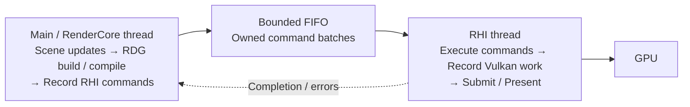

# RenderCore / RHI two-thread plan

Status: implemented as the initial two-thread rendering path. Threaded execution is now the
RenderDevice default, with an inline startup option. See
[implementation and verification](RenderCoreRHIThreadingVerification.md) for API semantics,
validation results, and the remaining performance limitations. The steps below preserve the
original design outline.

## Target design

Keep the current main thread as the **RenderCore thread** and add **one dedicated RHI thread**. This gives the rendering path two CPU threads while keeping window events, scene updates, and RenderCore together.

ZenEngine already has the starting point: deferred `RHICommandList` recording. Currently, `RenderDevice::SubmitCommandLists()` synchronously finalizes, submits, and flushes those commands. That is the main boundary to split.

| RenderCore thread owns | RHI thread owns |
| --- | --- |
| Scene, renderers, RDG compilation and pass callbacks | Vulkan command contexts and command pools |
| Recording backend-independent RHI commands | Executing commands and recording native command buffers |
| Logical resource state and render-frame preparation | Native resource operations, descriptors, submissions, presentation |
| Consuming completion results | Publishing submission results and GPU completion progress |

One RHI CPU thread can service the existing graphics, compute, and transfer GPU queues.

## Implementation steps

### 1. Introduce an executor, initially running inline

Add `RHICommandListExecutor` with operations such as `SubmitBatch()`, `FlushRHIThread()`, and `WaitGPUIdle()`. Route submission through it while preserving current behavior. Use the same executor for a startup option selecting inline or threaded execution.

### 2. Make recorded batches own their data

Introduce a move-only `RHICommandBatch` containing command storage, retained resources, and completion information. Separate recording storage from backend context ownership; return command lists to their pool only after consumption.

Two existing details need particular attention:

- `RHICommandBeginRendering` borrows a rendering-layout pointer. Copy its required data or retain the owner.
- `RHICommandWithBindlessEpoch` accesses the backend during recording and destruction. Give recording a safe lifetime-token mechanism.

Resource retention must cover both **queued CPU commands** and subsequent **GPU use**.

### 3. Start the dedicated RHI worker

Use a bounded FIFO with a mutex and condition variable initially. Add thread ownership assertions. Move command execution, backend frame operations, submission, and presentation onto this thread.

Route native resource creation/destruction and uploads through the same ordered executor. Synchronous requests are acceptable initially for initialization, pipeline cache misses, and readbacks. Copy upload data before handing it across threads.

At this stage, waiting for each batch result is useful to establish correctness.

### 4. Enable overlap between frames

Let RenderCore record frame **N+1** while RHI consumes frame **N**. Initially limit RenderCore to one frame ahead, independently of the GPU frames-in-flight setting.

Keep `GRenderFrameState` and `GRHIFrameState` owned by their respective threads. RenderCore associates each pending ticket with the frame selected by `GRenderFrameState`; RHI uses `GRHIFrameState` for its own lifecycle. Batches and results do not duplicate frame numbers or slots. A delayed result updates its associated RenderCore frame, even after the current RenderCore slot advances.

Distinguish three milestones:

1. Batch accepted by the CPU queue.
2. RHI execution/submission finished.
3. GPU work completed.

Command storage and GPU resources have different reuse conditions; an RHI-thread fence does not establish GPU completion.

### 5. Adapt RDG submission semantics and lifecycle operations

`RDGExecutor::ExecutePrepared()` currently commits resource state after a synchronous submission result. Simply replacing submission with enqueueing would break that contract.

Introduce submission tickets and separate scheduled resource state from confirmed submission state. Return completion/error messages to RenderCore. A failed submission must stop dependent queued batches; partial execution must retain the existing fatal-failure behavior.

Resize and shutdown should drain queued RHI work, wait for relevant GPU work, then recreate or release resources. Keep window-event handling on the main thread.

### 6. Validate correctness, then measure overlap

Extend the existing RHI/RenderCore tests for FIFO ordering, delayed consumption, resource retention, frame-slot reuse, and failure propagation.

Run `scene_renderer_demo` in both modes with Vulkan validation, exercising resize, minimize/restore, renderer switching, and shutdown. Measure RenderCore time, RHI time, queue depth, and wait time.

## Source references

ZenEngine:

- [RenderDevice.cpp](../ZenCore/Source/Graphics/RenderCore/V2/RenderDevice.cpp): `SubmitCommandLists()`, frame lifecycle, presentation, and resource retirement.
- [RHICommandList.h](../ZenCore/Include/Graphics/RHI/RHICommandList.h): command/context ownership, borrowed rendering layouts, and bindless epoch capture.
- [RHICommandList.cpp](../ZenCore/Source/Graphics/RHI/RHICommandList.cpp): recording, execution, and reset.
- [RenderGraph.cpp](../ZenCore/Source/Graphics/RenderCore/V2/RenderGraph.cpp): `RDGExecutor::ExecutePrepared()` and resource-state commit/rollback.
- [VulkanCommandList.cpp](../ZenCore/Source/Graphics/VulkanRHI/VulkanCommandList.cpp): native command finalization and submission.

UE5 reference checkout: `E:\Dev\UE5`.

- `Engine/Source/Runtime/RenderCore/Private/RHIThread.cpp`: dedicated RHI thread lifecycle (`FRHIThread`, `StartRHIThread()`, `StopRHIThread()`).
- `Engine/Source/Runtime/RHI/Public/RHICommandList.h`: command-list and executor interfaces.
- `Engine/Source/Runtime/RHI/Private/RHICommandList.cpp`: executor implementation, `ImmediateFlush()`, and RHI-thread fences; distinguish dispatching work from flushing the RHI thread.

Borrow this basic structure first. Parallel RDG recording and parallel command translation can come later.
