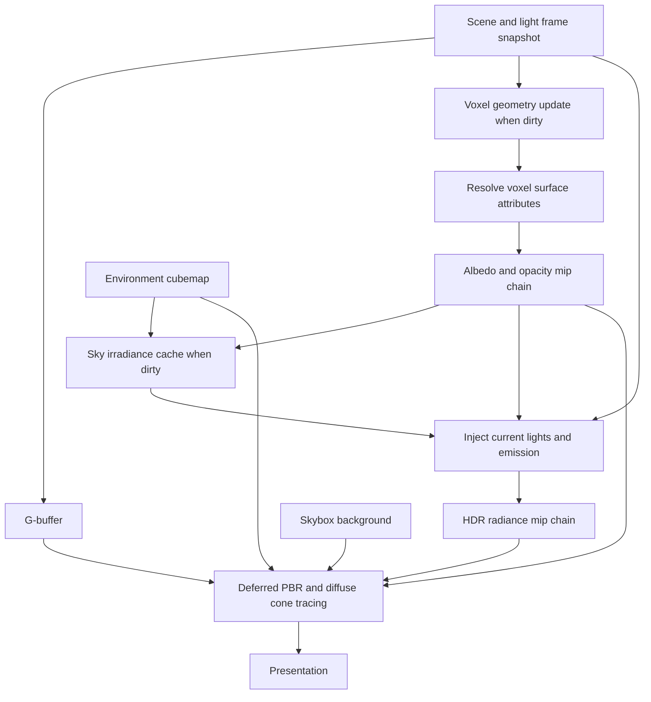

# Voxel GI implementation plan

Status: implemented step by step on 2026-09-21. The design below records the original plan; the execution notes and [verification report](VoxelGIVerification.md) describe the delivered implementation and actual test coverage.

Repository baseline: `99508992` (`Simplify RenderCore and RHI synchronization`).

## 1. Intended result

Add a third `scene_renderer_demo` mode that renders the scene with deferred PBR plus voxel cone traced diffuse global illumination. Reuse the existing scene voxelization and environment resources.

| Input | Result |
| --- | --- |
| `1` | Existing voxel visualization |
| `2` | Deferred PBR with environment IBL, retained as the comparison mode |
| `3` | Deferred PBR with voxel GI, including indirect color bleeding and occlusion |
| `R` in mode 1 or 3 | Rebuild the voxel scene and invalidate dependent lighting |

Support the number row and keypad equivalents for all three modes. Consume hotkeys before recording the frame. A mode change must not sample uninitialized voxel or radiance resources.

The first complete implementation includes configurable point, directional, and spot lights; runtime light updates; an optional animated point light in the demo; sky illumination; emissive surfaces; one diffuse indirect bounce; and both existing voxelizer backends. Static lights are initialized from configuration, while dynamic lights use the same runtime light model. A static scene must react to moving lights without repeated geometry voxelization.

UI editing is deferred, but configuration and animation must use APIs that a later UI can call. Additional indirect bounces, voxel specular reflections, moving/skinned geometry, sparse volumes, clipmaps, temporal accumulation, and full translucent transport are outside this initial implementation. Keep the existing environment specular IBL.

## 2. What the current code provides

Paths below are relative to the repository root. Findings are from the current source, not assumptions about the dormant GI code.

| Area | Existing behavior | Required work |
| --- | --- | --- |
| `ZenSamples/VulkanRHIDemo/SceneRenderer/SceneRendererDemo.cpp` | Binds `1` and `2`; creates four hardcoded point lights; has an animation timer and smoke runner | Mode 3, config-driven light creation, runtime animation, expanded smoke coverage |
| `ZenCore/Include/Graphics/RenderCore/V2/Renderer/RendererServer.h` and corresponding `.cpp` | Owns skybox, deferred renderer, and selected voxelizer; enum contains only `eVoxelize` and `ePBR` | Own GI renderer, explicitly dispatch three modes, handle failed GI updates |
| `VoxelizerBase`, `GeometryVoxelizer`, `ComputeVoxelizer` | Both active paths produce albedo only at a hardcoded resolution of 256; update and voxel drawing share `BuildRenderGraph()` | Separate production from visualization; expose common surface attributes and volume bounds |
| `VoxelGIRenderer.h/.cpp` and `Data/Shaders/VoxelGI/inject_radiance.comp` | Dormant injection stub; requires unused normal/emissive inputs and a shadow renderer; allocates one RGBA8 mip; uses a hardcoded directional light | Replace the stub with HDR injection, mip generation, and a real deferred consumer |
| `RenderScene.h/.cpp` | Copies four point lights at construction; `Update()` updates only the camera position | Typed runtime lights, stable IDs, revision tracking, immutable frame data |
| `DeferredLightingRenderer.cpp`, `Data/Shaders/SceneRenderer/deferred.frag` | G-buffer followed by direct PBR and diffuse/specular IBL | Reuse G-buffer and direct shading; add a GI composition variant |
| `SkyboxRenderer.cpp`, `RenderScene::GetEnvTexture()` | Existing skybox, irradiance, prefiltered environment, and BRDF LUT; default environment is `papermill.ktx` | Reuse for lighting and expose environment controls |
| `Data/engine.cfg`, `ZenCore/Include/Platform/ConfigLoader.h` | Flat `key=value` config with comments; voxelizer and async options already exist | Add validated lighting, environment, and GI configuration without another parser dependency |

Correctness prerequisites discovered during inspection:

- Compute voxelization uses a cube centered on the scene AABB; `VoxelizerBase::GetSceneMinPoint()` and geometry voxelization use the raw scene minimum. These differ for non-cubic scenes. All producers, visualizers, injection, and tracing must share one grid transform.
- The compute triangle map stores only base-color texture indices. Its dispatch also asserts that each node covers the whole scene index count. GI needs correct triangle, node, submesh, and material identity, including instanced meshes.
- Compute voxelization performs competing `imageStore` writes. Simply adding independent normal and emissive writes can combine attributes from different triangles. Geometry voxelization's packed alpha accumulation is also not a ready-to-filter opacity value.
- The current deferred emissive output is UNORM, and `offscreen.frag` uses `emissiveFactor.rbg`. HDR emission and channel agreement need correction along the shared material path.
- `sg::Material::SetData()` does not currently copy `baseColorFactor` into `MaterialData`; emissive strength is also separate. Verify and fix the material fields used by GI and the G-buffer together.
- `RenderScene` centers and normalizes the loaded scene. Configuration positions and ranges must explicitly use the resulting renderer world coordinates.
- Existing asynchronous RDG scheduling and persistent resource tracking should handle dependencies. Renderers must declare their resources and must not add private Vulkan submissions or barriers.

## 3. Architecture and ownership

Use the existing `VoxelGIRenderer` as the owner of lighting volumes and injection passes. Let the voxelizer own geometry-dependent attributes. Let `RenderScene` own current light/environment data, and let `DeferredLightingRenderer` retain G-buffer and final shading ownership.

Proposed interfaces, with exact names finalized during implementation:

- `VoxelizerBase::BuildVoxelizationGraph()` records updates only when geometry is dirty. `BuildVisualizationGraph()` records voxel drawing and any visualization preparation. A compatibility wrapper may preserve existing callers while migrating them.
- `VoxelizerBase::GetVoxelGrid()` returns the shared bounds, dimensions, voxel size, and transform. A geometry revision identifies successfully scheduled contents.
- `VoxelGIRenderer::BuildRenderGraph()` records necessary sky-cache, radiance, and mip updates. `GetLightingInputs()` exposes the radiance/opacity views, sampler, grid, and trace settings.
- Factor deferred graph construction into G-buffer and composition helpers. Mode 2 selects the ordinary IBL shader; mode 3 selects a GI shader sharing material, BRDF, direct-light, and tone-mapping helpers.
- `RenderScene` exposes add/update/remove/enable-light operations with stable `LightId` values and explicit status results. Environment and GI settings also have runtime setters. Configuration and demo animation call these operations.

Frame dependencies for mode 3:



This diagram expresses dependencies, not a mandatory serial command stream. Cached resources substitute for skipped producer nodes. Existing RDG scheduling may overlap independent G-buffer and compute work when supported.

## 4. Shared voxel data

### 4.1 One coordinate system

Define a cubic grid around the normalized scene AABB, with a small configurable or fixed voxel-sized border. Store its actual minimum and side length once. Use:

```text
voxelSize = gridSideLength / resolution
uvw = (worldPosition - gridMin) / gridSideLength
voxelCenter = gridMin + (integerCoordinate + 0.5) * voxelSize
```

Apply the same transform to compute/geometry voxelization, voxel drawing, shadow traversal, radiance injection, and deferred cone tracing. Handle empty/degenerate bounds explicitly. Check integer coordinates before image access and reject out-of-volume samples before filtering.

### 4.2 Coherent attributes under concurrent writes

Use a deterministic two-stage material path rather than extending the current competing multi-image writes:

1. Build a triangle-instance record table containing index offset, node transform index, and material index. Preserve draw ranges and instance identity. Both voxelizers use stable record IDs.
2. Retain each backend's coverage algorithm, but elect one triangle record per occupied voxel using `imageAtomicMin` on an `R32_UINT` owner volume. Clear it to `UINT_MAX` using a typed/compute clear, not a float color clear. Reject alpha-masked samples before election.
3. Resolve each occupied voxel once in compute. Evaluate a point on the elected triangle near the voxel center, derive valid barycentrics, and interpolate UVs, vertex color, and the world-space normal. Write albedo, normal/metallic, and HDR emission together.
4. Write zero occupancy and zero attributes for empty voxels. Normalize decoded normals and guard degenerate geometry. Use shared material sampling and explicit texture LOD in compute.

This keeps coverage generation and its output shared between visualization and GI. It changes mixed-surface voxels from averaged or racing colors to one reproducible representative surface; document this quality tradeoff. Alpha masking, UV selection, factors, and sRGB conversion must agree with the visible material path. Opaque and masked surfaces are supported; explicitly document the approximation for blended materials.

The compute large-triangle work list must have validated bounds. Track overflow and report/recover through a bounded resize/rebuild path; never accept corrupted or silently incomplete GI volumes. Verify geometry-shader primitive IDs map to the same triangle records as compute dispatches.

### 4.3 Resource layout

Proposed dense volume formats:

| Resource | Format | Mips | Lifetime/use |
| --- | --- | --- | --- |
| Triangle owner | `R32_UINT` | Base only | Geometry update scratch; retain/reuse allocation |
| Albedo and occupancy | `RGBA8_UNORM` | Full chain when GI enabled | Linear RGB; base alpha is 0 or 1; alpha mips supply filtered coverage |
| Normal and metallic | `RGBA8_UNORM` | Base only | Encoded world normal in RGB, metallic in A |
| Emission | `RGBA16_SFLOAT` | Base only | Linear HDR emission |
| Cached sky irradiance | `RGBA16_SFLOAT` | Base only | Geometry/environment-dependent incoming irradiance |
| Outgoing radiance and coverage | `RGBA16_SFLOAT` | Full chain | Premultiplied outgoing RGB and coverage alpha |

Allocate GI-specific volumes on first use of mode 3. If mode 1 previously produced albedo only, entering mode 3 requests a complete attribute rebuild. Returning to mode 1 must refresh any cached visualization instances when the geometry revision changes. Returning to mode 2 schedules no GI passes. Retain initialized GI resources for quick subsequent switches and release them through normal resource lifetime management.

Keep 256 as the existing voxel resolution default; add `voxel_resolution` with initial supported values 64, 128, and 256. Use 128 for early GI performance tuning and allow the user to choose quality. A shared resolution prevents mode 1 and mode 3 from representing different voxel scenes.

At 128 cubed, the six volumes above total approximately 75.4 MiB, including both complete mip chains. At 256 cubed they total approximately 603.4 MiB. These estimates exclude triangle records, voxel draw buffers, the G-buffer, allocation overhead, and existing environment textures. A single RGBA16F radiance chain is approximately 18.3/146.3 MiB at 128/256. Check format features and allocation results; report any explicit resolution fallback. Do not silently claim GI is active if required resources cannot be created.

## 5. Lights, configuration, and runtime updates

### 5.1 One runtime light representation

Replace the fixed four-light shader contract with a bounded light array and explicit count shared by PBR composition and voxel injection. Start with a maximum of 32 enabled lights; keep the limit documented and validate CPU/GPU layouts with size/offset checks and shader reflection.

Fields: stable ID, type, enabled flag, linear RGB color, nonnegative intensity, position, range, normalized direction, inner/outer spot cone angles, and shadow enable. Direction means the direction light travels; surface-to-light direction for a directional light is its negation. Point/spot attenuation uses inverse-square falloff with a finite smooth range cutoff and a guarded near distance. Intensity is in the renderer's documented relative HDR units for this version, rather than claiming calibrated photometric units.

Use a per-frame buffer or existing RDG value-upload allocation so queued GPU frames see immutable light data. Updates are applied before graph recording on the scene/render thread. Animation changes position, direction, color, intensity, or enabled state through the same setters intended for future UI controls. Removing a light invalidates its ID and removes its previous contribution on the next rendered frame.

Static means unchanged until edited; it does not imply baked lighting. Start with one combined light evaluation instead of separate static/dynamic radiance caches. Light-only edits rebuild radiance and radiance mips, never geometry or the sky cache.

### 5.2 Configuration proposal

Extend `Data/engine.cfg` using its current syntax. This example specifies one static directional light, one static point light, and one animated point light:

```ini
# Existing settings remain valid.
voxelizer=auto
async_compute=auto
voxel_resolution=256

environment_texture=papermill.ktx
environment_lighting=true
environment_intensity=1.0
environment_rotation_degrees=0.0
skybox_visible=true

voxel_gi_indirect_intensity=1.0
voxel_gi_cone_count=6
voxel_gi_cone_angle_degrees=60.0
voxel_gi_step_scale=1.0
voxel_gi_normal_bias_voxels=1.5
voxel_gi_max_distance_grid_lengths=1.7321
voxel_gi_max_steps=128
voxel_gi_shadow_enabled=true

light_count=3
light.0.type=directional
light.0.direction=-0.5,-1.0,-0.3
light.0.color=1.0,0.95,0.85
light.0.intensity=2.0
light.0.enabled=true
light.0.casts_shadows=true

light.1.type=point
light.1.position=-1.0,1.0,-1.0
light.1.color=1.0,0.3,0.1
light.1.intensity=5.0
light.1.range=6.0
light.1.enabled=true
light.1.casts_shadows=true

light.2.type=point
light.2.position=1.0,1.0,0.0
light.2.color=0.2,0.4,1.0
light.2.intensity=5.0
light.2.range=6.0
light.2.enabled=true
light.2.casts_shadows=true

# Demo-only animation references the config light index.
dynamic_light.enabled=true
dynamic_light.index=2
dynamic_light.orbit_center=0.0,1.0,0.0
dynamic_light.orbit_radius=1.0
dynamic_light.angular_speed_degrees=45.0
```

Spot lights additionally accept `inner_angle_degrees` and `outer_angle_degrees`. Orbit animation moves the referenced point/spot light around the Y axis using elapsed seconds; it is optional and is not embedded in the renderer. Runtime updates must work even when the demo animation is disabled.

The cone angle is the full cone aperture. Bound cone count to implemented presets, such as 4 and 6; validate angle, bias, distance, step scale, and iteration limits. Defaults are starting values to calibrate against the validation scenes, not a performance claim.

Parse typed values with non-throwing conversions and reject nonfinite values. Validate counts, nonnegative intensities/colors, positive ranges, nonzero directions, and `0 <= inner < outer < 90` spot half-angles. Log the exact invalid key. Invalid individual lights are skipped with diagnostics; invalid optional settings use documented defaults. An invalid runtime edit preserves the previous valid value and returns failure.

When `light_count` is absent, preserve the existing four-light scene defaults. Explicit `light_count=0` disables all analytic lights for sky/emission-only testing. Missing GI keys preserve ordinary mode 1/2 startup. Loading a generated default config must populate the in-memory settings in that same startup.

Keep parser data independent of renderer objects and GPU resources. Config loading produces settings; application code constructs lights through the runtime API. Live file watching and UI widgets are deferred.

## 6. Lighting and tracing

### 6.1 Direct-light injection and visibility

For each occupied voxel, evaluate enabled lights at the voxel center with its surface normal. Share light direction, attenuation, and spot falloff code with deferred direct lighting. Write approximately Lambertian outgoing radiance:

```text
Lvoxel = emission + diffuseReflectance / pi * (analyticIrradiance + skyIrradiance)
```

Diffuse reflectance includes the material base color and nonmetallic energy weighting. Injection evaluates the actual light count, supports zero lights, and writes the complete base radiance volume, including zero for empty voxels. This full overwrite removes obsolete illumination when lights move, switch off, or are removed. Keep the immutable normal/material volumes read-only during injection.

Use voxel occupancy traversal for initial analytic-light shadows, including the corresponding direct term in mode 3. Trace toward a point/spot light only as far as that light or the volume exit; trace directional light visibility to the volume exit. Use a grid-relative origin bias and bounded traversal. A conservative base-level grid traversal is the initial correctness path; filtered cone visibility is available where a soft approximation is intended. Avoid requiring the dormant `ShadowMapRenderer` or its unrelated EVSM matrix/exponent contract.

Mode 2 keeps its current unshadowed direct-light baseline while sharing the new light data and BRDF code. Mode 3 adds voxel visibility to direct lighting and injection. Document this difference when comparing images.

**Direct-shadow quality follow-up (2026-09-22):** the user requested removal of the box-shaped direct shadows produced by the initial occupancy baseline. Mode 3 now uses mesh depth maps for direct analytic lighting: six faces per point light and one projection per spot/directional light, with alpha-cutout coverage and filtered depth comparisons. `SceneShadowRenderer` owns this path separately from the dormant EVSM renderer. Its per-face resolution is independent of the voxel grid. Voxel occupancy traversal remains in radiance injection and environment visibility; cone tracing still consumes the voxelization results. `voxel_gi_shadow_enabled` and each light's `casts_shadows` gate both analytic visibility paths. See the corresponding verification follow-up for caching, resource cost, and regression results.

### 6.2 Skybox as a light source

Reuse `EnvTexture::pSkybox` as the directional HDR environment source. Compute a small, normalized hemisphere quadrature at each occupied voxel, tracing occupancy visibility toward the volume boundary before sampling the cubemap. Cache the resulting incoming sky irradiance. Invalidate this cache only for geometry/opacity changes or environment texture, rotation, enable, intensity, or integration-setting changes.

Apply the same environment orientation and intensity to sky lighting, deferred IBL, and displayed skybox. `skybox_visible` controls background drawing independently of whether the environment lights the scene. If the environment cannot load, log the error and bind a valid black fallback so analytic lights and emission can still render.

At a shaded G-buffer surface, GI cones accumulate reflected voxel radiance. Their remaining transmittance samples the environment after the cone exits the grid. This supplies direct diffuse sky illumination through openings; sky injected into voxels supplies the additional reflected contribution. Avoid adding the existing unoccluded diffuse IBL term on top of these contributions in mode 3.

Do not treat reaching a trace iteration/distance budget inside the grid as reaching the sky. Continue a bounded visibility-only query to the boundary or conservatively suppress that unresolved sky term. This prevents artificial light through thick walls. Keep environment specular IBL as the initial specular approximation, with separately bounded occlusion rather than applying diffuse occlusion indiscriminately.

### 6.3 Mip chains and cone integration

Generate mip levels with explicit compute passes, each reading the preceding level and writing its own 3D view. The full chain has `floor(log2(resolution)) + 1` levels. Start with isotropic 2x2x2 filtering of premultiplied radiance and coverage; generate the geometry-dependent coverage chain only when geometry changes. Keep coverage and radiance filtering definitions consistent.

Trace a fixed hemisphere cone set from the visible world-space point using an orthonormal basis around its normal. Select texture LOD from cone diameter relative to voxel size. Composite samples front to back using remaining transmittance, and advance by a positive distance tied to cone footprint. Normalize quadrature weights so constant incoming radiance produces the expected Lambertian response, with no extra or missing factor of pi.

The initial stepping and mip-opacity approximation must be fixed and tested together. If variable step length requires opacity correction, rescale premultiplied RGB consistently; adjusting alpha alone changes energy. Clamp LOD to available levels, terminate at low transmittance, and bound loop iterations. Use a linear clamp sampler with explicit volume bounds checks so out-of-grid samples do not repeat edge voxels.

Compose direct PBR, diffuse GI, retained environment specular, and visible-surface emission in linear HDR. Apply material diffuse weighting once at the receiver. Keep the existing tone-mapping stage at final output and correct the G-buffer emission format/swizzle. Share shader helpers rather than copying the full deferred shader.

Isotropic mips and one representative surface per voxel can leak across thin walls and lose directional detail. Validate these limits explicitly. Directional/anisotropic radiance and additional propagation bounces are follow-up quality improvements, not prerequisites for claiming one-bounce diffuse GI.

## 7. Dirty state, scheduling, and failure handling

| Change | Geometry/attributes | Coverage mips | Sky cache | Radiance/mips | Screen shading |
| --- | --- | --- | --- | --- | --- |
| First GI frame or new scene | Rebuild | Rebuild | Rebuild | Rebuild | Run |
| Camera motion | Reuse | Reuse | Reuse | Reuse | Run |
| Light position/direction/color/intensity/enabled change | Reuse | Reuse | Reuse | Rebuild | Run |
| Environment change | Reuse | Reuse | Rebuild | Rebuild | Run |
| Trace display settings/indirect intensity | Reuse | Reuse | Reuse unless sky integration changed | Reuse | Run |
| `R`, geometry/opacity/material edit, or resolution change | Rebuild | Rebuild | Rebuild | Rebuild | Run |
| Viewport resize | Reuse | Reuse | Reuse | Reuse | Recreate affected screen resources |
| Return to GI after another mode | Rebuild only stale/uninitialized products | As needed | As needed | As needed | Run |

Track geometry, lighting, environment, and settings revisions separately. Snapshot values before recording commands. Commit recorded revisions only after successful graph handoff; immediate graph failure keeps or restores dirty state, following the existing skybox retry pattern. A deferred device failure follows the existing blocked-device recovery policy.

Declare all storage reads/writes, sampled mip ranges, light buffers, and indirect work-list dependencies to RDG. Read source mip and write destination mip through distinct, precise views. The Vulkan requirements for storage versus sampled images must be satisfied by the RHI's transitions and format checks. See [Khronos resource descriptors](https://docs.vulkan.org/spec/latest/chapters/descriptors.html).

A single shared radiance volume is sufficient initially, provided persistent RDG tracking orders a new write after all earlier frame readers, including readers on another queue. Validate this explicitly with multiple frames in flight. Add no per-frame device-idle waits. Double buffering is a later optimization if measured stalls justify its memory cost.

Use the current `ePreferAsyncCompute` policy for eligible update passes after same-queue correctness works. Support async disabled and shared-queue fallback. Lazy creation, resolution changes, scene replacement, and destruction must retain resources until in-flight work retires. Failure to initialize GI logs a specific reason and leaves the demo in a working PBR mode.

## 8. Implementation sequence

Each step should build and leave the existing modes usable. Completion checks describe future implementation work; none are marked complete by this planning document.

| Step | Deliverable and primary files | Completion check |
| --- | --- | --- |
| 1. Data/config contract | `ConfigLoader.h`, `Data/engine.cfg`, shared light/settings definitions, `RenderScene.h/.cpp`, demo setup | Configurable analytic lights render in mode 2; add/update/remove and invalid config behavior are verified |
| 2. Voxel producer separation | `VoxelizerBase`, `ComputeVoxelizer`, `GeometryVoxelizer`, renderer dispatch | One shared grid; production can run without voxel drawing; mode 1 and cached updates still work |
| 3. Surface attributes | Triangle-instance records, owner election and resolve shaders, material upload, both voxelizer shaders | Coherent albedo/normal/metallic/emission, correct multi-node meshes, repeated voxelization stability, no overflow |
| 4. Radiance and visibility | Replace `VoxelGIRenderer` stub and injection shader; add coverage/radiance mip shaders and views | Analytic and emissive injection works, shadows are bounded, HDR survives, empty voxels remain empty |
| 5. Mode 3 composition | `RendererServer`, deferred renderer helpers, shared lighting GLSL, new GI fragment shader, demo hotkeys | Visible one-bounce color bleeding through mode 3; modes 1/2 remain selectable; GI is a live RDG consumer |
| 6. Environment lighting | Sky-cache pass, environment settings, cone escape contribution, skybox/IBL alignment | Sky-only illumination works through openings; closed regions stay occluded; no duplicated diffuse IBL |
| 7. Dynamic updates | Runtime light revisions, demo orbit controller, frame snapshots, smoke mode | Moving and disabled lights update direct and indirect output without geometry updates or residual radiance |
| 8. Integration and tuning | Shader registration, CMake inputs, targeted tests, validation scenes, evidence report | Thread/queue/backend matrix passes; measured performance and known visual limits are documented |

Register new programs in `ShaderProgram.h/.cpp` and add any new C++ files to `ZenCore/CMakeLists.txt` and relevant test targets. CMake discovers shader sources during configuration, so reconfigure after adding files. Its existing shader depfiles should track shared GLSL includes. Remove obsolete GI-only structs/bindings after migrating their consumers; preserve unrelated shadow-map users.

## 9. Verification and acceptance

### 9.1 Targeted automated checks

- Extend `ConfigLoaderTest`: missing/default/zero light count, malformed vectors and enums, nonfinite numbers, invalid ranges and spot angles, excessive counts, absent GI settings, and default-file startup.
- Extend light/scene tests: stable IDs, removal, failed edits preserving values, dirty revision changes, frame snapshots, and animation independent of frame rate.
- Extend `InputControllerTest` or a factored mode-selection test: `3` and keypad 3, single-press behavior, and `R` handling in all modes.
- Extend `CommonTest` shader reflection coverage: changed light/material layouts, readonly attributes, writeonly outputs, new sampler bindings, and push-constant ranges.
- Extend `RenderCoreTest`: per-mip producer/consumer edges, first-use initialization, light-only invalidation, failed-frame retry, mode switches, and overwrite ordering with previous frame readers on graphics/compute queues.
- Add focused native readback checks for owner election and attribute coherence, empty/full coverage mip values, HDR radiance above 1, and extinguishing a light clearing its old radiance. Test both compute and geometry production where supported. Synthetic unit tests alone do not establish full-scene visual correctness.

Example build/check commands, from an appropriately initialized MSVC/Vulkan environment:

```powershell
cmake --preset x64-windows-msvc-debug
cmake --build build/x64-windows-msvc-debug --target SpvShaders scene_renderer_demo ConfigLoaderTest InputControllerTest CommonTest RenderCoreTest VulkanRHIIntegrationTest
ctest --test-dir build/x64-windows-msvc-debug --output-on-failure -R 'ConfigLoaderTest|InputControllerTest|CommonTest|RenderCoreTest|VulkanRHIIntegrationTest'
```

### 9.2 GPU and visual checks

Extend the existing demo smoke steps to visit all three modes, force consecutive geometry updates, animate a light, disable it, resize, minimize/restore, and return to GI after lights changed in mode 2. Run with compute and geometry voxelizers, inline and threaded RHI, async off and on. Verify unsupported geometry/async hardware takes the existing fallback paths. Require zero application validation errors and synchronization hazards in standalone runs.

Use a small reproducible test scene as well as Sponza:

| Scenario | Expected evidence |
| --- | --- |
| Colored wall beside a white receiver | Visible indirect color transfer in mode 3; disappears when indirect intensity is zero |
| All lights, sky lighting, and emission disabled | No residual radiance in any mip; surfaces are dark |
| Emissive panel with analytic lights and sky disabled | Visible emission and illumination on nearby diffuse geometry; correct RGB channels and HDR range |
| Sky-only room with an opening | Light enters through the opening and bounces; closed-wall leakage is measured |
| Rotated environment | Sky background, diffuse light direction, and specular IBL agree |
| Moving point light | Direct light, voxel shadows, and indirect illumination move together; voxel geometry pass count stays unchanged |
| Light disabled/removed | Its contribution disappears by the next rendered update without a voxel rebuild |
| Non-cubic bounds, multiple nodes, shared mesh instances | Both voxelizers align with visible geometry and materials |
| Repeated mode switches and resize | No stale textures, changed grid origin, flashes, missing skybox, or resource lifetime errors |

Save captures and timing logs under `build/voxel-gi-*`, and summarize actual results in a later `Doc/VoxelGIVerification.md`. Record GPU, resolution, light count, cone settings, queue mode, and median/high-percentile GPU frame and pass times after warmup. Separate first-use voxelization, cached static GI, and dynamic-light updates. Use RDG metrics or available GPU capture tooling; make no async speedup claim without measurements.

The feature is complete when mode 3 visibly demonstrates indirect diffuse transport, sky and configurable lights contribute correctly, runtime light changes update GI without rebuilding static geometry, both supported voxelizers work, and the validation matrix is clean. Performance tuning must report the selected settings and limits rather than silently dropping required lighting behavior.

## 10. Implementation constraints and references

Apply the supplied C++ preferences to every changed function: one final return, explicit types except iterators, short necessary lambdas, engine containers such as `HeapVector`, no exception-based error handling, shared logic instead of duplicated implementations, and formatting with the repository `.clang-format`.

The technique is based on the established idea of filtering voxelized scene information to estimate visibility and indirect illumination. This plan chooses dense textures and one diffuse bounce to fit the current engine; it does not adopt the paper's full sparse-octree implementation. See [Crassin et al., Interactive Indirect Illumination Using Voxel Cone Tracing](https://research.nvidia.com/labs/rtr/publication/crassin2011givoxels/).

Storage/sampling feature checks and precise mip views should follow the existing RHI abstraction and the [Khronos image resource rules](https://docs.vulkan.org/spec/latest/chapters/resources.html). Preserve the queue and synchronization boundaries documented in [SynchronizationSimplificationPlan.md](SynchronizationSimplificationPlan.md) and the measured async limitations recorded in [AsyncComputeStep9Verification.md](AsyncComputeStep9Verification.md).


## 11. Execution record (2026-09-21)

Steps 1¨C7 are implemented, and step 8 includes regression tests, a repeatable GPU validation script, image comparisons, and the verification report.

- **1:** Validated point/directional/spot configuration, stable light IDs, runtime updates/removal, and immutable uniform snapshots. The ignored local `Data/engine.cfg` is configured; tracked `Data/engine.example.cfg` supplies the portable example.
- **2:** Both backends share a padded cubic grid and separate geometry production from visualization. Mode 3 records no voxel visualization draw.
- **3:** Deterministic triangle-instance ownership resolves matching albedo, normal/metallic, and HDR emission. Both backends use the same material/UV/alpha contract. The geometry shader preserves the full reflected vertex stride and disables face culling.
- **4:** Full replacement HDR injection, exact base-voxel visibility traversal, and explicit per-mip filtering are live RDG passes. Writes declare complete initialization.
- **5:** Number-row/keypad 3 selects deferred PBR plus one diffuse voxel bounce. Modes 1/2 and R remain available. Shared PBR shading retains specular IBL.
- **6:** Environment intensity, rotation, lighting/visibility toggles, a geometry/environment-dependent sky cache, and black fallback for missing/unsupported cubemaps are implemented.
- **7:** Demo point-light animation calls the runtime light API. Light revisions rebuild radiance and its mips without rebuilding geometry. Removal clears the contribution on the next update.
- **8:** C++ and shader builds, unit regressions, backend/thread/queue smoke coverage, colored-room image assertions, and a diagnostic framebuffer readback are implemented. See the verification report for results and remaining measurement gaps.

Implementation refinements relative to the proposal:

1. Compute voxelization uses bounded batches of one workgroup per triangle with direct triangle/voxel overlap tests. This removes the active producer's large-triangle append buffer and its overflow path.
2. Mip filtering reads and writes separate storage-image mip views in GENERAL layout. A sampled source initially caused the RDG's whole-image layout tracker to reject different layouts for one image; storage views keep the existing tracker valid without RHI changes.
3. Desktop capture was unavailable. The demo's explicit `--capture=path.ppm` diagnostic copies the framebuffer through the RDG and waits only when requested. `tools/validate_voxel_gi.py` produces fixtures and PNGs using Python's standard library.
4. Material prerequisites also included neutral fallback textures and enabling `KHR_materials_emissive_strength`; otherwise textureless factors and constant HDR emission were suppressed.
5. Native image comparisons verify transport and light removal. Dedicated raw-volume analytical mip/owner readback oracles and GPU pass timing measurements were not completed; the verification report does not claim these checks passed.
