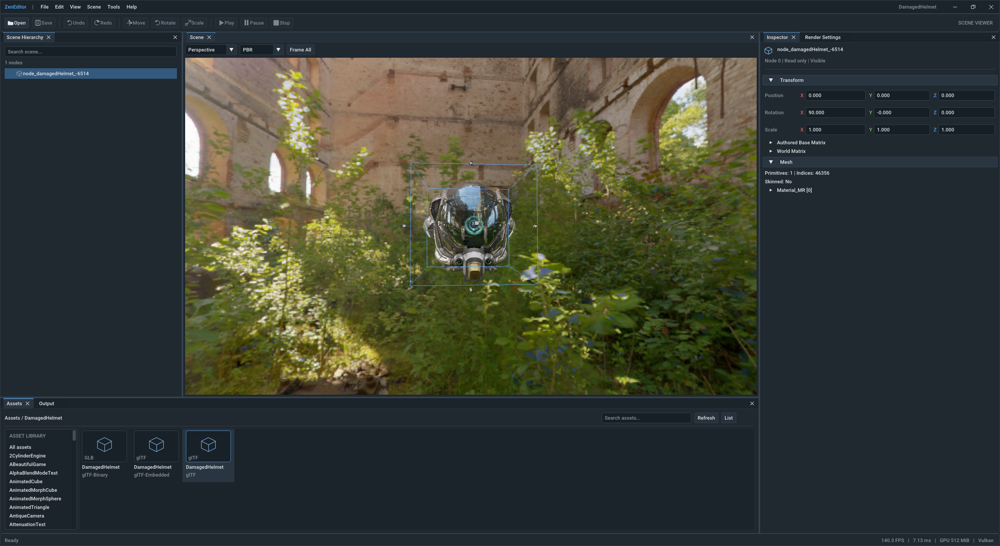
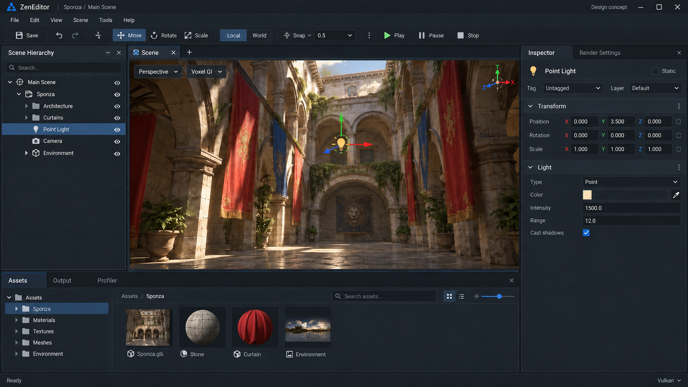

# ZenEditor implementation plan

**Roadmap update, 4 October 2026:** follow the
[ZenEditor rendering plan](ZenEditorRenderingPlan.md) for all new work. It makes
rendering, lighting, GI, debug outputs and a separate Run window the next priority.
Steps 5 onward below are deferred historical proposals, not the active delivery
sequence. The implemented viewer and architectural boundaries remain the baseline.

Architecture revised and adopted, 3 October 2026. Based on the current checkout.

Create a top-level **`ZenEditor/`** beside `ZenCore/`, `ZenUI/`, and `ZenSamples/`.
Build it as a separate application that reuses the engine and shared UI backend.
Deliver the docked workspace and a useful scene viewer first, then add document
persistence, undoable editing, asset composition, and runtime preview.

The first goal is a **3D scene and rendering editor for ZenEngine**. Godot and UE
are workflow references; a general game editor with scripting, physics, visual
graphs, and packaging is a later product expansion. This document proposes the
work; steps 1–4 have now been implemented as the first read-only viewer.

The adopted design keeps editor behavior independent of the UI toolkit and
separates the ImGui adapter from shared GPU rendering. Steps 1–4 were executed on
3 October 2026. Steps 5 onward are deferred and are not enabled.

## Required platforms and window migration

Windows and macOS are required platforms for ZenEditor and the SDL3
window/input migration. Linux support is deferred and does not block completing
the migration or removing GLFW after parity on the two required platforms.

Both platforms must provide the same combined title/menu layout through shared
editor UI, with window behavior behind an engine-owned API. Keep SDL and ImGui
types out of the public window/input contract. Retain the engine's RDG/RHI
rendering path and one shared ImGui dependency for runtime and editor.

The production SDL3 backend is implemented behind `platform::NativeWindow` and
is the default for new builds. `ZEN_WINDOW_BACKEND=GLFW` remains available until
macOS acceptance is complete. See [migration status](SDL3Migration.md) and the
[SDL3 evaluation](SDL3WindowBackendEvaluation.md). macOS requires native validation of borderless
resize/drag behavior, window controls, Retina sizing, input, and Vulkan/MoltenVK
presentation before the migration is complete. Linux and Wayland findings in
that evaluation are future work.

## Implementation checkpoint — steps 1–4

The new `ZenEditor/` application provides the docked workspace, live offscreen
viewport, navigation, read-only inspection, assets/logs, and asynchronous surface
picking. Shared rendering is split into neutral `ZenUI` and the `ZenImGui` adapter.
The model and rendering services build and run tests without ImGui.

See [build instructions, controls, contracts and validation](../ZenEditor/README.md).
All four build-option combinations and Debug/Release editor builds pass on Windows.
Native validation covers both RHI modes, UI-only startup, scene rendering, resizing,
minimize/restore and selection. Per-monitor desktop DPI changes and hands-on
interaction review remain acceptance checks; UI scale overrides are not a substitute.



The implemented frontend now follows the proposed charcoal-blue theme, proportional
font, structured Inspector fields and full-height Inspector dock. ZenEditor starts
maximized and renders at the actual framebuffer resolution.

Since that screenshot, the bottom Assets panel lists the open scene's meshes,
materials, textures and animations, with texture previews, instead of every model
under a folder. Scenes open through File → Open with the platform file picker and
File → Open Recent. A project file browser is deferred until projects exist.

This screenshot is the running application. The original concept below represents
later authoring features as well; Save, gizmos, undo/redo and Play stay disabled.
Selection lives in `EditorSelection`, owned by the toolkit-independent
`EditorController`. The UI renderer draws up to 16 distinct images per RDG pass
through a texture array, so ordinary frames need one UI pass.
Static fonts, Latin coverage, one native window and SDR output remain deliberate limits.

## Proposed appearance



This is a generated design concept, not a screenshot of working code. It shows
the intended mature workspace, including features that arrive in later steps.
The phase definitions below are the implementation contract; small generated
icons, values, and labels are illustrative.

| Area | Proposed behavior | Delivery |
| --- | --- | --- |
| Top menu and toolbar | File, Edit, View, Scene, Tools, Help; save/history; transform tools; preview controls | Shell in step 2; actions enabled as implemented |
| Left Scene Hierarchy | Search, tree selection, visibility; later create, rename, duplicate, delete, reparent | Read-only in step 4; mutation in steps 6–7 |
| Center Scene viewport | Largest area; perspective/orthographic camera, PBR/Voxel GI/voxel display, selection feedback | Live view in step 3; picking in step 4; gizmos in step 6 |
| Right Inspector | Selected node properties with collapsible Transform, Mesh, Material, Light, Camera sections | Read-only in step 4; editing in step 6 |
| Right Render Settings tab | GI, environment, shadows and render diagnostics | Read-only in step 4; validated edits in step 6 |
| Bottom Assets, Output, Profiler | Open scene's meshes, materials, textures and animations; searchable logs; existing engine timing data | Scene assets with previews and logs in step 4; separate project browser and import in step 7; profiler in step 8 |
| Bottom status bar | Operation status, render backend, unsaved state and live statistics when available | Starts in step 2 |

Start with one native window. Use approximately 18% width for hierarchy, 60% for
the viewport, and 22% for Inspector; let the bottom dock occupy roughly 23% of the
workspace height. Treat these as adjustable proportions, with minimum sizes and
collapsible docks for smaller displays. Use compact dark surfaces, restrained
blue selection, readable text, and consistent spacing.

The hierarchy/selection/Inspector relationship follows a familiar editor
workflow documented by [Godot](https://docs.godotengine.org/en/stable/getting_started/introduction/first_look_at_the_editor.html).
The precise arrangement above is a proposal for ZenEditor.

## What the engine already provides

| Existing code | Reuse | Missing editor work |
| --- | --- | --- |
| [ZenUI](../ZenUI/README.md), `UIContext`, `UIRenderer`, `UIDrawPacket` | Platform input bridge, ImGui lifecycle, RDG rendering and copied draw packets | Separate ImGui adapter from toolkit-independent rendering; editor context options, docking/layout storage, arbitrary image textures |
| [ZenUI CMake](../ZenUI/CMakeLists.txt) and [External CMake](../External/CMakeLists.txt) | Shared `ZenUI` and separate `ZenRuntimeUI`; pinned `v1.92.9b-docking` | Shared dependency currently gated only by `ZEN_BUILD_RUNTIME_UI` |
| [RendererServer](../ZenCore/Source/Graphics/RenderCore/V2/RendererServer.cpp) and [RenderOverlay](../ZenCore/Include/Graphics/RenderCore/V2/Renderer/RenderOverlay.h) | One engine-owned graph/submission path with application-owned final composition | Scene output and extent independent of the native viewport; UI-only frame path |
| [Scene](../ZenCore/Include/SceneGraph/Scene.h), [Node](../ZenCore/Include/SceneGraph/Node.h), [Transform](../ZenCore/Include/SceneGraph/Transform.h) | Scene ownership, parent links, component data and transforms | Stable authoring identity, controlled hierarchy mutation and document serialization |
| [RenderScene](../ZenCore/Include/Graphics/RenderCore/V2/RenderScene.h) | Staged transform, visibility, material and geometry updates before frame recording | Document-to-runtime adapter, authoring transactions and structural rebuild handling |
| [SceneRendererDemo](../ZenSamples/VulkanRHIDemo/SceneRenderer/SceneRendererDemo.cpp) and [model switching](../ZenSamples/VulkanRHIDemo/SceneRenderer/SceneRendererDemoModels.cpp) | Proven loading, camera setup and transactional scene replacement patterns | Editor-owned application loop and document lifecycle |
| [Existing UI review](UIIntegrationReview.md) | Agreed separation of runtime UI, shared renderer and future editor | Concrete shell, viewport, persistence and editing milestones below |

`ZenCore/Systems/SceneEditor` is currently a scene normalization utility. Its name
does not imply an existing editor application or authoring model. Leave it in
place initially; an eventual rename can be a separate cleanup.

Two constraints determine the implementation order. The current UI backend
rejects textures other than its static font atlas, so an `ImGui::Image` viewport
needs backend work. Also, `RendererServer::DispatchRenderWorkloads` currently
updates an attached scene unconditionally, so an empty editor must have an
explicit UI-only rendering path.

The current `ZenUI` is an ImGui integration, not yet a toolkit-independent
renderer: `UIContext` exposes `ImDrawData` and `ImFontAtlas`, `UIRenderer` consumes
them, and draw-packet construction uses ImGui vertex/index formats. Step 1 makes
this boundary explicit before editor panels start depending on it.

## UI replacement contract

Replacing ImGui should preserve scene loading, selection, hierarchy queries,
inspection data, camera navigation, picking, documents and commands. Widgets,
panel drawing, docking and toolkit input integration are replaceable presentation
code. Preserving panel implementations unchanged is not a requirement.

Do not wrap every ImGui function in a universal widget interface or build a
second UI framework in this phase. A future retained-mode UI can consume editor
state and invoke the same actions through its own event and layout model.

| Boundary | Contract |
| --- | --- |
| Editor state and behavior | Engine-owned IDs, values, query results and actions; no ImGui types, widget calls, GLFW handles or native-window requirement |
| Editor views | Read state and invoke actions such as `SelectNode`; own widgets, docking and presentation-local state |
| Viewport presentation | Supply content extent and accepted input actions; receive a scene image and viewport state; no ImGui widget in scene rendering or camera/picking behavior |
| ImGui adapter | Own ImGui context, platform input bridge, font preparation, texture-ID mapping and conversion to engine draw packets |
| Shared UI renderer | Consume engine-owned geometry, texture bindings, clipping and target descriptions; record through RDG/RHI without ImGui headers |

UI draw packets specify an engine vertex layout, index format, coordinate and
clip conventions, color/blend policy and texture handles. Raw byte arrays with an
implicit `ImDrawVert`/`ImDrawIdx` layout do not satisfy this contract. The adapter
converts or validates layout compatibility explicitly and copies transient data.
Fonts reach GPU rendering as ordinary image resources, not `ImFontAtlas` objects.
The initial renderer supports textured triangles with rectangular clipping;
advanced clipping, custom materials or other future UI requirements may extend
this contract or use another RDG renderer without changing editor behavior.

Docking IDs, ImGui capture flags and ini layout files stay inside the ImGui
presentation/adapter layers. Persist toolkit layout in its own versioned file;
keep engine-owned preferences separately. Changing toolkits may reset docking
layout while preserving preferences and scene data.

## Folder and dependency design

Each library has its own folder with `Include` and `Source`, and exposes only its
own include root, so a layer cannot include headers of a layer it does not link.
Include paths keep the `Editor/<Layer>/...` form. Add files as their step lands.

```text
ZenEditor/
  CMakeLists.txt
  README.md
  Model/       Include/Editor/Model, Source   EditorScene, SceneAssetIndex, EditorSelection,
                                              EditorCamera, EditorActions, EditorPreferences
                                              Documents and commands join here (steps 5-6)
  Rendering/   Include/Editor/Rendering, Source   EditorViewport
  Services/    Include/Editor/Services, Source    EditorController
  Platform/    Include/Editor/Platform, Source    EditorWindowChrome
  ImGui/       Include/Editor/ImGui, Source, Source/Panels   workspace, panels, theme
  App/         Main.cpp, EditorApplication          lifecycle, file picker, preferences I/O
  Tests/       model, rendering/service and native window tests; fixtures
```

Targets are split by responsibility. Dependencies point downward:

```text
zen_editor          -> ZenEditorUI
ZenEditorUI         -> ZenEditorServices + ZenEditorPlatform + ZenImGui
ZenEditorServices   -> ZenEditorRender
ZenEditorRender     -> ZenEditorModel
ZenEditorModel      -> ZenCore
ZenEditorPlatform   -> ZenCore
ZenImGui            -> ZenUI + zen_imgui (+ ZenWindowBackendInternal, privately)
ZenUI               -> ZenCore
ZenRuntimeUI        -> ZenImGui
scene_renderer_demo -> ZenRuntimeUI (linked from ZenSamples)
```

`zen_editor` owns startup, the window, the frame loop, the platform file picker and
preference loading/saving. `ZenEditorUI` is the initial ImGui frontend: panels,
docking, widget interaction, shortcut translation and viewport presentation. Panels
are declared by descriptors (stable ID, title, default dock area); the default
layout, View menu and saved visibility follow from them. The `EditorPanel` interface
is a frontend implementation detail, not an interface future toolkits must implement.

`ZenEditorModel` holds editor state and behavior that needs no window, GPU device or
UI toolkit: the read-only `EditorScene` and its cached queries, scene assets,
selection and pick stamps, the editor camera, the `EditorActions` registry and
neutral preferences. CPU asset parsing belongs here or in reusable engine loaders.

`ZenEditorRender` owns offscreen viewport resources, GPU scene publication as a
prepare/commit/discard transaction, selection visualization, asset previews and
asynchronous GPU picking. It reads the model and never changes it; pick results
carry the caller's stamp. It has no dependency on `ZenUI`, `ZenImGui`, widgets or a
native window; the frontend registers its images with the UI renderer. RDG
submission remains application/engine-owned.

`ZenEditorServices` holds `EditorController`, the toolkit-independent coordinator.
It owns the model state, runs transactions that span model and GPU (scene
replacement, applying picks, framing) and registers core actions. Menus, toolbars
and shortcuts dispatch through the action registry, which gives step 6 its single
command path. A replacement frontend reuses the controller unchanged.

`ZenUI/` is split the same way: `Renderer/` (`ZenUI`) owns rendering contracts, GPU
resources and RDG recording; `ImGui/` (`ZenImGui`) owns the context, font/platform
integration and draw conversion; `Runtime/` (`ZenRuntimeUI`) holds the runtime
panels. The ImGui adapter reaches the native window only through ZenCore's
`ZenWindowBackendInternal` interface target.

`ZenCore`, `ZenEditorModel`, `ZenEditorRender` and `ZenUI` must not include ImGui
or link `zen_imgui` directly or transitively. Their public headers must compile
without ImGui include paths. `ZenUI` must not know about documents, selection or
specific editor panels. The adapter and both ImGui frontends may use ImGui types;
do not leak them into model actions, viewport APIs or shared render packets.
Share small frontend widgets only when two consumers need them; do not make
ZenEditor inherit `RuntimeDebugUI` or link the demo application.

Add `ZEN_BUILD_EDITOR` with default `OFF`. Build/fetch shared UI when
`ZEN_BUILD_RUNTIME_UI OR ZEN_BUILD_EDITOR`; include `ZenUI` and `ZenImGui` for
either consumer, and build runtime panels only for the runtime option. Define
both options before `add_subdirectory(External)`. `ZenUI` is configured before
`ZenSamples`, and the demo links `ZenRuntimeUI` from its own CMake file, so
editor-only configurations are valid and libraries never modify sample targets.

Keep one pinned `zen_imgui` dependency (`v1.92.9b-docking`) shared by both
frontends. Runtime docking remains disabled; editor docking is enabled through
adapter options. A future custom frontend can link `ZenUI` without linking
`ZenImGui`; only active ImGui consumers should require fetching/building ImGui.

| Runtime UI | Editor | Required result |
| --- | --- | --- |
| OFF | OFF | Core and samples without ImGui |
| ON | OFF | Current runtime overlay |
| OFF | ON | Editor plus shared UI; demo remains UI-free |
| ON | ON | Both consumers using one shared ImGui dependency |

## Step 1 — Application foundation

**Result:** `zen_editor` launches, presents a blank workspace and shuts down cleanly;
editor behavior and shared rendering already have toolkit-independent boundaries.

1. Add the build option, targets, entry point and minimal `EditorApplication`.
   Reuse window, device, shader and frame infrastructure from the engine; consult
   the demo for lifecycle order without copying its profiling/capture machinery.
   Create `ZenEditorModel` with minimal session state and `ZenEditorUI` as the
   ImGui frontend now; add individual services only when a step needs them.
2. Split `ZenUI` rendering from `ZenImGui` integration. Introduce engine-owned
   draw geometry, explicit index format, clip/target descriptions and image
   bindings. Move ImGui draw conversion, context and atlas preparation into the
   adapter. Initially exercise the font image; step 3 adds viewport images and
   replacement scenarios. Move runtime consumers to the adapter with the same
   behavior and preserve the existing copied-data/resource-lifetime guarantees.
3. Add a UI-only frame path: clear the presentation target, append UI through RDG,
   submit through the existing device, and present with no scene attached. Keep
   graph begin/end/submission ownership in one place.
4. Give the ImGui adapter context explicit initialization options for editor
   configuration while preserving runtime defaults. Keep native input and ImGui
   lifecycle there. Establish resource and shader paths independent of the
   process working directory.
5. Support startup with no project, window resize, minimize/restore and focus
   loss. Keep destruction ordered so UI and scene resources retire while the
   device is alive, followed by device and window teardown.

**Exit check:** native launch/resize/restore/close in inline and threaded RHI;
no new validation errors; all four build-option combinations configure and build.
Compile a small model consumer and a synthetic draw-packet consumer without
ImGui include paths or linkage. The renderer consumer must be able to describe a
textured triangle without constructing an ImGui context. Keep runtime packet and
native UI regression checks passing after the split.

## Step 2 — Docked layout and base panels

**Result:** the editor has its recognizable layout even before a scene is loaded.

1. Add a small `EditorPanel` interface inside the ImGui frontend with stable ID,
   title, visibility and draw entry point. `EditorWorkspace` owns and draws
   panels. `EditorContext` supplies explicit model/render services; avoid global
   mutable editor state. Panels query state and invoke semantic actions. Loading,
   selection, filtering and camera behavior must not be implemented inside widget
   callbacks; only presentation-local state belongs to a panel.
2. Implement menu bar, toolbar, status bar, dockspace and empty Scene Hierarchy,
   Scene, Inspector, Assets and Output panels. Empty states explain what to open
   or select. Unimplemented editing/preview actions stay disabled with a reason.
3. Enable docking only for the editor context. Seed the default layout once and
   support View > Panels and View > Reset Layout. Keep stable ImGui IDs separate
   from visible titles and scene filenames.
4. Store versioned layout and preferences per user, outside scene files and the
   source tree. Keep ImGui docking/ini data in a toolkit-specific file and neutral
   preferences in a separate engine-owned format. Recover from missing/corrupt
   settings; do not reseed every frame. A toolkit replacement may reset layout.
5. Centralize theme, spacing and DPI behavior in presentation/adapter code. Start
   with the current static atlas; prepare needed glyph ranges in the adapter at
   initialization and upload through neutral image APIs. Treat CJK/IME and
   DPI-triggered atlas replacement as explicit follow-up acceptance work.

Use the public dockspace API; isolate default-layout construction in one file
because DockBuilder remains internal. An alternative is loading a versioned
default ini layout. See [Dear ImGui docking guidance](https://github.com/ocornut/imgui/wiki/Docking).
Keep multiple OS windows disabled: they require additional platform/render backend
work, as described in [Dear ImGui multi-viewports](https://github.com/ocornut/imgui/wiki/Multi-Viewports).

**Exit check:** review the actual shell against the concept; dock, hide, reopen and
reset panels; restart restores layout; verify 100%, 150% and 200% desktop scaling.
Verify that toolkit layout reset leaves neutral preferences intact and that no
panel/widget or docking types enter the model's public headers.
This is the first visual review checkpoint.

## Step 3 — Live embedded scene viewport

**Result:** load a glTF/GLB and navigate it inside the center panel.

1. Extend the neutral draw/image path from step 1 for multiple registered
   image/sampler bindings. Use engine-owned generation-checked UI texture handles,
   map `ImTextureID` to those handles only inside `ZenImGui`, resolve them into
   retained resources in draw packets, bind per draw, and declare every sampled image in
   RDG. Keep the font as a supported binding. Reject stale handles predictably.
   Application image bindings do not by themselves implement ImGui's dynamic
   texture/font lifecycle; keep that backend capability disabled until its
   create/update/destroy contract is implemented and verified separately. This
   capability decision belongs to the adapter, not the shared renderer API.
2. Separate scene render targets, camera and extent from the native presentation
   viewport. Introduce a small engine render-view description, including color,
   depth and extent. Migrate skybox, G-buffer, composition and voxel visualization
   paths that assume `m_pViewport`. Preserve the demo's direct presentation path.
3. Add `ZenEditorRender` and a toolkit-independent viewport service. It accepts
   extent/camera/render settings and exposes an engine scene image; frontend code
   registers and displays that image. First prove PBR rendering into an offscreen
   sampled color target; then add Voxel GI and voxel visualization.
   Compose the scene image with the docked UI
   in the same frame graph. Resolve MSAA if enabled and document the SDR color
   encoding so sampling does not introduce a second gamma conversion.
4. Size targets from the panel's **content image rectangle** in physical pixels,
   excluding tabs/toolbars and accounting for DPI and letterboxing. Quantize or
   debounce resize churn; retain old images until recorded work and GPU use finish.
   Hidden or zero-sized panels stop scene rendering while the shell stays usable.
   Frontend code converts widget geometry into engine-owned extent and pointer
   coordinates; the viewport service never queries ImGui or native window state.
5. Add an editor camera: right-mouse fly, orbit/pan, wheel dolly, frame-all, and
   perspective/orthographic modes. It is separate from authored scene cameras.
   Route input with modal/text entry first, active manipulation next, viewport
   navigation next, then other editor shortcuts. Focus loss cancels capture and
   clears held input; Escape cancels an operation before it can close anything.
   The frontend translates image hover/focus, text/modal capture and platform
   events into neutral interaction state/actions. Camera behavior lives in model
   services and accepts those actions; render services consume the resulting
   camera. A global ImGui mouse-capture flag alone cannot distinguish navigation
   inside a UI-hosted scene image from interaction with other widgets.
6. Own model loading in the toolkit-independent scene session. Reuse
   `FastGLTFLoader` and the existing transactional replacement pattern. Separate
   CPU parsing from render-service GPU preparation; publish a replacement only
   when both succeed. A failed load keeps the previous scene, reports the error,
   and releases partial resources. UI buttons invoke this same loading service.

**Exit check:** open Sponza and a small fixture; resize splitters, hide/show Scene,
minimize/restore and switch models in both RHI modes. Verify aspect and pointer
mapping at fractional DPI, scene/UI color consistency, and texture replacement
under delayed GPU completion. No full-device idle wait in steady-state UI drawing
or ordinary splitter dragging.
Exercise camera actions without a UI context and render an offscreen viewport
without `ZenImGui`. This verifies that a different frontend can drive the same
viewport through extent, camera/input state and image output.

This is the main renderer integration milestone. Implement it in two reviewable
changes: shared texture support, then offscreen scene rendering and presentation.

## Step 4 — Read-only scene inspection

**Result:** a useful scene viewer with synchronized hierarchy, viewport and Inspector.

1. Add hierarchy/inspection query services and a `SelectionService` to
   `ZenEditorModel`. Populate hierarchy from `Scene::GetNodes()` and parent links,
   including non-renderable nodes. Add search and selection; display names are not IDs.
   Initially key selection by scene generation plus node index and clear it on
   replacement. Step 5 replaces this with persistent document IDs. Keep filtering
   in a model query, and route both tree clicks and viewport picks through the
   same selection action. ImGui IDs and display labels never become selection IDs.
2. Show type-specific read-only properties for transforms, meshes, material
   references, lights and cameras. Show render/GI settings separately from
   selected object properties. Panels consume typed, read-only query results;
   property extraction and formatting-independent values belong to the model.
   Avoid a general reflection system at this stage.
3. Add selection bounds and frame-selected. Add viewport picking in two increments:
   coarse CPU bounds picking first, then an object-ID pass with asynchronous
   readback for visible-surface accuracy. Map IDs through the scene generation;
   discard results after scene/camera/target changes. Document transparency and
   skinned/instanced geometry policies before claiming precise picking support.
   Keep CPU selection logic in model services and GPU picking/bounds visualization
   in `ZenEditorRender`; the panel only supplies image-relative input and displays
   results. Applying asynchronous results must not require any ImGui object.
4. Open scenes through File → Open with the platform file picker (typed path
   without one) and File → Open Recent. List the open scene's meshes, materials,
   textures and animations in Assets, with loading/error states, previews and
   Inspector details that link to referencing assets and nodes. Add a bounded log
   buffer for Output with filters, clear and copy. Scene-asset queries, CPU
   previews, recent files, loading status, the bounded log buffer and filtering
   live outside panel code; clipboard transfer belongs to the frontend.
   Bring existing timing and GPU memory counters into status UI through typed
   snapshots from rendering services.

**Exit check:** hierarchy and viewport select the same node; clicking blank space
clears selection; typing in search never moves the camera. Cover duplicate names,
empty scenes, failed imports and stale asynchronous picks. Inspector cannot modify
the source asset or runtime scene. Test selection, hierarchy search, inspection,
failed loading and stale-pick rejection without an ImGui context. Pure model tests
must not initialize a window/GPU; test GPU picking separately through rendering
integration tests. Changing the frontend must not change these model tests.

**Checkpoint A:** steps 1–4 deliver the first useful ZenEditor viewer. Review panel
proportions, navigation and inspection before expanding the authoring surface.

## Step 5 — Documents, identity and persistence foundation

**Result:** a project and scene can be opened, saved and reopened without losing identity.

1. Extend the existing `ZenEditorModel` with `SceneDocument` and `ProjectDocument`;
   evolve the existing selection service to persistent document IDs. Extend the
   render-service adapter for document-to-runtime publication. Start with one
   open document; multiple scene tabs can reuse this boundary later.
2. Define persistent document/node/asset IDs, separate from pointers, ImGui IDs,
   `Node::GetIndex()`, renderable slots and `Node::GetHash()`. Maintain explicit
   mappings to loaded engine objects. Selection resolves through these mappings.
3. Adopt a small versioned Zen scene format, provisionally `.zenscene` JSON, plus
   a `.zenproject` manifest. Store referenced glTF assets and authored overrides
   rather than attempting glTF export. Imported source hierarchy remains intact
   initially; authored placement uses a parent instance node.
4. Store source asset ID, importer settings, source fingerprint and subobject
   mapping. Source indices alone are insufficient across arbitrary reimports.
   Report missing or changed source objects instead of silently retargeting edits.
   Keep original units and normalization metadata explicit.
5. Establish New/Open/Save/Save As, path resolution relative to the project,
   schema validation and migration rules. Save through a temporary file and an
   atomic replacement; failed saves retain the previous file and dirty state.
   Add a reusable Save/Discard/Cancel flow for closing or replacing a dirty scene.
6. Keep authored state, generated runtime scene data and per-user workspace data
   separate. Plan a runtime-readable scene schema/loader without depending on
   editor panels or command history; move reusable loader code into engine asset
   services when the preview/runtime consumer is added.

**Exit check:** save/reload reproduces IDs, references and transforms; move the
project folder; test missing assets, unsupported schema versions and failed saves.
Reject malformed input without replacing the active document. Nothing writes back
to the source `.gltf`/`.glb` as an incidental editor operation.

## Step 6 — Undoable property editing and gizmos

**Result:** select an object, edit it, undo/redo, save, reopen, and get the same result.

1. Add concrete commands and a history stack with execute/undo/redo, clean revision
   tracking and transaction boundaries. Commands store persistent IDs and before/
   after values. New edits after undo discard the redo branch; returning to the
   saved revision clears the dirty marker. Selection/layout changes are not edits.
2. Implement Inspector transform editing first. A slider/gizmo drag previews
   changes but commits one undo item; Escape restores its initial state. Add
   validation, defaults and consistent keyboard shortcuts through the same
   command dispatch path as menus and toolbar buttons.
3. Add translate, rotate and scale gizmos, local/world modes and snapping. Define
   parent-space conversion, nonuniform scale, negative scale, singular matrices
   and imported matrix/TRS behavior. Preserve authored normalization separately;
   do not mutate only the rendered matrix and lose the change on reload.
4. Apply document changes before render snapshots through `RenderScene` staging
   APIs. Refresh child transforms, bounds, selection overlays, shadows and voxel
   revisions together. Do not let ImGui callbacks mutate data being consumed by
   queued rendering. Begin with single-object editing.
5. Add rename/visibility, light and camera properties, then material factors and
   references to already loaded textures. Expose shared-material versus instance
   override scope explicitly. Validate render settings through existing APIs;
   defer expensive GI resource reconfiguration until an edit is committed.
6. Decide persistence scope per control: authored lighting/material/environment
   and supported scene settings go into the document; diagnostic render mode,
   editor camera, layout and profiler toggles remain workspace/session state.
   Freeze animation during edit mode so it cannot immediately overwrite a change.

**Exit check:** a long drag makes one undo item; cancel restores the exact value;
undo/redo and save/reload agree for nested transforms and lights. Invalid values
leave the document/runtime intact. Native rendering reflects edits in PBR, shadows
and GI in inline/threaded modes. Test the command model without a GPU separately
from the small native integration suite.

**Checkpoint B:** this is the first authoring release: inspect, transform, adjust
lights/materials, undo, save and reopen. Ship this loop before large asset tools.

## Step 7 — Scene composition and asset workflow

**Result:** build scenes from multiple assets and manage their structure safely.

1. Add create-empty/light/camera, duplicate and subtree delete. Extend engine scene
   mutation APIs only as needed; current parent pointers and component ownership
   are not a complete authoring transaction API. Reject hierarchy cycles and
   define reparenting as preserving world transform by default.
2. Make undo of delete restore IDs, hierarchy, components and references. Initially
   limit structural edits within imported asset instances; offer an explicit
   unpack/make-editable operation later instead of silently breaking source links.
3. Support multiple asset instances in one document. Merge/remap geometry,
   materials, lights, skins and animation references correctly, with a valid
   document-to-renderable mapping. Use transactional scene reconstruction for
   structural changes first; optimize to incremental updates only when necessary.
4. Add a Project browser beside the scene Assets panel, with project folders,
   search, drag/drop instantiate and bounded thumbnail caching. Separate discovery,
   import, GPU upload and publication; use task progress and cancellation. Keep
   the existing loader serialized until its thread-safety is established.
5. Add dependency-aware reimport, changed-source conflict reporting, missing-asset
   repair and metadata/cache versioning. Retain source assets and editor overrides
   separately so reimport has a defined merge policy.

**Exit check:** compose two imported models; duplicate, reparent and delete one;
undo and reload preserve the result. Failed/cancelled import keeps the active
scene. Reimport detects removed source objects and never maps overrides by name
alone. Repeated imports and thumbnail eviction retire GPU resources correctly.

## Step 8 — Preview and rendering diagnostics

**Result:** preview supported runtime behavior without changing the authored document.

1. Add Edit/Preview/Paused states using an isolated scene copy or equivalent
   isolated runtime state. Enable Play/Pause/Stop for existing animation and
   supported simulation systems. Stop restores the authored state and edit camera.
   The engine's current rendering/animation support does not imply a complete
   gameplay scripting or physics runtime.
2. Separate Scene camera and authored Camera preview. Reuse the embedded viewport
   path for a Game/Preview tab when needed; define input ownership on mode changes.
3. Add Profiler and resource/debug views using existing engine metrics, passes and
   GI diagnostics. Display the actual rendered mode and fallback reason. Avoid
   per-frame blocking readbacks just to populate editor panels.
4. Add crash-recovery snapshots/autosave separate from explicit saves, recovery UI,
   recent projects and persistent user preferences. Verify a standalone runtime
   scene-loading path has no editor/ImGui dependency.

**Exit check:** repeated preview/stop cycles preserve the saved document, undo
history and selection. Runtime changes do not mark the authored document dirty.
Recover an interrupted editing session and verify memory remains bounded across
scene reloads and preview cycles.

## Step 9 — Advanced authoring after the core loop

Prioritize these individually after using the editor on real scenes:

| Feature | Prerequisite |
| --- | --- |
| Multi-selection and batch properties | Stable commands, selection model, mixed-value handling |
| Prefabs and nested reusable scenes | Instance identity, overrides, dependency cycle checks, reimport policy |
| Material/node graph editor | Stable material asset format, shader compilation and failure recovery |
| Animation timeline and key editing | Clear authored-versus-preview property ownership and animation persistence |
| Scripting, physics and gameplay tooling | Corresponding runtime systems and debugger integration |
| Multiple scene tabs and asset editors | Per-document selection/history/dirty state and close/save flows |
| Editor extensions | Proven service boundaries; explicit API/version policy |
| Detached windows and multiple monitors | Platform windows, swapchains, per-window input/DPI and lifetime handling |
| Build/export pipeline | Runtime-readable scene/assets, dependency closure and packaging requirements |

## Frame and ownership rules

For the embedded viewport, use this ordering:

1. Poll native events and forward them through the active toolkit adapter.
2. Begin UI; lay out panels, measure the image rectangle and collect semantic actions.
3. Translate toolkit capture/focus and image-relative input into neutral interaction
   state; apply model actions, document commands and editor camera movement.
4. Render services prepare target extent and stage scene changes before
   `RenderScene::Update`; register the resulting scene image for presentation.
5. Finalize UI; the adapter converts its output into engine-owned draw packets.
   Resolve the logical viewport image handle to this frame's retained target,
   including the first frame and resize cases.
6. Build one graph: scene passes write offscreen color/depth; optional selection
   visualization reads scene data; UI samples final color and writes presentation.
7. Submit/present through existing engine infrastructure; retire replaced resources
   through completion tracking.

Keep ImGui and native window work on the window thread. Draw packets must not retain ImGui
frame pointers. Runtime scenes, sampled images and descriptor bindings must remain
valid through queued recording and GPU use. Keep inline and threaded RHI behavior
equivalent. Preserve the lifetime contracts in the [RHI runbook](../ZenCore/Include/Graphics/RHI/README.md).

Keep the same model actions and rendering services when replacing the frontend.
Frontend replacement covers input/layout interpretation, widget presentation and
draw conversion; new rendering features may also require backend extensions.

## Delivery and review order

This is the original delivery order. The active continuation is the milestone
table in [ZenEditor rendering plan](ZenEditorRenderingPlan.md#implementation-milestones).

| Delivery | Steps | Review evidence |
| --- | --- | --- |
| Shell | 1–2 | Neutral model/render contracts, runtime migration, native layout, restart/reset and build matrix |
| Viewer | 3–4 | Independent viewport services, embedded rendering, resize/input checks, hierarchy/picking/Inspector |
| Authoring foundation | 5 | Stable documents and failure-safe save/reload |
| First editor release | 6 | Edit → undo → redo → save → reopen, with correct rendered results |
| Scene assembly | 7 | Multiple assets, hierarchy commands, import/reimport and thumbnails |
| Preview workspace | 8 | Isolated runtime preview, diagnostics and recovery |
| Advanced tools | 9 | Separate feature plans driven by actual use |

Use existing `UIDrawPacketTest`, `InputControllerTest`, runtime UI integration and
scene-switch tests as regression coverage where shared code changes. Separate
ImGui adapter conversion tests from neutral render-packet tests. Add focused
model tests from steps 1–4, then serialization/command tests in steps 5–6, and native
tests for resource lifetime, embedded rendering and input routing. Keep visual acceptance
separate from unit-test success. Run affected Debug/Release checks and both RHI
modes; do not rerun unrelated renderer suites for documentation-only changes.

Review steps 1–2 as the first milestone: dependency separation, runtime adapter
migration, separate executable, frontend panel base, default layout and workspace
persistence. Steps 3–4 then deliver the viewer using those boundaries.

## Future UI replacement

| Area | Expected migration |
| --- | --- |
| Engine and scene rendering | Reuse; preserve RDG/RHI ownership and resource lifetimes |
| Editor model, loading, selection, camera behavior, documents and commands | Reuse through the same toolkit-independent queries/actions |
| Offscreen viewport, GPU scene adapter and picking | Reuse; connect new frontend geometry/input to existing services |
| Shared UI renderer | Reuse where draw requirements match; extend rendering features when necessary |
| Panels, widgets, docking, theme and toolkit input integration | Implement a new frontend and adapter |
| Saved docking layout | Reset or explicitly migrate; neutral preferences and scene documents remain usable |

A replacement frontend links the existing model/render services and, if suitable,
the neutral `ZenUI` renderer. It does not link `ZenEditorUI` or `ZenImGui`.
Runtime UI can continue using ImGui during an editor migration; removing ImGui
from the entire build also requires migrating or disabling that runtime frontend.
An actual custom UI library is outside this plan's implementation scope.

## Concept image provenance

Generated with the built-in image generation tool. The exact generation prompt is
saved in [zeneditor-concept.prompt.txt](imgs/zeneditor-concept.prompt.txt). The image
is an illustrative target for review, not evidence that editor features exist.
