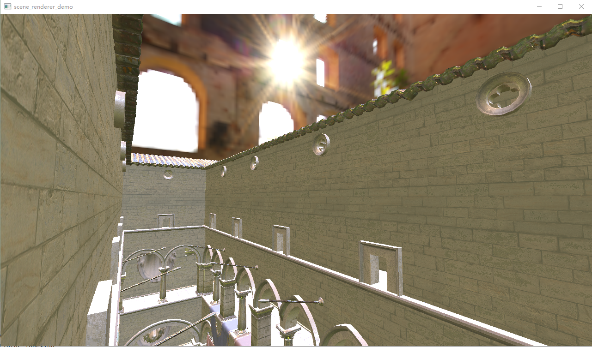
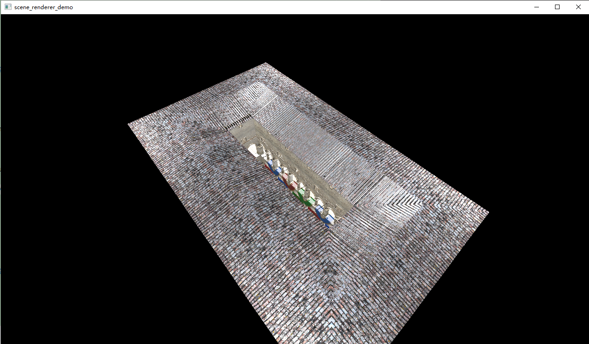
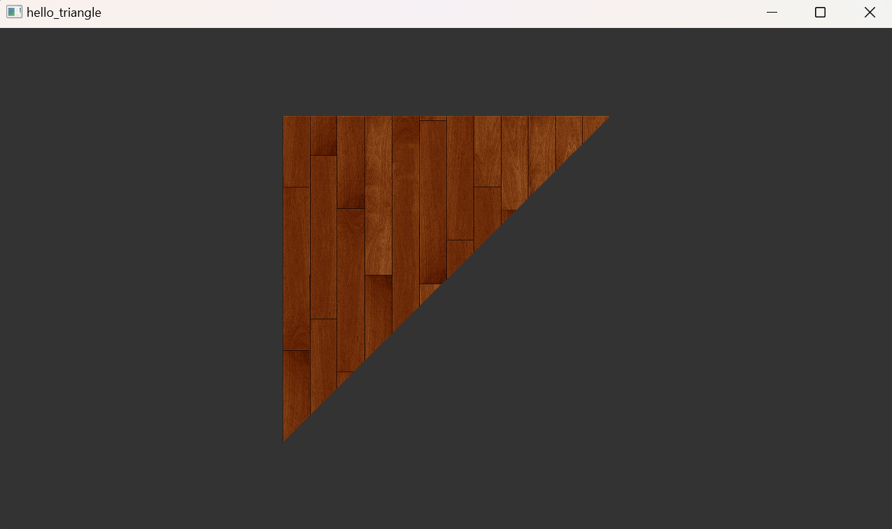
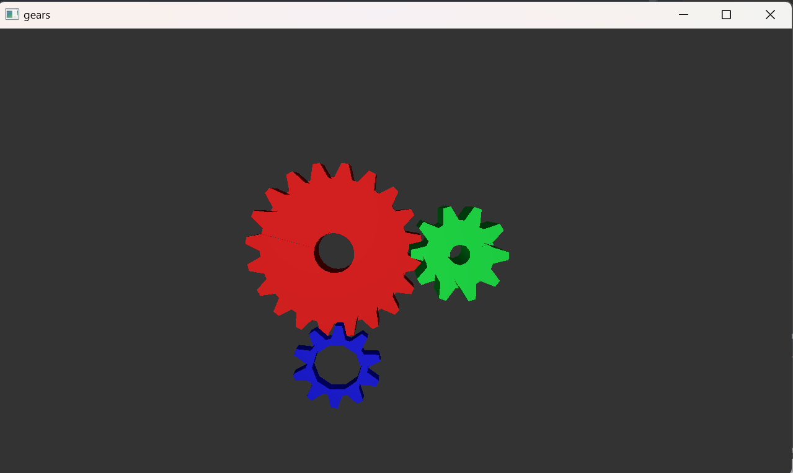
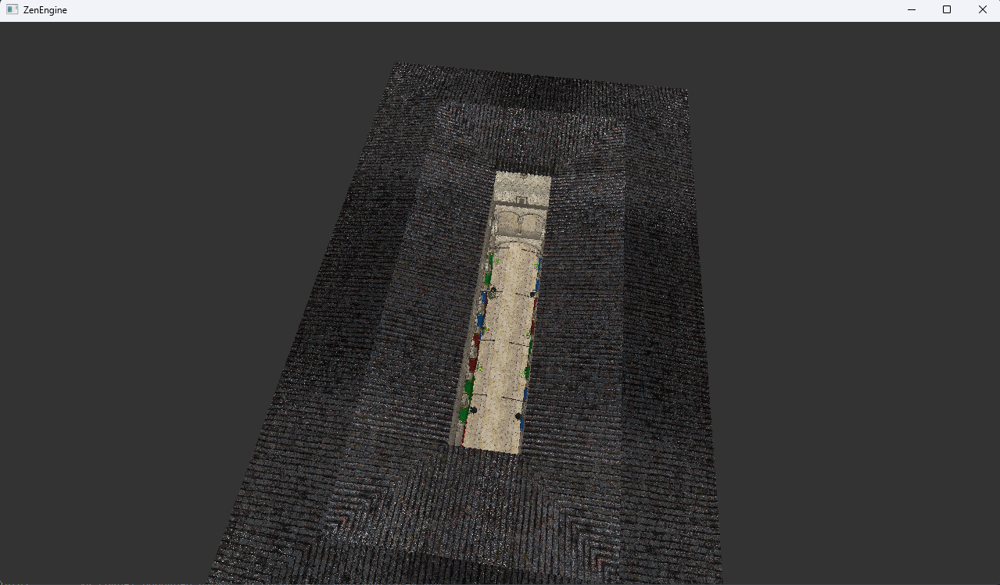
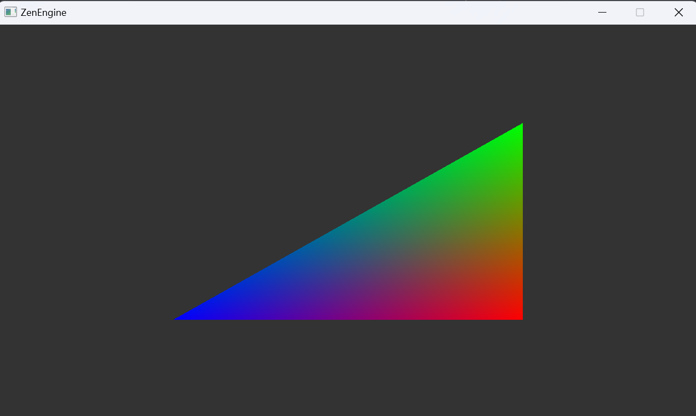

## RenderGraph based Vulkan Renderer

This is a personal project build by myself while learning Vulkan API. It mainly consists of following 2 parts:

1. `RHI & VulkanRHI`: Vulkan Render Hardware Interface
2. `RenderCore(V2)`: high level rendering framework build on `VulkanRHI`:
    * `RenderGraph`: Manage passes, dependencies, resources, barriers.
    * `RenderDevice`: Manage frame acquirement and frame presentation.
    * `SceneRenderer`: Render scene-graph based scenes.
    * `SkyboxRenderer`: Process environment textures and draw skybox.

## M4-2025.2.6

**Current Status:**

Implemented basic IBL+PBR lighting. Adds a separate SkyboxRenderer for processing environment textures.

**scene_renderer_demo** (basic PBR with IBL, use SceneGraph to manage gltf models)

**Next steps:**
Focus on refactor and new rendering algorithms.
* **Optimize texture loading command submission**: RenderDoc capture events show that too many command submission when copying from stating buffer to gpu texture, to be optimized and fixed.
* **Implement more concise and explicit layout transition**: consider using dynamic rendering feature to replace current framebuffer/renderpass setup.
* **Fix bugs in render graph cpu memory allocation and deallocation**.
* **Refactor & Fix Bugs in current asset loading code (model & texture)**: when loading some gltf models, the result is not correct, maybe sth wrong with the coordinate system. Consider implementing a robust asset lib and convert various asset format to self-defined format.
* **Study state of the art global illumination algorithms**.

## M3-2025.2.2

**Current Status:**

Refined VulkanRHI and Render framework V2. Implemented scene graph based renderer demo.

**scene_renderer_demo**(basic PBR with static lighting, use SceneGraph to manage gltf models)

**Next steps:**

Refine further ZenEngine's VulkanRHI and RenderCoreV2 framework. Implement more rendering algorithms.

## M2-2024.10.21

**Current Status:**

Implemented VulkanRHI and Render framework V2 from scratch (Basic structure and functionality
implemented, but may contain bugs). Already implemented 2 sample applications based
on [Vulkan Samples](https://github.com/SaschaWillems/Vulkan).

**hello_triangle**(with texture)

**gears**

**Next steps:**

Re-write **all** [Vulkan Samples](https://github.com/SaschaWillems/Vulkan) using ZenEngine's VulkanRHI and RenderCoreV2.

## M1-2024.1.3

Implemented Simple PBR with static point lights.

Main Features(Implemented):

1. Vulkan Abstraction Layer
2. Simple RenderGraph.
3. Scene Graph.
4. PBR with static point lights.

**Next Steps**

1. Refactor Vulkan Abstraction Layer
   * Main Goal: Robust Pipeline Management, Support for Raytracing.

2. Refactor RenderGraph
   * Main Goal: Barrier Management, Aliasing, Reorder, Multi-RDGPass, Support for Raytracing.

3. Hybrid Rendering.
4. Dynamic Diffuse Global Illumination (DDGI).

## M0-2023.10.2

**Current Status:**

Finally! Hello, Triangle! (single pass, fixed shader without input)

**Next steps:**

1. Vertex inputs.
2. Uniform buffers.
3. Load Meshes.
4. Load Textures.
5. More passes.
6. More reasonable barriers.
7. Merging passes, use Subpass dependency instead of pipeline barriers.

