# ZenEngine

A personal real-time rendering engine written from scratch in C++20 on Vulkan, built
while learning the API and modern renderer architecture. It is organized around a
**render graph** that schedules work across **graphics, async-compute and transfer
queues**, a dedicated **RHI thread**, **voxel cone-traced global illumination**, and a
**glTF 2.0** importer covering most of the Khronos material extensions.


<sub>Sponza, Voxel GI view: deferred PBR + IBL, shadowed point lights and one diffuse bounce
from a 256³ voxel grid. Release build on an AMD Radeon RX 7900 XT, 1600×900.</sub>

## Highlights

- **Render graph (RDG)**: declare graphics, compute and transfer passes; the graph derives
  resource versions, barriers and layout transitions, culls unused passes, pools and reuses
  transient allocations, and splits the frame into queue submission groups with exact
  cross-queue waits.
- **Multi-queue, multi-thread execution**: RenderCore records backend-independent RHI
  command lists on the main thread, and a dedicated RHI thread translates and submits them.
  Eligible voxel GI passes run on the async-compute queue and uploads on the transfer queue.
- **Voxel cone-traced GI**: scene voxelization (geometry-shader or compute path, 64/128/256³),
  radiance injection with shadow visibility, mip filtering on async compute, six-cone diffuse
  tracing with environment, emissive and analytic-light contributions, all reconfigurable at
  runtime.
- **glTF 2.0**: transactional import of `.gltf`/`.glb`, Draco and meshopt compression, GPU
  instancing, skins, morph targets, `KHR_animation_pointer`, punctual and image-based lights,
  cameras, variants, and the clearcoat, sheen, transmission, volume, iridescence, anisotropy,
  dispersion and specular material extensions.
- **Vulkan backend**: Vulkan 1.2 with dynamic rendering, a global bindless heap, VMA,
  timeline semaphores, lifetime-tracked deferred destruction, a pipeline cache, and robust
  swapchain recreation.
- **Tooling**: a Dear ImGui runtime debug UI rendered through the graph, portable CPU/GPU
  per-pass profiling, GPU memory statistics, device-loss diagnostics, 1,100+ GoogleTest cases
  and Python image/corpus verification scripts.

## Gallery

### Dynamic lighting with voxel GI

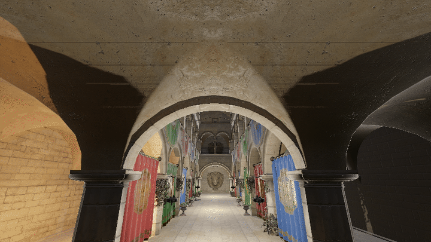

<sub>One warm point light orbits through both side aisles. Its shadow faces, voxel radiance and
cone-traced bounce light update every frame. Captured with `--fixed-step` frame by frame.</sub>

### One scene, three views

| Voxelization | Deferred PBR + IBL | Voxel GI |
| :---: | :---: | :---: |
| 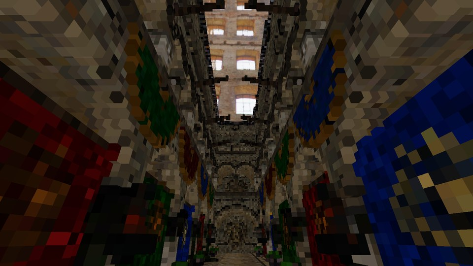 | 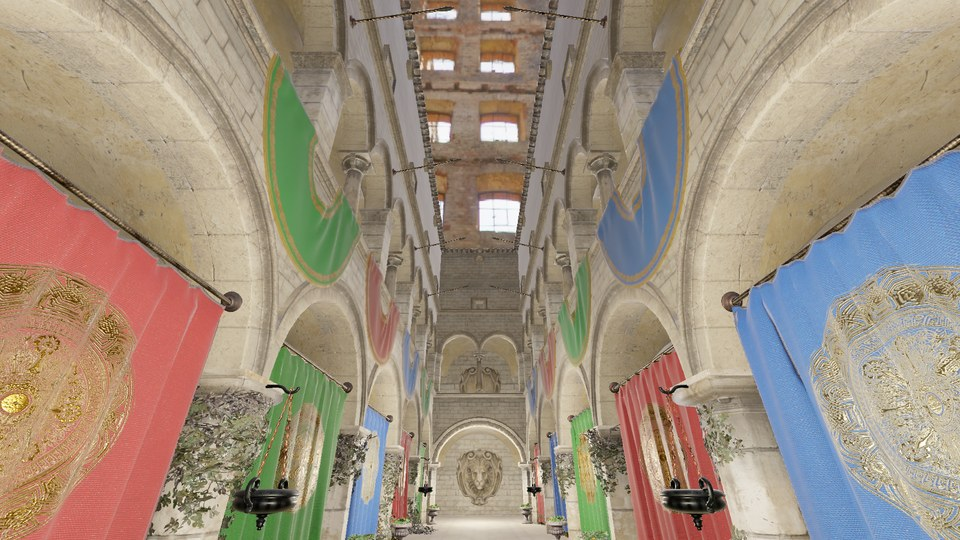 | 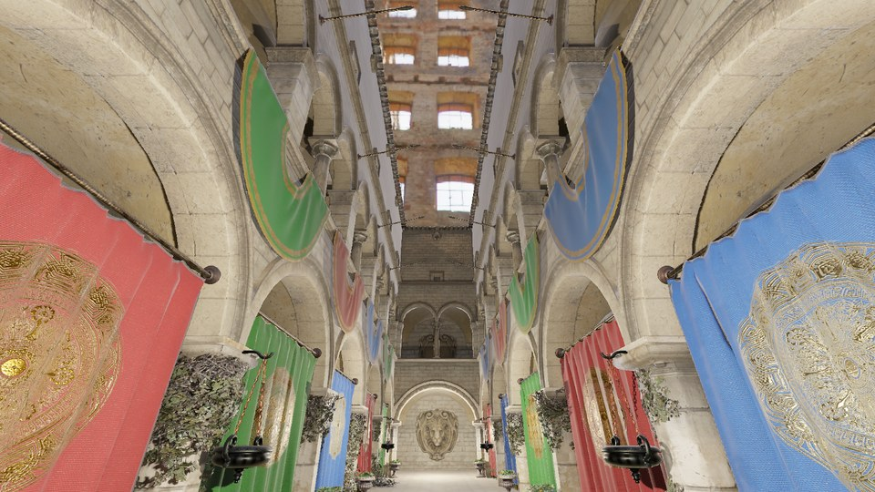 |
| 256³ albedo voxels | Direct PBR + environment IBL | + shadow maps and cone-traced indirect light |

### What the indirect bounce adds

| Direct light only | Direct + voxel cone-traced bounce |
| :---: | :---: |
| 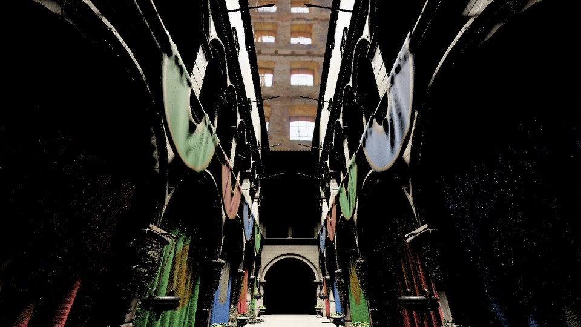 | 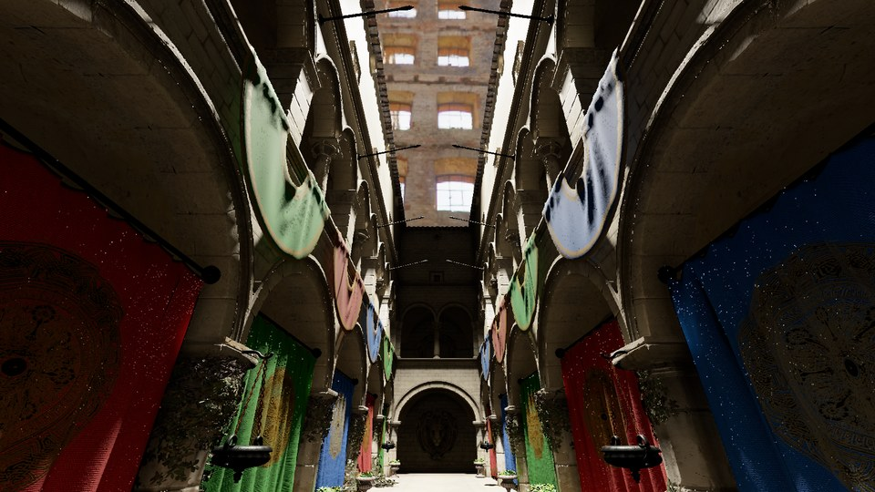 |

<sub>A single shadow-casting spot light shines down through the open roof onto the nave floor,
with environment lighting off. Same frame, `voxel_gi_indirect_intensity` 0 versus the default 1.
In the right image, everything outside the sunlit floor is lit only by the bounce.</sub>

### glTF material extensions

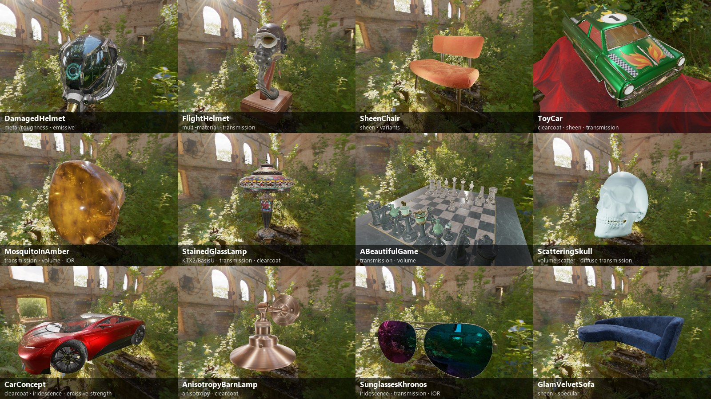

<sub>[Khronos glTF sample assets](https://github.com/KhronosGroup/glTF-Sample-Assets) in the
Deferred PBR view. Advanced materials use the forward HDR path with an opaque-scene refraction
snapshot.</sub>

### Runtime debug UI

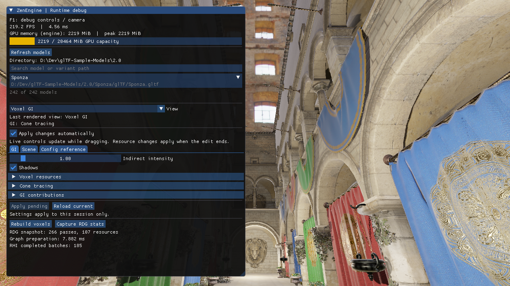

<sub>Model browser, view switching, live GI/voxel resource settings, scene, environment and
light controls, GPU memory, and on-demand render-graph statistics.</sub>

## Architecture

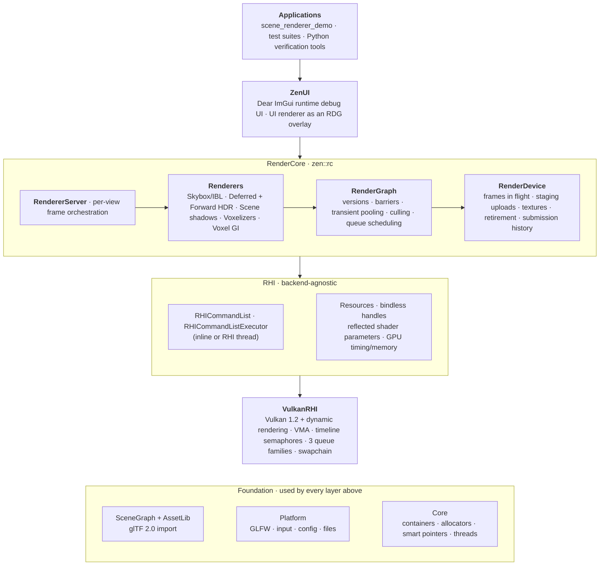
```mermaid
flowchart TB
    App["<b>Applications</b><br/>scene_renderer_demo · test suites · Python verification tools"]
    UI["<b>ZenUI</b><br/>Dear ImGui runtime debug UI · UI renderer as an RDG overlay"]
    subgraph RC["RenderCore · zen::rc"]
        direction LR
        RS["<b>RendererServer</b> · per-view frame orchestration"]
        R["<b>Renderers</b><br/>Skybox/IBL · Deferred + Forward HDR · Scene shadows · Voxelizers · Voxel GI"]
        RDG["<b>RenderGraph</b><br/>versions · barriers · transient pooling · culling · queue scheduling"]
        RD["<b>RenderDevice</b><br/>frames in flight · staging uploads · textures · retirement · submission history"]
        RS --> R --> RDG --> RD
    end
    subgraph RHI["RHI · backend-agnostic"]
        direction LR
        CL["RHICommandList · RHICommandListExecutor<br/>(inline or RHI thread)"]
        RES["Resources · bindless handles<br/>reflected shader parameters · GPU timing/memory"]
        CL ~~~ RES
    end
    VK["<b>VulkanRHI</b><br/>Vulkan 1.2 + dynamic rendering · VMA · timeline semaphores · 3 queue families · swapchain"]
    subgraph F["Foundation · used by every layer above"]
        direction LR
        SG["SceneGraph + AssetLib<br/>glTF 2.0 import"]
        PL["Platform<br/>GLFW · input · config · files"]
        CO["Core<br/>containers · allocators · smart pointers · threads"]
        SG ~~~ PL ~~~ CO
    end
    App --> UI --> RC --> RHI --> VK
    VK ~~~ F
```

Everything except ZenUI and the samples lives in the `ZenCore` library
(`ZenCore/Include`, `ZenCore/Source`).

### What each layer provides

| Layer | Location | Capabilities |
| --- | --- | --- |
| **Core** | `Templates/`, `Memory/`, `Utils/` | `SmallVector`, `HeapVector`, `ArenaVector`, `FlatHashMap`, `LRUCache`, `ObjectPool`, `NameID` interning; linear, paged and pool allocators; intrusive `RefCountPtr`/`UniquePtr`/`SharedPtr`; thread pool, locks; `VERIFY_EXPR` invariants checked in Debug and Release. |
| **Platform** | `Platform/` | GLFW window and input (keyboard/mouse with UI capture), transactional `key=value` `ConfigLoader`, file system helpers, timers. |
| **SceneGraph & AssetLib** | `SceneGraph/`, `AssetLib/`, `Systems/` | Node/component scene (transform, mesh, material, light, camera, texture, sampler); fastgltf + simdjson glTF importer with transactional failure; Draco/meshopt decoding; skin, morph and `KHR_animation_pointer` animation; PNG/JPEG/WebP/BasisU textures; model catalog for the UI browser; scene centering and normalization. See [glTF scene import](Doc/GLTFSceneImport.md). |
| **RHI** | `Graphics/RHI/` | Backend-agnostic buffers, textures, views, samplers and pipelines; deferred `RHICommandList` recording; an executor that runs inline or on a dedicated RHI thread; per-queue submission serials and explicit dependencies; global bindless handles; reflected, batched shader parameters; GPU pass timing, GPU memory statistics and device-loss diagnostics. See [RHI contracts](ZenCore/Include/Graphics/RHI/README.md). |
| **VulkanRHI** | `Graphics/VulkanRHI/` | Vulkan 1.2 with `VK_KHR_dynamic_rendering`, volk loading, VMA allocation, graphics/compute/transfer queue selection with concurrent sharing, timeline semaphores (fence fallback), a lifetime tracker for deferred destruction, descriptor pools plus a set-0 bindless heap, a uniform ring allocator, a native pipeline cache, and swapchain recreation with `swapchain_maintenance1` support. |
| **RenderGraph** | `RenderCore/V2/RenderGraph/` | Graphics/compute/transfer passes with name-reflected bindings; automatic resource versions, barriers and layout transitions; content guarantees; pass culling; transient pooling and allocation reuse; queue preferences compiled into submission groups with cross-queue waits; imports and deferred extractions; metrics and an independent barrier validator. See [RDG metrics](Doc/RDGMetrics.md). |
| **RenderDevice** | `RenderCore/V2/` | Frames in flight and frame slots, the per-frame graph, a staging upload queue on async transfer, texture manager, scene resource ownership, GPU-safe resource retirement, and cross-graph submission history. |
| **Renderers** | `RenderCore/V2/Renderer/` | `RendererServer` (view selection and runtime GI reconfiguration), `SkyboxRenderer` (irradiance, prefiltered environment, BRDF LUT, skybox), `DeferredLightingRenderer` (G-buffer, deferred lighting, forward HDR path with transmission/scattering, tone map, light markers), `SceneShadowRenderer` (point/spot/directional shadow maps shared by lighting and GI), `GeometryVoxelizer`/`ComputeVoxelizer`, `VoxelGIRenderer`. |
| **ZenUI** | `ZenUI/` | Dear ImGui context and renderer recorded as an RDG overlay, plus the runtime debug UI described in the gallery. Optional via `ZEN_BUILD_RUNTIME_UI`. |
| **Samples & tools** | `ZenSamples/`, `tools/` | `scene_renderer_demo`, unit and Vulkan integration suites, a glTF corpus importer, and Python scripts for corpus rendering, GI quality, voxelization calibration and profiling. |

### Anatomy of a Voxel GI frame

Each frame builds one render graph. Voxel GI work is **incremental**: voxelization and
opacity mips rebuild only when geometry changes, sky irradiance only when the environment
changes, and radiance injection only when lighting changes, such as a moving light.

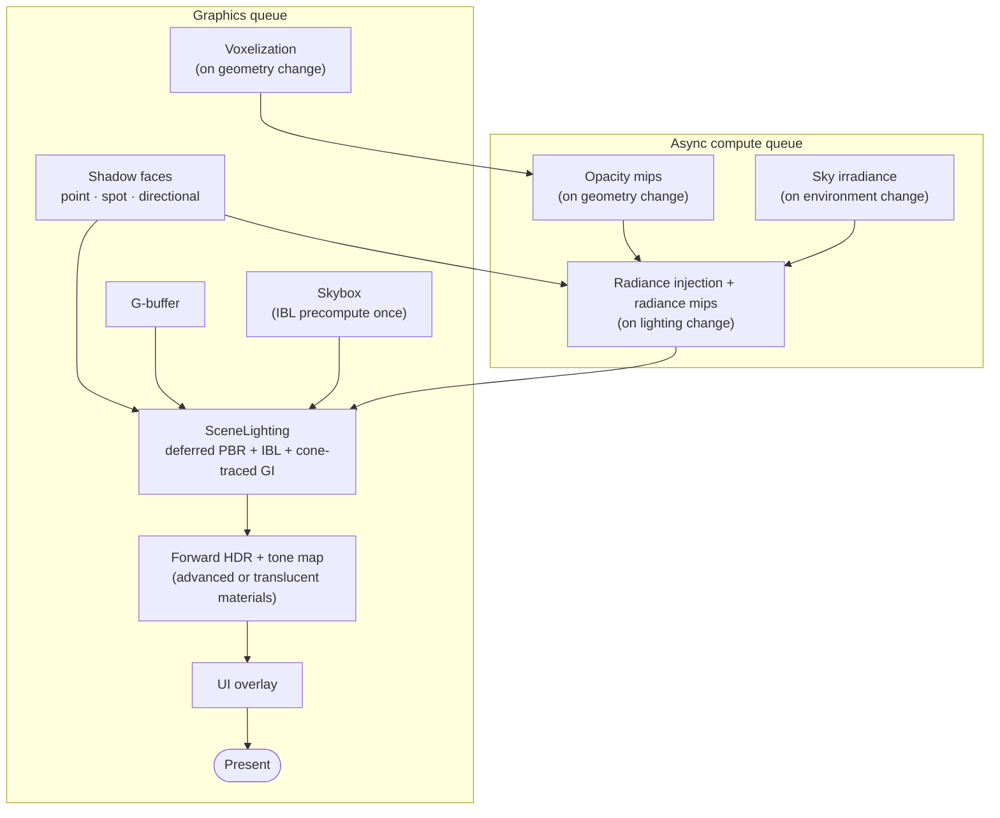
```mermaid
flowchart TB
    subgraph GFX["Graphics queue"]
        direction TB
        SKY["Skybox<br/>(IBL precompute once)"]
        GB["G-buffer"]
        VOX["Voxelization<br/>(on geometry change)"]
        SH["Shadow faces<br/>point · spot · directional"]
        LIT["SceneLighting<br/>deferred PBR + IBL + cone-traced GI"]
        FWD["Forward HDR + tone map<br/>(advanced or translucent materials)"]
        OVL["UI overlay"]
        PRES(["Present"])
    end
    subgraph ACE["Async compute queue"]
        direction TB
        OPM["Opacity mips<br/>(on geometry change)"]
        SKI["Sky irradiance<br/>(on environment change)"]
        INJ["Radiance injection + radiance mips<br/>(on lighting change)"]
    end
    VOX --> OPM --> INJ
    SKI --> INJ
    SH --> INJ
    SH --> LIT
    GB --> LIT
    SKY --> LIT
    INJ --> LIT
    LIT --> FWD --> OVL --> PRES
```

`voxelizer=auto` selects the geometry-shader voxelizer when the GPU supports geometry
shaders. With the compute voxelizer (`voxelizer=comp`), voxelization also runs on async compute.

Passes are declared rather than synchronized by hand. This is the radiance/opacity
mip-chain builder from `VoxelGIRenderer.cpp`:

```cpp
RDGComputePassDesc pass;
pass.SetShaderProgramName(program);
pass.SetPassTag(NameID(fmt::format("{}_{}", tag, mip)));
pass.SetQueuePreference(RDGQueuePreference::ePreferAsyncCompute);
pass.BindStorageImage("sourceVolume", views[mip - 1]);
pass.BindStorageImage("targetVolume", views[mip], RDGContentGuarantee::eFullWrite);
graph->AddComputePass(std::move(pass))
    .RecordPassCommands([groups](RDGPassCmdEncoder& encoder) {
        encoder.Dispatch(groups.x, groups.y, groups.z);
    });
```

The graph resolves the bindings through shader reflection, orders the read of mip *n − 1*
after the write that produced it, places the pass on the compute queue when the device has
one, and inserts the barriers and semaphore waits for the graphics passes that consume it.

### Threading and queues

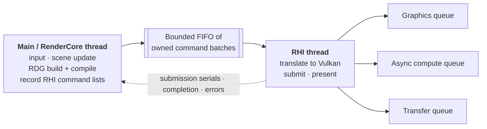
```mermaid
flowchart LR
    MT["<b>Main / RenderCore thread</b><br/>input · scene update<br/>RDG build + compile<br/>record RHI command lists"]
    Q[["Bounded FIFO of<br/>owned command batches"]]
    RT["<b>RHI thread</b><br/>translate to Vulkan<br/>submit · present"]
    G["Graphics queue"]
    C["Async compute queue"]
    T["Transfer queue"]
    MT --> Q --> RT
    RT --> G & C & T
    RT -. "submission serials · completion · errors" .-> MT
```

Threaded execution is the default; `--rhi-thread=0` runs the same executor inline.
`async_compute=auto|off` in `Data/engine.cfg` and `--async-compute=0|1` control async compute
scheduling.
Background: [threading plan](Doc/RenderCoreRHIThreadingPlan.md),
[async compute plan](Doc/AsyncComputeImplementationPlan.md) and
[synchronization simplification](Doc/SynchronizationSimplificationPlan.md).

## Building and running

### Requirements

- Windows 10/11 x64, Visual Studio 2022 (MSVC), CMake ≥ 3.23, Ninja.
- Vulkan SDK (provides `glslangValidator`; shaders compile with the build).
- A Vulkan 1.2 GPU with dynamic rendering, descriptor indexing and a graphics+compute queue.
- glTF models, e.g. a checkout of
  [glTF-Sample-Assets](https://github.com/KhronosGroup/glTF-Sample-Assets).

Production support currently targets Windows desktop Vulkan, and AMD is the validated
hardware. macOS and Linux presets exist but are not supported until their platform
acceptance matrix passes. Details are in the [RHI contracts](ZenCore/Include/Graphics/RHI/README.md#vulkan-device-and-presentation-requirements).

### Build

Use an **x64 Developer PowerShell for Visual Studio** with CMake, Ninja and the Vulkan SDK
installed. From the repository root:

```powershell
cmake --preset x64-windows-msvc-release
cmake --build --preset x64-windows-msvc-release --target scene_renderer_demo --parallel 8
./build/x64-windows-msvc-release/bin/scene_renderer_demo.exe
```

Every preset writes executables to `build/<preset-name>/bin`, including Debug. The Windows
release preset selects `Release` (`/O2`, `NDEBUG`). In a CMake preset-aware IDE, select the
matching configure/build presets and `scene_renderer_demo` as the launch target. Configure
once before using a build preset. `-DBUILD_TESTING=OFF` configures without engine test
targets or GoogleTest, and `-DZEN_BUILD_RUNTIME_UI=OFF` omits Dear ImGui.

For an automatic Visual Studio environment setup, build and Voxel GI launch, use
`tools/run_voxel_gi_performance.cmd`. This uses the separate Release performance preset
described in [VoxelGI performance](Doc/VoxelGIPerformance.md).

### Configure the scene

Copy `Data/engine.example.cfg` to `Data/engine.cfg` and set `model_base_path` (or an
absolute `default_model_path`). Model paths in `Data/engine.cfg` are resolved relative to
that file's directory, so the launch working directory does not affect asset lookup. The
same file selects the voxelizer, voxel resolution, environment map, GI parameters, shadow
resolution, present mode and lights. Each key is documented inline, and most can also be
edited live from the debug UI.

The Sponza screenshots above override the default lights (`scene_lighting_override=true`):
three shadow-casting point lights along the nave, or one roof-height spot light for the
bounce comparison.

### Controls

| Input | Action |
| --- | --- |
| **1** / numpad 1 | Voxel GI view (startup default) |
| **2** / numpad 2 | Voxelization view |
| **R** | Rebuild the voxel scene |
| **F1** | Toggle between debug UI interaction and camera control |
| **W A S D**, **Left Shift / Left Ctrl** | Move, rise/descend |
| Left mouse drag | Look around |
| **↑ / ↓** | Double / halve camera speed |
| **Tab** | Toggle cursor capture |
| **Esc** | Quit |

Deferred PBR is available from the UI's *View* selector or `--mode=2`. Diagnostic mode IDs
for automation are `--mode=1` voxelization, `--mode=2` PBR and `--mode=3` Voxel GI.

### Useful command-line options

| Option | Effect |
| --- | --- |
| `--disable-validation` | Disable Vulkan validation (enabled by default) when measuring performance |
| `--width=N --height=N` | Window size |
| `--vsync=0\|1`, `--present-mode=…` | Presentation control (`default`, `fifo`, `fifo_relaxed`, `mailbox`, `immediate`) |
| `--rhi-thread=0\|1`, `--async-compute=0\|1` | Inline vs threaded RHI; async compute scheduling |
| `--ui` / `--no-ui` | Force the runtime debug UI on or off |
| `--frames=N --warmup=N --fixed-step` | Deterministic, finite runs |
| `--capture=frame.ppm` | Write the final frame as an image |
| `--profile=PREFIX` | CPU/GPU per-pass profile (CSV + JSON), see [Engine profiling](Doc/EngineProfiling.md) |
| `--gpu-markers`, `--gpu-memory-stats`, `--device-loss-diagnostics` | Debugging aids |

An unrecognized option prints the complete usage line.

### Dependencies

Third-party sources are downloaded automatically by CMake FetchContent into
`External/<dependency-name>`. Git submodules are not needed, but the first configure needs
network access. Every archive has a pinned revision and SHA-256 checksum in
[`External/CMakeLists.txt`](External/CMakeLists.txt). Downloaded source folders are ignored
by Git, and build and download state stays in the selected build tree.

| Dependency | Pinned version | Used by |
| --- | --- | --- |
| GLFW | 3.5.1 | Window/input integration |
| GLM | 1.0.3 | Engine math |
| GLI | `3542f8830178061e0661f5df1e89d36ba7d7b0ab` | Texture loading; current upstream commit |
| spdlog | 1.17.0 | Logging |
| VulkanMemoryAllocator | 3.4.0 | Vulkan allocation |
| volk | 1.4.350 | Vulkan function loading |
| SPIRV-Reflect | Vulkan SDK 1.4.363.0 | Shader reflection |
| stb | `2c980bb59875b0d32144a71867fbdebb2f77cd20` | Image loading |
| fastgltf | 0.9.1 | glTF loading |
| simdjson | 4.6.11 | fastgltf's supported JSON parser version |
| GoogleTest | 1.18.0 | Only with `BUILD_TESTING=ON` |
| Dear ImGui | 1.92.9b-docking | Only with `ZEN_BUILD_RUNTIME_UI=ON` |

The standalone `span` dependency was replaced by C++20 `std::span` behind the existing
`zen::ArrayView` alias. Upstream examples, tests and GoogleMock are disabled.

## Testing and verification

| Suite | Cases | Covers |
| --- | ---: | --- |
| `RenderCoreTest` | 547 | Render graph compilation, scheduling, submission and failure paths, async compute/upload lifetimes, GI settings and resource planning |
| `VulkanRHIIntegrationTest` | 336 | Real-device resources, descriptors, bindless retirement, queues, swapchain, recording, pipelines, GPU timing |
| `CommonTest` | 108 | glTF import (compatibility, morphs, stress, physical units), animation, containers, allocators, configuration |
| `VulkanRHITest` | 45 | Backend unit contracts: lifetime tracker, queue selection, synchronization |
| `SmartPtrTest`, `ConfigLoaderTest`, `RuntimeUIIntegrationTest`, `SceneModelSwitchTest`, `UIDrawPacketTest`, `InputControllerTest`, `ConeVoxelGIIntegrationTest`, … | 90+ | Smart pointers, configuration, UI integration, model switching, input, cone-traced GI end-to-end |

GPU suites expect a Vulkan device. Python scripts under `tools/` render the glTF corpus,
validate voxelization and GI quality against references, and check profiling output. On
2026-10-01 all 339 variants of the Khronos sample corpus imported and rendered with no
validation errors ([details](Doc/GLTFSceneImport.md#reproducible-verification)).

## Code review skill

The shared [C++ rendering review skill](.agents/skills/review-rendering-changes/SKILL.md)
contains the review workflow and seven C++ coding rules used for ZenEngine changes.
Clone or pull this repository on another device and open it in Codex. The skill is
discovered from `.agents/skills`; no separate installation is needed for this repository.
If it does not appear, restart Codex ([skill discovery documentation](https://learn.chatgpt.com/docs/build-skills#where-codex-loads-local-skills)).

After making code changes, invoke it explicitly:

```text
Use $review-rendering-changes to review my current changes before committing.
```

For review with fixes, ask it to "review and refine my current changes, then run the
relevant checks." Review-only requests do not modify files; committing and pushing
require an explicit request. Other coding agents can read the linked `SKILL.md` directly.

To install the skill for use outside this repository on another device, ask Codex:

```text
Use $skill-installer to install https://github.com/proton991/ZenEngine/tree/main/.agents/skills/review-rendering-changes
```

## Documentation

| Topic | Documents |
| --- | --- |
| RHI | [Binding and lifetime contracts](ZenCore/Include/Graphics/RHI/README.md) · [Error handling](Doc/RHIErrorHandlingPlan.md) · [Improvement plan](Doc/RHIImprovementPlan.md) |
| RenderCore | [Render graph design](Doc/DevLogs/RenderGraphDesign.md) · [RDG/RenderCore analysis](Doc/RDGRenderCoreAnalysisAndPlan.md) · [RDG metrics](Doc/RDGMetrics.md) |
| Threading and queues | [RenderCore/RHI threading](Doc/RenderCoreRHIThreadingPlan.md) · [Async compute](Doc/AsyncComputeImplementationPlan.md) · [Synchronization simplification](Doc/SynchronizationSimplificationPlan.md) |
| Global illumination | [Voxel GI plan](Doc/VoxelGIImplementationPlan.md) · [Verification](Doc/VoxelGIVerification.md) · [Performance](Doc/VoxelGIPerformance.md) · [Voxelization calibration](Doc/VoxelizationCalibration.md) |
| Assets and tools | [glTF scene import](Doc/GLTFSceneImport.md) · [Engine profiling](Doc/EngineProfiling.md) · [UI integration review](Doc/UIIntegrationReview.md) |

## Current limitations and next steps

- GI is diffuse-only with a single bounce. Specular reflections come from the prefiltered
  environment, not from the voxel scene.
- Environment (sky) visibility uses one binary voxel ray per cone, so a narrow occluder can
  remove a whole cone's sky light and leave dark strips, e.g. on Sponza's floor.
- The Deferred PBR view has no shadow maps; mesh shadows are part of the Voxel GI view.
- Up to 32 punctual lights; fixed bindless heaps of 2048 2D textures, 64 cube textures and
  128 samplers.
- Refraction uses a single opaque-scene snapshot. See the
  [glTF practical limits](Doc/GLTFSceneImport.md#practical-limits).
- Next: hybrid voxel GI ([plan](Doc/HardwareRayQueryEnvironmentLightingPlan.md)). Sampled,
  temporally filtered sky light removes those strips first. Hardware ray queries then add
  triangle-accurate visibility, bounce and reflections, with voxel rays as the fallback.

## Development history

<details>
<summary>Earlier milestones (2023–2025)</summary>

### M4 · 2025-02-06: IBL + PBR

Image-based lighting with a separate `SkyboxRenderer` for environment processing.

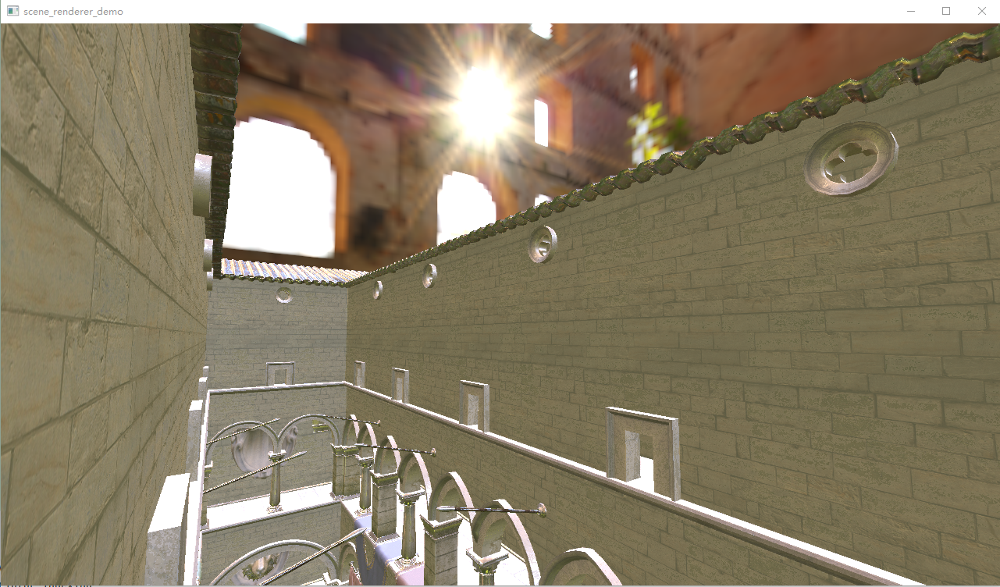

### M3 · 2025-02-02: scene-graph renderer

Refined VulkanRHI and RenderCore V2, with a scene-graph based renderer and static PBR lighting.

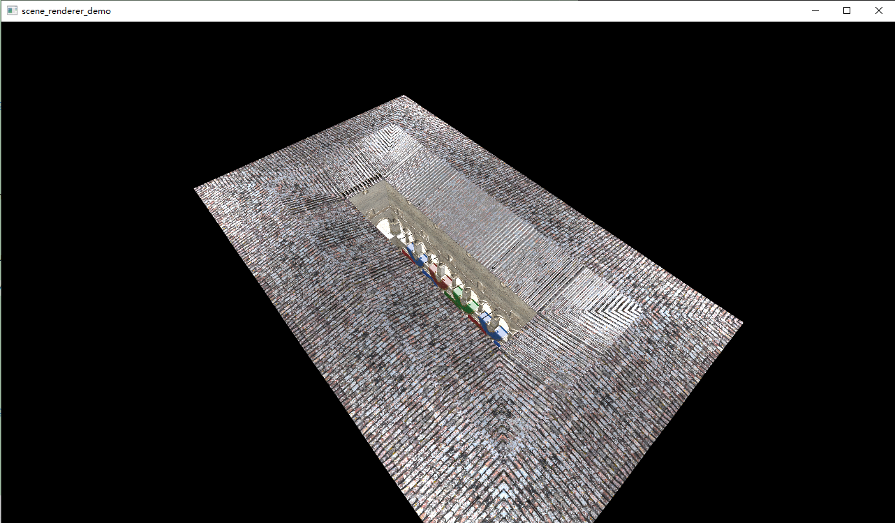

### M2 · 2024-10-21: VulkanRHI and RenderCore V2

The RHI and render framework were rewritten from scratch and validated with ports of
[Sascha Willems' Vulkan samples](https://github.com/SaschaWillems/Vulkan).

| hello_triangle (textured) | gears |
| :---: | :---: |
| 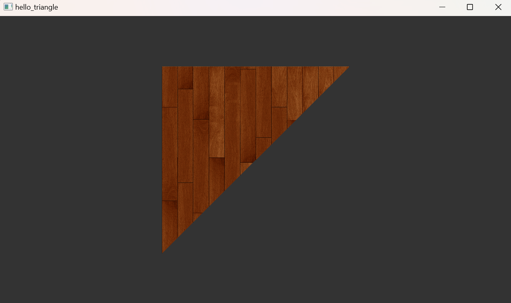 | 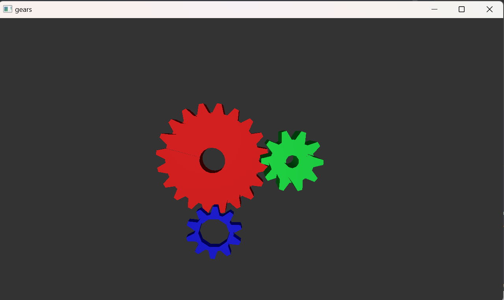 |

### M1 · 2024-01-03: first PBR

A Vulkan abstraction layer, a simple render graph, a scene graph and PBR with static point lights.

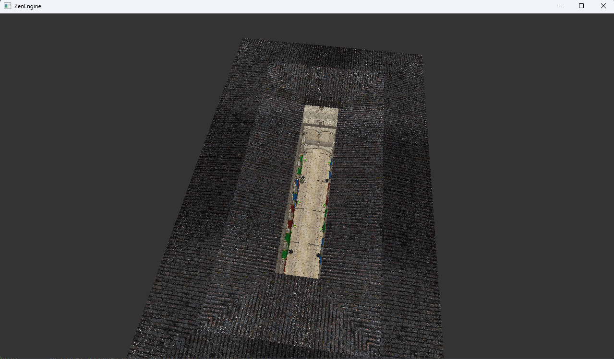

### M0 · 2023-10-02: Hello, Triangle

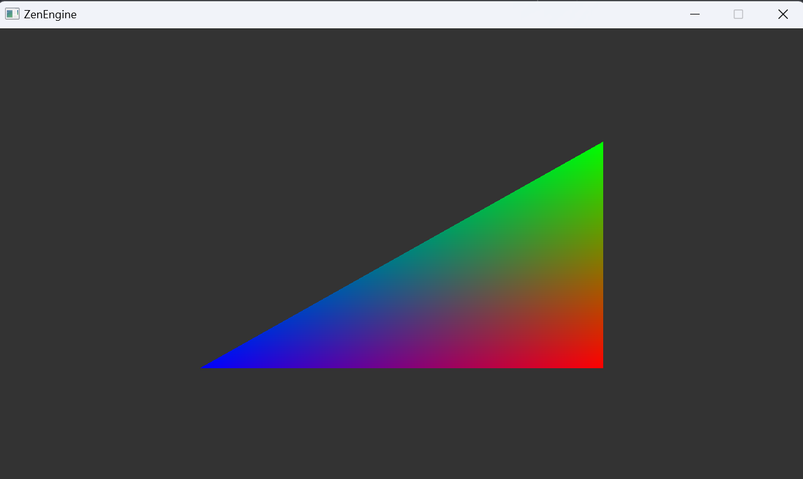

The M0–M2 demos were removed in the RHI cleanup; their code remains in Git history.

</details>

Since M4 (2025-02 to 2026-10) the engine gained the multi-queue render graph, the RHI thread,
async compute and transfer, dynamic rendering, the global bindless heap, voxelization and
voxel cone-traced GI, the expanded glTF importer, the runtime debug UI and portable profiling.
