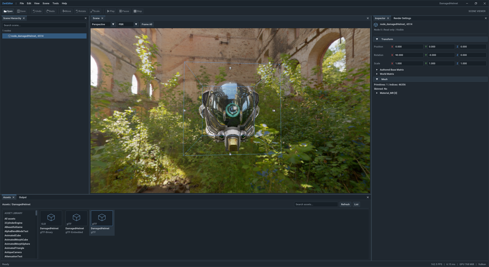

# ZenEditor scene viewer

The editor supports glTF inspection and a unified **Rendering** panel for lighting,
GI, rendering algorithms and framebuffer diagnostics. Milestones 1–3 of the
[rendering plan](../Doc/ZenEditorRenderingPlan.md) are implemented. Scene and asset
authoring remain deferred. Run/Restart/Stop and `zen_player` belong to milestone 4;
rendering preset files belong to milestone 5.



## Build and launch

From a Visual Studio developer terminal on Windows:

```powershell
cmake --preset x64-windows-msvc-debug
cmake --build build/x64-windows-msvc-debug --target zen_editor
.\build\x64-windows-msvc-debug\bin\zen_editor.exe
```

On macOS:

```sh
cmake --preset arm64-apple-clang-debug
cmake --build --preset arm64-apple-clang-debug --target zen_editor
build/arm64-apple-clang-debug/bin/ZenEditor.app/Contents/MacOS/ZenEditor
```

The CMake target stays `zen_editor`; its macOS output is `ZenEditor.app`, with
the executable at `ZenEditor.app/Contents/MacOS/ZenEditor`. IDE Run launches this
executable. The bundle supplies the ZenEditor name and logo for Finder and the
Dock. A `bin/zen_editor` symlink preserves existing direct launch commands and
replaces the previous standalone build artifact. To pass diagnostic arguments
directly, run `build/arm64-apple-clang-debug/bin/zen_editor --windowed`.

The editor starts maximized in normal desktop window mode. The window stays
hidden until initialization completes, then appears once at its final size. It
activates and brings its window to the front when launched from an IDE or terminal.
It uses the actual framebuffer dimensions for presentation and resizes the offscreen
scene to the available viewport pixels. Use `--windowed` to start at 1440×900
instead. `--hidden` never shows the window, so a maximized start renders at the
restored 1440×900 size.

The editor uses platform-specific menus and window title bars:

- **Windows:** the editor draws minimize, maximize/restore, and close at the right.
  Drag the space after the menus to move the window; double-click it to
  maximize/restore. Window edges retain native resizing, and maximizing fills the
  monitor work area without covering the taskbar. Control requests are applied
  between frames before framebuffer resizing.
- **macOS:** the window uses a native title bar with the system close, minimize,
  and zoom buttons. File, Edit, View, Scene, and Help appear in the macOS system
  menu bar. The application menu includes Services, Hide, and Quit (Cmd+Q).
  Cocoa handles title-bar dragging and double-clicks, resizing, and full screen.
  Toolbar buttons stay in the editor's content below the title bar. Native menu
  dispatch, panel toggles, Cmd+O/Cmd+Q, window decoration, and basic MoltenVK
  presentation have been checked on macOS. Full migration acceptance still
  requires the interaction and display checks listed in the migration status.

Linux support is deferred.

Use `--scene=absolute/path/model.gltf` (or `.glb`) to open an initial asset.
Without it the shell starts empty. An import failure keeps the current scene and
reports its error in Assets and Output, including failures of the initial asset.
File → Open (Cmd+O on macOS, Ctrl+O elsewhere, or the toolbar Open button) shows
the platform file picker, filtered to glTF/GLB, without blocking rendering. It
starts beside the most recent scene, otherwise in the configured `model_base_path`.
The GLFW fallback backend has no picker and asks for a path instead.
File → Open Recent lists the last ten
scenes that opened successfully; missing files are disabled, and Clear Recent
empties the list.

`ZEN_BUILD_EDITOR` and `ZEN_BUILD_RUNTIME_UI` both default to `ON`.
Use `-DZEN_BUILD_EDITOR=OFF` to configure without the editor. Existing build trees
retain their cached option values; use `-DZEN_BUILD_EDITOR=ON` to enable it there.
All four combinations are supported. Both frontends use the same pinned
`v1.92.9b-docking` ImGui dependency. With both options off, core and samples have
no ImGui dependency. Only editor initialization enables docking.

The implementation uses SDL3 behind `platform::NativeWindow` and the engine's
RHI/RDG stack. The pinned SDL library is built statically; no SDL DLL deployment
is required. Use `-DZEN_WINDOW_BACKEND=GLFW` for the migration fallback.
See [migration status](../Doc/SDL3Migration.md) for validation and remaining macOS
acceptance work.
Shader, texture and engine configuration paths use the existing engine path
configuration and do not depend on the launch working directory.

## Workspace and controls

- Drag panel tabs to dock; use View to hide/reopen panels or Reset Layout.
- Select hierarchy nodes or click scene geometry to synchronize the Inspector.
  Hierarchy search retains ancestors and includes nodes without meshes.
- Enable **Move lights** in the Scene toolbar, then left-drag a point or spot light's
  circular handle to move it across the current view. Orbit the camera to change the
  movement plane. Release to keep the position; Escape or focus loss cancels the drag.
  Handles include disabled lights and show through geometry. Directional lights have
  no position handle. Positions update the Rendering panel and preview live, including
  shadows and GI. New point and spot lights appear in front of the camera.
- Hold right mouse over the focused Scene view to look and fly with WASD/QE;
  Shift increases speed. Alt + left mouse orbits; middle mouse pans; wheel dollies.
  Scene-image drags retain navigation ownership when the panel is floating.
- **View → Panels → Camera Settings** configures fly movement speed from 0.001 to
  100 scene units per second (default 1). Type a value in the text box or use the
  **−/+** buttons to change it by 0.1 (hold Ctrl for steps of 1);
  **Reset** restores the default. Imported models have a longest extent of
  one scene unit, so the saved speed stays consistent across glTF source sizes and
  after framing a selection. Shift multiplies it by three; diagonal flight is
  capped at the same speed. Pan and wheel zoom continue to follow the view distance.
- F frames the selection; Home or Frame All frames the scene. **Rendering → View
  projection** selects perspective or orthographic projection. The camera is
  independent of cameras authored in the glTF.
- The Scene toolbar's **Controls** checkbox shows a list of these mouse and keyboard
  controls over the bottom-left of the scene. The frame shortcuts come from the
  action registry. The setting is saved with the editor preferences, and the list
  is hidden when the view is too small to hold it.
- FPS, frame time and GPU memory appear at the top of the Scene viewer, beside
  its controls when space allows and wrapped below them in narrow panels.
- The orientation sphere in the top-right corner is bound to the camera. It shows
  world X (red), Y (green) and Z (blue) on a translucent ball whose great circles
  are brighter on the front half; faint rings mark the negative ends. Every camera
  change turns the sphere. Dragging the sphere orbits the camera around the current
  center at the same distance, so the sphere's surface follows the cursor (one
  sphere radius of drag turns the view one radian). Like the viewport orbit, pitch
  stops just short of straight up or down. Clicking an axis end without dragging
  views the scene from that side; straight-down and straight-up views keep X to the
  right. Left presses on the sphere never select the geometry behind it. Small
  views omit the sphere.
- Menus, toolbar buttons and shortcuts run the same registered actions, so each
  command has one label, shortcut and enabled state. Shortcuts work anywhere in the
  workspace except while typing, while a widget is active or while a menu or modal
  is open. Disabled commands explain which plan step enables them.
- Escape cancels navigation or a modal. Text input, active widgets, open popups,
  and loss of window/panel focus prevent viewport navigation.
- **Rendering** selects PBR or PBR with voxel cone GI, independently of the debug
  output. New/reset layouts select this panel in the right dock; existing layouts
  retain the `RenderSettings` identity. Inspector source values remain read-only.
- Output retains at most 2,048 entries of 4,096 characters each, with level/text
  filtering, Clear and Copy. GPU memory and frame-time readings are snapshots.

The frontend uses graphite surfaces, soft borders, blue accents and proportional
Roboto text. Input widths are capped and scale with DPI; toolbar controls wrap and
Rendering labels stack above their fields when panels become narrow. Camera Settings groups its compact
speed input, boost readout and navigation shortcuts into cards. The Inspector keeps
its read-only XYZ fields and full-height dock. Save and playback controls
remain disabled in this viewer.

### Rendering configuration, lighting and diagnostics

The Rendering panel owns an editable draft and an applied revision. Invalid edits
keep the applied preview intact. Light values, environment scalars, GI cone values
and output selection apply between frames. Grid size, voxelizer, reflectance
resources/budget and shadow resolution wait for **Apply**; other edits keep
previewing in the meantime. **Revert** discards whatever has not been applied.
**Apply** and **Revert** stay visible in a fixed bottom footer while settings scroll
above them. They are enabled only while changes are pending,
keeping the panel layout and scroll position stable during edits.
Section resets and **Reset setup** restore the session's defaults. GPU allocation
failures show a latched PBR fallback reason, with explicit retry and restoration of
the last successfully rendered setup.

Scenes start with their glTF lights, including disabled and zero-intensity lights.
A scene without glTF lights starts with none. Add point, directional or spot lights,
or six side/eight corner lights around the normalized bounds. Imported lights are
editable copies; **Reset lights to glTF** restores the file's rig, and **Clear
lights** is valid. New scenes reset the rig while retaining GI, environment and
output settings. The demo still opts into the six-light preset explicitly.

The **Light ball** in Rendering > Lighting is a movable point light for GI tests.
It draws a small sphere in the selected color and lights nearby surfaces in every
direction. Enable **Follow camera** to carry it ahead of the camera; disable it to
hold its world position while inspecting the result. Edit color, intensity, light
range, sphere radius, follow distance or the held position. Distances use the
normalized scene span of one: defaults are range 0.12, radius 0.005, follow distance
0.08 and intensity 0.0025. Range and follow distance must exceed the sphere radius.

Select **PBR + voxel GI** and enable the GI **Analytic lighting** contribution to
see bounce light. The ball casts six-face point-light shadows when mesh shadows
are enabled. Moving it updates shadow faces and radiance mips without revoxelizing
unchanged geometry. It has a separate lighting revision and uses none of the 32
scene-light slots. The sphere is a visual source indicator; the point light supplies
the energy, rather than adding an emissive mesh to the scene.

For a Sponza GI check, clear other lights and set environment intensity to zero,
enable the ball, and fly near a floor or wall. Hold it in place and compare
**Indirect intensity** at zero and one. The native test also provides an opt-in
Sponza capture: set `ZEN_EDITOR_LIGHT_BALL_SCENE` to the scene path and run
`EditorRenderingTest --gtest_also_run_disabled_tests --gtest_filter=*LightBallSponzaCapture*`
from the repository root. Images are saved under `build/rendering-validation`.
Light positions use the normalized rendering world; the setup records its source
center and scale.

**Mesh shadows** apply immediately in **PBR + voxel GI** and control shadows from
direct lights (including the light ball). They do not disable environment lighting
or voxel occlusion. With no enabled shadow-casting lights, toggling this option
does not change the image; the Shadows section points this out. To compare, add a
light under Lighting, keep its **Casts shadows** enabled and place an object between
the light and a visible surface. Environment lighting can soften the contrast;
temporarily lower its intensity to isolate the cast shadow. Only **Map size**
requires Apply. Shadow edits preflight the array size against reported GPU memory
before publication. The GI contribution switches affect indirect light,
separately from direct light, specular IBL and the
skybox. The panel reports the effective voxelizer and resource errors.

**Debug output** provides final color, raw/linear depth, albedo, world normals,
shadow maps by light and point-light face, 3D surface voxels and axis-aligned voxel
slices. Both voxel views display surface albedo in sRGB, independent of lighting.
Surface slices expose mip zero; radiance and additional material channels
are deferred. Ranges and decoding run on the GPU. Selection bounds and light
markers are suppressed in diagnostics. Albedo/normals require the deferred path;
forward material scenes show an explicit unavailable reason and a cleared image.
Depth describes surfaces which write the scene depth target. Output resources are
built in the current graph and never cached as transient UI textures.

For repeatable captures, `--debug=final|depth|albedo|normal|shadow|voxels|voxel-slice`
selects an output and `--capture-scene=path.ppm --frames=N` captures the scene target
without workspace chrome. `--capture=path.ppm` still captures the full workspace.
Use `--smoke-test --frames=3` to wait for asynchronous loading before a short
capture run, without reaching the scripted navigation actions.

### Environment and skybox

Open **Rendering → Environment** to select a skybox and image-based lighting
texture together. The repository includes the papermill cubemap. An optional
[starter set](../Data/Textures/Environments/README.md) of two outdoor skies and five
indoor HDRs (studio, rooms, corridor and workshop) from Poly Haven (CC0) is not
stored in the repository; `python tools/fetch_environments.py` downloads it.
**Browse** accepts a 2:1 Radiance `.hdr` panorama up to 8K or a floating-point
RGBA16F/32F `.ktx`/`.dds` cubemap. A typed path is available when the window
backend has no native picker. **Refresh list** discovers additional
files under `Data/Textures`; browsing can load files elsewhere.

Intensity, rotation, environment lighting and skybox visibility apply immediately.
The override and controls persist across scene switches for this editor session;
they do not edit or save the glTF. **Scene / engine default** restores the selected
scene's authored image-based light when present, otherwise `environment_texture`
from engine configuration. A missing/unsupported file preserves the active texture
and reports an error. Open a scene with renderable geometry to enable these controls.

Texture changes run between frames. HDR decoding/conversion runs on the CPU; upload,
irradiance generation, reflection prefiltering and drawing use the existing RDG/RHI
pipeline. Switching can briefly pause the editor while decoding and preparing GPU
resources. Retired environments cancel their queued preprocessing, and replacement
invalidates GI lighting history without rebuilding geometry or clearing selection.

For startup or capture runs, combine `--scene=...` with
`--environment=Environments/studio_small_09_1k.hdr` (after fetching the starter
set). Relative environment paths resolve under `Data/Textures`; absolute UTF-8
paths are also accepted.

Opening a scene shows a modal progress bar for reading data, preparing graphics
resources and publishing the scene. CPU import runs on an engine worker so the
window keeps repainting; GPU preparation and publication run on the engine thread,
after their stage has been displayed. The bar animates during import and then shows
completed stages, without claiming a byte count or time estimate. GPU work can
temporarily pause the animation. Failed loads keep the previous scene and show a
dismissible error. Startup scenes, File/Open and recent files use this same flow.

Assets lists the open scene's meshes, materials, textures and animations, with
category filters, search and grid/list views. Selecting one shows it in the
Inspector, including links to the materials, meshes and nodes that reference it.
Selecting a node or asset activates the Inspector's dock tab and reopens it if
closed, including clicking the already selected item. The Inspector's permanent
Selection tab follows selection in Hierarchy, Scene and Assets. A reference link
from Selection opens a closable tab without changing the
scene selection. Further links navigate within that tab; Ctrl/Cmd-click opens or
focuses another tab. Each reference tab has Back/Forward buttons (Alt+Left/Right
while the Inspector is focused), including a route back to its originating page.
Switching pages retains their scroll and expanded sections. Selecting another
object returns to Selection while keeping reference tabs; loading another scene
clears those tabs. Tabs and history last for the current editor session.

Mesh assets, and the Mesh section of a selected node, show a material-free preview
like RenderDoc's mesh view. The mesh is drawn in its own vertex space, so node
transforms are not applied, from the open scene's GPU vertex and index buffers
into a separate image. Shading is Flat (face normals), Smooth (vertex normals) or
Normals (normals as colors); Wireframe overlays edges where the GPU supports line
fill. Drag to orbit, middle-drag to pan and use the wheel to zoom; **Frame** refits
the mesh bounds. The preview camera is independent of the Scene camera and refits
when another mesh is shown; shading options persist across selections. Only
triangle primitives are drawn, and the preview renders only in frames in which the
Inspector shows it.

Inspector Back/Forward buttons and shortcuts invoke the same registered actions.
Their shortcuts use an Inspector scope, so the workspace's global dispatcher cannot
trigger them from another panel. The frontend synchronizes navigation before drawing
its controls; `GetInspector()` only returns state, and successful scene replacement
resets navigation within the controller's load transaction.

Uncompressed RGBA8 textures show previews downsampled on the CPU to at most 128
pixels in their stored encoding,
so sRGB data is not decoded twice. Materials show that preview of their base color
texture tinted by the base color factor, or a swatch. Compressed and floating-point
textures show an icon. The loader's placeholder textures, its linear copies of
color images (folded into the original) and an unused default material are not
listed. Projects and a file browser for building scenes from several assets
belong to later plan steps.

The font is `Roboto-Medium.ttf` from the pinned ImGui dependency's `misc/fonts`
directory (Apache 2.0, attribution in upstream `docs/FONTS.md`). CMake supplies its
absolute location, including when using an offline ImGui checkout. The adapter's
default font remains the fallback. Editor styling does not change the runtime UI.

The ImGui layout lives in `imgui-layout-v2.ini`. Toolkit-independent preferences
(panel visibility keyed by stable panel ID, and recent files) live in
`preferences-v3.txt`, which the model layer reads and replaces atomically. The
directory is `%LOCALAPPDATA%/ZenEngine/ZenEditor` on Windows, or
`$XDG_CONFIG_HOME/ZenEngine/ZenEditor` (`~/.config/ZenEngine/ZenEditor` fallback).
Missing or invalid layouts are rebuilt. Without `preferences-v3.txt`, visibility and
recent files migrate from `preferences-v2.txt`, or visibility alone from
`preferences-v1.txt`; earlier files are left in place. Panels unknown to a saved file
use their default visibility, so adding or reordering panels is safe. Reset Layout
restores default visibility and keeps the recent files.
`--settings-dir=path` provides an isolated directory for testing.

Startup monitor scale controls the static font atlas and spacing; `--scale=1`,
`--scale=1.5`, or `--scale=2` provides a diagnostic override. Dock widths remain
adjustable; narrower panels wrap Inspector values. CJK/IME and rebuilding the
atlas while moving between monitors are follow-up work, as specified in the plan.

## Boundaries for a future UI replacement

Each library has its own folder and include root, so a layer cannot include the
headers of a layer it does not link:

| Folder / target | Responsibility | Direct dependencies |
| --- | --- | --- |
| `Model/` `ZenEditorModel` | Scene parsing and the read-only `EditorScene` (node lookup, child lists, hierarchy filter, inspection, bounds, CPU picking), `SceneAssetIndex` and CPU previews, `EditorSelection` and pick stamps, `InspectorNavigation` tabs and history, `EditorCamera` and `ViewAxes` orientation math, the `EditorActions` registry, `EditorPreferences` and recent files, environment discovery, mesh preview settings, logs | `ZenCore` |
| `Rendering/` `ZenEditorRender` | `EditorViewport`: GPU scene publication as a prepare/commit/discard transaction, offscreen images, preview textures, selection bounds and GPU pick results. `MeshPreviewRenderer`: the Inspector's material-free mesh image. Reads the model, never changes it | `ZenEditorModel` |
| `Services/` `ZenEditorServices` | `EditorController`: owns the editor state, runs transactions across model and GPU (loading, applying picks, framing) and registers the core actions | `ZenEditorRender` |
| `Platform/` `ZenEditorPlatform` | Native title-bar hit testing, window actions, and macOS system menus; no ImGui types | `ZenEditorModel` |
| `ImGui/` `ZenEditorUI` | Workspace, descriptor-based panels (one file each under `Source/Panels`), theme palette, shortcut translation, toolkit layout file | Services, platform, `ZenImGui` |
| `App/` `zen_editor` | Application lifecycle, platform file picker, preference loading/saving, frame submission and diagnostics | `ZenEditorUI` |

A replacement frontend keeps the model, render and service libraries and their
tests; it draws `EditorController` state, dispatches its actions and replaces panels,
toolkit layout and input translation. It may supply neutral packets to `ZenUI` or use
its own renderer. Only `ZenEditorUI` and `zen_editor` link ImGui.

Adding a panel means one file under `ImGui/Source/Panels`, one factory call in
`CreateEditorPanels` and a descriptor with a stable ID and default dock area; the
default layout, View menu and saved visibility follow from the descriptor. Adding a
command means registering an action with the owner of the state it changes; menus,
toolbar and shortcuts then share it.

Applications explicitly call `RenderDevice::InitializeRendererServer()` once,
after device initialization and shader registration, before initializing
`EditorController`. This setup is the same with or without a native window.
`RenderDevice::Init()` initializes only device/graph infrastructure;
`GetRendererServer()` is a read-only accessor that returns null before the explicit
initialization call. `RenderDevice::Destroy()` still owns server teardown.

The offscreen `RenderView` contains borrowed color/depth images and physical extent.
`RendererServer::DispatchRenderWorkloads` requires this view explicitly and passes
it to scene graph builders. The runtime constructs a fresh
`RenderView::FromViewport(*nativeViewport)` each frame; the editor supplies
`EditorViewport::GetRenderView()`. Scene renderers retain neither a native viewport
nor an optional target override. The server's native viewport is used separately
for UI composition and presentation. `GetColorTarget()` and `GetDepthTarget()`
refer to either kind of target; there is no runtime/editor selection in the renderers.

The Scene panel quantizes target dimensions to eight pixels and letterboxes to the
actual aspect; navigation/picks use that image rectangle. Hidden/zero-size panels
skip scene rendering. The graph retains replaced images until queued work finishes;
ordinary splitter resize and GPU picking never introduce an idle wait. Model
replacement and native swapchain recreation use the existing synchronization path.

Color is single-sample SDR, stored encoded in an RGBA8 UNORM scene image and sampled
without another gamma conversion. UI uses the existing straight-alpha SDR policy.
HDR, linear-light UI blending and MSAA resolution are not provided by this viewer.

## Picking contract

CPU bounds picking gives immediate feedback. An R32_UINT object-ID pass followed by
a one-pixel compute extraction and asynchronous buffer readback refines selection.
Results carry scene, camera, target and selection revisions; stale results cannot
overwrite a newer action. No ImGui object or synchronous GPU wait is needed to apply
a result. IDs map to scene-generation + node-index identities, never display names.

The ID pass reuses scene geometry/transforms and material alpha-mask/backface rules.
It includes visible opaque and alpha-masked triangles. Blended or transmissive
surfaces, points and lines are excluded; a solid surface behind them may be selected.
Unselectable solid geometry occludes with ID zero. Background clicks clear selection.
Skinned/morphed geometry uses the loader's frozen initial pose. Instances use the
loader's expanded scene nodes; primitive-level, bone and per-vertex selection are
not implemented. Bounds are an x-ray line overlay. These are viewer policies, not a
claim of animated or transparency-aware precise selection.

## Verification and diagnostics

```powershell
cmake --build build/x64-windows-msvc-debug --target EditorModelTest EditorRenderingTest UIDrawPacketTest UIRenderingTest RuntimeUIIntegrationTest SceneModelSwitchTest
ctest --test-dir build/x64-windows-msvc-debug -R "EditorModel|EditorRendering|UIDrawPacket|UIRendering|RuntimeUIIntegration|SceneModelSwitch" --output-on-failure
```

Model tests initialize no window, GPU or ImGui. Rendering tests initialize no window
or ImGui and exercise both RHI modes, including a CPU bounding-box hit that GPU
surface picking correctly clears, stale results, resize and scene replacement.
Neutral UI tests render a synthetic triangle and retire registered resources after
graph declaration. Existing runtime UI and model-switch regression tests remain.

`--smoke-test` runs 40 frames with resize, minimize/restore, hide/show, picks,
camera/projection changes, layout reset and asset selection. Combine it with `--rhi=inline` or
`--rhi=threaded`, `--mode=pbr|gi|voxels`, and `--hidden` for native validation.
`--frames=N --capture=path.ppm` captures the last frame. Diagnostic capture waits
for completion; normal rendering does not use this capture path.

`EditorWindowChromeTest` verifies Windows client/drag/resize regions, decoration
restoration, maximize work-area bounds, double-click restore, and queued window
controls. The adapter follows the native
[custom-frame message protocol](https://learn.microsoft.com/en-us/windows/win32/dwm/customframe).
Windows 11's maximize-button hover Snap Layout menu is not implemented; the custom
button remains an ordinary UI control. Cross-monitor DPI transitions and manual
drag-to-snap behavior remain platform acceptance checks.

Validated on Windows with an AMD Radeon RX 7900 XT: Debug and Release builds,
the four build-option combinations, seven selected CTest suites, 29 swapchain
regression tests, native fixture/Sponza rendering, and synthetic 100%/150%/200% UI
scales. Restart/corrupt-layout recovery preserves neutral preferences; launching
from another directory and failed initial import recovery also pass. Actual per-monitor DPI changes, manual docking/navigation,
clipboard/IME, and other operating systems remain acceptance checks.
